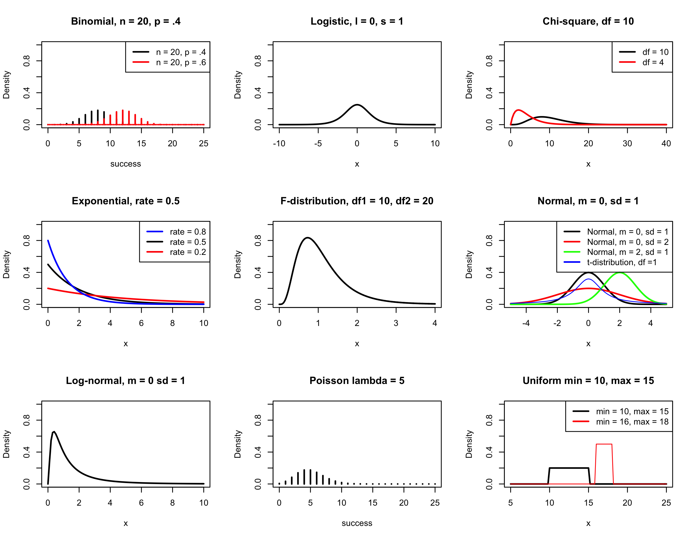

```{r setup, echo = F}
# in the end, should be about 1500 lines
knitr::opts_chunk$set(
  comment = "#",
  collapse = TRUE,
  warning = FALSE,
  message = FALSE,
  fig.width=6, fig.height=6,
  fig.retina = 3,
  fig.align = 'center'
)
```

## Outline

1. Why are simulations relevant? 
2. What you need to know before doing simulations (assumptions)? 
3. How to perform simulations
4. 

---
## Prerequisites
<!-- I will be using base plot for this workshop: this is because it is MUCH EASIER to get quick BEAUTIFUL plots and show stuff -->
For this workshop it is useful to have a solid understanding of 

1. Linear models and generalized linear models (GLMs)
2. Programming in R 

See the [QCBS R workshops](https://r.qcbs.ca/) if you want to revise these topics.

- We are going to review some aspects of these workshops, but getting some experience from those subjects can clearly help you for this workshop. 
- We are going to be more explicitly show assumptions of models and use for loops in this workshop 

---
## Learning objectives

1. Develop intuition and skills to perform simulations
2. Explore useful functions when designing simulations 
3. Articulate what are the assumptions underlying a simulation (for the models tested or the scope of the simulation)


###############
---
class: inverse, center, middle

# Why are simulations relevant?


---
## Simulations are games 

- Simulations are games that we make up the rules
- This equips us with a very powerful tool to create 'alternative worlds'. 
- The challenge in this game is to figure out what the parameters are for the processes existing in the natural world. 

---
## Find patterns in random processes

- Simulations are useful to test the properties of randomly generated data 
- Since we designed the simulation, we know parameters of the processes that underlie it.
- It is then possible to test various methods to 
  1. see if they work and verify their assumptions, 
  2. do power analysis, 
  3. learn how data is generated 
  4. etc. 

---
## Find patterns in the natural world

- The idea here is that perhaps we are interested in understanding how a certain process was generated (how $X$ influences $Y$, which could be written as $X \xrightarrow{Affects} Y$ or $Y \sim X$). 

- This is probably the most important points for simulations in biology as we are trying to understand **natural processes** (which are themselves manifestations of **random processes**)

- Therefore, being able to do simulations can be a nice addition to your research toolkit. 
  

---
## Probability distributions are crucial for simulations

- When performing simulations, once has to keep in mind the
  1. **type of distribution** underlying the data of interest
  2. **parameters** of the distribution itself (mean, standard deviation, rate, degrees of freedom, etc.)
  3. **statistical model** making the relationship between the response variable and the explanatory variable. 
  4. ideas or things we *want to show or learn* with the simulation

---
## Tips when performing simulation

.alert[Description section]. Add a 'Description' section to all your simulation scripts to introduce what the script is about. 

- You can add information how to use important arguments or a step-by-step description on how to use the script.
- You can add some references that you used to build your scrip. 

.small[
```r
# Description  ------------------------------------------------------------
#### ### ### ## #### ### ### ## #### ### ### ## 
# TITLE OF THE SCRIPT
# Created by YOUR_NAME
# 
# Why: 
# Requires:
# NOTES: 
# Reference : 
#### ### ### ## #### ### ### ## #### ### ### ## 

# Code here ... 

```
]


---
## Tips when performing simulation

.alert[Comments]. Be extra generous when commenting your code to describe as precisely as possible for the information that is not variable. 


.small[
```{r eval=FALSE}
# Description  ------------------------------------------------------------
## This is the description section as previously presented 

# Libraries ---------------------------------------------------------------
## Here load the libraries used in the script 
library(ggplot2)

# Functions ---------------------------------------------------------------
## Add and describe the functions used in the script 
## Add more information
function.name = function(var){tmp=2+var; return(tmp)}

# Plots -------------------------------------------------------------------
## Plotting the data simulated 
## Add more information
plot(function.name(1:10)+rnorm(10))
```
]

- We used fewer comments to lighten the presentation, but please add comments. 

###############
---
class: inverse, center, middle

# What you need to know before doing simulations? 


---
## Functions useful in simulations (RNG)

- When performing simulations, you will have to play with (pseudo-)randomly generated numbers from a random number generator (RNG). 
- This is a challenge if we want to replicate the analysis we are performing. 
- `R` has the function `set.seed()` that help us to play with the RNG.

The example below uses a RNG to extract numerical value between 1 and 10
```{r, echo=FALSE}
set.seed(123)
```

```{r}
runif(n = 1, min = 1, max = 10) # Gives a random number between 1 and 10
runif(n = 1, min = 1, max = 10) # RNG wasn't reset, different answer (see above)
runif(n = 1, min = 1, max = 10) # Different again... 

set.seed(42); runif(n = 1, min = 1, max = 10) # This sets the RNG 
set.seed(42); runif(n = 1, min = 1, max = 10) # The exact same number 

```

---
## Functions useful in simulations (sample)

- The function `sample()` randomly picks a value from a vector (of a number of elements)

The example below uses a RNG to extract numerical value between 1 and 10
```{r, echo=FALSE}
set.seed(123)
```

```{r}
set.seed(12) # Set the RNG 
v.1.10 = 1:10 # Make a vector from 1 to 10 
# Randomly pick 1 (size) value from the vector (x), without replacement 
sample(x = v.1.10, size = 1, replace = FALSE) 
```

- The values don't have to be numerical: they could be characters or factors

```{r}
set.seed(3) # Set the RNG 
# Randomly pick 5 (size) letters from the vector (x), without replacement 
sample(x = LETTERS, size = 5, replace = FALSE) 
sample(x = as.factor(month.abb), size = 5, replace = FALSE) 
```


---
## Challenge 1 

Select randomly 4 values out of a vector of numbers ranging from 1 to 10 : 1. without replacement and 2. with replacement. 

Use `sample()` to perform this task. 

```{r, eval=FALSE}
sample()
```


---
## Challenge 1 - Solution 

Select randomly 4 values out of a vector of numbers ranging from 1 to 10 : 1. without replacement and 2. with replacement.

```{r}
set.seed(12345) # Sets the random number generator to a fix value
vec.1.10 = 1:10 # Make the vector to choose from 
sample(x = vec.1.10, size = 4, replace = FALSE) # Sample 4 nb without replacement
sample(x = vec.1.10, size = 4, replace = TRUE) # Sample 4 nb with replacement
```

As you can see in the last example, there are 2 "6"s, since each time a random number was picked, all numbers could be randomly chosen. 

1000 draws with replacement from 0 or 1, with equal probability for each. 
```{r}
set.seed(123); table(sample(x = 0:1, size = 1000, replace = T,prob = c(.5,.5)))
```

###############
---
class: inverse, center, middle

# Let's explore what underly some statistical processes

---
## Functions for various distributions

- To help us in performing simulations, we need to get some data (random variables, X) which numerical values are outcomes of random processes. 
- In `R`, there is a convention on how to call different distributions. 

| Type | Definition | Comment |
| ---- | ---------- | ------- |
| p	   | *probability* (*cumulative* distribution function or CDF; gives you the probability for a given quantile) | gives the probability that a random variable takes in a certain *range of values* for that random variable |
| q	   | *quantile* (inverse of CDF; gives you the x value for a given probability) | gives the position on the x axis where the area under the curve is a certain probability |
| d	   | *density* density function (probability density function or PDF) | gives probability that a random variables have for a specific value if the random variable  |
| r	   | *random* random variable coming from a certain distribution | We use this to generate random numbers from a specific distribution |

- In the next slide, you'll see some built in functions to use these distributions 

---
## Functions for various distributions

.verysmall[
| Distribution | Probability | Quantile | Density | Random |
| ------------ | ----------- | -------- | ------- | ------ |
| Beta	       | `pbeta`	 | `qbeta`	| `dbeta`	| `rbeta` |
| Binomial	   | `pbinom`	 | `qbinom`	| `dbinom`	| `rbinom` |
| Cauchy       | `pcauchy` | `qcauchy` | `dcauchy`	| `rcauchy` |
| Chi-Square	 | `pchisq`	 | `qchisq`	 | `dchisq`	| `rchisq` |
| Exponential	 | `pexp`    | `qexp`	 | `dexp`	| `rexp` |
| F	           | `pf`	     | `qf`	| `df`	| `rf` |
| Gamma	       | `pgamma`	 | `qgamma`	| `dgamma`	| `rgamma` |
| Geometric	   | `pgeom`	 | `qgeom`	| `dgeom`	| `rgeom` |
| Hypergeometric | `phyper`	| `qhyper`	| `dhyper`	| `rhyper` |
| Logistic	     | `plogis`	| `qlogis`	| `dlogis`	| `rlogis` |
| Log Normal	   | `plnorm`	| `qlnorm`	| `dlnorm`	| `rlnorm` |
| Negative Binomial	| `pnbinom`	| `qnbinom`	| `dnbinom`	| `rnbinom` |
| Normal	     | `pnorm`	| `qnorm`	| `dnorm`	| `rnorm` |
| Poisson	     | `ppois`	| `qpois`	| `dpois`	| `rpois` |
| Student t	   | `pt`	| `qt`	| `dt`	| `rt` |
| Studentized Range | `ptukey`	| `qtukey`	| `dtukey`	| `rtukey` |
| Uniform	     | `punif`	| `qunif`	| `dunif`	| `runif` |
| Weibull	     | `pweibull`	| `qweibull`	| `dweibull`	| `rweibull` |
| Wilcoxon Rank Sum Statistic	   | `pwilcox`	| `qwilcox`	| `dwilcox`	| `rwilcox` |
| Wilcoxon Signed Rank Statistic | `psignrank`	| `qsignrank`	| `dsignrank`	| `rsignrank` |
]

---
## Functions for various distributions

.verysmall[
| Distribution | Probability | Quantile | Density | Random |
| ------------ | ----------- | -------- | ------- | ------ |
| Beta	       | `pbeta`	 | `qbeta`	| `dbeta`	| `rbeta` |
| <span style="background-color: #FFFF00">**Binomial**</span>	   | `pbinom`	 | `qbinom`	| `dbinom`	| `rbinom` |
| Cauchy       | `pcauchy` | `qcauchy` | `dcauchy`	| `rcauchy` |
| <span style="background-color: #FFFF00">**Chi-Square**</span>	 | `pchisq`	 | `qchisq`	 | `dchisq`	| `rchisq` |
| <span style="background-color: #FFFF00">**Exponential**</span>	 | `pexp`    | `qexp`	 | `dexp`	| `rexp` |
| <span style="background-color: #FFFF00">**F**</span>	           | `pf`	     | `qf`	| `df`	| `rf` |
| Gamma	       | `pgamma`	 | `qgamma`	| `dgamma`	| `rgamma` |
| Geometric	   | `pgeom`	 | `qgeom`	| `dgeom`	| `rgeom` |
| Hypergeometric | `phyper`	| `qhyper`	| `dhyper`	| `rhyper` |
| <span style="background-color: #FFFF00">**Logistic**</span>	     | `plogis`	| `qlogis`	| `dlogis`	| `rlogis` |
| <span style="background-color: #FFFF00">**Log Normal**</span>	   | `plnorm`	| `qlnorm`	| `dlnorm`	| `rlnorm` |
| Negative Binomial	| `pnbinom`	| `qnbinom`	| `dnbinom`	| `rnbinom` |
| <span style="background-color: #FFFF00">**Normal**</span>	     | `pnorm`	| `qnorm`	| `dnorm`	| `rnorm` |
| <span style="background-color: #FFFF00">**Poisson**</span>	     | `ppois`	| `qpois`	| `dpois`	| `rpois` |
| <span style="background-color: #FFFF00">**Student t**</span>	   | `pt`	| `qt`	| `dt`	| `rt` |
| Studentized Range | `ptukey`	| `qtukey`	| `dtukey`	| `rtukey` |
| <span style="background-color: #FFFF00">**Uniform**</span>	     | `punif`	| `qunif`	| `dunif`	| `runif` |
| Weibull	     | `pweibull`	| `qweibull`	| `dweibull`	| `rweibull` |
| Wilcoxon Rank Sum Statistic	   | `pwilcox`	| `qwilcox`	| `dwilcox`	| `rwilcox` |
| Wilcoxon Signed Rank Statistic | `psignrank`	| `qsignrank`	| `dsignrank`	| `rsignrank` |
]


---
## Common statistical distributions
<!--  -->

```{r, echo=FALSE, out.width=750, out.height=600, fig.width=9,fig.height=7.5}
par(mfrow = c(3,3), bg = NA)
# par(mfrow = c(1,1), bg = NA)
col = scales::alpha("black",.5)
col.r = scales::alpha("red",.5)
col.g = scales::alpha("green",.5)
col.b = scales::alpha("blue",.5)
lwd=2
# Binom
#define range of "successes"
success <- 0:20
plot(success, dbinom(x = success, size=20, prob=0.4),type='h', col = col.b, lwd=lwd, ylim = c(0,1), ylab = "Density", main = "Binomial")
curve(expr = dbinom(x = x, size=20, prob=0.6),col = col, lwd=lwd, ylim = c(0,1), type = 'h',add = T)
curve(expr = dbinom(x = x, size=1, prob=0.5),col = col.r, lwd=lwd, ylim = c(0,1), type = 'h',add = T)
abline(h=seq(0,1, by = .1), lty = 3, lwd = .3)
legend("topright",legend = c("n = 20, p = .4","n = 20, p = .6","n = 1, p = .5"),lty = c(1,1,1), col =c(col.b,col, col.r), lwd = 2)

# Logistic
curve(dlogis(x,location = 0, scale = 1), from=-10, to=10, col = col, lwd=lwd, ylim = c(0,1), ylab = "Density", main = "Logistic, l = 0, s = 1")
abline(h=seq(0,1, by = .1), lty = 3, lwd = .3)

# Chi-sq
curve(dchisq(x, df = 10), from = 0, to = 40, col = col.b, lwd=lwd, ylim = c(0,1), ylab = "Density", main = "Chi-square")
curve(dchisq(x, df = 4), from = 0, to = 40, col = col, lwd=lwd, ylim = c(0,1), add = T)
curve(dchisq(x, df = 1), from = 0, to = 40, col = col.r, lwd=lwd, ylim = c(0,1), add = T)
abline(h=seq(0,1, by = .1), lty = 3, lwd = .3)
legend("topright",legend = c("df = 10","df = 4","df = 1"),lty = c(1,1,1), col =c(col.b,col, col.r), lwd = 2)

# Exponential 
curve(dexp(x, rate = .5), from=0, to=10, col=col.b, lwd=lwd, ylim = c(0,1), ylab = "Density", main = "Exponential")
curve(dexp(x, rate = .2), from=0, to=10, col=col, lwd=lwd, ylim = c(0,1),add = T)
curve(dexp(x, rate = .8), from=0, to=10, col=col.r, lwd=lwd, ylim = c(0,1),add = T)
abline(h=seq(0,1, by = .1), lty = 3, lwd = .3)
legend("topright",legend = c("rate = 0.8","rate = 0.5","rate = 0.2"),lty = c(1,1,1), col =c(col.b,col,col.r), lwd = 2)

# F-distribution
curve(df(x, df1 = 10, df2 = 20), from = 0, to = 4, n = 5000, col= col, lwd=lwd, ylim = c(0,1), ylab = "Density", main = "F-distribution, df1 = 10, df2 = 20")
abline(h=seq(0,1, by = .1), lty = 3, lwd = .3)

# normal 
curve(expr = dnorm(x = x, mean=0,sd=1), from = -5, to = 5, col=col.b, lwd=lwd, ylim = c(0,1), ylab = "Density", main = "Normal")
curve(expr = dnorm(x = x, mean=0,sd=2), from = -5, to = 5, col=col, lwd=lwd, ylim = c(0,1), add = T)
curve(expr = dnorm(x = x, mean=2,sd=1), from = -5, to = 5, col=col.r, lwd=lwd, ylim = c(0,1), add = T)
curve(dt(x, df=1), from=-5, to=5, col=col.g, lty = 1, lwd=lwd, ylim = c(0,1), ylab = "Density", main = "t-distribution df = 10", add=TRUE)
abline(h=seq(0,1, by = .1), lty = 3, lwd = .3)
legend("topright",legend = c("Normal, m = 0, sd = 1","Normal, m = 0, sd = 2","Normal, m = 2, sd = 1","t-distribution, df =1"),lty = c(1,1,1,1), col =c(col.b,col,col.r,col.g), lwd = 2)

# Log normal 
curve(dlnorm(x, meanlog=0, sdlog=1), from=0, to=10, col=col, lwd=lwd, ylim = c(0,1), ylab = "Density", main = "Log-normal, m = 0 sd = 1")
abline(h=seq(0,1, by = .1), lty = 3, lwd = .3)

# Poisson
plot(success, dpois(success, lambda=5), type='h', col=col, lwd=lwd, ylim = c(0,1), ylab = "Density", main = "Poisson, lambda = 5")
abline(h=seq(0,1, by = .1), lty = 3, lwd = .3)

# unifrom
curve(dunif(x, min = 8,max = 9), from=5, to=25, col=col.b, lwd=lwd, ylim = c(0,1), ylab = "Density", main = "Uniform") 
curve(dunif(x, min = 10,max = 15), from=5, to=25, col=col, lwd=lwd, ylim = c(0,1), add=T) 
curve(dunif(x, min = 16,max = 18), from=5, to=25, col=col.r, lwd=lwd, ylim = c(0,1), add = T) 
abline(h=seq(0,1, by = .1), lty = 3, lwd = .3)
legend("topright",legend = c("min = 8, max = 9","min = 10, max = 15","min = 16, max = 18"),lty = c(1,1,1), col =c(col.b,col,col.r), lwd = 2)
```

---
## Summary of important distribution 

- Distributions of random variables comes in 2 flavors: 
  1. Discrete (only *countable* number of *distinct* values, e.g., 0, 5, 19,...)
  2. Continuous (infinite number of possible values, e.g., 0.1,0.62113,...)

- Here is a table explaining important distributions 

.small[
| Distribution | Definition | Type of data | Example |
| ------------ | ---------- | ------------ | ------------ |
| Binomial	   | probability of *n* repeated *yes/no* experiments with probability *p* of *success* | discrete; yes/no; 0/1 | Number of heads in a row after 3 tosses |
| Poisson	     | probability of a number of cases happening in a defined range of time or space given a constant rate | discrete; | ticks of a radiation counter, DNA mutation, lightning strikes (something per unit time or space for example) |
| Logistic	   | probability of an individual to be in one class or another | continuous; | alive or not, yes or no, diseased or not, etc. |
| Normal	     | probability function which informs how values are distributed | continuous; | height of individuals, beak length, shoe size, time required to run a kilometer, the data shows a 'bell-shaped' curve |
| Uniform	     | probability of all outcomes are equal | continuous; | angle between 0-360 | 
<!-- | Exponential	 | | continuous;|  | -->
<!-- | Student t	   |            | continuous; | | -->
<!-- | Beta	       |            |              | -->
<!-- | Chi-Square	 |            |              | -->
<!-- | F	           |            |              | -->
]

---
## Normal distribution 

The general form of the probability density function for a normal distribution is 

$$f(x)={\frac{1}{\sigma\sqrt{2\pi}}}e^{-{\frac{1}{2}}\Bigl(\frac {x-\mu}{\sigma}\Bigr)^2}$$

The important part here is the mean $\mu$ and the standard deviation $\sigma$.


---
## Normal distribution 
.pull-left[

```{r, fig.width=5,fig.height=5}
curve(expr = dnorm(x = x, mean=0,sd=1), 
      from = -5, to = 5, ylim = c(0,1),
      col="black", ylab = "Density",
      main = "Density normal") 
abline(h=seq(0,1, by = .1), 
       lty = 3, lwd = .3)

```

]

---
## Normal distribution 
.pull-left[

```{r, fig.width=5,fig.height=5}
curve(expr = dnorm(x = x, mean=0,sd=1), 
      from = -5, to = 5, ylim = c(0,1),
      col="black", ylab = "Density",
      main = "Density normal") 
abline(h=seq(0,1, by = .1), 
       lty = 3, lwd = .3)

```
]

.pull-right[

For the density distribution, the *area* under the curve between two points is the *probability*. For example, the 95% probability (red region), and 2 tails 2.5% (blue region).

```{r, echo=FALSE, fig.width=5,fig.height=5}
x <- seq(-5, 5, 0.1)
cex  = .7
plot(x, dnorm(x, 0, 1), main = "Density normal", type = "l", lwd = 3, col = "black", ylab = "", xlab = "x", ylim = c(0,1))
# quantile.normal = qnorm(seq(0,1, by = .05))
quantile.normal = qnorm(c(.999,0.001,.975,.025, .95, .05, .9, .1))
abline(v = quantile.normal[!is.infinite(quantile.normal)], lty = 3, lwd = .3) 
abline(h=seq(0,1, by = .1), lty = 3, lwd = .3)

p = 0.025 

# add the polygon to the left  
lb <- min(x) # Lower bound
ub <- qnorm(p)   # Upper bound
x2 <- seq(min(x), ub, length = 100) # New Grid
y <- dnorm(x2, 0, 1) # Densitypolygon(c(lb, x2, ub), c(0, y, 0), col = rgb(0, 0, 1, alpha = 0.5))
polygon(c(lb, x2, ub), c(0, y, 0), col = rgb(0, 0, 1, alpha = 0.5))
text(x = ub, y = p+0.04,labels = paste0("pnorm(qnorm(p)) = \n",p*100,"%"),adj = 0,pos = 2, cex=cex)

text(x = ub-.6, y = .2,labels = paste0("qnorm(p) = ", round(qnorm(p),2)),adj = 0,pos = 1,offset = -1, cex=cex)
arrows(x0 = ub,x1 = ub, y0 = .2,y1 = .1,code = 2,length=.1)


# add the polygon to the right 
lb <- qnorm(1-p) # Lower bound
ub <- max(x)   # Upper bound
x2 <- seq(lb, max(x), length = 100) # New Grid
y <- dnorm(x2, 0, 1) # Density
polygon(c(lb, x2, ub), c(0,y,0), col = rgb(0, 0, 1, alpha = 0.5))
text(x = lb, y = p+0.04,labels = paste0(p*100,"%"),adj = 0,pos = 4, cex=cex)

text(x = lb+.7, y = .2,labels = paste0(round(qnorm(1-p),2)," = qnorm(1-p)"),adj = 0,pos = 1,offset = -1, cex=cex)
arrows(x0 = lb,x1 = lb, y0 = .2,y1 = .1,code = 2,length=.1)

# Add the middle (red) polygon 
lb <- qnorm(p) # Lower bound
ub <- qnorm(1-p)   # Upper bound
x2 <- seq(lb, ub, length = 100) # New Grid
y <- dnorm(x2, 0, 1) # Density
polygon(c(lb, x2, ub), c(0,y,0), col = rgb(1, 0, 0, alpha = 0.5))
text(x = mean(x2), y = .2,labels = paste0((1-2*p)*100,"% \n=", "\npnorm(qnorm(1-p)) - \npnorm(qnorm(p))"),adj = 0,pos = 1, cex=cex)

text(x = 0, y = .55,labels = paste0(quote("Mean")),adj = 0,pos = 1,offset = 0, cex=cex)
arrows(x0 = 0,x1 = 0, y0 = .5,y1 = .42,code = 2,length=.1)

legend("topright",legend = c("Density normal (dnorm)","Density rnorm(100)"), lwd = 1, lty = 1, col = c("black", "green"))

set.seed(123)
rndat =rnorm(100)
# mean(rndat)
dens.nor = density(rndat)
lines(dens.nor, lwd = 3,col = scales::alpha("green",.8))
mybins=hist(rndat, plot = F, density = T, breaks = 100)
crn = mybins$density
brn = mybins$breaks
# # par(new=TRUE)
# # hist(rndat,axes = F, ylab = "", xlab = "", main = "", col = NA, border = NA)
# for (i in 1:c(length(brn)-1)) {
#   x = mean(brn[i],brn[i+1])
#   y = crn[i]
#   points(x,y, col = scales::alpha("black",.2), pch = 19)
# }

# text(x = 2.2, y = .38,labels = paste0("qnorm(1-p)"),adj = 0,pos = 1,offset = 0)
# arrows(x0 = 2.2,x1 = qnorm(1-p), y0 = .35,y1 = .27,code = 2,length=.1)


```
]


---
# Quantile value for a normal distribution 

```{r}
qnorm(p = 0.025,lower.tail = F)
```


---
## Challenge 2 

Let's say you want to simulate the length of different beak sizes for 10 birds. 

Use `rnorm()` to generate 10 random normal numbers. 

```{r, eval=FALSE}
rnorm()
```


---
## Challenge 2 - Solution 

Let's say you want to simulate the length of different beak sizes for 10 birds. 

Use `rnorm()` to generate 10 random normal numbers. 

```{r}
set.seed(1234)
n <-10
rnorm(n)
```

- Why are there negative values? 

###############
---
class: inverse, center, middle

# Simulating data for models

---
## Linear model refresher

$$Y = \beta_{0} + \beta_{1} x_{1} + \cdots + \beta_{p} x_{p} + \epsilon$$

- $Y$ is the response variable
- $\beta_0$ is the intercept
- $\beta_1$ is the coefficient of variation for the first explanatory variable ($x_1$)
- $\beta_p$ is the coefficient of variation for the $p^{th}$ explanatory variable for the $p^{th}$ $x_p$ explanatory variable
- $\epsilon$ is the residual of the model. Note that $\epsilon \sim N(\mu=0,sd = \sigma)$

- The goal is to find the **best estimation** of the parameters ($\beta$s), while minimizing the residuals, and assess the goodness of fit of the model


---
## Simulate categories (Anova)
<!-- Although this is with only 2 groups, I'm showing this as a quick example -->
.pull-left[
```{r}

set.seed(1234); n = 1000
y1 = rnorm(n, mean = 15, sd = 1)
y2 = rnorm(n, mean = 15.5, sd = 1)

sim.aov1 = data.frame(y = y1, gr = "A")
sim.aov2 = data.frame(y = y2, gr = "B")
df.aov = rbind(sim.aov1, sim.aov2)
df.aov$gr = factor(df.aov$gr)

aov.out = aov(y~gr, data = df.aov)
#summary(aov.out)
tk.test = TukeyHSD(aov.out)
round(tk.test$gr,2)
```
]

.pull-right[
```{r, fig.width=5,fig.height=5}
plot(y~gr, data = df.aov)
```

]


---
## Advanced simulations

- Now that we have the building blocks to make simulations, we are going to add another layer:
  - We want to simulate a process and then see how, when changing one value, our simulation responds 
  - For this, we need a certain workflow that resembles this: 
    1. create a blank vector in which a value of interest will be stored in 
    2. Within a loop or many `for(){}` loops, we are going to 
      - simulate data, get a desired result and store the result for future analysis 
    3. Summarize our findings (in a plot, with calculations, etc.) 

.alert[ATTENTION]. This is an iterative process. Usually, we make small increments writing up the code and then put it all together in a cohesive function that will make exactly what we are looking for. 


---
## Advanced simulations
.tiny[
```{r}
# Defining the population 
n = 600 # Number of elements to be generated 
set.seed(13) # Set RNG 
x = rnorm(n) # Generate numbers from normal distribution 
reedddd = scales::alpha("blue",.4) # Make colour transparent 

# Definte the function 
sample.mean.pop.est <- function(x,n, sample.size, ylim = NULL) {
  # x: is the actual values of the trait measured 
  # n: size of the population (number of individuals or items)
  # sample.size: how big is the sample size from which the MEAN will be calculated from 
  # ylim: add a maximum if needed 
  # histogram of the population 
  
  # Just get the stats from the histogram 
  pop.hist = hist(x, plot = F) # Make base histogram 
  
  # Make empty vector
  tmp.v = c(NA) 
  
  # For loop to calculate the mean based on a sample from the population 
  for (i in 1:n) {
    tmp = sample(x = x, size = sample.size, replace = FALSE)
    # Record that information (mean of the sample)
    tmp.v[i] = mean(tmp)
  } # End i
  
  # Sample histogram 
  sample.hist = hist(tmp.v, plot = F)
  # Population histogram 
  hist(x, ylim = range(c(0,c(sample.hist$counts, pop.hist$counts), ylim)), 
       main = paste("Sample n =", sample.size))
  # Add the sample estimate 
  sample.hist = hist(tmp.v, col = reedddd, add=T)
} # End sample.mean.pop.est
```
]
---
## Advanced simulations

.small[
```{r}
par(mfrow=c(2,2))
sample.mean.pop.est(x = x, n = n, sample.size = 1, ylim = 300)
sample.mean.pop.est(x = x, n = n, sample.size = 10, ylim = 300)
sample.mean.pop.est(x = x, n = n, sample.size = 50, ylim = 300)
sample.mean.pop.est(x = x, n = n, sample.size = 500, ylim = 300)
```
]

---
## References

https://web.stanford.edu/class/bios221/labs/simulation/Lab_3_simulation.html
https://bookdown.org/rdpeng/rprogdatascience/simulation.html
https://towardsdatascience.com/statistical-simulation-in-r-part-1-d9cb4dc393c9
https://www.r-bloggers.com/2020/05/power-analysis-by-data-simulation-in-r-part-ii/
https://it.unt.edu/simple-data-simulations
https://www.youtube.com/watch?v=tvv4IA8PEzw
http://www.columbia.edu/~cjd11/charles_dimaggio/DIRE/resources/R/simRreg.pdf
https://aosmith.rbind.io/2018/08/29/getting-started-simulating-data/
https://www.crumplab.com/programmingforpsych/simulating-and-analyzing-data-in-r.html
https://users.phhp.ufl.edu/rlp176/Courses/PHC6089/R_notes/simulations.html
https://nickch-k.github.io/introcausality/Cheat%20Sheets/Simulation_Cheat_Sheet.pdf
https://debruine.github.io/tutorials/sim-lmer.html


---
class: inverse, center, bottom

# Thank you for attending this workshop!


