<!-- # ?xaringan::moon_reader -->
<!-- seal: true  # creates title slide -->
<!-- ratio: '16:9' # "4:3" -->
<!-- countIncrementalSlides: true # Otherwise, it's hard to reference a slide -->
<!-- github -->

```{r setup, echo=F, warning=FALSE}
# in the end, should be about 1500 lines
knitr::opts_chunk$set(
  comment = "#",
  collapse = TRUE,
  warning = FALSE,
  message = FALSE,
  fig.width=6, fig.height=6,
  fig.retina = 3,
  fig.align = 'center'
)

if("librarian" %in% rownames(installed.packages()) == FALSE) {install.packages("librarian")}
library(librarian) # even better than pacman 
# library(pacman)
# Need to install all packages in initialize
suppressWarnings(source(file = "scripts/0.0_initialize.R"))
# Check also suppressMessages()
```

<!-- How this workshop started (or what prompted the original development of this workshop)
I was reading R. Dawkins (Climbing Mount Improbable) and Futuyma's Evolution book and wanted to understand deeply what was going on when the authors were talking about a specific topic. So I started to simulate some of the ideas in the books. 

That got me interested to know what was available in R to do simulations. So I started reading on the subject and found it very relevant for graduate students and for scientists. So I wanted to develop a workshop that would enable graduate students to be more proficient in performing simulations. I hope that this workshop could be of any use to the people that are studying it. 
-->

<!-- Ideas on how to present 
It was proposed that this workshop could be recorded (with or without an audience) in small chunks so that people can refer to the parts that are less clear (at their own pace)

-->

# Disclaimer

- I am not a statistician and do not pretend to fully understand all the implications of what will be presented. 
- Some sloppy mathematical notation is used. If you know how to improve it, please suggest some modifications.  
- Not all the code is shown in the presentation to reproduce the examples. 
  * You have to go in the 
    * [presentation RMarkdown files](https://github.com/beausoleilmo/Rsimulation/blob/6786d553e657db08ae28a31c5a4764dade704400/workshopXX-En/workshopXX-en.Rmd) or 
    * the script file [Workshop R script](https://github.com/beausoleilmo/Rsimulation/blob/6786d553e657db08ae28a31c5a4764dade704400/workshopXX-En/scripts/workshopXX-en.r), which requires the [0.0_initialize.R](https://github.com/beausoleilmo/Rsimulation/blob/6786d553e657db08ae28a31c5a4764dade704400/workshopXX-En/scripts/0.0_initialize.R) and other scripts specified within. 
    * Don't forget to change the paths associated with some files to load everything. 
- In addition, this is a work in progress. Any input you have is more than welcome. 

???
- Might not apply to you
- `wget --no-check-certificate --content-disposition https://raw.githubusercontent.com/beausoleilmo/Rsimulation/main/workshopXX-En/scripts/workshopXX-en.r`

---
# Outline

Theory: 
1. [Why are simulations relevant?](#why-sim-revelant) 
2. [When simulations are useful?](#when-sim-useful) 
3. [What you need to know before doing simulations?](#what-to-be-known-before-sim)
4. [Let's explore what underlie some random processes](#explore-under-stat-process)
5. [Statistical distributions in more details](#statistical-distributions)
6. [Simulating data for models (lm, glm, lmm, in development)](#sim-data-models)
7. [Simulating data for power analysis (in development)](#simulating-power)
8. [Advanced simulations](#advanced-simulations)
9. [References](#references)
10. [Acknowledgements](#acknowledgements)

The exercices for this workshop: [Challenge wallpaper](#challenge_0_wallpaper), [Challenge 1](#challenge1), [challenge 2](#challenge2), [challenge 3](#challenge3), [challenge 4](#challenge4), [challenge 5](#challenge5), [challenge 6](#challenge6), [challenge 7](#challenge7).

Supporting material:

Please check out the [Simulation in R Cheat Sheet](https://docs.google.com/presentation/d/11bNgLUCyvlL8Ndq_nF-N6T71dZwgETbhbSHuc40VqvU/edit#slide=id.p)


???
This workshop was designed to give you the tools to perform simulations in R. 
- Simulations to get data in order to perform a statistical model, 
- but also to be able to simulate a situation and verify how a parameter change the outcome of a model. 
- Go see the [Simulation in R Cheat Sheet](https://docs.google.com/presentation/d/11bNgLUCyvlL8Ndq_nF-N6T71dZwgETbhbSHuc40VqvU/edit#slide=id.p) here https://docs.google.com/presentation/d/11bNgLUCyvlL8Ndq_nF-N6T71dZwgETbhbSHuc40VqvU/edit#slide=id.p

---
# Prerequisites
<!-- I will be using base plot for this workshop: this is because it is MUCH EASIER to get quick BEAUTIFUL plots and show stuff -->
For this workshop it is useful to have a solid understanding of 

1. Linear models and generalized linear models (GLMs)
2. Programming in R 

See the [QCBS R workshops](https://r.qcbs.ca/) if you want to revise these topics. Select the [R workshops](http://r.qcbs.ca/workshops/) needed.

- We are going to review some aspects of these workshops, but getting some experience from those subjects can clearly help you for this workshop.
- We are going to be more explicitly show assumptions of models and use for loops in this workshop
- You should also have installed [R on CRAN here](https://cran.r-project.org) `r fa("r-project", fill = "steelblue")` and you could get [RStudio](https://www.rstudio.com) as well.

???

- This workshop builds on the previous workshops. 
- But don't worry, we are going to refresh some of the concepts here. 


---
# Learning objectives

1. Develop intuition and skills to perform simulations
2. Use specific and relevant functions in R when designing simulations 
3. Articulate what are the assumptions underlying a simulation (for the models tested or the scope of the simulation)
4. Know how and when to use important statistical distributions
5. Simulate different data structure to perform LMs, GLMs, and (G)LMMs. 

???

- Hopefully, this is what people will get out of this workshop. 
- The idea of my workshop is to plant a seed in the heads of biologists that it is possible to test biological ideas or hypotheses in silico.


Ultimately, I would like the students to be able

  - to *evaluate* what type of random process generated a particular biological situations.  
  - to *apply* the various functions in R to simulate data (pseudo-random number generators)
  - to *interpret* and *analyse* the data that has been generated with R. 
  - to *create* their own simulations in R in order to answer a particular question or learn about a particular topic 

Consider that it takes time to develop a 'programers' intuition when coding. There are multiple ways to get to the same answer and the idea is not to be perfect at first, but to try to answer a question and improve. 

---
# Expectation from the course

- Please, I invite you to participate as much as you can. 
- I certainly have a lot to learn and I wish that our learning environment is welcoming to committing errors and learning from them 

???
- Here is a pool of jokes to tell at one point or another [from this source](https://www.barrypopik.com/index.php/new_york_city/entry/two_random_variables_were_talking_in_a_bar)
- "Two random variables were talking in a bar. They thought they were being discrete, but I heard their chatter continuously."
- 2 variables go in a bar multiple times. One always selects a new drink each time with a dice and the other selects always the same drink. One variable says to the other, dude, you're so random. 
- Infinitely many mathematicians walk into a bar. The first says, "I'll have a beer." The second says, "I'll have half a beer." The third says, "I'll have a quarter of a beer." The barman pulls out just two beers. The mathematicians are all like, "That's all you're giving us? How drunk do you expect us to get on that?" The bartender says, "Come on guys.  Know your limits."
[Source here](https://williambiersack.weebly.com/math-jokes.html)  Explanation: This is a reference to a converging infinite series. The limit of this: from n=0 to infinity is the sum (1/2^n) = 1 + 1/2 + 1/4 + 1/8 + ...  = 2 since $\sum_{n=1}^{\infty}(1/2)^n=1$. see [this article](https://en.wikipedia.org/wiki/1/2_%2B_1/4_%2B_1/8_%2B_1/16_%2B_⋯)

#################################
---
class: inverse, center, middle
name: why-sim-revelant
# Why are simulations relevant?

???

In this section, we will explore 
- What are simulations 
- What is the idea behind simulations
- What statistics has to do with simulations.
- Understand, with all of these, why simulations are relevant.

---
# Background and questions

- Have you ever performed a simulation in R?
- What are simulations for? Would simulations be useful for your current or future work? 
- Why do you think they are important? 
- When do you think they are helpful? 
- What is a model? Can you give examples of models that are not statistical models? 
???
- Have you ever had a [probability theory course](https://bookdown.org/kevin_davisross/probsim-book/) and learnt important [random variable distributions](#explore-under-stat-process) that are often seen in biology? 
- Have you ever performed a simulation in R?  Elsewhere? (bootstrapping? Permutations? Bayesian using MCMC?, a secret Santa?)
- What are simulations for? Would simulations be useful for your current or future work? 
- Why do you think they are important? 
- When do you think they are helpful? 
- **What is a model?** Can you give examples of models that are not statistical models? 
  * It's an **imitation of a structure, machine, etc.** showing **relevant** parts (usually smaller or simplified).
  * examples such as 
    - a **cell model** (like the plastic stuff you' have'd find in a lab)
    - The atomic model 
    - A **map** (which is a **representation of our world** to NAVIGATE in it)
      * they are abstractions of the real world (It is not the real world) 
      * The only map that is right is the 1:1 real map which would not be useful to make a sense of how the world is. Imagine that to go to the pharmacy, I need to give you all the genetic sequences of the trees that you encounter to get the directions. This would be insane! Therefore, we **simplify** and just extract what is useful for a particular situation. 
    - 3D model that is created from a 2D drawing (floor plan in architecture)
    - Lego model of a giraffe
    - Model of Dinosaur based on bones and assumptions we have of the type of organism they were.
    - Toy, Scale Model Kit of a spacecraft or a car or boat... 
    - Role model: someone or something that excels in its domain and can be used as an example of a quality or skill. "Un ou une role model est une personnalité dont le comportement, l'exemple ou le succès est (ou peut être) imité par des tiers, notamment par des personnes plus jeunes" (source [wikipedia](https://fr.wikipedia.org/wiki/Role_model_(sociologie)))
    - Basically our task is to take **statistical Clay and model it** as we wish based on some idea. In this workshop, I want you to be able to play a bit more with statistical plasticine. "Pâte à modelée" (Plasticine, Play-Doh)

    - The goal is to make part of our world easier to understand, define, quantify, vizualize, simulate, etc. See [Scientific modelling](https://en.wikipedia.org/wiki/Scientific_modelling)
--

<br>

.pull-left[
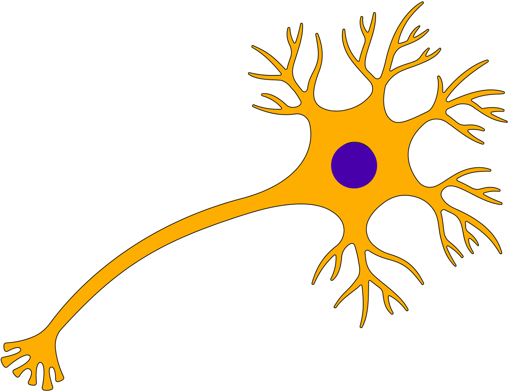
]

.pull-right[

]

???
Some examples 
- Ecological, Climate, Statistical Model
- Modelling biological systems (e.g., epidemiology)
- Simulations (see [Modeling and simulation](https://en.wikipedia.org/wiki/Modeling_and_simulation)), Etc. 
- Some definitions from Banks (1998, p. 6)
  * **Model**: Representation of an actual system (concern about the limits or boundaries of the model that supposedly represent the system). Known complexity (just enough). 
  * **Event**: Occurence that changes the state of the system 

---
# Background and questions

- Biological models
  * Exponential growth: $n(t+1)=Rn(t)$ (discrete) or $\frac{dn}{dt}=rn(t)$ (continuous)
  * Logistic growth: $n(t+1)=n(t)+rn(t) \Big(1-\frac{n(t)}{k} \Big)$ (discrete) or $\frac{dn}{dt}=rn(t) \Big(1-\frac{n(t)}{k} \Big)$ (continuous)
  * Haploid and diploid selection 
  * Competition equations
  * Consumer-resource equations
  * SIR equations (Susceptible, Infected, Recovered)

- Statistical models 
  * LM, GLM, GLMMs, GAM, Ordinations, etc.
  * Machine learning
  * Dynamical models 

???

- Reference for the models: Otto, S.P. & Day, T., 2007. A Biologist's Guide to Mathematical Modeling in Ecology and Evolution. pp.1–973.
- See also [Statistical model](https://en.wikipedia.org/wiki/Statistical_model)
- See also [Mathematical model](https://en.wikipedia.org/wiki/Mathematical_model)
- See also [Scientific modelling](https://en.wikipedia.org/wiki/Scientific_modelling)

- let's start with what are simulations

---
# Survey: defining models 

.center[

]

???
- A model is a [**simplified** (schematic)] [**theoretical**] structure [or **representation**] [**of a system** or object, which can be statistical, mathematical, physical, etc.] **that helps explain** [or **gain information about**] the "**real world**", or against which the "real world" is measured. 
- Models can be [imitated or emulate] represented by a [system of equations, variables, and calculations] to predict or make the output from input database, [frame a hypothesis in order to generate testable predictions].
- something “perfect” from which we may base ourselves or from which we hope to emulate.
- They may or may not represent what can actually be observed and replicated in reality. 


---
# Usefulness of models

<br>
<br>
<br>
<br>


"Models can help to guide a scientist's intuition about 
- *_how various processes interact_*; 
- they can point out logical *_flaws in an argument_*; 
- they can identify *_testable hypotheses_*, *_generate key predictions_*, and *_suggest appropriate experiments_*; and 
- they can reshape fields by providing *_new ways of thinking about a problem_*. 

But mathematical models also have their limitations. The results of an analysis are only as interesting as the biological questions motivating a model. [...]"


.right[— Sarah. P. Otto, and Troy Day 2007 (modified)]

???

- As a definition, "a model is a representation of an actual system". (Banks 1998). 
- Models can be **deterministic** (full information, prédicts entirely the future) or **stochastic** (random events affect the system, prediction can be only probabilistic)

- Citation: "Science will progress faster and further by a marriage of mathematical and empirical biology. This marriage will be even more successful if more biologists can use math, when needed, to advance their own research goals. It is toward this end that we devote this book." — Sarah. P. Otto, and Troy Day 2007
- NOTE: Box's, [All models are wrong, but some are useful](https://en.wikipedia.org/wiki/All_models_are_wrong) "The aphorism is generally attributed to the statistician George Box, although the underlying concept predates Box's writings." "Box, George E. P. (1976), "Science and statistics" (PDF), Journal of the American Statistical Association, 71 (356): 791–799, doi:10.1080/01621459.1976.10480949."

- Would be unproductive to say that all **maps** are wrong and dismiss them because of that. They are still very **useful**! 


---
# Survey: defining simulations 

.center[

]

???
- [Performance or] **imitation** (approximation of reality) of the operation of a real-word process or system over time, which can include the creation of dataset (not "real" data) with specific **parameters** (**distributions**) to **test a model**, **understand a behaviour**, etc. **Understand better what a type of data can say**. **Predict** the behaviour of a phenomenon or relationships


---
# Defining simulations

<br>
<br>
<br>
<br>

.center[
"[...] the term 'simulation' describes a wealth of varied and useful techniques, all connected with the mimicking of the rules of a model of some kind."
]

.right[— Byron J. T. Morgan 1984]

???

- Simulations are made in different flavors, via 
  * physical reproductions at smaller scale or 
  * mathematical models in computer (*in silico*)
- See [Beginner’s Guide to Simulating Data](http://www.page-gould.com/simulation/Guide-to-Simulation-for-R.html)
- Whitlock and Schluter define "Simulation" (chapter 19, 2020, 3rd edition) as "Simulation uses a computer to imitate the process of repeated sampling from a population to approximate the null distribution of a test statistic".

---
# Survey: would simulations be useful for you?

.center[
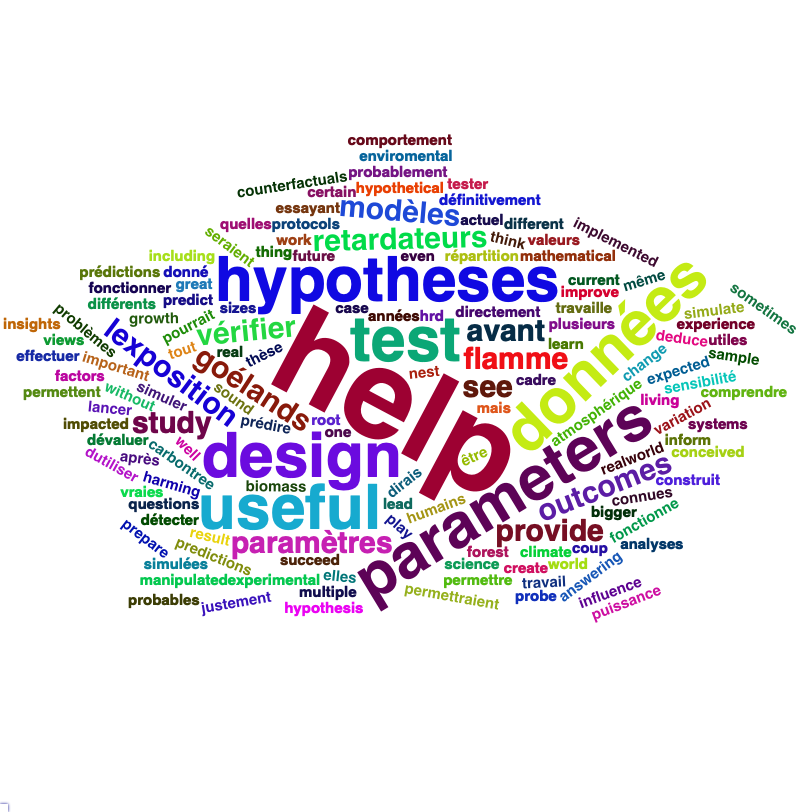
]

???
- Usefulness? 
  * Make predictions
  * Test hypothesis Ethically (understand phenomena without needing permits and sampling animals) 
  * test models and their potential problems (assumptions), tweak parameters 
  * test extreme cases. 
  * Design experiments and power analysis 


---
# Simulations are games: we make up the rules

- A challenges is to figure out what parameters (or rules) are governing a natural process. 
- Simulations are powerful tool that can generate 'alternative worlds' or models of the world. 
- We are responsible and need to be conscious about the choices we make in order to get an answer. 
- In summary:
  * We try to understand **natural processes**, which are often manifestations of **random variables** or **stochastic process**
- Being able to do simulations can be a nice addition to your research toolkit. 

--

.alert[Are these two distribution showing the same stochastic process? ] 
```{r normal_compare_theoretical_simulated, echo=FALSE, fig.width=8, fig.height=4}
par(mfrow=c(1,2), mar = c(3,4,.5,.5), cex = 1.3)
set.seed(12345)
x = seq(-5,5,by=.1)
y = dnorm(x)

curve(expr = dnorm(x), 
      from = -5,
      to = 5, 
      ylim = c(0,1), 
      xlab = "", 
      ylab = "Density", 
      lwd =3);abline(v = 0, lty =3)
  title(xlab="x", line=2, cex.lab=1.2)
polygon(c(x, rev(x), 0), c(y, rep(0,length(y)), 0), col=scales::alpha("blue",.5))
x2 = rnorm(6)
y2 = density(x2)
plot(y2, 
     main = "", 
     xlab = "", 
     ylab = "Density", 
     xlim = c(-5,5), 
     ylim = c(0,1),
     lwd = 3);abline(v = 0, lty =3)
  title(xlab="x", line=2, cex.lab=1.2)
polygon(c(y2$x, rev(y2$x), 0), c(y2$y, rep(0,length(y2$y)), 0), col=scales::alpha("blue",.5))

```

???

**Games**: 
- Basically, we want to play with numbers within a particular set of rules in order to see if we can understand the behaviour of those numbers within the set of rules. 
- We need to find a **strategy** in order to play the game properly. 
- What is the goal of the game? We want to understand the natural world 

**responsible and need to take conscious choices [...]**
- When we design a simulation, we have to build in the **assumptions of the models** or the **processes** we are trying to recreate. 
- So we need to **decide**, what is going to make up the process. 
- The *parameters and variable are chosen by you*
  * Plausibility (look in lit., ask colleagues for data already collected).
- Be **statistically aware** of what you are *modeling* and what you *want to know.* 

**IMAGE**: Are these two distribution showing the same *random process*?
- Yes! They are both normally distributed 
  * **left**: standard normal curve and 
  * **right**: density plot of 6 pts randomly drawn from a normal dist.
  * BUT, they are NOT identical. The SAME RULES are generating the 2 distributions, but they are NOT showing the same curves...

- Étienne Low-Décarie says "it eliminates the need for dice when playing Dungeons and Dragons"
```
library(TeachingDemos)
dice(rolls=3, ndice=4, sides=6, plot.it=T,
     load=rep(1, 6))
```

---
# Why simulations? Find patterns from stochastic processes

- Simulations are useful to test the properties of randomly generated data 
- Since we design the simulation, we know the parameters of the processes.
???
You probably learned how to use statistical models on certain types of data. 
- To answer your research question, you could collect data and get an *a posteriori* understanding of the parameters that make up a phenomenon. 
- Simulations help you, 
  * bypass the requirement of data, AND
  * Let *YOU SET* the  parameters you think are relevant for a pattern (based on lit.)
  * **CAREFUL**! Do not simulate data to generate **FAKE** data. 
--

- It is then possible to test various methods or statistical analysis to 
    1. learn how data are generated,
    2. Understand and see a model works and verify its assumptions or predictions, 
    3. explore old and new ideas, theories, hypothesis, the existence of a phenomenon or a slow process,
    4. prepare your analysis script before data collection (or preregistration),
    5. do [power analysis](https://cran.r-project.org/web/packages/pwr/vignettes/pwr-vignette.html) and dry run [an experimental design](https://low-decarie.github.io/Introduction-to-simulation-for-experimental-design-using-R/#/),
    6. simulate tragic events to see their impact (e.g., nuclear explosion, flood, emergence and trajectories of hurricanes, etc.) 
    7. [give you teaching material](https://serc.carleton.edu/sp/library/datasim//examples.html), 
    8. etc. 
???
- **Random**: 'That is governed by the law of probability'
  * "The law of probability tells us about the probability of specific events occurring." or a collection of equations that define probabilistic relationships among events [See this](https://magoosh.com/statistics/what-is-the-law-of-probability/) or [this link](https://methods.sagepub.com/reference/encyc-of-research-design/n336.xml)
- **Stochastic**: 'determined randomly or involves random probability distribution.' 
  * From Greek roots meaning **conjectural** or pertaining to conjecture (form an opinion about something without much information to base it on), or another word saying "**to guess**" or "target" or even literally "Stick used as aim by archers". 
  * "the sense of “randomly determined” is from 1934, from German stochastik (1917)." See [GLOSSARY GUIDE](https://glossary.guide/stochastic-1935/)
- **Expected value**:
  * It is the mean of a random variable *X*: it's a misnomer as we don't necessarily "expect" an event to be near the 'expected value'. Just that *in the long run*, or if *we collect enough information about the random variable*, we might get an expected value for the distribution of the random variable. 

- Forest management: could be long to get data: simulations can help to take faster decision
- Epidemics, road congestion, simulate tragic events to see their impact (e.g., nuclear explosion, flood, emergence of hurricane, etc.)
- See book Morgan, B.J.T., 1984. Elements of simulation

- We might start with a research question or simply want to understand a process.
- We might be interested in understanding how a certain process was generated 
  * how $X$ is related $Y$, which could be written as $Y \sim X$. 

$X \xrightarrow{correlated} Y$

Everything that we measure is caused by factors that scientists try to make sense. 
- e.g. a phenotype, the number of eggs birds lay in a population, the survival of individuals in a population, or other ecological (and environmental) variables, etc.
- The question here is: 
  * **How these measures came to be**? 
  * What process governs the value that we measured? 
  * In other words, 
     1. How is the data that I've measured distributed? and 
     2. What causes my data to be distributed that way?

- Random (or [stochastic process](https://en.wikipedia.org/wiki/Stochastic_process)) variables
  * Collection of random variables defined by some parameters
  * E.g., bacterial growth: you can probably not predict exactly the exact time when a single bacterium will divide, but over a certain amount of time, you might get an idea of the rate at which bacteria divide and colonize a petri dish. 

For power analysis...
- See also `power.prop.test()`


---
# Pros and cons of simulations

The list below was taken from Banks (1998 Handbook of simulation).

.pull-left[
**Pros:** 
- Choose correctly 
- Compress and expand time
- Understand why
- Explore possibilities
- Diagnose problems
- Identify constraints
- Develop understanding
- Visualize the plan 
- Build consensus
- Prepare for change 
- Invest wisely
- Train the team
- Specify requirements
]

.pull-right[
**Cons:**
- Model building requires special training
- Simulation results may be difficult to interpret 
- Simulation modeling and analysis can be time consuming and expensive 
- Simulation may be used inappropriately 

They are offset by 
- simulation software (R), which can also analyse the results; 
- Personal computers are faster (with programming tricks!) and 
- most complex systems in biology are not closed-form model, justifying the usefulness of simulations. 
]


???
- Read *Banks* (1998) for a detailed description od each(Banks, J. 1998. Handbook of simulation) See p.10-11. 
- **Choose correctly**: Test multiple proposed change without committing resources to their acquisition
- **Compress and expand time**: you can speed up or slow down some processes 
- **Understand why**: a certain phenomena occur in the system (connection with other systems)
- **Explore possibilities**: of a valid simulation
- **Diagnose problems**: Simulations allows you to better understand the interactions among the variables in the system
- **Identify constraints**: Bottlenecks or sampling constraints
- **Develop understanding**: about what underlies the concept studied 
- **Visualize the plan**: 
- **Build consensus**: by forging a demonstrable argument and its assumptions.
- **Prepare for change**: future brings change
- **Invest wisely**: for planning your experiment 
- **Train the team**: learn by making mistakes and learn to operate better
- **Specify requirements**: of a system. 


#################################
---
class: inverse, center, middle
name: when-sim-useful
# When could a simulation be useful? 

???
You might be wondering: 
- "OK, I somewhat understand how learning to perform simulations in R might be useful to me. 
- But WHEN should I use simulations in my work?"

---
# ALL THE TIME!!!! 

- Simulations can help you at all stages of your research from planning to publishing and beyond! 
- Whether you want to: 
1. Learn about science in general 
  - learn how a mechanism work (i.e., genetic drift, natural selection), 
  - develop a deeper understanding of a concept.

2. Design a particular study 
  - Specify and refine a research objective, question, hypotheses to test and their predictions,
  - a research plan, an experimental and sampling design or test a statistical method, 
  - play with data before your field work, 
  - simulate random point on a map to sample it. 

3. Publish an article or criticize 
  - respond to reviewers for a paper you want to publish,
  - support an argument or a point you want to make,
  - verify the claims made by other researchers.
  
4. etc. 


???
- The surprising answer is that it can be **used at all stages of research**. 
- Here is a short list of elements for when you could be using it

- Simulation is (Banks 1998)
  * an indispensable problem-solving methodology 
  * used to describe and analyze the behaviour of a system, ask "what-if" questions and aid in the design of real systems 
  * Existing and conceptual systems can be modelled with simulations 


---
# Quick example: Genetic drift without mutation

- Here we have 4 plots showing genetic drift with the same simulation. 
- The only difference is the number of individuals in each population
- Your can deduce many things from the allele frequency change.

```{r r_tips2, echo=FALSE, fig.width=13,fig.height=6.5}
# Description  ------------------------------------------------------------
#### ### ### ## #### ### ### ## #### ### ### ## 
# Genetic drift simulation
# Created by Marc-Olivier Beausoleil
# 2022-01-07
# Why: 
# Requires:
# NOTES: 
# Drift is (from Futuyma)
# - unbiased
# - random fluctuations in allele frequency are larger in smaller populations
# - drift causes genetic variation to be lost
# - drift causes populations that are initially identical to become different
# - an allele can become fixed without the benefit of natural selection
# Reference : 
# Futuyma p. 167, figure 7.2
#### ### ### ## #### ### ### ## #### ### ### ## 

# graphing parameters -----------------------------------------------------
par(mfrow = c(2,2), mar = c(3,3,2,2), cex = 1.2)
# Random seed -------------------------------------------------------------
set.seed(1245)

# Simulation parameters ---------------------------------------------------
# Number of gametes to chose from 
n.sperm = 2
n.eggs = 2
# Number of generations (x axis)
gen = 500
# Number of replicate populations 
popu = 5

# variance = p*(1-p)/(2*N)
# Variation is smaller when the population size is bigger 

# Loops -------------------------------------------------------------------
# Loops for all population replicates, tracking allele frequency change over the generations 
# number of individual per population 
n.id.pop = 5*10^seq(0,3, by=1)
# Loop that will change the maximum number of individual per population 
for (l in n.id.pop) {
  # Initial allele frequency 
  p.init = .5 
  # Maximum population size 
  max.pop = l
  # Total number of gametes in the population 
  n.gametes = c(max.pop*(n.sperm+n.eggs))
  # Make an empty object to record the population information 
  all.pops = NULL
  # Loop to track the all population allele frequency change 
  for (j in 1:popu) {
    all.fq.change = .5
    # Loop to track the within population allele frequency change 
    for (i in 1:gen) {
      # If the first iteration, make the probability equal the initial allele frequency 
      if (i == 1) {prob.p = p.init} else {prob.p = prop.all[2]}
      # binomial function to generate the new allele frequency (0 = q, 1 = p)
      allele.fq = rbinom(n = n.gametes, size = 1, prob = prob.p)
      # Randomly sample the population (this is the drift, a random sample of the population)
      all.drift = sample(x = allele.fq, size = max.pop, replace = F)
      # Get the proportion of the alleles in the new population 
      prop.all = prop.table(table(all.drift))
      # Record the p allele only 
      all.fq.change = c(all.fq.change, prop.all[2])
      # If there is an allele that goes to fixation, it'll print NA. In this case, break the for loop and go to the next iteration
      if(is.na(prop.all[2])) {break}
    } # End i
    # Record all population information
    one.pop = data.frame(p.fq = as.numeric(all.fq.change), pop = j)
    all.pops = rbind(all.pops,one.pop)
    # If an allele is fixated, it's going to be recorded 
    all.pops[is.na(all.pops)] <- ifelse(names(prop.all)=="1",yes = 1,no = 0)

  } # End j
  
  # Plot --------------------------------------------------------------------
  # Make the empty plot 
  plot(all.pops$p.fq~c(1:nrow(all.pops)), 
       col = as.factor(all.pops$pop),
       main = paste0("Pop N=",max.pop, ", Start p=",p.init),
       ylab = "",
       xlab = "",
       ylim = c(0,1),
       xlim = c(1,gen),
       type = "n")
  if (l%in% n.id.pop[c(1,3)]) {
  title(ylab="Allele fq p", line=2, cex.lab=1.2)
  }
  if (l%in% n.id.pop[c(3,4)]) {
  title(xlab="Generations", line=2, cex.lab=1.2)
  }
  
  
  # Add the lines per population and colour them 
  for (k in 1:popu) {
    pttmp = all.pops[all.pops$pop==k,]
    points(c(1:nrow(pttmp)), pttmp$p.fq, 
           type = "l",
           col = k)
    final.allele.fq = ifelse(pttmp$p.fq[length(pttmp$p.fq)] %in% c(0),"red",
                             ifelse(pttmp$p.fq[length(pttmp$p.fq)] %in% c(1),"green","black"))
    points(c(nrow(pttmp)), pttmp$p.fq[length(pttmp$p.fq)], 
           type = "p",
           col = scales::alpha(final.allele.fq, .5), pch = 19)
           # col = scales::alpha(c("black","red","green","blue","cyan")[k], .5), pch = 19)
  } # End k
} # End l

```

???
- Here is an example of simulation that was made in R to show genetic drift without natural selection. 
- The same script, or function, can be used to generate patterns like these, but by varying the parameters (population sizes or starting alleles). 
- Each plot contains 
  * 5 populations that started (initial condition) with an allele frequency p of 50% (so q = .5).
  * Genetic drift for a population stops when an allele is fixed (its fq = 1)
  * Points mark if an allele is lost (red) or fixed (green), or in a mixture (black)
- You can see now see with the simulation that 
  * No **particular** allele will be fixated (unbiased)
  * the **number of individuals** seems an important factor in the fixation of alleles. The fluctuations in allele fq are largers in smaller pop. 
  * some genetic variation can be **lost**
  * **makes populations different**, even if the pop are identical at the beginning. 
  * **Fixation** of an allele without natural selection 

- See also this example [Online Box 5: R code to simulate drift, selection, and dispersal of two species in any number of patches: Figures 6.7-6.9 in the book](http://mvellend.recherche.usherbrooke.ca/Box5.htm)

---
# Quick (?) example: Natural selection 

- How would you model natural selection?
???
- If natural selection is the non random transmission of genetic information in living organisms in a particular environment, how would you simulate that? 
- (From Futuyma, Evolution) [Non-random] Differential survival and/or reproduction of classes of entities that differ in one or more [transmissible] characteristics which, as a consequence, alter the proportions of the different entities [in subsequent generations].
--

- What is the type of selection we want to simulate? 
- What is being selected? What is that type of data (continuous [range?], discrete [counts?])? 


```{r fake_fitness_functions, echo=FALSE, fig.width=8,fig.height=3}
# Fake fitness landscapes 
# Fitness test theoretical fitness landscapes 
par(mfrow=c(1,3))
q.fun = function(x, 
                 exponent = 2,
                 factor = -1,
                 xlab = xlab,
                 ylab = "Fitness",
                 lwd = 3,
                 ylim = c(0,4000),
                 cex.text = 1,
                 col.main = "black", 
                 col.line = "red", 
                 col.box = "black", 
                 col.text = "black") {
  y = x^exponent*factor
  plot(y~x, type = "l", 
       axes=FALSE,
       xaxs="i",yaxs="i",
       frame.plot=FALSE, 
       xlab="", ylab = "",lwd = lwd, col = col.main,
       # ylim = c(min(y),max(y)+5000)
       ylim = ylim)
  box(bty="l", lwd = 3)
  mtext(side=2,text=ylab,line = 1.1, col = col.text, cex = cex.text)
  mtext(side=1,text=xlab,line = 1.6, col = col.text, cex = cex.text)
  # axis(side = 1, labels = FALSE, tck = 0.000000001, lwd = 4, col = col.box)
  # axis(side = 2, labels = FALSE, tck = 0.000000001, lwd = 4, col = col.box)
  # y2 = -3*x^2+2500
  # points(y2~x, type = "l", lty = 2, lwd = lwd,
  #        col = col.line)
}
# col.main = "white"
col.main = "black"
xlab = ""
q.fun(-100:100,exponent = 1,factor = 10,xlab = "(Directional)",lwd = 5,cex.text = 2,
      ylab = "Fitness", col.line = NA,ylim = c(-1000, 2000),
      col.main = col.main,col.box = col.main, col.text = col.main)
q.fun(-100:100,xlab = "(Stabilizing)",lwd = 5,cex.text = 2,
      ylab = "", col.line = NA,ylim = c(-5000, 2000),
      col.main = col.main,col.box = col.main, col.text = col.main)
q.fun(-70:70,factor = 1,xlab = "(Disruptive)",lwd = 5,cex.text = 2,
      ylab = "", col.line = NA,ylim = c(-200, 7000),
      col.main = col.main,col.box = col.main, col.text = col.main)

```
--

- But what all of these mean? 
- What do they assume? 
- What is the data generated to make these lines and curves? 


???
- We won't answer the last questions for this moment. 
- In order to build a natural selection simulator in R, we need a couple of tools. 

#################################
---
class: inverse, center, middle

# Let's build some simulation intuitions 

???
- In this section, I want to explore a graph and try to extract all of its juice
- NOTE: The TACIT idea here is to find the underlying DISTRIBUTIONS or HOW THE RANDOM VARIABLE WAS GENERATED.

---
# What do you see here? 

- Can you give *as much information* as you can within and between each graphs.

```{r normalX_Y, echo=FALSE, fig.show='hide', fig.width=8,fig.height=4}
# source(file = "scripts/marginal_plot.R")
set.seed(123)
# par(mfrow = c(1,2), mar =c(4,4,3,3), cex = 1.4)
n = 250
x.1 = rnorm(n, mean = 15, sd = 5)
y.1 = 2*x.1 +rnorm(n, mean = 0, sd = 4)#rnorm(n, mean = 5, sd = 2)

x.2 = rnorm(n, mean = 15, sd = 1)
y.2 = 2*x.2 +rnorm(n, mean = 0, sd = .5) # rnorm(n, mean = 5, sd = .5)
# marginal_plot(x.1,y.1,ylim = range(c(y.1,y.2)), xlim = range(c(x.1,x.2)), pch = 19, col = scales::alpha("black",.8), ylab = "Y",xlab = "X")
# marginal_plot(x.2,y.2,ylim = range(c(y.1,y.2)), xlim = range(c(x.1,x.2)), pch = 19, col = scales::alpha("black",.8), ylab = "Y",xlab = "X")

library(ggplot2)
# Use base R here 
# https://stackoverflow.com/questions/71052975/how-to-plot-histograms-in-base-r-in-the-margin-of-a-plot?noredirect=1#comment125604177_71052975 
library(ggExtra)

size.line = .8
text.size = 16
col.line = alpha("black",.5)
df.1 <- data.frame(x = x.1, y = y.1)
df.2 <- data.frame(x = x.2, y = y.2)
p.1 <- ggplot(df.1, aes(x, y)) + 
  geom_point(colour = alpha("black",.5)) + 
  lims(x = range(c(x.1,x.2)), y = range(c(y.1,y.2))) +
  theme_classic() + 
  theme(axis.ticks = element_line(colour = "black"),
        axis.title = element_text(size = text.size),
        axis.text = element_text(size = text.size, colour = "black"),
        axis.text.x = element_text(size = text.size),
        axis.text.y = element_text(size = text.size))

p.2 <- ggplot(df.2, aes(x, y)) + 
  geom_point(colour = alpha("black",.5)) + 
  lims(x = range(c(x.1,x.2)), y = range(c(y.1,y.2))) +
  theme_classic() + 
  theme(axis.ticks = element_line(colour = "black"),
        axis.title = element_text(size = text.size),
        axis.text = element_text(size = text.size, colour = "black"),
        axis.text.x = element_text(size = text.size),
        axis.text.y = element_text(size = text.size))
p.1
p.2

p.h1 <- p.1 + geom_hline(yintercept=mean(y.1), linetype="dashed", color = col.line, size=size.line)
p.h1
p.h.v1 <- p.h1 + geom_vline(xintercept=mean(x.1), linetype="dashed", color = col.line, size=size.line)
p.h.v1
p.h2 <- p.2 + geom_hline(yintercept=mean(y.2), linetype="dashed", color = col.line, size=size.line)
p.h2
p.h.v2 <- p.h2 + geom_vline(xintercept=mean(x.2), linetype="dashed", color = col.line, size=size.line)
p.h.v2

positions.1 <- data.frame(
  x = c(mean(x.1)-sd(x.1), mean(x.1)+sd(x.1), mean(x.1)+sd(x.1), mean(x.1)-sd(x.1)),
  y = c(mean(y.1)-sd(y.1), mean(y.1)-sd(y.1), mean(y.1)+sd(y.1), mean(y.1)+sd(y.1))
)
positions.2 <- data.frame(
  x = c(mean(x.2)-sd(x.2), mean(x.2)+sd(x.2), mean(x.2)+sd(x.2), mean(x.2)-sd(x.2)),
  y = c(mean(y.2)-sd(y.2), mean(y.2)-sd(y.2), mean(y.2)+sd(y.2), mean(y.2)+sd(y.2))
)

positions.x1 <- data.frame(
  x = c(mean(x.1)-sd(x.1), mean(x.1)+sd(x.1), mean(x.1)+sd(x.1), mean(x.1)-sd(x.1)),
  y = c(-Inf, -Inf, Inf, Inf)
)
positions.x2 <- data.frame(
  x = c(mean(x.2)-sd(x.2), mean(x.2)+sd(x.2), mean(x.2)+sd(x.2), mean(x.2)-sd(x.2)),
  y = c(-Inf, -Inf, Inf, Inf)
)
positions.y1 <- data.frame(
  x = c(Inf, -Inf, -Inf, Inf),
  y = c(mean(y.1)-sd(y.1), mean(y.1)-sd(y.1), mean(y.1)+sd(y.1), mean(y.1)+sd(y.1))
)
positions.y2 <- data.frame(
  x = c(Inf, -Inf, -Inf, Inf),
  y = c(mean(y.2)-sd(y.2), mean(y.2)-sd(y.2), mean(y.2)+sd(y.2), mean(y.2)+sd(y.2))
)
# p.h.v + geom_polygon(data = positions, aes(x = x, y = y),fill = alpha("gray70",.6))
p.h.v.sd.x1 = p.h.v1 + geom_polygon(data = positions.x1, aes(x = x, y = y),fill = alpha("gray70",.4))
p.h.v.sd.x1
p.h.v.sd.x2 = p.h.v2 + geom_polygon(data = positions.x2, aes(x = x, y = y),fill = alpha("gray70",.4))
p.h.v.sd.x2

p.h.v.sd.x.sd.y1 = p.h.v.sd.x1 + geom_polygon(data = positions.y1, aes(x = x, y = y),fill = alpha("gray70",.4))
p.h.v.sd.x.sd.y1
p.h.v.sd.x.sd.y2 = p.h.v.sd.x2 + geom_polygon(data = positions.y2, aes(x = x, y = y),fill = alpha("gray70",.4))
p.h.v.sd.x.sd.y2

p.h.v.sd.x.sd.y.l1 = p.h.v.sd.x.sd.y1 +  geom_smooth(method = "lm", se = TRUE, col =alpha("red",.5))
p.h.v.sd.x.sd.y.l1
p.h.v.sd.x.sd.y.l2 = p.h.v.sd.x.sd.y2 +  geom_smooth(method = "lm", se = TRUE, col =alpha("red",.5))
p.h.v.sd.x.sd.y.l2

p.marg1 = ggExtra::ggMarginal(p.h.v.sd.x.sd.y.l1, type = "histogram", fill = "gray80", col = "gray70")
p.marg1
p.marg2 = ggExtra::ggMarginal(p.h.v.sd.x.sd.y.l2, type = "histogram", fill = "gray80", col = "gray70")
p.marg2
# plot(y.1~x.1, ylim = range(c(y.1,y.2)), xlim = range(c(x.1,x.2)), pch = 19, col = scales::alpha("black",.8), ylab = "Y",xlab = "X")
# plot(y.2~x.2, ylim = range(c(y.1,y.2)), xlim = range(c(x.1,x.2)), pch = 19, col = scales::alpha("black",.8), ylab = "Y",xlab = "X")

```
.pull-left[
```{r normalX_Y1, echo=FALSE, fig.width=5,fig.height=4}
p.1
```
]

.pull-right[
```{r normalX_Y2, echo=FALSE, fig.width=5,fig.height=4}
p.2
```
]

???
Here are 2 plots with an independent variable X and a response variable y. 
--

Find correlation and covariance
- The correlation of the first graph is `r round(cor(x.1,y.1),2)` and the covariance is `r round(cov(x.1,y.1),2)`.
- The correlation of the second graph is `r round(cor(x.2,y.2),2)` and the covariance is `r round(cov(x.2,y.2),2)`.
???
What would you infer about correlation and covariance?

What can be seen? 
- Points, continuous x and y
- mean (dashed lines), sd (the shades)
- Correlation, covariance 
- Linear model
- Assumptions of linear model 
  - Linearity
  - Independence? Don't know
  - Normal residuals (not shown)
  - Equality of variance (see residuals)

```
set.seed(123)
n = 250
x.1 = rnorm(n, mean = 15, sd = 5)
y.1 = 2*x.1 +rnorm(n, mean = 0, sd = 4)#rnorm(n, mean = 5, sd = 2)

x.2 = rnorm(n, mean = 15, sd = 1)
y.2 = 2*x.2 +rnorm(n, mean = 0, sd = .5) # rnorm(n, mean = 5, sd = .5)
```


---
# What do you see here? 

- Can you give *as much information* as you can within and between each graphs.

.pull-left[
```{r normalX_Y3, echo=FALSE, fig.width=5,fig.height=4}
# p.h1
p.h.v1
```
]

.pull-right[
```{r normalX_Y4, echo=FALSE, fig.width=5,fig.height=4}
# p.h2
p.h.v2

```
]

- Here the mean of X and Y is shown 

???
What can be seen? 
- mean (dashed lines), sd (the shades)

```
set.seed(123)
n = 250
x.1 = rnorm(n, mean = 15, sd = 5)
y.1 = 2*x.1 +rnorm(n, mean = 0, sd = 4)#rnorm(n, mean = 5, sd = 2)

x.2 = rnorm(n, mean = 15, sd = 1)
y.2 = 2*x.2 +rnorm(n, mean = 0, sd = .5) # rnorm(n, mean = 5, sd = .5)
```

---
# What do you see here? 

- Can you give *as much information* as you can within and between each graphs.

.pull-left[
```{r normalX_Y5, echo=FALSE, fig.width=5,fig.height=4}
# p.h.v.sd.x1
p.h.v.sd.x.sd.y1
```
]

.pull-right[
```{r normalX_Y6, echo=FALSE, fig.width=5,fig.height=4}
# p.h.v.sd.x2
p.h.v.sd.x.sd.y2
```
]

- Here the mean and the standard deviation of X and Y is shown

???
What can be seen? 
- mean (dashed lines), sd (the shades)

```
set.seed(123)
n = 250
x.1 = rnorm(n, mean = 15, sd = 5)
y.1 = 2*x.1 +rnorm(n, mean = 0, sd = 4)#rnorm(n, mean = 5, sd = 2)

x.2 = rnorm(n, mean = 15, sd = 1)
y.2 = 2*x.2 +rnorm(n, mean = 0, sd = .5) # rnorm(n, mean = 5, sd = .5)
```


---
# What do you see here? 

- Can you give *as much information* as you can within and between each graphs.

.pull-left[
```{r normalX_Y7, echo=FALSE, fig.width=5,fig.height=4}
p.h.v.sd.x.sd.y.l1
```
]

.pull-right[
```{r normalX_Y8, echo=FALSE, fig.width=5,fig.height=4}
p.h.v.sd.x.sd.y.l2
```
]

- Here the mean and the standard deviation of X and Y is shown with the regression lines

???
What can be seen? 
- Correlation, covariance 
- Linear model
- Assumptions of linear model 
  - Linearity
  - Independence? Don't know
  - Normal residuals (not shown)
  - Equality of variance (see residuals)
  
  - [R: How to do linear regression with errors in x and y?](https://stat.ethz.ch/pipermail/r-help/2000-June/006992.html)
  - [Methods for Detecting and Resolving Heteroskedasticity](https://rpubs.com/cyobero/187387)

```
set.seed(123)
n = 250
x.1 = rnorm(n, mean = 15, sd = 5)
y.1 = 2*x.1 +rnorm(n, mean = 0, sd = 4)#rnorm(n, mean = 5, sd = 2)

x.2 = rnorm(n, mean = 15, sd = 1)
y.2 = 2*x.2 +rnorm(n, mean = 0, sd = .5) # rnorm(n, mean = 5, sd = .5)
```

---
# What do you see here? 

- Can you give *as much information* as you can within and between each graphs.

.pull-left[
```{r normalX_Y9, echo=FALSE, fig.width=5,fig.height=4}
p.marg1
```
]

.pull-right[
```{r normalX_Y10, echo=FALSE, fig.width=5,fig.height=4}
p.marg2
```
]

- Here the mean and the standard deviation of X and Y is shown with the regression lines and the distributions of X and Y. 

???
What can be seen? 
- Distribution of x and y to better understand what could have PRODUCED these variables. 

```
set.seed(123)
n = 250

x.1 = rnorm(n, mean = 15, sd = 5)
y.1 = 2*x.1 +rnorm(n, mean = 0, sd = 4)#rnorm(n, mean = 5, sd = 2)

x.2 = rnorm(n, mean = 15, sd = 1)
y.2 = 2*x.2 +rnorm(n, mean = 0, sd = .5) # rnorm(n, mean = 5, sd = .5)
```

---
# What do you see here? (2)

- Can you give *as much information* as you can within and between each graphs.

```{r poissonX_Y, echo=FALSE, fig.show='hide', fig.width=8,fig.height=4}
set.seed(1217)
n = 250
b0 = 0.8
b1 = 0.5
b2 = 0.5
# x1 = rnorm(n, mean = 5, sd = 1) # 
# x1 = runif(n, min = 1, max = 3)
x1 = runif(n, min = 0, max = 6)
# Linear on the log scale 
# https://aosmith.rbind.io/2018/07/18/simulate-poisson-edition/ 
lambda1 = exp(b0 + b1*x1) # This defines the mean at each point 
# Since lambda is the number of events/time*time = nb of event, 
# each x point will change the number of events (y) by drawing a value from a poisson distribution that has a different mean each time
# The MEAN and VARIANCE of the poisson process does NOT need to be an integer. Only the OUPUT of the poisson distribution NEEDS to be an integer.
# Lambda can be changed in multiple ways: the number of events for a period of time OR change the time interval
# If you take the mean and variance of the y1, you WON'T see the so called equivalence between mean and variance of poisson distribution. Because this is the Poisson PROCESS and not the DISTRIBUTION that you are observing
# https://www.probabilitycourse.com/chapter10/10_1_0_basic_concepts.php 
# Keep in mind that a RANDOM PROCESS is a collection of RANDOM VARIABLES "collected".
# In other words, you might measure a random variable that is the outcome of a random process that you try to model https://web.ma.utexas.edu/users/mks/M358KInstr/RandomVariables.pdf 

# mean(lambda1)
y1 = rpois(n, lambda = lambda1) 
# plot(density((y1)))
# hist(((y1)))
# mean((y1))

plot(log(y1)~x1)
plot(y1~x1);abline(h = seq(range(y1)[1],range(y1)[2],by = 1),lty = 3)
x2 = rnorm(n, mean = 3, sd = 1)

# x2 = runif(n, min = 2, max = 5)
lambda2 = exp(b0 + b2*x2)
# mean(lambda2)
y2 = rpois(n, lambda = lambda2) 
# mean((y2))

library(ggplot2)
library(ggExtra)
library(gridExtra)

size.line = .8
text.size = 16
col.line = alpha("black",.5)
df.1 <- data.frame(x = x1, y = y1, ly = log(y1), mod = "model1")
df.2 <- data.frame(x = x2, y = y2, ly = log(y2), mod = "model2")
df = rbind(df.1,df.2)

# y1 = log(y1)
# y2 = log(y2)
# y1=y1[is.finite(y1)]
# y2=y2[is.finite(y2)]

p.1 <- ggplot(df.1, aes(x, y)) + 
  geom_point(colour = ifelse(is.finite(df.1$ly),yes = alpha("black",.5),no = alpha("red",.5))) + 
  lims(x = range(c(df$x)), y = range(c(y1,y2))) +
  theme_classic() + 
  theme(axis.ticks = element_line(colour = "black"),
        axis.title = element_text(size = text.size),
        axis.text = element_text(size = text.size, colour = "black"),
        axis.text.x = element_text(size = text.size),
        axis.text.y = element_text(size = text.size))

p.2 <- ggplot(df.2, aes(x, y)) + 
  geom_point(colour = ifelse(is.finite(df.2$ly),yes = alpha("black",.5),no = alpha("red",.5))) + 
  lims(x = range(c(df$x)), y = range(c(y1,y2))) +
  theme_classic() + 
  theme(axis.ticks = element_line(colour = "black"),
        axis.title = element_text(size = text.size),
        axis.text = element_text(size = text.size, colour = "black"),
        axis.text.x = element_text(size = text.size),
        axis.text.y = element_text(size = text.size))
p.1
p.2
# grid.arrange(p.1, p.2, nrow = 1)
gm_mean = function(x, na.rm=TRUE){
  exp(sum(log(x[x > 0]), na.rm=na.rm) / length(x))
}
# mean(y1)

p.h1 <- p.1 + geom_hline(yintercept=gm_mean(y1), linetype="dashed", color = col.line, size=size.line)
p.h1
p.h.v1 <- p.h1 + geom_vline(xintercept=mean(x1), linetype="dashed", color = col.line, size=size.line)
p.h.v1
p.h2 <- p.2 + geom_hline(yintercept=gm_mean(y2), linetype="dashed", color = col.line, size=size.line)
p.h2
p.h.v2 <- p.h2 + geom_vline(xintercept=mean(x2), linetype="dashed", color = col.line, size=size.line)
p.h.v2

p.h.v1.s <- p.h.v1 + geom_hline(yintercept=seq(range(y1,y2)[1],range(y1,y2)[2]+1,by = 5), linetype="dotted", color = col.line, size=.3)
p.h.v2.s <- p.h.v2 + geom_hline(yintercept=seq(range(y1,y2)[1],range(y1,y2)[2]+1,by = 5), linetype="dotted", color = col.line, size=.3)
p.h.v1.s
p.h.v2.s


positions.1 <- data.frame(
  x = c(mean(x1)-sd(x1), mean(x1)+sd(x1), mean(x1)+sd(x1), mean(x1)-sd(x1)),
  y = c(mean(y1)-sd(y1), mean(y1)-sd(y1), mean(y1)+sd(y1), mean(y1)+sd(y1))
)
positions.2 <- data.frame(
  x = c(mean(x2)-sd(x2), mean(x2)+sd(x2), mean(x2)+sd(x2), mean(x2)-sd(x2)),
  y = c(mean(y2)-sd(y2), mean(y2)-sd(y2), mean(y2)+sd(y2), mean(y2)+sd(y2))
)

positions.x1 <- data.frame(
  x = c(mean(x1)-sd(x1), mean(x1)+sd(x1), mean(x1)+sd(x1), mean(x1)-sd(x1)),
  y = c(-Inf, -Inf, Inf, Inf)
)
positions.x2 <- data.frame(
  x = c(mean(x2)-sd(x2), mean(x2)+sd(x2), mean(x2)+sd(x2), mean(x2)-sd(x2)),
  y = c(-Inf, -Inf, Inf, Inf)
)
positions.y1 <- data.frame(
  x = c(Inf, -Inf, -Inf, Inf),
  y = c(mean(y1)-sd(y1), mean(y1)-sd(y1), mean(y1)+sd(y1), mean(y1)+sd(y1))
)
positions.y2 <- data.frame(
  x = c(Inf, -Inf, -Inf, Inf),
  y = c(mean(y2)-sd(y2), mean(y2)-sd(y2), mean(y2)+sd(y2), mean(y2)+sd(y2))
)
# p.h.v + geom_polygon(data = positions, aes(x = x, y = y),fill = alpha("gray70",.6))
p.h.v.sd.x1 = p.h.v1.s + geom_polygon(data = positions.x1, aes(x = x, y = y),fill = alpha("gray70",.4))
p.h.v.sd.x1
p.h.v.sd.x2 = p.h.v2.s + geom_polygon(data = positions.x2, aes(x = x, y = y),fill = alpha("gray70",.4))
p.h.v.sd.x2

p.h.v.sd.x.sd.y1 = p.h.v.sd.x1 + geom_polygon(data = positions.y1, aes(x = x, y = y),fill = alpha("gray70",.4))
p.h.v.sd.x.sd.y1
p.h.v.sd.x.sd.y2 = p.h.v.sd.x2 + geom_polygon(data = positions.y2, aes(x = x, y = y),fill = alpha("gray70",.4))
p.h.v.sd.x.sd.y2

p.h.v.sd.x.sd.y.l1 = p.h.v.sd.x.sd.y1 +  geom_smooth(method = "glm",method.args = list(family = "poisson"), se = TRUE, col =alpha("red",.5))
p.h.v.sd.x.sd.y.l1
p.h.v.sd.x.sd.y.l2 = p.h.v.sd.x.sd.y2 +  geom_smooth(method = "glm",method.args = list(family = "poisson"), se = TRUE, col =alpha("red",.5))
p.h.v.sd.x.sd.y.l2

p.marg1 = ggExtra::ggMarginal(p.h.v.sd.x.sd.y.l1, type = "histogram", fill = "gray80", col = "gray70")
p.marg1
p.marg2 = ggExtra::ggMarginal(p.h.v.sd.x.sd.y.l2, type = "histogram", fill = "gray80", col = "gray70")
p.marg2

# grid.arrange(p.marg1,p.marg2, nrow =1)

```

.pull-left[
```{r poissonX_Y1, echo=FALSE, fig.width=5,fig.height=4}
p.1
```
]

.pull-right[
```{r poissonX_Y2, echo=FALSE, fig.width=5,fig.height=4}
p.2
```
]

???
What can be seen?
- Distribution of x and y to better understand what could have PRODUCED these variables. 

- It might not appear very clear, but the data in 
  * Left: X is uniform and y is DISCRETE
  * Right: X is Normal and y is DISCRETE

```
set.seed(1217)
n = 250
b0 = 0.8 ; b1 = 0.5 ; b2 = 0.5
x1 = runif(n, min = 0, max = 6)
lambda1 = exp(b0 + b1*x1)
y1 = rpois(n, lambda = lambda1) 
x2 = rnorm(n, mean = 3, sd = 1)
lambda2 = exp(b0 + b2*x2)
y2 = rpois(n, lambda = lambda2) 
```


---
# What do you see here? (2)

- Can you give *as much information* as you can within and between each graphs.

.pull-left[
```{r poissonX_Y3, echo=FALSE, fig.width=5,fig.height=4}
p.marg1
```
]

.pull-right[
```{r poissonX_Y4, echo=FALSE, fig.width=5,fig.height=4}
p.marg2
```
]

???
What can be seen?
- Distribution of x and y to better understand what could have PRODUCED these variables. 

- It might not appear very clear, but the data in 
  * Left: X is uniform and y is DISCRETE
  * Right: X is Normal and y is DISCRETE

```
set.seed(1217)
n = 250
b0 = 0.8 ; b1 = 0.5 ; b2 = 0.5
x1 = runif(n, min = 0, max = 6)
y1 = rpois(n, lambda = lambda1) 
x2 = rnorm(n, mean = 3, sd = 1)
lambda2 = exp(b0 + b2*x2)
y2 = rpois(n, lambda = lambda2) 
```

---
# What do you see here? (2)

- Can you give *as much information* as you can within and between each graphs.

```{r poissonX_logY, echo=FALSE, fig.show='hide', fig.width=8,fig.height=4}
library(scales)
set.seed(1217)
# n = 250
# b0 = 0.6
# b1 = 1.00
# b2 = 0.5
# x1 = rnorm(n, mean = 5, sd = 1) # 
# x1 = runif(n, min = 1, max = 3)
# lambda1 = exp(b0 + b1*x1) # This defines the mean at each point 
# y1 = rpois(n, lambda = lambda1) 
# x2 = rnorm(n, mean = 3, sd = 1)
# lambda2 = exp(b0 + b2*x2)
# y2 = rpois(n, lambda = lambda2) 

y1 = log(y1)
y2 = log(y2)
y1=y1[is.finite(y1)]
y2=y2[is.finite(y2)]

p.1.log <- ggplot(df.1, aes(x, log(y))) + 
  geom_point(colour = ifelse(is.finite(df.1$ly),yes = alpha("black",.5),no = alpha("red",.5))) + 
  lims(x = range(c(df$x)), y = range(c(y1,y2))) +
  theme_classic() + 
  theme(axis.ticks = element_line(colour = "black"),
        axis.title = element_text(size = text.size),
        axis.text = element_text(size = text.size, colour = "black"),
        axis.text.x = element_text(size = text.size),
        axis.text.y = element_text(size = text.size)) #+
  # scale_y_continuous(trans = log_trans(),breaks = c(1:5,seq(10,100,by =10)),limits = c(x = range(c(df$x)), y = range(c(y1,y2))))#,
# breaks = trans_breaks("log", function(x) exp(x)),
# labels = trans_format("log", math_format(e^.x)))


p.2.log <- ggplot(df.2, aes(x, log(y))) + 
  geom_point(colour = ifelse(is.finite(df.2$ly),yes = alpha("black",.5),no = alpha("red",.5))) + 
  lims(x = range(c(df$x)), y = range(c(y1,y2))) +
  theme_classic() + 
  theme(axis.ticks = element_line(colour = "black"),
        axis.title = element_text(size = text.size),
        axis.text = element_text(size = text.size, colour = "black"),
        axis.text.x = element_text(size = text.size),
        axis.text.y = element_text(size = text.size))#+
  # scale_y_continuous(trans = log_trans(),breaks = c(1:5,seq(10,100,by =10)),limits = c(x = range(c(df$x)), y = range(c(y1,y2))))

# grid.arrange(p.1, p.2, nrow = 1)
gm_mean = function(x, na.rm=TRUE){
  exp(sum(log(x[x > 0]), na.rm=na.rm) / length(x))
}
# mean(y1)

p.h1 <- p.1.log + geom_hline(yintercept=mean(y1), linetype="dashed", color = col.line, size=size.line)
p.h1
p.h.v1 <- p.h1 + geom_vline(xintercept=mean(x1), linetype="dashed", color = col.line, size=size.line)
p.h.v1
p.h2 <- p.2.log + geom_hline(yintercept=mean(y2), linetype="dashed", color = col.line, size=size.line)
p.h2
p.h.v2 <- p.h2 + geom_vline(xintercept=mean(x2), linetype="dashed", color = col.line, size=size.line)
p.h.v2

p.h.v1.s <- p.h.v1 + geom_hline(yintercept=seq(range(y1,y2)[1],range(y1,y2)[2]+1,by = 5), linetype="dotted", color = col.line, size=.3)
p.h.v2.s <- p.h.v2 + geom_hline(yintercept=seq(range(y1,y2)[1],range(y1,y2)[2]+1,by = 5), linetype="dotted", color = col.line, size=.3)
p.h.v1.s
p.h.v2.s


positions.1 <- data.frame(
  x = c(mean(x1)-sd(x1), mean(x1)+sd(x1), mean(x1)+sd(x1), mean(x1)-sd(x1)),
  y = c(mean(y1)-sd(y1), mean(y1)-sd(y1), mean(y1)+sd(y1), mean(y1)+sd(y1))
)
positions.2 <- data.frame(
  x = c(mean(x2)-sd(x2), mean(x2)+sd(x2), mean(x2)+sd(x2), mean(x2)-sd(x2)),
  y = c(mean(y2)-sd(y2), mean(y2)-sd(y2), mean(y2)+sd(y2), mean(y2)+sd(y2))
)

positions.x1 <- data.frame(
  x = c(mean(x1)-sd(x1), mean(x1)+sd(x1), mean(x1)+sd(x1), mean(x1)-sd(x1)),
  y = c(-Inf, -Inf, Inf, Inf)
)
positions.x2 <- data.frame(
  x = c(mean(x2)-sd(x2), mean(x2)+sd(x2), mean(x2)+sd(x2), mean(x2)-sd(x2)),
  y = c(-Inf, -Inf, Inf, Inf)
)
positions.y1 <- data.frame(
  x = c(Inf, -Inf, -Inf, Inf),
  y = c(mean(y1)-sd(y1), mean(y1)-sd(y1), mean(y1)+sd(y1), mean(y1)+sd(y1))
)
positions.y2 <- data.frame(
  x = c(Inf, -Inf, -Inf, Inf),
  y = c(mean(y2)-sd(y2), mean(y2)-sd(y2), mean(y2)+sd(y2), mean(y2)+sd(y2))
)
# p.h.v + geom_polygon(data = positions, aes(x = x, y = y),fill = alpha("gray70",.6))
p.h.v.sd.x1 = p.h.v1.s + geom_polygon(data = positions.x1, aes(x = x, y = y),fill = alpha("gray70",.4))
p.h.v.sd.x1
p.h.v.sd.x2 = p.h.v2.s + geom_polygon(data = positions.x2, aes(x = x, y = y),fill = alpha("gray70",.4))
p.h.v.sd.x2

p.h.v.sd.x.sd.y1 = p.h.v.sd.x1 + geom_polygon(data = positions.y1, aes(x = x, y = y),fill = alpha("gray70",.4))
p.h.v.sd.x.sd.y1
p.h.v.sd.x.sd.y2 = p.h.v.sd.x2 + geom_polygon(data = positions.y2, aes(x = x, y = y),fill = alpha("gray70",.4))
p.h.v.sd.x.sd.y2

p.h.v.sd.x.sd.y.l1 = p.h.v.sd.x.sd.y1 +  geom_smooth(method = "lm",method.args = list(family = "poisson"), se = TRUE, col =alpha("red",.5))
p.h.v.sd.x.sd.y.l1
p.h.v.sd.x.sd.y.l2 = p.h.v.sd.x.sd.y2 +  geom_smooth(method = "lm",method.args = list(family = "poisson"), se = TRUE, col =alpha("red",.5))
p.h.v.sd.x.sd.y.l2

p.marg1 = ggExtra::ggMarginal(p.h.v.sd.x.sd.y.l1, type = "histogram", fill = "gray80", col = "gray70")
p.marg1
p.marg2 = ggExtra::ggMarginal(p.h.v.sd.x.sd.y.l2, type = "histogram", fill = "gray80", col = "gray70")
p.marg2
```

.pull-left[
```{r poissonX_logY3, echo=FALSE, fig.width=5,fig.height=4}
p.marg1
```
]

.pull-right[
```{r poissonX_logY4, echo=FALSE, fig.width=5,fig.height=4}
p.marg2
```
]


???

What can be seen?
- Distribution of x and y to better understand what could have PRODUCED these variables. 

- It might not appear very clear, but the data in 
  * Left: X is uniform and y is DISCRETE
  * Right: X is Normal and y is DISCRETE
  * Now the Y variable was log transformed 

```
set.seed(1217)
n = 250
b0 = 0.8 ; b1 = 0.5 ; b2 = 0.5
x1 = runif(n, min = 0, max = 6)
y1 = rpois(n, lambda = lambda1) 
x2 = rnorm(n, mean = 3, sd = 1)
lambda2 = exp(b0 + b2*x2)
y2 = rpois(n, lambda = lambda2) 
```

#################################
---
class: inverse, center, middle
name: what-to-be-known-before-sim
# What you need to know before doing simulations? 

???
- We'll explore the functions that you can use in R to help you develop simulations and play with random number generators. 
- SEE also `expand.grid()` and `outer` [The Essence of R’s expand.grid() Function](https://towardsdatascience.com/the-essence-of-rs-expand-grid-function-a-love-letter-to-a-function-that-say-it-all-3f0ebba649c)


---
# Tips when performing simulation

.alert[Description section]. Add a 'Description' section to all your simulation scripts to introduce what the script is about. 

- You can add information how to use important arguments or a step-by-step description on how to use the script.
- You can add some references that you used to build your scrip. 

```r
# Description  ------------------------------------------------------------
#### ### ### ## #### ### ### ## #### ### ### ## 
# TITLE OF THE SCRIPT
# Created by YOUR_NAME
# 
# Why: 
# Requires:
# NOTES: 
# Reference : 
#### ### ### ## #### ### ### ## #### ### ### ## 

# Code here ... 

```

???
- Before the meat of the presentation, I want to give you this tip. 
- Here we present a 'header' that you could use at the beginning of EACH of you script
- Believe us, it makes it much easier when you go back to an old script if you have at least this information in the header. 


---
# Tips when performing simulation

.alert[Comments]. Be extra generous when commenting your code to describe as precisely as possible for the information that is not variable. 


```{r r_tips1, eval=FALSE}
# Description  ------------------------------------------------------------
# This is the description section as previously presented 

# Libraries ---------------------------------------------------------------
# Here load the libraries used in the script 
library(ggplot2)

# Functions ---------------------------------------------------------------
# Add and describe the functions used in the script 
## Add more information
function.name = function(var){tmp=2+var; return(tmp)}

# Plots -------------------------------------------------------------------
# Plotting the data simulated 
## Add more information
plot(function.name(1:10)+rnorm(10))
```

(We used fewer comments to lighten the presentation, but please add comments.)

???
- Also don't forget to add sections in your script. 
  - On macOS press `Alt + Shift + K` to get the shortcut list of RStudio. 
  - See the `Cmd + Shift + R` to automatically add a section that will be visible in the document outline. 

- Time to run a simulation is important: knowing that some functions are faster in R can make a difference for a slow simulation with a fast one.

---
# Tips when performing simulation

- Structure your work space in a way that is easy to track: 
  1. README.txt       # explain the project and minimal details on how to navigate the project, and metadata
  2. data             # Place all the data in this folder 
    1. raw            # it is suggested to 'lock' the raw data, so you don't accidentaly modify the data 
    2. processed      # This would be the 'clean' data 
  3. output           # This is what you generate in `R`
    1. plots          # Export the plots with `pdf`, `png`, `svg`, or anyother function to save your plots
    2. data           # This would be intermediate data, tables, and other intermediate manipulation of data 
  4. scripts          # In this folder, place the scripts (You can have a 'initialize.R' script and 'runall.R' script to be able to reproduce the analysis. Check out the `sessionInfo()` function)
    1. functions      # You might want to generate your own custom functions. They can be placed here or in the 'initialize.R' script. 
  5. temp             # If needed, place temporary files and want to delete them after

???
- [Structuring R projects](https://www.r-bloggers.com/2018/08/structuring-r-projects/)
- [An Introduction to R](https://intro2r.com/dir-struct.html)
- [RStudio Projects and Working Directories: A Beginner's Guide](https://martinctc.github.io/blog/rstudio-projects-and-working-directories-a-beginner%27s-guide/)
- [R best practices](https://kdestasio.github.io/post/r_best_practices/)
- [How to organize your analyses with R Studio Projects](https://www.rforecology.com/post/organizing-your-r-studio-projects/)


---
# Building simulations is an iterative process 

.alert[ATTENTION]. Usually, coding simulation is written in **small increments** and then put together in a cohesive function that will make what we are looking for. 

- It **takes practice to code simulations**: the more you code, the more you develop tricks. 
- Always try to **relate your simulation to a certain question of interest.** This will bring more meaning to the insights that you are trying to make. 

In this section, we will discover functions that might help when coding simulations in R.


| Function  | Definition |
| --------- | ---------- |
| set.seed  | Control the Random Number Generation |
| sample	  | Random Samples and Permutations | 
| rep   	  | Replicate Elements of Vectors and Lists | 
| gl    	  | Generate Factor Levels | 
| expand.grid | Create a Data Frame from All Combinations of Factor Variables | 
| replicate (see sapply)  | Wrapper of sapply for repeated evaluation of an expression | 
| for, if, while, next, break | Control Flow | 
| p, d, r, +'name of dist.' | [See the table of distributions in R](#table-distributions) | 
| plot, hist, points, lines, curve  | Plotting functions |


???
- When building up a Simulations, we are writing our code iteratively. You have to place yourself in a mindset of problem solving and finding the tools and tricks you need in order to 'resolve' the challenge that is presented to you.
- There are often a lot of different ways to code the exact same problem or situation. You might need to go back and read more on the subject. That is part of the joy or learning by doing. 
- Here are some useful functions that are central for some problems in simulations


---
# Functions useful in simulations (RNG)

- When performing simulations, you will have to play with (pseudo-)randomly generated numbers from a random number generator (RNG). 
- This is a challenge if we want to replicate the analysis we are performing. 
- `R` has the function `set.seed()` that help us to play with the RNG.

The example below uses a RNG to extract numerical value between 1 and 10
```{r set.seed_function, echo=FALSE}
set.seed(123)
```

```{r runif_example}
runif(n = 1, min = 1, max = 10) # Gives a random number between 1 and 10
runif(n = 1, min = 1, max = 10) # RNG wasn't reset, different answer (see above)
runif(n = 1, min = 1, max = 10) # Different again... 

set.seed(42); runif(n = 1, min = 1, max = 10) # This sets the RNG 
set.seed(42); runif(n = 1, min = 1, max = 10) # The exact same number 

```

???
- To go deeper: The actual pseudorandom number generator (PRNG) which is default in R is called the [Mersenne Twister](https://en.wikipedia.org/wiki/Mersenne_Twister) (see `??set.seed`) 
- `set.seed(seed, kind = "Mersenne-Twister")`

---
# Functions useful in simulations (sample)

- The function `sample()` randomly picks a value from a vector (i.e., random sampling).

The example below uses a RNG to extract numerical value between 1 and 10
```{r set.seed_hidden, echo=FALSE}
set.seed(123)
```

```{r sample_numerical_example}
set.seed(12) # Set the RNG 
v.1.10 = 1:10 # Make a vector from 1 to 10 
# Randomly pick 1 (size) value from the vector (x), without replacement 
sample(x = v.1.10, size = 1, replace = FALSE) 
```

- The values don't have to be numerical: they could be characters or factors

```{r sample_characters_example}
set.seed(3) # Set the RNG 
# Randomly pick 5 (size) letters from the vector (x), without replacement 
sample(x = LETTERS, size = 5, replace = FALSE) 
sample(x = as.factor(month.abb), size = 5, replace = FALSE) 
```

???
- `sample()` is a very versatile function that can be used in a variety of places. 

---
# Functions useful in simulations (sample)

<!-- SEE http://faculty.washington.edu/kenrice/sisg/sisg-lie11-05.pdf -->

- The function `sample()` can actually be used in order to do permutations 
- Let's say we have a data frame with 2 columns 

.verysmall[
.pull-left[
```{r permutations_load_viridis, echo=FALSE}
library(viridis)
```

```{r permutations_df, fig.width=4,fig.height=3}
set.seed(123)
n = 40; col = viridis::viridis(n = n)
x = 1:n ; y = 2+.5*x + rnorm(n, sd=7)
df.xy = data.frame(x,y, col )
```
]

.pull-right[
```{r permutations_XY, fig.width=4,fig.height=3}
set.seed(321)
df.xy$x.s = sample(df.xy$x) #<<
df.xy$y.s = sample(df.xy$y) #<<
# We break up the link of X and Y 
```
]

```{r permutations_plot, echo=-c(1:5), fig.width=12,fig.height=4}
par(mfrow=c(1,3), mar=c(3,4,2,1), cex = 1.2)
plot.lm.c <- function(data, formula,main = "") {
  plot(as.formula(formula), col=col, xlab ="", data=data, pch=19, main = main)
  abline(lm(as.formula(formula),  data=data))
  title(xlab = as.character(as.formula(formula)[3]), line=2, cex.lab=1.2)}
plot.lm.c(df.xy,"y~x",    main = "Original x-y")
plot.lm.c(df.xy,"y~x.s",  main = "Permutated x")
plot.lm.c(df.xy,"y.s~x.s",main = "Permutated x and y")
```
]

???
**Permutations**:
- a rearrangement of a complex object, collection, etc., or the result of this rearrangement (See [Wikipedia's article about permutation](https://en.wikipedia.org/wiki/Permutation))
- Imagine a Rubik's cube. If you rotate one side, you got a permutation of the cube (a new arrangement)

- for permutations 
  * 1st plot: not permutated
  * 2nd plot: x permutated
  * 3rd plot: x and y permutated
- The highlighted lines are where the permutation occurs

- `?sample` Random Samples and Permutations
- [Difference between rbinom and sample](https://stats.stackexchange.com/questions/339459/r-difference-between-rbinom-and-sample)

```
# From the ?sample
x <- 1:12
sample(x) # a random permutation
sample(x, replace = TRUE) # bootstrap resampling, length(x) > 1
set.seed(1);sample(c(0,1), 100, replace = TRUE, prob = .5) # 100 Bernoulli trials
set.seed(1);rbinom(n = 100,size = 1,.5)
```

- sample draws random samples from categorical distribution, 
- rbinom from binomial distribution. 
- You might be interested in rmultinom
<!-- --- -->
<!-- ## Functions useful in simulations (sample) -->
<!-- - Keep in mind that permutations are valid if the null hypothesis tested is that there is *no association* between the variables studied.
http://faculty.washington.edu/kenrice/sisg/sisg-lie11-05.pdf
-->

---
# Functions useful in simulations (sample)

- Below is an example using sample to generate 
  * permutation of the data (orange lines) and 
  * Bootstrap, leave-'one'-out data points (here leaving 20 out), recalculating the lm (red lines)

```{r perm.boot, eval=FALSE}
permutate.df = replicate(n = 200, # nperm 
          expr = data.frame(y = sample(df.lm$y,size = nrow(df.lm), replace = FALSE), #<<
                            x = df.lm$x), simplify = FALSE)
bootstrap.fun <- function(data) {
  tmp.sample = sample(1:nrow(data),size = c(nrow(data)-20), replace = FALSE) #<<
  data.frame(y = data[tmp.sample,"y"], x = data[tmp.sample,"x"]) } # end boot fun
bootstrap.df = replicate(n = 200, expr = bootstrap.fun(df.lm), simplify = FALSE)
```

```{r permutations_bootstrap_df_lm, echo=FALSE, results='hide', message=FALSE, warning=FALSE, fig.width=7, fig.height=3.5}
par(mar=c(4,4,0.1,0.1))
set.seed(12345678)
n = 100; beta0 = 2.5; beta1 = 0.8
x.lm = rnorm(n = n, mean = 10, sd = 1)
err = rnorm(n = n, mean = 0, sd = 1)
# Linear combination 
y.lm = beta0 + beta1*x.lm + err
# Make a dataframe of the data 
df.lm = data.frame(x = x.lm, y = y.lm)
par(mar = c(4,4,.5,.5))
# Colour 
b.5 = scales::alpha("black",alpha = .5)

# PLot the data 
plot(y~x, data = df.lm, pch = 19, col = b.5, xlab = "")
title(xlab = "x", ylab="", line=2.2, cex.lab=1.2)
# Model the data 
lm.out = lm(y~x, data = df.lm)
# Add a line to the plot 
abline(lm.out)
pred = predict(lm.out, interval = "confidence") # 95%  confidence interval
polygon(x = c(df.lm$x[order(df.lm$x)], rev(df.lm$x[order(df.lm$x)])),  
        y = c(pred[, "lwr"][order(df.lm$x)],rev(pred[, "upr"][order(df.lm$x)])), 
        col = scales::alpha("blue",.5))


sim.lm = simulate(lm.out, nsim = 1e5, seed = 12) %>% data.frame
lower_ci_sim <- apply(sim.lm, 1, function(x) quantile(x, probs = 0.025) )
upper_ci_sim <- apply(sim.lm, 1, function(x) quantile(x, probs = 0.975) )
sims_summary <- data.frame(
  lower = lower_ci_sim,
  upper = upper_ci_sim
)


# Add permutations
set.seed(98765432)
permutate.df = replicate(n = 200, # nperm 
          expr = data.frame(y = sample(df.lm$y,size = nrow(df.lm), replace = FALSE), x = df.lm$x),
          simplify = FALSE)
lm.out.perm = mapply(lm, permutate.df)
apply(lm.out.perm, 2,function(x) abline(x, col = scales::alpha("orange",.5)))

# Add bootstrap
bootstrap.fun <- function(data) {
  tmp.sample = sample(1:nrow(data),size = c(nrow(data)-20),replace = FALSE)
  data.frame(y = data[tmp.sample,"y"], 
             x = data[tmp.sample,"x"])
}
set.seed(54)
bootstrap.df = replicate(n = 200, # nperm 
                        expr = bootstrap.fun(df.lm),
                        simplify = FALSE)

lm.out.boot = mapply(lm, bootstrap.df)
apply(lm.out.boot, 2, function(x) abline(x, col = scales::alpha("red",.9)))

abline(lm.out)
points(df.lm$x,df.lm$y, col = b.5, pch = 19)
points(mean(df.lm$x),mean(df.lm$y), col = "green", pch = 19)
abline(v =mean(df.lm$x), h = mean(df.lm$y), lty = 3)

```
???
- 200 Permutation the response variable. 
- 200 Bootstrap of data minus 20 random data points each time 


---
# Functions useful in simulations (sample)

- You can also simulate random dates in a time interval. 

```{r rdm_dates,}
set.seed(42)
# Get a sequence of dates
datae.seq = seq(from = as.Date('2010/01/01'), 
                to = as.Date('2022/01/01'), 
                by = "day")

# Look at beginning and end of sequence 
head(datae.seq, 4); tail(datae.seq, 4)

# Get only 5 elements of the generated sequence 
sample(datae.seq, 5)
```
???
- for dates and time as well. 

---
# Functions useful in simulations (sample)

- You can also generate a die and randomly toss it. 
- You can change the probability of landing on one face more than the other. 

```{r sample_die, echo=-1, fig.width=8, fig.height=3.5}
par(mar=c(4,4,1,0.1))
set.seed(50)
p_dice = c(1,1,1,1,1,5) # Here we have 5 times the change of landing on 6
                        # Same as writing p_dice/sum(p_dice) or the prob.
nb.tosses = 100
die_results <- sample(x = 1:6, # or seq(from = 1, to=6, by=1)
                      size = nb.tosses,
                      replace = T, prob = p_dice) 
barplot(table(die_results), ylab = "Fq", xlab ="Face", main = "Loaded dice") # table(die_results)/nb.tosses
```

???
- simulate a die and change the probability of landing on a particular face 


---
# Functions useful in simulations (rep)

- Numerical values are not the only type of class you'll see in simulations. Characters (or factors) can be generated in `R` easily. 
- The `rep()` function can help you with this

```{r rep_function_example}
(let4first = LETTERS[1:4])
rep(let4first, times = 2) # Repeat the WHOLE sequence twice 
rep(let4first, each = 2) # Repeat each element twice 

# Set the number of repeat for each element in the vector 
rep(let4first, times = c(1,2,3,6))

# Complete replication: replicate each element twice and do this three times 
rep(let4first, each = 2, times = 3)
rep(let4first, length.out = 6) # Repeat the vector until you hit the length.out

```

???
- It is useful to make a vector with multiple copies of some values
- rather than doing it by hand, you can use `rep()`


---
# Functions useful in simulations (gl)

- There are functions in `R` that can help you generate factor levels (with the `gl` function). 

```{r gl_func}
nb.of.levels = 2
nb.of.replicates = 8
labels.for.the.factors = c("Control", "Treat")

## First control, then treatment:
gl(n = nb.of.levels, k = nb.of.replicates, labels = labels.for.the.factors)

## 20 alternating As and Bs
gl(n = 2, k = 1, length = 20, labels = LETTERS[1:2])

## alternating pairs of 1s and 2s
gl(n = 2, k = 2, length = 19) # see last element missing
```

???
- rather than using rep and then factors, you can use the Generate Factor Levels `gl()` function

---
# Functions useful in simulations (replicate)

- In some cases, you want to replicate data, for example when you want to generate multiple populations at once with the same parameters
- `replicate()` can be used instead of a `for loop` and make simulations faster. 

```{r data_replicate}
set.seed(1234)
data.replicated = replicate(n = 2,
                            expr = data.frame(gr = rep(LETTERS[1:3], each = 2),
                                              y = rnorm(6)), 
                            simplify = FALSE)
```
.pull-left[
```{r data_replicate1}
data.replicated[[1]]
```
]

.pull-right[
```{r data_replicate2}
data.replicated[[2]]
```
]

???
- This function allows you to call a function `n` number of times and to record the output. 
- In this case, it generates 2 simulated (different) dataframes which can be used in a simulation to get some replication all at once. I think this comes handy with the `apply`, `do.call`, etc. 
- Often, we are interested in *the behaviour of a simulation in the long run*. This means that we want to not only look at 1 simulated event, but at some *'performance'* estimation (maybe showing the spread of a parameter that could be distributed based on the sample size)

---
# Functions useful in simulations (expand.grid)

- The function `expand.grid()` will make a data frame from all combinations of factor variables
- It can be useful when making hypothesis testing or want to explore an experimental design 

```{r expand.example}
set.seed(1234)
exp.design = expand.grid(height = seq(60, 70, 10), 
                         weight = seq(100, 200, 100),
                         sex = c("Male","Female"), 
                         stringsAsFactors = TRUE) # characters will be factors
exp.design
```

???

```
DT::datatable(exp.design, fillContainer=FALSE, options=list(pageLength = 5))
```


---
# Functions useful in simulations (expand.grid)

- For example, you could `expand.grid()` to make a deck of cards

```{r deck_of_caRds, echo=-1}
# Nicer deck 
cards = c( "A",2:10, "J", "Q", "K"); length(cards) # Get cards type
suits = c("♦", "♣", "♥", "♠" ) # Get the suits c("Diamonds", "Clubs", "Hearts", "Spades")
cute.deck <- expand.grid(cards = cards, suits = suits) #<<
cute.deck$nice.cards = apply(cute.deck, 1, function(x) paste0(x, collapse = "")) # Combine cards and suits
cute.deck$col = ifelse(cute.deck$suits %in% c("♦","♥"),"red","black") # add colour 

# Select cards at random 
set.seed(1234)
n.c = 5
row.sel = sample(1:nrow(cute.deck),size = n.c, replace = FALSE) #<<
cute.deck[row.sel,"nice.cards"]
```

???

```{r}
# probability of extracting 2 aces from a deck of 52 cards which has 4 aces and that we draw 3 cards
nb.aces.in.deck = 4
nb.of.cards.in.deck = 52
draw.cards = 3
nb.cards.wish.to.check = 2
# This is modeled with a hypergeometric distribution (discrete), which calculate probabilities when sampling without replacement
dhyper(nb.cards.wish.to.check, 
       m = nb.aces.in.deck,
       n = nb.of.cards.in.deck-nb.aces.in.deck,
       k = draw.cards)
```


```{r}
# Check prop. of each suits in a deck 
table(cute.deck$suits)/nrow(cute.deck) 

# cards <- c("Ace", "Deuce", "Three", "Four","Five", "Six", "Seven", "Eight", "Nine", "Ten", "Jack", "Queen", "King")
# Define suits, cards, values
suits <- c("Diamonds", "Clubs", "Hearts", "Spades")
cards <- c("Ace", 2:10, "Jack", "Queen", "King")
# Build deck, replicated proper number of times
deck <- expand.grid(cards=cards, suits=suits)
deck$value <- c(1, 2:9, rep(10, 4))
deck$col = ifelse(deck$suits %in% c("Diamonds","Hearts"),"red","black")
```


---
# Functions useful in simulations (outer)

- The function `outer()` can apply a function to the input arrays. 


```{r outer.example.nt, eval=FALSE}
x <- 1:10; names(x) <- x
# Multiplication & Power Tables
x %o% x # same as outer(x, x, "*")
x.mul = outer(x, x, "*")
x.sub = outer(x, x, "-")
x.add = outer(x, x, "+")
x.div = outer(x, x, "/")

```

```{r outer.example, echo=FALSE, fig.width=8,fig.height=5}
x <- 1:10; names(x) <- x; y <- 1:10; names(y) <- y
# Multiplication & Power Tables
# x %o% x # same as outer(x, x, "*")
x.mul = outer(x, y, "*")
x.sub = outer(x, y, "-")
x.add = outer(x, y, "+")
x.div = outer(x, y, "/")
add.lab = function(x, out.mat, cex = 1) {
  for (i in 1:length(x)) {
    for (j in 1:length(x)) {
      text(i,j,labels = round(out.mat[i,j],2),cex = cex)
    }
  }
}
cex=.8
par(mfrow = c(2,2), mar = c(4,4,1,1))
image(x = x, y = y, z = x.mul, axes = FALSE, main ='Multiplication', xlab = "")
title(xlab = "x", line=2, cex.lab=1.2)
axis(1, at = seq(1, max(x), by = 1))
axis(2, at = seq(1, max(y), by = 1))
add.lab(x,x.mul, cex=cex)

image(x = x, y = y, z =x.sub, axes = FALSE, main ='Subtraction', xlab = "")
title(xlab = "x", line=2, cex.lab=1.2)
axis(1, at = seq(1, max(x), by = 1))
axis(2, at = seq(1, max(y), by = 1))
add.lab(x,x.sub, cex=cex)

image(x = x, y = y, z =x.add, axes = FALSE, main ='Addition', xlab = "")
title(xlab = "x", line=2, cex.lab=1.2)
axis(1, at = seq(1, max(x), by = 1))
axis(2, at = seq(1, max(y), by = 1))
add.lab(x,x.add, cex=cex)

image(x = x, y = y, z =x.div, axes = FALSE, main ='Division', xlab = "")
title(xlab = "x", line=2, cex.lab=1.2)
axis(1, at = seq(1, max(x), by = 1))
axis(2, at = seq(1, max(y), by = 1))
add.lab(x,x.div, cex=cex)

y <- 2:8; names(y) <- paste(y,":", sep = "")
# outer(y, x, "^")

# outer(month.abb, 1999:2003, FUN = "paste")

## three way multiplication table:
# x %o% x %o% y[1:3]

```

???
- You can think outer as taking 2 vectors, putting one vertical the other horizontal and filling all the combinations of each values in each vector 
- Look at the diagonals 
- READ the images as the X axis having an OPERATION on the Y axis 

---
name: challenge_0_wallpaper
## Challenge 0: wallpapeR 

- Provide 2 functions (see the #<<) with their argument(s) to 
1. store a random number between 1 and `r length(grDevices::hcl.pals())` in `rdm.nb` and 
2. one that will give the same number from the pseudo-random generator each time the script is ran. 

```{r wallpapeR, eval=FALSE}
#<<
par(bg = NA, mar = c(0,0,0,0)) # will take the whole screen
x = 1:70; y = 1:70 # make variables 
x.val = (x^2);   y.val = y
xy.out = outer(x.val, y.val, "-") # manipulate the variables
nb.col.pal = length(grDevices::hcl.pals()) # find all palettes in hcl.pals
#<<

xy.out = xy.out + rnorm(length(xy.out), mean = 0, sd = 200) # Prettify with RDM
image(t(xy.out),xaxt = "n", yaxt = "n", bty = "n",
      col = hcl.colors(1000, palette = hcl.pals()[rdm.nb])) # 61,93 looks good
```


```{r waller, echo=FALSE, eval=FALSE}
# Make computer wallpapers
# png("~/Desktop/wallpapers_sunwaves.png", res = 300, units = "px",
#     width = 1920, # add your screen resolution here
#     height = 1080)
set.seed(9) 
par(bg = NA, mar = c(0,0,0,0)) # will take the whole screen
x = 1:70; y = 1:70 # make variables 
x.val = (x^2);   y.val = y
xy.out = outer(x.val, y.val, "-") # manipulate the variables
nb.col.pal = length(grDevices::hcl.pals()) # find all palettes in hcl.pals
rdm.nb = sample(c(1:nb.col.pal), size = 1); print(rdm.nb) # Get random number
xy.out = xy.out + rnorm(length(xy.out), mean = 0, sd = 200) # Prettify with RDM
# f.na.iamge = which(is.na(xy.out))
# xy.out[f.na.iamge] <- rnorm(length(f.na.iamge),mean = mean(tan(x)))
image(t(xy.out),
      col = hcl.colors(1000, palette = hcl.pals()[rdm.nb]), # 61,93 looks good
      xaxt = "n", yaxt = "n", bty = "n")
# dev.off()
```

???
- I you get out of this workshop without any use for what you are doing in research, at least, you can say that I haven't given you anything! 

---
## Challenge 0: wallpapeR - Solution 

- Provide 2 functions (see the #<<) with their argument(s) to 
1. store a random number between 1 and `r length(grDevices::hcl.pals())` in `rdm.nb` and 
2. one that will give the same number from the pseudo-random generator each time the script is ran. 

```{r wallpapeR_solution, fig.width=6, fig.height=2}
set.seed(9) #<<
par(bg = NA, mar = c(0,0,0,0)) # will take the whole screen
x = 1:70; y = 1:70 # make variables 
x.val = (x^2);   y.val = y
xy.out = outer(x.val, y.val, "-") # manipulate the variables
nb.col.pal = length(grDevices::hcl.pals()) # find all palettes in hcl.pals
rdm.nb = sample(c(1:nb.col.pal), size = 1); print(rdm.nb) # Get random number #<<
xy.out = xy.out + rnorm(length(xy.out), mean = 0, sd = 200) # Prettify with RDM
image(t(xy.out),xaxt = "n", yaxt = "n", bty = "n",
      col = hcl.colors(1000, palette = hcl.pals()[rdm.nb])) # 61,93 looks good
```

???

- To export the graph 
```
png("~/Desktop/wallpapers_sunwaves.png", res = 300, units = "px",
    width = 1920, # add your screen resolution here
    height = 1080)
# [wallpapercode here]
dev.off()
```

---
name: challenge1
## Challenge 1 

Select randomly 4 values out of a vector of numbers ranging from 1 to 10 : 1. without replacement and 2. with replacement. 

Use `sample()` to perform this task. 

```{r show_sample, eval=FALSE}
sample()
```

???
- Using, `sample`, students should explore the replace argument
- For people that are finished before the end: 
  * take 1000 draws with replacement from, two values (0 or 1), with equal probability for each. 
  * Here you could specify how the probability is selected 
- If someone finishes early, you could ask them to use the `replicate` function to generate a lot of draws from the `sample` function 

```{r}
set.seed(12345) # Sets the random number generator to a fix value
vec.1.10 = 1:10 # Make the vector to choose from 
mean(vec.1.10)
size = 10
n = 10
replicate.draws = replicate(n = n,simplify = TRUE,
          expr = sample(x = vec.1.10, size = size, replace = TRUE))

get.average = apply(replicate.draws, 2, mean)
hist(get.average)

# Check out what simplify does and deal with it 
replicate.draws.list = replicate(n = n,simplify = FALSE,
                            expr = sample(x = vec.1.10, size = size, replace = TRUE))
# Make into a matrix
do.call(cbind, replicate.draws.list)
do.call(rbind, replicate.draws.list)
```


---
## Challenge 1 - Solution 

Select randomly 4 values out of a vector of numbers ranging from 1 to 10 : 1. without replacement and 2. with replacement.

```{r sample_replacement}
set.seed(12345) # Sets the random number generator to a fix value
vec.1.10 = 1:10 # Make the vector to choose from 
sample(x = vec.1.10, size = 4, replace = FALSE) # Sample 4 nb without replacement
sample(x = vec.1.10, size = 4, replace = TRUE) # Sample 4 nb with replacement
```

As you can see in the last example, there are 2 "6"s, since each time a random number was picked, all numbers could be randomly chosen. 

1000 draws with replacement from 0 or 1, with equal probability for each. 
```{r sample_example}
set.seed(123); table(sample(x = 0:1, size = 1000, replace = T,prob = c(.5,.5)))
```

???
- I added a bonus here *1000 draws with replacement from 0 or 1*


---
name: challenge2
## Challenge 2 

Create a data frame with variable 
- x ranging from 1 to 10, 
- $y = 2+ 3 * x$ and 
- a grouping factor (gr) with one group with the 5 smallest values and another group with the 5 largest values. 

???
- Some students might point out that the error $\epsilon$ is missing. They can add it if they want. Just make sure to verify that the mean of $\epsilon$ is indeed `0`, and that they are concious about the sd they could change. 

---
## Challenge 2 - Solution 
```{r linear_no_error, echo=-1, fig.width=6, fig.height=5}
par(mar=c(4,4,.5,.5), cex = 1.5)
x = 1:10
y = 2 + 3 * x
gr = rep(letters[1:2],each = 5)
linear.df = data.frame(x,y,gr)
plot(y~x, col = as.factor(gr), data = linear.df, pch = 19, cex = 1.5)
```


???
- Note that the regression is "perfect". This is not what we typically see when collecting data. Why? because here the $\epsilon$ term is missing. This is the random error term that each measurement has. 
- The $\epsilon$ is drawn from a normal distribution with mean=0 and a none-zero sd. 

#################################
---
class: inverse, center, middle
name: explore-under-stat-process
# Let's explore what underlies some random processes

???
- This is where the statistical background is important. 
- we will revise some concepts to make sure we can continue on programming simulations

---
# Are you sure?

- What characterizes a random phenomenon or all situations that involves chance or a likelihood that certain outcomes are realized?
???
- Ross, K. 2021. An introduction to probability and simulation:563.
- A process is random if multiple outcomes and uncertain about a specific outcome
--

- A degree of **uncertainty**!
- Below are 3 and 100 coins (the lines) flipped 10 and 5000 times each (the x-axis). 

```{r coin_tosses, echo=FALSE, fig.width=10,fig.height=4}
# This is an example of "long run frequency" probability
par(mfrow = c(1,2), mar = c(4,4,2.5,.5), cex = 1.2)
toss.coin <- function(n.tosses = 1000) {
  ctos = rbinom(n.tosses, 1, .5)
  nb = 1:length(ctos)
  r.sum = cumsum(ctos)
  d.coin.toss = data.frame(nb, ctos, r.sum, run.prop = r.sum/nb)
  d.coin.toss
}
set.seed(123456)
rep.toss = replicate(n = 3,toss.coin(n.tosses = 10), simplify = F)
result = lapply(rep.toss, "[", "run.prop")
tosses= do.call(cbind,result)
matplot(tosses,type = "l", ylim = c(0,1), main = "3 coins, 10 tosses",
        ylab = "Proportion of tosses", xlab = "Number of tosses")
abline(h = 0.5,lty = 3, lwd= 3)

set.seed(123456)
rep.toss = replicate(n = 100,toss.coin(n.tosses = 5e3), simplify = F)
result = lapply(rep.toss, "[", "run.prop")
tosses= do.call(cbind,result)
matplot(tosses,type = "l", ylim = c(0,1),  main = "100 coins, 5000 tosses",
        ylab = "Proportion of tosses", xlab = "Number of tosses")
abline(h = 0.5,lty = 3, lwd= 3)

# plot(d.coin.toss$run.prop~d.coin.toss$nb, type = "l", ylim = c(0,1))
```


---
# Probability and odds 

- When describing the "chance" or "likelihood" of an outcome, you can use a probability or odds (which reports probabilities in terms of ratios)
- They are related: 
  * $p_{success} = \frac{\text{Nb of successes}}{\text{Total number of events}}$ and $1-p_{success} \text{ or } q = \frac{\text{Nb of failures}}{\text{Total number of events}}$
  * odds in favor of an event occurring is $odds_{favour} = p/(1-p)$  or $odds = \frac{\text{probability of success}}{\text{probability of failure}}$ or $odds_{success} = \frac{\frac{\text{Nb of successes}}{\text{Total number of events}}}{\frac{\text{Nb of failures}}{\text{Total number of events}}}=\frac{\text{Nb of successes}}{\text{Nb of failures}}$. Otherwise, the odds against is $odds_{against} = (1-p)/p$
- Why bother using probability or odds? 
???
- Let's explore the basic concepts like probability and odds.  
- This is important when you start simulating data (e.g., logistic model), but also understand how to interpret some of the equations that we'll see later when we want to develop simulations for certain models  
- See `MASS::fractions(.25)` to convert a decimal to a fraction! 
- See this explation for [prob vs odds](https://www.youtube.com/watch?v=Vu4x2DKn12g&ab_channel=Mario%27sMathTutoring)
--

- probability ranges between 0 and 1, but odds range from 0 to $\infty$. 

.pull-left[
```{r odds_prob_scale_zero_one, echo=FALSE, fig.width=4.7,fig.height=2}
par(mar = c(0,0,0,0), 
    # mfrow=c(1,2),
    cex = 1.2)
# Probability
plot(0, type ="n", xlim = c(0,1), axes = F,ylab = "", xlab = "")
segments(0,0,1,0)
yval = .1
lwd = 2
seqp=seq(0,1,by = .1)
for (i in seqp) {
  segments(i,-yval,i,yval)
}
ytext = .65
text(seqp,y = -.25,labels = seqp)
text(.5,y = ytext,labels = c("Probability"))
arrows(0,.3,1,.3,length = .1,code = 3, lwd = lwd, col = "gray10")

```
]

.pull.right[
```{r odds_scale_zero_inf, echo=FALSE, fig.width=4.7,fig.height=2}
par(mar = c(0,0,0,0), 
    # mfrow=c(1,2),
    cex = 1.2)
# Odds
plot(0, type ="n", xlim = c(0,11), axes = F,ylab = "", xlab = "")
segments(0,0,10,0)
yval = .1
lwd = 2
for (i in 0:10) {
  segments(i,-yval,i,yval)
}
text(0:10,y = -.25,labels = c(0:10))
text(.5,y = ytext,labels = c("Odds \nlosing"))
text((10+1)/2,y = ytext,labels = c("Odds \nwinning"))
arrows(0,.3,1,.3,length = .1,code = 3, lwd = lwd, col = "red")
arrows(1,.3,11,.3,length = .1,code = 3, lwd = lwd, col = "blue")
```
]

- It is useful to change the scale characterizing the chance of an event occurring. But from the "odds scale" on the right, **the odds of losing is not symmetric** (between 0 and 1) **compared to odds of winning** (between 1 and $\infty$). How can we solve that and make both sides symmetric? 

???
- Whitlock and Schluter: "The odds of success are the probability of success divided by the probability of failure" 
- Log odds is convenient as it makes the odds of losing and winning symmetric 
  - See: 
  - `log(1/6) =-1.7918` and 
  - `log(6/1) = 1.7918`
- References 
  - Seriously, check this post: [Probability vs Odds](https://towardsdatascience.com/probability-vs-odds-f47fbc6789f4). It is amazing! 
  - And check this video for odds: [Odds and Log(Odds), Clearly Explained!!!](https://www.youtube.com/watch?v=ARfXDSkQf1Y&ab_channel=StatQuestwithJoshStarmer)


---
# Probability and odds 

- By using the log of the odds. 
- Log (natural log, or ln) odds can now 
   * range from $-\infty$ to $\infty$ and 
   * makes the (log)odds-scale symmetric. 
   * It is calculated as $ln (odds) = ln(p/(1-p))$ (i.e., the logit function).
- This will become handy when building a logistic model as this is the 'logit' link 

```{r log_odds_scale_inf_inf, echo=FALSE, fig.width=4.7,fig.height=2}
par(mar = c(0,0,0,0), cex = 1.2)
plot(0, type ="n", xlim = c(-6,6), axes = F,ylab = "", xlab = "")
segments(-5,0,5,0)
yval = .1
lwd = 2
for (i in -5:5) {
  segments(i,-yval,i,yval)
}
ytext = .65
text(-5:5,y = -.25,labels = c(-5:5))
text(-5/2,y = ytext,labels = c("Log odds \nlosing"))
text((5)/2,y = ytext,labels = c("Log odds \nwinning"))
arrows(-6,.3,0,.3,length = .1,code = 1, lwd = lwd, col = "red")
arrows(0,.3,6,.3,length = .1,code = 2, lwd = lwd, col = "blue")
points(0,.3, pch =19)

```


<!-- .alert[Careful!] This is not the same as saying $success/(success + failure)$. This last calculation is the probability -->
???
- The odds ratio and the log odds ratio is a bit like the R-squared: 
  * it indicates a relationship between 2 things (it's an effect size, or how one is a good predictor of the other (if the value is large))
  * Whitlock and Schluter ("Odds ratio measures the magnitude of association between 2 categorical variables when each variable has only 2 categories". [...], The odds ratio compares the proportion of successes and failures between the 2 groups). It is just the ratio of the odds of success in one group divided by the odds of success in a second group. 
    - If the odds ratio is =1, then the odds of success are the same for both groups (odds of success are the same in both groups). >1: higher odds in first group, <1: higher in second group 

- Also, the Geometric mean (which is the mean of logs) is BETTER when using log-based data (qPCR, where the data doubles each round) and is less sensitive to outliers (which the arithmetic mean is actually VERY sensitive)

```{r prob_odd_log_trans}
raw.num = c(1,2,8) # numbers NOT on the log scale (simulate a DOUBLING process like qPCR)
mean(raw.num) # Arithmetic average (which would be WRONG)
mean.log = mean(log(raw.num)/log(2)) # Taking the mean of the log (this is the geometric mean)
mean.log # Mean, on the log scale, for the raw numbers transformed: log(raw.num)
2^mean.log
# gm = exp(mean(log(raw.num))) # calculating the geometric mean 
gm = 2^(mean(log(raw.num)/log(2))) # Here we calculate the geometric mean with a base 2
# Now compare the geometric mean of the raw numbers with the mean of the log, transformed back into the raw number scale 
gm
2^mean.log
```


---
# Probability and odds

- Example: a horse runs 100 races and wins 20 of them.  What is the **odds** of winning?
- $odds = p/(1-p)$  or $odds = \frac{\text{probability of success}}{\text{probability of failure}}$

```{r odds_example, echo=-1}
library(MASS)
tot.nb.ev = 100; success = 20
failure = tot.nb.ev-success
p = success/tot.nb.ev; q = failure/tot.nb.ev
(odds.favor = (success)/(failure)) # Odds in favor of event ( 1 in 4), same as p/q
(odds.agnst = (failure)/(success)) # Odds against the event (here 4 to 1), same as q/p
```

<!-- In the calculation above, I'm NOT using the probability of successes as the division by 100 (to make it a probability) would cancel out and make it harder to get a quick intuition from the toy example -->

The horse wins 1 race to 4 fails (odds of winning = `r fractions(odds.favor)`).
So, for 5 races it will win 1 and loose 4. 

```{r coin_sequence_image, echo=FALSE, fig.width=4.7,fig.height=2}
par(mar = c(0,0,0,0))
# Get circles
nb.flips = 5
radius =1 
# initialize a plot
plot(x = c(0, nb.flips*(radius+.5)+5), y = c(-1, 1), type = "n", 
     axes = F,
     asp = 1,ylab = "", xlab = "")
w = 0
pos=0
col.v = c("white",rep("black",nb.flips-1))
for (i in 1:nb.flips) {
  # prepare "circle data"
  radius = 1
  center_x = w + 1
  center_y = pos
  theta = seq(0, 2 * pi, length = 200) # angles for drawing points around the circle
  # draw the circle
  lines(x = radius * cos(theta) + center_x, y = radius * sin(theta) + center_y)
  polygon(x = radius * cos(theta) + center_x, y = radius * sin(theta) + center_y, col = col.v[i])
  text(center_x,center_y+1.5,labels = c("Win",rep("Lose",nb.flips-1))[i], cex = 2)
  w = w + 2*radius+.5
}

```


Conversely, the horse  odds of failing is `r paste0(odds.agnst,":1")` (read 4 *to* 1). 
The horse is 4 times more *likely* to fail than to succeed in a race. Odds can also be represented as ratios (and integer ratios).

???
- If the `odds = 1` or `log(odds) = 0`: 
  * it means that we are as likely to win, as we are likely to lose 
- If the `odds < 1` or `log(odds) < 0`: More odds to loose
- If the `odds > 1` or `log(odds > 0`: More odds to win 


- Another example: for a 6-sided die, 
  * the odds of rolling a 6 is 1:5 (one TO 5)
  * the odds of rolling a 5 OR a 6 is 2:4 (2 TO 4)

- If the odds of success is 1 (O=1), we can say that "the odds are one to one" or "1:1", then one success occurs for every failure. If the odds are 10, (10:1) then 10 trials result in success for every one that results in failure (Whitlock and Schluter 2020)

- in French, Odds is the "cote" (https://fr.wikipedia.org/wiki/Cote_(probabilités))
- Also, be careful. Probability and likelihood IS NOT THE SAME

---
# Probability and odds 

- Example: a horse runs 100 races and wins 20 of them. What is the **probability** of winning?
- $p = odds/(1+odds)$

```{r probability_example}
tot.nb.ev = 100; success = 20
failure = tot.nb.ev-success
(probability.favor = (success)/(tot.nb.ev)) # probability of event (here 20%), fractions(probability.favor)
(q = failure/tot.nb.ev)
```
- So the horse *wins* 1/5 or `r paste0(probability.favor*100,"%")` of the times. 
- The probability of a particular outcome (say getting a *head* for a coin) for a particular event (tossing a coin) is the number of a particular outcome divided by the total number of results from the event. 
???
- Probability is the number of a *certain event* divided by the total number of events. 
- but you can convert from odds to probability. 
--

- You can see that $odds = p/(1-p) = (.2)/(1-.2) = .2/.8 = 1/4$

---
# Probability and odds 

- Let's code the difference between probability, odds and log odds. 

```{r get_head_tail, echo=FALSE}
ht <- function(d, m=5, n=m){
  # print the head and tail together
  get.ht = list(head = head(d,m), tail = tail(d,n))
  do.call(rbind,get.ht)
}
```


```{r odds_prob, fig.width=9,fig.height=7.5, highlight.output=c(TRUE, FALSE)}
# Get some LOG ODDS numbers 
log_odds = seq(from = -5, to = 5, by = .25)
odds = exp(log_odds) # Transformed into odds 

# Make inverse logit function 
inv.logit = function(x) {exp(x)/(1 + exp(x))} # takes log odds as input. Same as function(x){1/(1 + exp(-x))}

p = inv.logit(log_odds) # This is  p = odds/(1 + odds) 
q = 1-p # Probability of failure (1-p)

# Store log_odds other data to plot 
d = data.frame(log_odds, odds, p, q) 
format(x = ht(d,3),digits = 2, scientific = F)
```

???
- We first generate a series of number in LOG odds that we will transform in the probability scale (between 0 and 1) 

- proof for `inv.logit2`
- $p = \frac{ e^{(\text{log odds})} }{1+e^{(\text{log odds})}}$
- $p = \frac{ \frac{1}{e^{(\text{log odds})}}*e^{(\text{log odds})} }{ \frac{1}{e^{(\text{log odds})}}* (1+e^{(\text{log odds})}) }$
- $p = \frac{ 1 }{ \frac{1}{e^{(\text{log odds})}} + \frac{e^{(\text{log odds})}}{e^{(\text{log odds})}} }$
- $p = \frac{ 1 }{ 1+ \frac{1}{e^{(\text{log odds})}} }$
- $p = \frac{ 1 }{ 1+ e^{-(\text{log odds})} }$

<!-- Reference 
https://www.montana.edu/rotella/documents/502/Prob_odds_log-odds.pdf 
https://stats.oarc.ucla.edu/other/mult-pkg/faq/general/faq-how-do-i-interpret-odds-ratios-in-logistic-regression/
https://www.statisticshowto.com/probability-and-statistics/probability-main-index/odds-ratio/
-->
<!-- Good example on odds ration 
https://sphweb.bumc.bu.edu/otlt/mph-modules/bs/bs704_confidence_intervals/BS704_Confidence_Intervals10.html -->

---
# Probability and odds 

- The three plots show the contrast between probability, odds and log odds.
- The regions in blue (success) and red (failure) are highlighting the part of the function that is considering a success and a failure for the black line. 

```{r odds_prob_plot_with_pol, echo=FALSE, eval=TRUE, fig.width=12,fig.height=6}
# adde prob scale
par(mfrow = c(2,3))
par(mar = c(0,4,0,0), 
    # mfrow=c(1,2),
    cex = 1.2)
# Probability
plot(0, type ="n", xlim = c(0,1), axes = F,ylab = "", xlab = "")
segments(0,0,1,0)
yval = .05
lwd = 2
axis.t = -.17
seqp=seq(0,1,by = .2)
for (i in seqp) {
  segments(i,-yval,i,yval)
}
ytext = .55
text(seqp,y = axis.t,labels = seqp)
text(.5,y = ytext,labels = c("Probability"))
arrows(0,.3,1,.3,length = .1,code = 3, lwd = lwd, col = "gray10")
###
# Odds
plot(0, type ="n", xlim = c(0,11), axes = F,ylab = "", xlab = "")
segments(0,0,10,0)
lwd = 2
for (i in 0:10) {
  segments(i,-yval,i,yval)
}
text(0:10,y = axis.t,labels = c(0:10))
text(.7,y = ytext,labels = c("Odds \nlosing"))
text((10+1)/2,y = ytext,labels = c("Odds \nwinning"))
arrows(0,.3,1,.3,length = .1,code = 3, lwd = lwd, col = "red")
arrows(1,.3,11,.3,length = .1,code = 3, lwd = lwd, col = "blue")
###
plot(0, type ="n", xlim = c(-6,6), axes = F,ylab = "", xlab = "")
segments(-5,0,5,0)
lwd = 2
for (i in -5:5) {
  segments(i,-yval,i,yval)
}
text(-5:5,y = axis.t,labels = c(-5:5))
text(-5/2,y = ytext,labels = c("Log odds \nlosing"))
text((5)/2,y = ytext,labels = c("Log odds \nwinning"))
arrows(-6,.3,0,.3,length = .1,code = 1, lwd = lwd, col = "red")
arrows(0,.3,6,.3,length = .1,code = 2, lwd = lwd, col = "blue")
points(0,.3, pch =19)

###

par(mar =c(4,4,1.5,.25), cex = 1.3)
p.o = d$p~d$odds
p.lo = d$p~d$log_odds
o.lo = d$odds~d$log_odds
plot(o.lo, type="l", ylab="Odds", xlab="", lwd=3, main = "ln(odds) ~ odds"); abline(v=0, lty=3)
polygon(x = c(-10,0,0,-10),y = c(0,0,1,1), col = scales::alpha("red",.5), border =  scales::alpha("red",.5))
polygon(x = c(0,10,10,0),y = c(1,1,150,150), col = scales::alpha("blue",.5), border =  scales::alpha("blue",.5))
title(xlab = "Ln odds", ylab="", line=2.2, cex.lab=1.2)

plot(p.o,  type="l", ylab="Probability", xlab="",    lwd=3, main = "p ~ odds"); abline(h=.5, v=0, lty=3)
polygon(x = c(0,1,1,0),y = c(0,0,.5,.5), col = scales::alpha("red",.5), border =  scales::alpha("red",.5))
polygon(x = c(1,150,150,1),y = c(0.5,0.5,1,1), col = scales::alpha("blue",.5), border =  scales::alpha("blue",.5))
title(xlab = "Odds", ylab="", line=2.2, cex.lab=1.2)

plot(p.lo, type="l", ylab="Probability", xlab="", lwd=3, main = "p ~ ln(odds)"); abline(h=.5, v=0, lty=3)
polygon(x = c(-10,0,0,-10),y = c(0,0,.5,.5), col = scales::alpha("red",.5), border =  scales::alpha("red",.5))
polygon(x = c(0,10,10,0),y = c(0.5,0.5,1,1), col = scales::alpha("blue",.5), border =  scales::alpha("blue",.5))
title(xlab = "Ln odds", ylab="", line=2.2, cex.lab=1.2)
```


???
- You can recognize from the third graph, the familiar shape of a logistic regression. This is purely due to the transformation of space from [0,1] to ]-infinity, infinity[. 
- [Logistic Regression / Odds / Odds Ratio / Risk](https://mmuratarat.github.io/2019-09-05/odds-ratio-logistic-regression)

---
# Probability and p-values

- What is the difference between a probability and a p-value?
--

- A p-value is not only the probability of *a specific event*. 
- A p-value consists of [3 parts.](https://towardsdatascience.com/p-value-hypothesis-testing-and-statistical-significance-63bdd7277e66) They are the :
  1. *Probability* of an event 'A' or that random chance _generated the data_ 'A' (or would give the result we got) **PLUS**
  2. *Probability* of observing something else (other events) that is _equally rare_ **PLUS**
  3. *Probability* of observing something else that is rarer (or have less chance to occur or more extreme) than the event 'A'.
- **NOTE 1:** a p-value for *continuous variables* is the _area under the curve AT the value and GREATER or LOWER the CRITICAL value or BOTH (greater *and* lower) depending on the test._ 
???
- Let's just spend some time explaining the DIFFERENCE between a probability and a *p-value*. 
- See [StatQuest: P Values, clearly explained](https://www.youtube.com/watch?v=5Z9OIYA8He8&ab_channel=StatQuestwithJoshStarmer), [How to calculate p-values ](https://www.youtube.com/watch?v=JQc3yx0-Q9E&t=0s&ab_channel=StatQuestwithJoshStarmer) and [p-values: What they are and how to interpret them](https://www.youtube.com/watch?v=vemZtEM63GY&ab_channel=StatQuestwithJoshStarmer)
- For example flip a coin 2 times. You can get HH, HT, TH, TT. The probability of getting HH is 0.25, but the P-VALUE for getting HH is 0.5 (HH ~ 0.25, what is equally rare; TT~0.25, Is there anything rarer? no, so .25*2 = 0.5)
- You can SUM the probabilities for DISCRETE events, but when it comes to CONTINUOUS events (ones where there are an infinity different values possible), then we use the DENSITY curve, which now the p-value becomes the AREA under the curve . 
--

- **NOTE 2:** the **probability of an event occurring** *is not the same* as the **p-value** (sum of the 3 parts).
  - We add part 2. and 3. because it gives us information about the **specialness** of this rare event. 
  - In other words, we want to know if the event we measured is statistically special or, as you might have heard it, statistically significant!

---
# Probability and p-values

What is the p-value 1. for getting a human height of 108.04 cm? 2. What is the probability of having a height between 109.9995 and 110.0005 cm? What is the p-value for someone of height 110 cm?. Below are the distributions of hypothetical heights with mean = 110 and sd = 1.

```{r probability_normal_pval, echo=FALSE, eval=TRUE, fig.width=9,fig.height=3}
par(mfrow = c(1,2), mar=c(3,3,0.1,0.1))
draw.normal(where = "both",mean = 110,  prob = 0.025,ylim = c(0,.6), col = scales::alpha(c('blue',NA),.5), text = TRUE, text.height = .56)
draw.normal(where = "middle2",mean = 110,  prob = 0.4998,ylim = c(0,.6), col = scales::alpha(c('blue',NA),.5), text = F, text.height = .56)
```
--
The answer is 1. 0.05 or 5%, 2. 0.04%, 3. 1 or 100%!


???
- Example taken, with modifications from [StatQuest: P Values, clearly explained](https://www.youtube.com/watch?v=5Z9OIYA8He8&ab_channel=StatQuestwithJoshStarmer)

---
# Probability distributions are crucial for simulations

- When performing simulations, one has to keep in mind the
  1. **type of distribution** underlying the data of interest
  2. "**arguments**" or "**parameters**" of the distribution itself (mean, standard deviation, rate, degrees of freedom, etc.)
  3. **statistical model** making the relationship between the response variable and the explanatory variable. 
  4. ideas or things we *want to show or learn* with the simulation
???
- That might not apply to all sorts of simulations, 
  * but will at least cover the ones that relate to statistical models.
- It is still very useful to know the different types of distributions that random variables can take.

- Note that (in Frequentist inference statistics) 
  * a **"parameter"** is a quantity that is CONSTANT. 
  * a **"variable"** can take multiple values. 
- BUT a parameter could become a variable if this is the thing we want to see how it affects our models. 
- Greek letters are often used to denote these parameters 

---
# Why statistical distributions matter? 

- As we discussed in the introduction, we are interested in what is underlying natural processes.
- To mimic the natural processes, 
  * we need a way to get some similar data as we would if we collect them (we need a way to generate (pseudo-)random variables).
  * In other words, to help us in performing simulations, we need to get some data (random variables, *X*) which numerical values are outcomes of random processes. 
- The idea here is to find the distribution underlying a random process which generate a particular phenomenon in nature and use it to output values to be used in your simulation.
- After generating the data, you can analyze it and see how it can be manipulated. 

???
- Here, we are coming back to the idea of looking at pattern in random processes. 
- random variables in the natural world are generated from what has been called statistical distribution. 
- Statistician have been studying random variables by mapping , measuring, describing, and making taxonomies of them which now they are able to understand them in a more general way: based on statistical distributions from which they are drawn. 
- Take a look at Khan Academy [Random variables](https://www.khanacademy.org/math/statistics-probability/random-variables-stats-library/random-variables-discrete/v/random-variables)
- See Crawley's R Book chapter 7 "Mathematics"

---
# What is a random variable? 

- Imagine a number is presented to you like so:

```{r feel_random_var, echo=FALSE}
set.seed(123)
n = 1000
rnorm.val = rnorm(n = n, mean = 15, sd = 2)
random.var.normal = round(rnorm.val,1)
```

```{r get_rdm_nb_1, echo=FALSE}
random.var.normal[1]
```
???
- This is an exercise to let the attendees feel what are random variables and why statistical distributions are interesting. 
- Note that a regular distribution of outcomes might be perceptible if a relatively large number of repetition is made
--

- From which distribution is this variable coming from?
--

- Would be helpful to have more information 


---
# What is a random variable? 

- Now imagine you are able to get more numbers from the same process:

```{r get_rdm_nb_5, echo=FALSE}
random.var.normal[1:5]
```
???
- Here, we just increase the amount of values that we can get from a random process to try to characterize it. 
- We can now calculate some properties of this data. 
--

- This is more informative. We can take the mean and the standard deviation of these numbers: mean = `r round(mean(random.var.normal[1:5]),1)`, sd = `r round(sd(random.var.normal[1:5]),1)`. 
--

- Again, from which distribution is this variable coming from?
--

- We could plot the result to get a feel of the distribution: 

.pull-right2[

```{r feel_random_var_hist_5, echo=FALSE, fig.width=6, fig.height=5}
par(mfrow=c(1,1),cex = 1.5)
hist(random.var.normal[1:5], main = "Hisogram of random variable", xlab = "x")
```

]

--

- Still hard to definitely tell 

---
# What is a random variable? 

- What if you get even more numbers (say 100) from the same random process:

```{r get_rdm_nb_100, echo=FALSE}
random.var.normal[1:100]
```

???
- With more and more data, we can get a better intuition of the underlying distribution that generated the data. 
--

- The mean = `r round(mean(random.var.normal[1:5]),1)`, sd = `r round(sd(random.var.normal[1:5]),1)`. 
- Check the graph

.pull-right2[

```{r feel_random_var_hist_100, echo=FALSE, fig.width=6, fig.height=5}
par(mfrow=c(1,1),cex = 1.5)
hist(random.var.normal[1:100], main = "Hisogram of random variable", xlab = "x")
```
]

--

- That looks normal! 

---
name: table-distributions
# Functions for various distributions

- In `R`, there is a convention on how to call different distributions. 

| Type | Definition | Comment |
| ---- | ---------- | ------- |
| p	   | *probability* (*cumulative* distribution function or CDF; gives you the probability for a given quantile) | gives the probability that a random variable takes in a certain *range of values* for that random variable |
| q	   | *quantile* (inverse of CDF; gives you the x value for a given probability) | gives the position on the x axis where the area under the curve is a certain probability |
| d	   | *density* function (probability density function or PDF) | gives probability that a random variables have for a specific value if the random variable  |
| r	   | *random*  variable coming from a certain distribution | We use this to generate random numbers from a specific distribution |

- In the next slides, you'll see some built in functions to use these distributions 

???
- Fortunately, we don't need to remeasure and rediscover all statistical distributions. 
- In `R`, there are many functions that are available to play with these distributions, or even extract some pseudo-randomly generate values and use them to perform simulations. 
- Here is a table showing the nomenclature used in R to generate data of 

---
# Functions for various distributions

- Here is an example of the `d`, `p`, `r`, `q` functions for the normal distribution. 
- Note that `lower.tail = TRUE` by default. It means that the probability is calculated from the "left" whereas `lower.tail = FALSE` means that the probability will be calculated from the "right". 

```{r pqrd_distribution_example_normal, echo=FALSE, fig.width=13,fig.height=5}
par(mar=c(3,4.5,.5,3))
cex.lab = 1.5
curve(dnorm(x,0,1), from = -5, to = 5,  lwd = 5, xlab = "", cex.lab = cex.lab, 
      ylab = "Std. normal, dnorm(x, mean=0, sd=1)",
      yaxt="n", xaxt="n")
curve(pnorm(x,0,1)*.4, from = -5, to = 5, add=TRUE, col = "red", lwd = 4)
curve(pnorm(x,0,1,lower.tail = FALSE)*.4, from = -5, to = 5, add=TRUE, col = "blue", lwd = 4)
axis(c(2),cex.axis=cex.lab)
axis(c(1),cex.axis=cex.lab)
axis(4,at = seq(0,0.4, by = .1), labels = seq(0,1, length.out = 5), col = "red",col.axis = 'red', col.ticks = "red", 
     cex = cex.lab,
     cex.lab = cex.lab,
     cex.axis = cex.lab)
probs = c(.0001,.001, .01,.1,.25,.5,.8,.9,.95,.975,.99, .999)
points(x = qnorm(probs,lower.tail = T),y = probs*.4, pch = 19, col = scales::alpha("red", .5))
points(x = qnorm(probs,lower.tail = F),y = probs*.4, pch = 19, col = scales::alpha("blue", .5))
abline(v = qnorm(c(.95,.975,.999),lower.tail = T), col = scales::alpha("grey",.5))
abline(v = qnorm(c(.95,.975,.999),lower.tail = F), col = scales::alpha("grey",.5))
text(x = qnorm(c(.95,.975,.999),lower.tail = T),y = .2, labels = round(qnorm(c(.95,.975,.999),lower.tail = T),2),srt = 90)
segments(x0 = qnorm(c(.975),lower.tail = T),y0 = 0.975*.4,x1 = 10,y1 = 0.975*.4, col = "red", lty = 3)
segments(x0 = qnorm(c(.95),lower.tail = T),y0 = 0.95*.4,x1 = 10,y1 = 0.95*.4, col = "red"   , lty = 3)
text(x = qnorm(c(.975),lower.tail = T),y = .975*.4, labels = .975,col = "red", pos = 3)
text(x = qnorm(c(.95),lower.tail = T),y = .95*.4, labels = .95,col = "red", pos = 1)
title(xlab = "x", line=2, cex.lab=cex.lab)
legend(x = -4.5,y = .35, legend = c("dnorm", "pnorm, lt=T", "pnorm, lt=F","rnorm(100)","qnorm, lt=T","qnorm, lt=F"), 
       lty = c(1,1,1, 1, rep(NA,2)), lwd = c(5,4,4,4,rep(NA,2)), 
       pch = c(rep(NA,4),19, 19),
       col = c("black","red","blue","green","red","blue"),
       bg = scales::alpha("white",.8), 
       cex =1.7)
set.seed(11)
lines(density(rnorm(100)), col = scales::alpha("green", .8), lwd = 5)
```


---
# Functions for various distributions (special)

```{r happy_birthday, echo=c(-1), eval=TRUE}
# from the ??birthday page in R help 
# probability of > 2 people with the same birthday
(a = pbirthday(23, coincident = 3))
# 0.9 probability of >=3 coincident birthdays
(a = qbirthday(coincident = 3, prob = 0.9)) # Gives the number of people
# Chance of >=4  coincident birthdays in 300 people
(a = pbirthday(300, coincident = 4))
```


???
- I added a cool function in R for Probability of coincidences called `pbirthday` (birthday paradox)

```{r pbirthday_plot1}
## from Diaconis & Mosteller p. 858. 'coincidence' is that husband, wife, daughter all born on the 16th
qbirthday(classes = 30, coincident = 3) # approximately 18

coin = 2
n.seq = 1:qbirthday(p = 0.999,coincident = coin)
get.probs = mapply(pbirthday, n = n.seq, classes = 365, coincident = coin)
plot(get.probs~n.seq, type = "l"); abline(h = 0.5, v = qbirthday(p = 0.5,coincident = coin), lty = 3)
```

- See alos this derivation:
```{r pbirthday_plot2_derivation}
# birthday paradox
# scaling exponents in mathematics
n.people = 23
day.of.year = sample(1:365,n.people, replace = TRUE)
day.of.year
happy.birthday = function(n.people = 20) {
  day.of.year = sample(1:365,n.people, replace = TRUE)
  length(which(table(day.of.year)>2))
}
barplot(table(replicate(10,happy.birthday(n.people = 40))))
pbirthday(40,classes = 365)
prod(c(1-(1:182/365)))

hbirthd <- function(n.p = 5) {
  1-prod(365:c(365-c(n.p-1)))/365^n.p
}
n.p = 2:65
plot(x = n.p,mapply(hbirthd, n.p = n.p), type = "l");abline(h = 0.5, v = qbirthday(), lty = 3)
```


---
# Functions for various distributions

.xsmall[
| Distribution                   | Probability  | Quantile    | Density     | Random      | Parameters         | PDF or PMF |
| ------------                   | -----------  | --------    | -------     | ------      | ----------         | ---------- |
| Beta	                         | `pbeta`	    | `qbeta`	    | `dbeta`	    | `rbeta`     | shape1, shape2     | $f(x) = \frac{\Gamma(\alpha + \beta)}{\Gamma(\alpha) \Gamma(\beta)}, 0 \lt x \lt 1$ |
| Binomial	                     | `pbinom`	    | `qbinom`    | `dbinom`	  | `rbinom`    | sample size, prob. | $f(x) = {n \choose x} p^x(1-p)^{n-x}, x = 0,1,2,...,n$ |
| Cauchy                         | `pcauchy`    | `qcauchy`   | `dcauchy`	  | `rcauchy`   | location, scale    | $f(x) = \frac{1}{\pi} \frac{1}{x^2+1}, -\infty \lt x \lt \infty$ |
| Chi-Square	                   | `pchisq`	    | `qchisq`    | `dchisq`	  | `rchisq`    | df                 | $f(x) = x^{(k/2)-1} \frac{e^{-x/2}}{( 2^{k/2} \Gamma(k/2) )}, x \gt 0$ |
| Exponential	                   | `pexp`       | `qexp`	    | `dexp`	    | `rexp`      | rate               | $f(x) = \lambda e^{-\lambda x}$ (when $x \geq 0$, otherwise, 0) |
| F	(Fisher's F)                 | `pf`	        | `qf`	      | `df`	      | `rf`        | df1, df2           | $f(x) = \frac{\Gamma[(r_1+r_2)/2](r_1/r_2)^{r_1/2}}{\Gamma(r_1/2)\Gamma(r_2/2)}\frac{(x)^{r_1/2-1}}{(1+r_1x/r_2)^{(r_1+r_2)/2)}}, x \ge 0$ |
| Gamma	                         | `pgamma`	    | `qgamma`    | `dgamma`	  | `rgamma`    | shape              | $f(x) = \frac{\lambda^c x^{c-1}e^{-\lambda x}}{\Gamma(c)}, x \gt 0$ |
| Geometric	                     | `pgeom`	    | `qgeom`	    | `dgeom`	    | `rgeom`     | prob.              | $f(x) = p(1-p)^{x}, x = 0,1,2,...$ |
| Hypergeometric                 | `phyper`	    | `qhyper`    | `dhyper`	  | `rhyper`    | m, n, k            | $f(x) = \frac{{N-D\choose n-x}{D \choose x}}{{N \choose n}}, x = 0,1,2,...,n$ |
| Logistic	                     | `plogis`	    | `qlogis`    | `dlogis`	  | `rlogis`    | location, scale    | $f(x) = \frac{e^{a+bx}}{1+e^{a+bx}}, -\infty \lt x \lt \infty$ |
| Log Normal	                   | `plnorm`	    | `qlnorm`    | `dlnorm`	  | `rlnorm`    | mean, sd           | $f(x)={\frac{1}{x\sigma\sqrt{2\pi}}}e^{-\Bigl(\frac {(ln(x)-\mu)^2}{2\sigma^2}\Bigr)}$ |
| Negative Binomial	             | `pnbinom`    | `qnbinom`   | `dnbinom`	  | `rnbinom`   | size, prob.        | $f(x) = {x+r-1 \choose r-1}p^r(1-p)^x, x = 0,1,2,...$ |
| Normal	                       | `pnorm`	    | `qnorm`	    | `dnorm`	    | `rnorm`     | mean, sd           | $f(x)={\frac{1}{\sigma\sqrt{2\pi}}}e^{-{\frac{1}{2}}\Bigl(\frac {x-\mu}{\sigma}\Bigr)^2}, -\infty \lt x \lt \infty$ |
| Poisson	                       | `ppois`	    | `qpois`	    | `dpois`	    | `rpois`     | mean               | $f(x) = e^{-\lambda}\frac{\lambda^x}{x!}, x = 0,1,2,...$ |
| t (Student's *t*)              | `pt`	        | `qt`	      | `dt`	      | `rt`        | df                 | $f(x) = \frac{\Gamma[(r+1)/2]}{\sqrt{\pi r}\Gamma(r/2)}\frac{1}{(1+x^2/r)^{(r+1)/2}}$ |
| Studentized Range              | `ptukey`	    | `qtukey`    | `dtukey`	  | `rtukey`    |                    | You just don't want to see it... |
| Uniform	                       | `punif`	    | `qunif`	    | `dunif`	    | `runif`     | min, max           | $f(x) = \frac{1}{b-a}$ for $x \in [a,b]$, $0$ otherwise |
| Weibull	                       | `pweibull`	  | `qweibull`  | `dweibull`  | `rweibull`  | shape              | $f(x) = \frac{k}{\alpha} \frac{(x-\mu)^{k-1}}{\alpha}e^{-((x-\mu)/\alpha)^k}, x \geq \mu;k.\alpha \gt 0$ |
]

???
- this is a list, using the nomenclature shown in the previous slide, of different functions used to explore common statistical distributions that we could use in our simulations. 
- The last column is showing some mathematical formula of the distributions. 
- PDF is the probability density function (for continuous variables) and 
- PMF is the probability mass function (for discrete variables)
- equations from http://publish.illinois.edu/liangf/files/2016/10/Appendix_D_Dist.pdf 
- See [Distributions in the stats package](https://stat.ethz.ch/R-manual/R-devel/library/stats/html/Distributions.html)
- See [Foundations Of Statistics With R](https://mathstat.slu.edu/~speegle/_book_spring_2021/RBT.html)
- T-distribution = accommodates for the uncertainty that you have in the variance.  
- Chi-squared: for testing hypotheses involving count data 
- Fisher's F: ANOVA, comparing 2 variances 
- Student's t: small sample work for comparing 2 parameter estimates 
<!-- | Distribution                   | Probability  | Quantile    | Density     | Random      | Parameters         | PDF or PMF | -->
<!-- | ------------                   | -----------  | --------    | -------     | ------      | ----------         | ---------- | -->
<!-- | Wilcoxon Rank Sum Statistic	   | `pwilcox`	  | `qwilcox`	  | `dwilcox`	  | `rwilcox`   | m, n               |     | -->
<!-- | Wilcoxon Signed Rank Statistic | `psignrank`	| `qsignrank`	| `dsignrank`	| `rsignrank` |                    | see [here](https://stats.stackexchange.com/questions/307167/what-is-the-distribution-of-the-wilcoxon-signed-ranked-test-statistic) | -->

---
# Functions for various distributions

.xsmall[
| Distribution | Probability | Quantile | Density | Random | Parameters               | PDF or PMF |
| ------------ | ----------- | -------- | ------- | ------ | ----------               | ---------- |
| Beta	       | `pbeta`	 | `qbeta`	| `dbeta`	| `rbeta`                                                       | shape1, shape2     | $f(x) = \frac{\Gamma(\alpha + \beta)}{\Gamma(\alpha) \Gamma(\beta)}, 0 \lt x \lt 1$ |
| <span style="background-color: #FFFF00">**Binomial**</span>	   | `pbinom`	 | `qbinom`	| `dbinom`	| `rbinom`  | sample size, prob. | $f(x) = {n \choose x} p^x(1-p)^{n-x}, x = 0,1,2,...,n$ |
| Cauchy       | `pcauchy` | `qcauchy` | `dcauchy`	| `rcauchy`                                                 | location, scale    | $f(x) = \frac{1}{\pi} \frac{1}{x^2+1}, -\infty \lt x \lt \infty$ |
| <span style="background-color: #FFFF00">**Chi-Square**</span>	 | `pchisq`	 | `qchisq`	 | `dchisq`	| `rchisq`  | df                 | $f(x) = x^{(k/2)-1} \frac{e^{-x/2}}{( 2^{k/2} \Gamma(k/2) )}, x \gt 0$ |
| <span style="background-color: #FFFF00">**Exponential**</span>	 | `pexp` | `qexp` | `dexp`	| `rexp`          | rate               | $f(x) = \lambda e^{-\lambda x}$ (when $x \geq 0$, otherwise, 0) |
| <span style="background-color: #FFFF00">**F (Fisher's F)**</span>	           | `pf`	  | `qf` | `df`	| `rf`    | df1, df2           | $f(x) = \frac{\Gamma[(r_1+r_2)/2](r_1/r_2)^{r_1/2}}{\Gamma(r_1/2)\Gamma(r_2/2)}\frac{(x)^{r_1/2-1}}{(1+r_1x/r_2)^{(r_1+r_2)/2)}}, x \ge 0$ |
| Gamma	       | `pgamma`	 | `qgamma`	| `dgamma`	| `rgamma`                                                     | shape             | $f(x) = \frac{\lambda^c x^{c-1}e^{-\lambda x}}{\Gamma(c)}, x \gt 0$ |
| Geometric	   | `pgeom`	 | `qgeom`	| `dgeom`	| `rgeom`                                                        | prob.             | $f(x)=p(1-p)^{x}, x = 0,1,2,...$ |
| Hypergeometric | `phyper`	| `qhyper`	| `dhyper`	| `rhyper`                                                   | m, n, k           | $f(x) = \frac{{N-D\choose n-x}{D \choose x}}{{N \choose n}}, x = 0,1,2,...,n$ |
| <span style="background-color: #FFFF00">**Logistic**</span>	     | `plogis`	| `qlogis`	| `dlogis`	| `rlogis` | location, scale   | $f(x) = \frac{e^{a+bx}}{1+e^{a+bx}}, -\infty \lt x \lt \infty$ |
| <span style="background-color: #FFFF00">**Log Normal**</span>	   | `plnorm`	| `qlnorm`	| `dlnorm`	| `rlnorm` | mean, sd          | $f(x)={\frac{1}{x\sigma\sqrt{2\pi}}}e^{-\Bigl(\frac {(ln(x)-\mu)^2}{2\sigma^2}\Bigr)}$ |
| Negative Binomial	| `pnbinom`	| `qnbinom`	| `dnbinom`	| `rnbinom`                                              | size, prob.       | $f(x) = {x+r-1 \choose r-1}p^r(1-p)^x, x = 0,1,2,...$ |
| <span style="background-color: #FFFF00">**Normal**</span>	     | `pnorm`	| `qnorm`	| `dnorm`	| `rnorm`        | mean, sd          | $f(x)={\frac{1}{\sigma\sqrt{2\pi}}}e^{-{\frac{1}{2}}\Bigl(\frac {x-\mu}{\sigma}\Bigr)^2}, -\infty \lt x \lt \infty$ |
| <span style="background-color: #FFFF00">**Poisson**</span>	     | `ppois`	| `qpois`	| `dpois`	| `rpois`      | mean              | $f(x) = e^{-\lambda}\frac{\lambda^x}{x!}, x = 0,1,2,...$ |
| <span style="background-color: #FFFF00">**t (Student's *t*)**</span>	   | `pt`	| `qt`	| `dt`	| `rt`         | df                | $f(x) = \frac{\Gamma[(r+1)/2]}{\sqrt{\pi r}\Gamma(r/2)}\frac{1}{(1+x^2/r)^{(r+1)/2}}$ |
| Studentized Range | `ptukey`	| `qtukey`	| `dtukey`	| `rtukey`                                               |                   | You just don't want to see it... |
| <span style="background-color: #FFFF00">**Uniform**</span>	     | `punif`	| `qunif`	| `dunif`	| `runif`      | min, max          | $f(x) = \frac{1}{b-a}$ for $x \in [a,b]$, $0$ otherwise |
| Weibull	     | `pweibull`	| `qweibull`	| `dweibull`	| `rweibull`                                             | shape             | $f(x) = \frac{k}{\alpha} \frac{(x-\mu)^{k-1}}{\alpha}e^{-((x-\mu)/\alpha)^k}, x \geq \mu;k.\alpha \gt 0$ |
]

???
- Highlighted are interesting distributions. 

| Distribution | Probability | Quantile | Density | Random | Parameters               | PDF or PMF |
| ------------ | ----------- | -------- | ------- | ------ | ----------               | ---------- |
| Bernouli | 	| 	| 	|  | | $f(x) = p^x(1-p)^{1-x}, x = 0,1$ |
| Wilcoxon Rank Sum Statistic	   | `pwilcox`	| `qwilcox`	| `dwilcox`	| `rwilcox`                                | m, n              |                                 |
| Wilcoxon Signed Rank Statistic | `psignrank`	| `qsignrank`	| `dsignrank`	| `rsignrank`                        |                   | see [here](https://stats.stackexchange.com/questions/307167/what-is-the-distribution-of-the-wilcoxon-signed-ranked-test-statistic) |

<!-- 
PDF for continuous 
PMF for discrete 
# See also how to convert them from one another
https://en.wikipedia.org/wiki/Relationships_among_probability_distributions
-->

---
# Common statistical distributions (density or mass)

```{r Statistical_dist, echo=FALSE, fig.width=14,fig.height=8}
par(mfrow = c(3,4), 
    # bg = NA,
    mar= c(3.5,4,3,3))
# par(mfrow = c(1,1), bg = NA)
col = scales::alpha("black",.5)
col.r = scales::alpha("red",.5)
col.g = scales::alpha("green",.5)
col.b = scales::alpha("blue",.5)
lwd=2
# Binom
#define range of "successes"
success <- 0:20
plot(success, dbinom(x = success, size=1, prob=0.5),type='h', col = col.b, lwd=lwd, ylim = c(0,1), xlab ="",ylab = "Probability", main = "Binomial")
curve(expr = dbinom(x = x, size=20, prob=0.6),col = col, lwd=lwd, ylim = c(0,1), type = 'h',add = T)
curve(expr = dbinom(x = x, size=20, prob=0.4),col = col.r, lwd=lwd, ylim = c(0,1), type = 'h',add = T)
abline(h=seq(0,1, by = .1), lty = 3, lwd = .3)
title(xlab = "Success",line=2.2, cex.lab=1.2) 
legend("topright",legend = c("n = 1, p = .5","n = 20, p = .6","n = 20, p = .4"),lty = c(1,1,1), col =c(col.b,col, col.r), lwd = 2)

# Poisson
plot(success, dpois(success, lambda=1), type='h', col = col.b, lwd=lwd, ylim = c(0,1), xlab = "", ylab = "Probability", main = "Poisson")
points(success, dpois(success, lambda=5), type='h', col=col, lwd=lwd)
points(success, dpois(success, lambda=12.56), type='h', col=col.r, lwd=lwd)
abline(h=seq(0,1, by = .1), lty = 3, lwd = .3)
title(xlab = "Success",line=2.2, cex.lab=1.2) 
legend("topright",legend = c("lambda = 1","lambda = 5","lambda = 12.56"),lty = c(1,1,1), col =c(col.b,col, col.r), lwd = 2)

# Uniform discrete
# Define uniform discrete 
dunifdisc<-function(x, min=0, max=1) ifelse(x>=min & x<=max & round(x)==x, 1/(max-min+1), 0)
curve(dunifdisc(x, 7,10), type = "h",from=6, to=11, col=col, xlab = "",
      lwd=3, ylim = c(0,1), ylab = "Probability", main = "Uniform discrete"); title(xlab = "x",line=2.2, cex.lab=1.2) 
curve(dunifdisc(x, 6,7), type = "h",add=TRUE, col=col.b, xlab = "",
      lwd=2, ylim = c(0,1), ylab = "Probability", main = "Uniform discrete"); title(xlab = "x",line=2.2, cex.lab=1.2) 
abline(h=seq(0,1, by = .1), lty = 3, lwd = .3)
legend("topright",legend = c("min = 6, max = 7", "min = 7, max = 10"),lty = c(1), col =c(col.b, col), lwd = 2)

# Hypergeometric
xs <- 0:20
plot(xs,dhyper(xs, m =20,n = 10,k = 10), type = "h",from=0, to=15, col=col.b, xlab = "",
      lwd=1, ylim = c(0,0.5), ylab = "Probability", main = "Hypergeometric")
curve(expr = dhyper(x, m =30,n = 30,k = 30),col = col, lwd=lwd, ylim = c(0,1), type = 'h',add = T)
title(xlab = "x",line=2.2, cex.lab=1.2) 
abline(h=seq(0,1, by = .1), lty = 3, lwd = .3)
legend("topright",legend = c("m = 20, n = 10, k = 10", "m = 30, n = 30, k = 30"),lty = c(1), col =c(col.b, col), lwd = 2)


# Chi-sq
curve(dchisq(x, df = 1), from = 0, to = 40, col = col.b, lwd=lwd, ylim = c(0,1), xlab = "", ylab = "Density", main = "Chi-square")
curve(dchisq(x, df = 4), from = 0, to = 40, col = col, lwd=lwd, ylim = c(0,1), add = T)
curve(dchisq(x, df = 10), from = 0, to = 40, col = col.r, lwd=lwd, ylim = c(0,1), add = T)
abline(h=seq(0,1, by = .1), lty = 3, lwd = .3)
title(xlab = "x",line=2.2, cex.lab=1.2) 
legend("topright",legend = c("df = 1","df = 4","df = 10"),lty = c(1,1,1), col =c(col.b,col, col.r), lwd = 2)

# Exponential 
curve(dexp(x, rate = .5), from=0, to=10, col=col.b, lwd=lwd, ylim = c(0,1), xlab = "",ylab = "Density", main = "Exponential")
curve(dexp(x, rate = .2), from=0, to=10, col=col, lwd=lwd, ylim = c(0,1),add = T)
curve(dexp(x, rate = .8), from=0, to=10, col=col.r, lwd=lwd, ylim = c(0,1),add = T)
abline(h=seq(0,1, by = .1), lty = 3, lwd = .3)
title(xlab = "x",line=2.2, cex.lab=1.2) 
legend("topright",legend = c("rate = 0.8","rate = 0.5","rate = 0.2"),lty = c(1,1,1), col =c(col.b,col,col.r), lwd = 2)

# F-distribution
curve(df(x, df1 = 1, df2 = 1), from = 0, to = 4, n = 5000, col= col.b, lwd=lwd, ylim = c(0,1), xlab = "", ylab = "Density", main = "F-distribution")
curve(df(x, df1 = 10, df2 = 20), add = TRUE, n = 5000, col= col, lwd=lwd)
curve(df(x, df1 = 20, df2 = 1), add = TRUE, n = 5000, col= col.r, lwd=lwd)
abline(h=seq(0,1, by = .1), lty = 3, lwd = .3)
title(xlab = "x",line=2.2, cex.lab=1.2) 
legend("topright",legend = c("df1 = 1, df2 = 1", "df1 = 10, df2 = 20", "df1 = 20, df2 = 1"),lty = c(1,1,1), col =c(col.b, col, col.r), lwd = 2)

# Normal1
curve(expr = dnorm(x = x, mean=0,sd=1), from = -5, to = 5, col=col.b, lwd=lwd, ylim = c(0,1), xlab ="", ylab = "Density", main = "Normal")
curve(expr = dnorm(x = x, mean=0,sd=2), from = -5, to = 5, col=col, lwd=lwd, ylim = c(0,1), add = T)
curve(expr = dnorm(x = x, mean=2,sd=1), from = -5, to = 5, col=col.r, lwd=lwd, ylim = c(0,1), add = T)
abline(h=seq(0,1, by = .1), lty = 3, lwd = .3)
title(xlab = "x",line=2.2, cex.lab=1.2) 
legend("topright",legend = c("Normal, m = 0, sd = 1","Normal, m = 0, sd = 2","Normal, m = 2, sd = 1"),lty = c(1,1,1), col =c(col.b,col,col.r), lwd = 2)

# Normal2
curve(dt(x, df=1), from=-5, to=5, col=col.b, lty = 1, lwd=lwd, ylim = c(0,1), xlab ="", ylab = "Density", main = "t-distribution")
curve(expr = dnorm(x = x, mean=0,sd=1), from = -5, to = 5, col=col, lwd=lwd, ylim = c(0,1), add=TRUE)
curve(dt(x, df=10), from=-5, to=5, col=col.r, lty = 2, lwd=lwd, ylim = c(0,1),add = TRUE)
abline(h=seq(0,1, by = .1), lty = 3, lwd = .3)
title(xlab = "x",line=2.2, cex.lab=1.2) 
legend("topright",legend = c("t-distribution, df = 1", "t-distribution, df = 10", "Normal, m = 0, sd = 1"),lty = c(1,2,1), col =c(col.b,col.r,col), lwd = 2)

# Log normal 
curve(dlnorm(x, meanlog=0, sdlog=1), from=0, to=10, col=col.b, lwd=lwd, ylim = c(0,1), xlab = "", ylab = "Density", main = "Log-normal")
curve(dlnorm(x, meanlog=1.5, sdlog=1.2), add = TRUE, col=col, lwd=lwd, ylim = c(0,1))
curve(dlnorm(x, meanlog=1.8, sdlog=.15), add = TRUE, col=col.r, lwd=lwd, ylim = c(0,1))
abline(h=seq(0,1, by = .1), lty = 3, lwd = .3)
title(xlab = "x",line=2.2, cex.lab=1.2) 
legend("topright",legend = c("meanlog = 0, sdlog = 1", "meanlog = 1.5, sdlog = 1.2", "meanlog = 1.8, sdlog = 0.15"),lty = c(1), col =c(col.b, col, col.r), lwd = 2)

# Logistic
curve(dlogis(x,location = 0, scale = 1), from=-10, to=10, col = col.b, lwd=lwd, xlab ="",ylim = c(0,1), ylab = "Density", main = "Logistic")
curve(dlogis(x,location = 2, scale = 2), add = TRUE, col = col, lwd=lwd)
abline(h=seq(0,1, by = .1), lty = 3, lwd = .3)
title(xlab = "x",line=2.2, cex.lab=1.2) 
legend("topright",legend = c("loc = 0, scale = 1", "loc = 2, scale = 2"),lty = c(1), col =c(col.b, col), lwd = 2)

# unifrom
curve(dunif(x, min = 8,max = 9), from=5, to=25, col=col.b, lwd=lwd, ylim = c(0,1), xlab ="",ylab = "Density", main = "Uniform continuous") 
curve(dunif(x, min = 10,max = 15), from=5, to=25, col=col, lwd=lwd, ylim = c(0,1), add=T) 
curve(dunif(x, min = 16,max = 18), from=5, to=25, col=col.r, lwd=lwd, ylim = c(0,1), add = T) 
abline(h=seq(0,1, by = .1), lty = 3, lwd = .3)
title(xlab = "x",line=2.2, cex.lab=1.2) 
legend("topright",legend = c("min = 8, max = 9","min = 10, max = 15","min = 16, max = 18"),lty = c(1,1,1), col =c(col.b,col,col.r), lwd = 2)
```
???
- This is a subset of the distributions highlighted from the previous slide.
- There are multiple Families of distribution for each type 
- there are 2 distributions with discrete variables 
- the rest are distributions of continuous variables
- Note the F (Fisher's) distribution. It is determined by the degrees of freedom in the numerator and denominator 
  * the distribution is right-skewed 
  * sample variance can't be <0 so only positive values 
  * The order of DF matters 
  * [An introduction to the F-Distribution](https://www.youtube.com/watch?v=G_RDxAZJ-ug&ab_channel=jbstatistics)

---
# Summary of important distribution 

- Distributions of random variables comes in 2 flavors: 
  1. Discrete (infinite *integer* number of *distinct* values, e.g., `0`, `5`, `19`,...)
  2. Continuous (infinite decimal number of possible values, e.g., `0.1`,`0.62113`,...)


| Distribution | Definition | Data type  | Example |
| ------------ | ---------- | ------------ | ------------ |
| Binomial	   | probability of *n* repeated *yes/no* experiments with probability *p* of *success* | discrete; yes/no; 0/1 | Number of heads in a row after 3 tosses |
| Poisson	     | probability of a number of cases happening in a defined range of time or space given a constant rate | discrete; | ticks of a radiation counter, DNA mutation, colonization of animals on remote islands (something per unit time or space for example) |
| Logistic	   | probability of an individual to be in one class or another (link function in GLM) | continuous; | alive or not, yes or no, diseased or not, etc. |
| Normal	     | probability function which informs how values are distributed, centered on a mean, being symmetric, and having a specific variance | continuous; | height of individuals, beak length, shoe size, time required to run a kilometer, the data shows a 'bell-shaped' curve |
| Uniform	continuous     | probability of all outcomes are equal | continuous; | angle between 0-360 | 
| Uniform	discrete     | probability of all outcomes are equal | discrete; | Faces of a dice | 
| Exponential	 | times it takes, starting from now, before something happens | continuous;| Used in maximum likelihood, Generating genealogies, continuous rate |
<!-- | Student t	   |            | continuous; | | -->
<!-- | Geometric	   |            | continuous; | Gene conversion (recombination) | -->
<!-- | Beta	       |            |              | -->
<!-- | Chi-Square	 |            |              | -->
<!-- | F	           |            |              | -->

- see [Probability Cheat Sheet from P. Michaeli](https://web.cs.elte.hu/~mesti/valszam/kepletek), [from J. Fieberg](https://github.com/jfieberg/probability_cheatsheet), or [from W. Chen](https://github.com/wzchen/probability_cheatsheet) for more details

???
- This is a small reminder of what are some of the important distributions with some examples. We will explore some of them in more details later in the talk. 
- Make sure that the distribution you use are parameterised the way you expect. For example, you might see sometimes the normal distribution taking a *variance* instead of a *standard deviation*. In R, it is parameterised with a *standard deviation*. 

---
# Selecting the right distribution

- See "Figure 6A.15 from Probabilistic approaches to risk by Aswath Damodaran"

<!-- 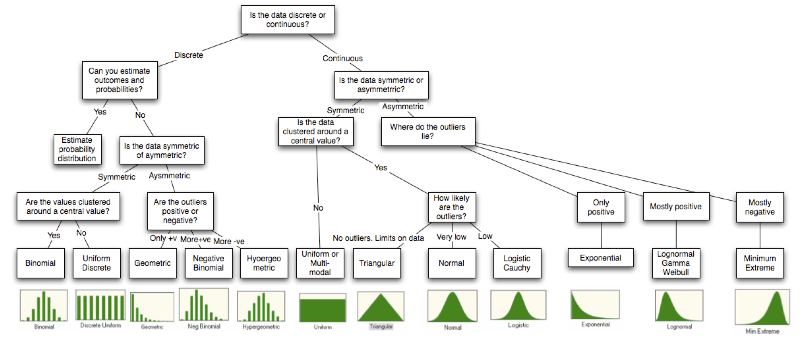 -->
.center[
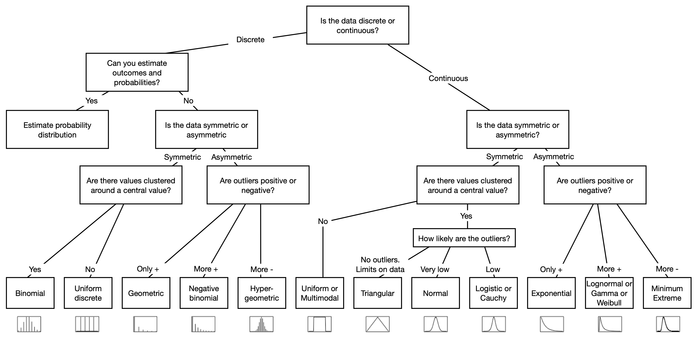
]

???
This figure contains a decision graph that *could* help figure out what distribution you are facing. BUT, it doesn't guarantee that you'll find the right distribution. 


---
# The same distribution? 

.alert[Careful!]

- Some distribution are similar but don't show the same process 

```{r similar_plot_from_different_distributions, echo=FALSE, fig.width=7,fig.height=3}
par(mfrow = c(1,2))
set.seed(1234)
hist(rbinom(10000, 10, 0.5), #breaks = seq(-0.5, 10.5, by = 1), 
     main = "Binomial")
hist(rnorm(10000, 5, 1.5), xlim = c(0,10), main = "Normal")
```
???
- Just keep in mind that some distributions can be approximated with other, but the important point to note is to respect the *type* of data that is generated from a distribution. 

---
# Almost all roads lead to "the normal distribution"

The image below shows a small roadmap demonstrating the link between different statistical distributions. 

.center[
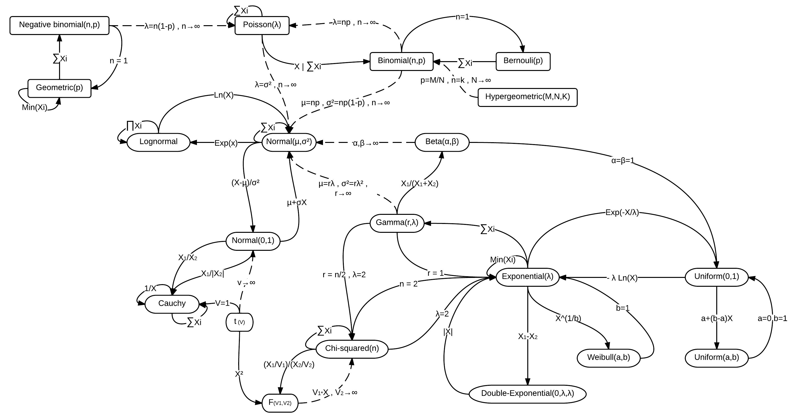
]
???
- Source https://en.wikipedia.org/wiki/Relationships_among_probability_distributions and http://www.math.wm.edu/~leemis/2008amstat.pdf (Ehsan.azhdari)
- Leemis, L. M., and J. T. McQueston. 2008. Univariate Distribution Relationships. The American Statistician 62:45–53.

---
# Other distributions with packages

- Other packages have other distributions. See the [CRAN Task View: Probability Distributions](https://cran.r-project.org/web/views/Distributions.html) if you need a funky distribution that doesn't come in `base R`.
- Some distributions can be recreated in `R` even if they haven't their own function name (e.g., Bernoulli). 
  * Bernoulli distribution can be simulated with a binomial distribution with `size = 1`.

```{r equivalence_between_distributions_Bern_binom, echo=FALSE, fig.width=7,fig.height=4}
par(mfrow = c(1,2), cex = 1.4)
# install.packages("Rlab")
library("Rlab")
# Bernoulli 
x <- seq(0, 1, by = 1) 
y_dbern <- dbern(x, prob = 0.7)
barplot(height = y_dbern,
        names.arg = setNames(c(.3, .7), c('absent (0)', 'present (1)')), 
        ylim = c(0, 1), xlab = '', ylab = 'probability', main = 'Bernoulli p = 0.7')

# Binomial (to get Bernoulli) 
x <- seq(0, 1, by = 1) 
y_binom <- dbinom(x,size = 1, prob = 0.7)
barplot(height = y_binom,
        names.arg = setNames(c(.3, .7), c('absent (0)', 'present (1)')), 
        ylim = c(0, 1), xlab = '', ylab = 'probability', main = 'Binomial, n = 1, p = 0.7')

# Simulate 10 (fair) coin flips
# set.seed(98765)
# rbinom(n = 10, size = 1, prob = 0.5)
```

```{r simulate_coin_flips_plot, echo=FALSE, eval=FALSE}
# Coin flips visualize
set.seed(1235)

nb.flips = 10
set.seed(98765)
coin.flips = rbinom(n = nb.flips, size = 1, prob = 0.5)
heads.tails = ifelse(coin.flips==1,"H","T")
radius =1 
# initialize a plot
plot(x = c(0, nb.flips*(radius+.5)), y = c(-.5, 1), type = "n", 
     axes = F,
     asp = 1, 
     ylab = "", xlab = "")
w = 0
pos=0
for (i in 1:nb.flips) {
  if (i %% 5 == 0) {
    pos = pos + 2.5
    w = 0
  }
  
  # prepare "circle data"
  radius = 1
  center_x = w + 1
  center_y = pos
  theta = seq(0, 2 * pi, length = 200) # angles for drawing points around the circle
  
  # draw the circle
  lines(x = radius * cos(theta) + center_x, y = radius * sin(theta) + center_y)
  polygon(x = radius * cos(theta) + center_x, y = radius * sin(theta) + center_y, col = scales::alpha("beige",.5))
  text(center_x,center_y,labels = heads.tails[i], cex = 3)
  w = w + 2*radius+.5
}

```

???
- Multiple people have expanded the catalog of distributions supported in R. This could be seen in the CRAN Task View about probability distributions. 
- In the next slides, we will explore some distributions in a little more depth. 

#################################
---
class: inverse, center, middle
name: statistical-distributions
# Statistical distributions in more details 

???
- In this section, we'll explore in more details some statistical distributions that are important in biology 

---
# Binomial distribution

- Binomial distribution is finite (number of trials is not infinite) and discrete.
- It assumes that:
  - Each *independent* trial is either a success (1, T, Yes) or failure (0, F, No)
  - There is a *fixed* number of trials and the probability on each trial is constant.

- The probability mass function is:

$$f(x) = {n \choose x} p^x(1-p)^{n-x} $$
where 
- $p$ is the probability of success in a single trial ($(1-p)=q$ is the probability of failure)
- $n$ is the number of trials 
- $x$ is the number of trials that are successes
- ${n \choose x} = \frac{n!}{r!(n-r)!}$ is the number of combinations where the order doesn't matter. 

???
- Note that a 'success' or 'failure' is a *contrast* between 2 elements. 
  * These could be 'heads/tail', 'girl/boy', 'diseased/not', etc.
- The probability of success or failure DON'T change as the experiment goes: e.g., the probability of heads or tail for a coin should not change as the experiment is conducted. 

- See the lecture [Binomial Distribution](https://www.montana.edu/rotella/documents/502/BinomDist.html)
- The function `choose()` is used in R to find the number combinations (regardless of the order, meaning that it could be found in any position). For example, if you just want to know the number of combinations you can have from choosing 6 numbers out of 49, it is `r choose(49, 6)`. If you wish to know the chances of winning the lotteries it's `r 1/choose(49, 6)`.
  * In other words, the *binomial coefficient* shows the number of ways there are of getting x items out of n items (when the item can be one of just 2 types such as male/female, success/failure) (See Crawley's R book). E.g., from 8 individuals, how many ways there are that 3 are males and hende 5 are females? `choose(8,3)` or `r choose(8,3)`
  * Note that the **factorial** gives the number of permutations of *n* items. To arrange 4 items 4! in R is `factorial(4)` which in this case gives `r factorial(4)`.

```
par(mfrow=c(1,2))
x <- 0:6
plot(x,factorial(x),
     type="s", # step option 
     log="y", # Get logarithmic scale for y 
     main="factorial x")
abline(h = seq(0,1000,by = 25), lty = 3)

x = 0:8
plot(x,choose(8,x),
     type="s",
     main="Binomial coefficients")
abline(h = seq(0,70,by = 10), lty = 3)
```

---
# Binomial distribution

- Examples 
  - Number of heads in a row after 3 tosses (heads or tail)
  - Wright-Fisher model (Genetic drift, p and q)
  - Testing the side effects of a new medications (with and without effect)
  - Model river overflows due to excessive rain (overflows or not). 
  - Number of individuals that have a survival probability in an experiment. 

???
- Wright–Fisher model is a mathematical model of genetic drift. p and q are the frequency of 2 different alleles. (Generations do not overlap, like annual plants, and that the copy of the gene in the new generation is independently drawn from the gene pool of the previous generation)
  * Here is a simulation of the Wright-Fisher model [Introduction to the Wright-Fisher Model](https://stephens999.github.io/fiveMinuteStats/wright_fisher_model.html#simulating_the_wright-fisher_model) (cleaner compared to my version!)
- For the medical side effect (affected or not), the river overflows (overflow or not) example, read [5 Real-Life Examples of the Binomial Distribution](https://www.statology.org/binomial-distribution-real-life-examples/)
- https://towardsdatascience.com/why-is-logistic-regression-the-spokesperson-of-binomial-regression-models-54a65a3f368e

<!-- , 'cancer cell death/alive' -->


---
# Binomial distribution in `R`

- In `R`, you can generate binomial distributed variables with the `rbinom` function. 

```
rbinom(n = number of repetitions, # or number of 'experiments' or observations
       size = sample size, # between 0 and up to the size (0:size)
       p = probability of success)
```

- Think of it as the number of times you'd get a success, with probability $p$, for a number of times you repeat the experiment. 

```{r tables_rbinom_ex}
set.seed(12345)
# 1000 experiments where each time, e.g., flipping a coin, I can either have a
table(rbinom(n = 1000, size=1, prob=0.5), dnn=NULL) # success or failure with p=.5
# 1 experiment with 1000 coins summing all successes with p=.5
rbinom(n = 1, size=1000, prob=0.5)
# 1000 experiments where each time, for example flipping 10 coins, where I 
rbind(random = table(rbinom(n = 1000, size=10, prob=0.5), dnn=NULL)/1000,# sum the success with p=.5
      theory = round(dbinom(x = 0:10, size=10, prob=0.5),3))
```
???
- The structure of the function is shown in `R` notation.


---
# Binomial distribution

- Example 1: probability of having a certain number of offspring with a certain genotype (e.g., Aa) given the genotypes of the parents 
  - If a male (AA) mates a female (Aa), what is the probability that 6 of their 7 offspring is Aa (7 choose 6)
  - The probability of getting Aa from AA x Aa is [1/2 AA and 1/2 Aa], 
  - $P(6|7) = {7 \choose 6} (1/2)^6(1-1/2)^{7-6} = 7/128$ (about 0.055)

```{r dbinmon_prob.gen.ans}
dbinom(x = 6,7,prob = .5)
```

- Example 2: Probability of having 3 daughters if you have 5 children.
  * if you have 5 children, these are independent trials, so n = 5
  * "success" is the probability that the child is a daughter (p = 1/2)
  * $P(3|5) = {5 \choose 3} (1/2)^3(1-1/2)^{5-3} = 5/16$ (about 0.31)

```{r dbinmon_prob.daughter.ans}
dbinom(x = 3,5,prob = .5) 
```


???
genotype examples
The Punnett square for the male and female union 

| Gametes | A | a | 
| ------- | - | - | 
| A	      | AA | Aa	| 


Daughter examples


- You could also discuss this simpler case: 
- what is the probability of getting 2 daughters out of 3 children
```{r dbinmon_prob.5}
dbinom(2,3,prob = .5)
```

```
000 # 0 ## 1/8      1/8
001 # 1 ## 1/8  #
010 # 1 ## 1/8  #   3/8
100 # 1 ## 1/8  #
011 # 2 ## 1/8  ##
110 # 2 ## 1/8  ##  3/8
101 # 2 ## 1/8  ##
111 # 3 ## 1/8  ### 1/8

```


---
# Binomial distribution

- This is a visualization of the previous examples.

```{r dbinom_plot_ex, echo=-c(1:5), fig.width=8,fig.height=4}
par(mfrow = c(1,1), mar = c(4,4,1,1))
set.seed(12345); lwd = 3
col = scales::alpha("black",.5); col.r = scales::alpha("red",.5)
col.g = scales::alpha("green",.5); col.b = scales::alpha("blue",.8)
add.l <- function(by=.1) {  abline(h=seq(0,1, by = by), lty = 3, lwd = .3)}
plot(0:8, dbinom(x = 0:8, size=7, prob=0.5),type='h', col = col.b, lwd=lwd, ylim = c(0,.4), ylab = "Probability", main = "s=7 (blue) and s=5 (red); p=0.5 "); add.l(.05)
points(x = 6, y = dbinom(x = 6, size=7, prob=0.5), pch =19, col = col.b)

lines(c(0:8)+0.1, dbinom(x = 0:8, size=5, prob=0.5),type='h', col = col.r, lwd=lwd)
points(x = 3+.1, y = dbinom(x = 3, size=5, prob=0.5), pch =19, col = col.r)
legend("topright",legend = c("Genetics","Daughter"), lty =c(1), col = c("blue","red"), lwd = 3)
```

???
- blue = genotype examples
```{r dbinmon_prob.gen}
dbinom(x = 6,7,prob = .5)
```

- Red = Daughter examples
```{r dbinmon_prob.daughter}
dbinom(x = 3,5,prob = .5) 
```

- Examples taken from 
  * [Polynomial Applications Binomial Distribution](http://www.biology.arizona.edu/biomath/tutorials/polynomial/applications/BinomialEx3.html)
  * [Biology 300 Notes on the binomial distribution](https://www.zoology.ubc.ca/~bio300b/binomialnotes.html)
  * [The Binomial Distribution: A Probability Model for a Discrete Outcome](https://sphweb.bumc.bu.edu/otlt/mph-modules/bs/bs704_probability/bs704_probability7.html)


---
# Binomial distribution


```{r Statistical_dist_binom, echo=-c(1:6), fig.width=8,fig.height=4}
par(mfrow = c(2,3), mar = c(4,4,1,1))
set.seed(12345)
col = scales::alpha("black",.5); col.r = scales::alpha("red",.5)
col.g = scales::alpha("green",.5); col.b = scales::alpha("blue",.8)
lwd=2
add.l <- function(by=.1) {  abline(h=seq(0,1, by = by), lty = 3, lwd = .3)}
# For dbinom, x is the vector of quantiles 
plot(0:1, dbinom(x = 0:1, size=1, prob=0.5),type='h', col=col.b, lwd=lwd, ylim=c(0,1), ylab="Probability", main = "s=1, p=.5"); add.l()
plot(0:20, dbinom(x=0:20, size=20, prob=0.4), type='h', col=col.b, lwd=lwd, ylim=c(0,.2), ylab="", main = "s=20, p=.4");add.l()
plot(0:23, dbinom(x=0:23, size=20, prob=0.9), type='h', col=col.b, lwd=lwd, ylim=c(0,0.3), ylab="", main = "s=20, p=.9");add.l()
plot(40:110, dbinom(x=40:110, size=150, prob=0.5), type='h', col=col.b, lwd=lwd, ylim=c(0,.15), ylab="Probability", main="s=150, p=.5");add.l()


plot(40:51, dbinom(x = 40:51, size=50, prob=0.99),type='h', col = col.b, lwd=lwd, ylim = c(0,.8), ylab = "", main = "s=50, p=.99");add.l()
hist(rbinom(n = 100000, size=50, prob=0.99),xlab = "Nb of successes", breaks = 100, col = col.b, main = "s=50, p=.99", probability = F)
```

???
1. One coin with 50% probability of success vs failure 
2. 20 coins with 40% probability of success vs failure 
3. 20 coins with 90% probability of success vs failure # Compare with previous graph. Can't go above 20. If you have a coin that lands on a success 90% of the time, you'd expect that the number of successes you sum up is large, which is why the graph is shifted to the right. 
4. 150 coins with 50% probability of success vs failure. The highest probability is at 75
5. 50 coins with 99% probability of success vs failure. The highest probability is at 50. 
6. Same as previous but randomly generated 
- Some of the distributions may *look* normal, but they are NOT. 
- If you look at the histograms and plot the "density", you can see that it can go ABOVE 1. It makes more sense to see the probabilities as the AREA under such curve.
- See [Probability density function vs. probability mass function](https://math.stackexchange.com/questions/23293/probability-density-function-vs-probability-mass-function)

```{r hist.binom, fig.width=7,fig.height=4}
hist(rbinom(n = 100000, size=50, prob=0.5), xlab = "Nb of successes", breaks = 100, 
     col = col.b, main = "s=50, p=.5", probability = F)
```


---
name: challenge3
## Challenge 3 

What is the probability (in %), of getting 4 heads *and* 4 tails from 4 tosses of a fair coin? 
Use the binomial distribution to answer this question. 

???
- Fair coin = probability has to be 0.5
- If Heads = success, then you can have 4 heads and 0 heads. 
- You need to add up the probability for both.

---
## Challenge 3 - Solution 

What is the probability (in %), of getting 4 heads or 4 tails from 4 tosses of a fair coin? 
```{r binom_chall_coin, echo=-1, fig.width=8,fig.height=4}
par(mar =c(4,4,1,1)); lwd = 5
dbinom(x = 0, size = 4, prob = .5) + dbinom(x = 4, size = 4, prob = .5) #<<
curve(dbinom(x,4,.5),0,6, n = 7,type = "h", lwd = lwd)
curve(dbinom(x,4,.5),0,0, type = "h",add = TRUE, col = "red", lwd = lwd)
curve(dbinom(x,4,.5),4,4, type = "h",add = TRUE, col = "red", lwd = lwd)
```

???

```{r binomial_fun}
mybin <- function(x,n,p) { choose(n, x)* p^x* (1-p)^(n-x) } 
mybin(0,4,.5) + mybin(4,4,.5)
0.5^4*2
```


---
# Poisson distribution

- To be Poisson distributed, the data generally assumes that 
  - the probability of some event is small over a short period of time (or area), but that there are a lot of events (as there would be a lot of time passing, or a lot of space) in which the process could happen 
  - The number of event reported is independent from one time point to the other. 
  - In summary, it models *rare* events that happen at a certain *rate*. In other words, there are many opportunities to succeed (n is large), but the probability of success (for each trial) is small. 
  
- The probability mass function is:

$$f(x) = e^{-\lambda}\frac{\lambda^x}{x!}$$ where $\mu = \sigma^2 = \lambda$

???
- See the article [The Poisson Distribution and Poisson Process Explained](https://towardsdatascience.com/the-poisson-distribution-and-poisson-process-explained-4e2cb17d459) "A Poisson Process is a model for a series of discrete event where the average time (or space) between events is known, but the exact timing of events is random. The arrival of an event is independent of the event before (waiting time between events is memoryless)."
- The important point here is that 1. the *NUMBER OF TRIALS IS UNKNOWN*, 2. But there are a lot of them

---
# Poisson distribution

- Examples (something per unit time or space for example): 
  - Nb of deaths due to a disease (e.g., SARS-CoV 2) for a period of time 
  - Ticks of a radiation counter (Geiger counter which detects and measures ionizing radiation)
  - DNA mutation
  - Colonization of animals on remote islands
  - Mutation models
  - Recombination models 
  - Bacteria colonies growing on an agar plate 

```{r petri_dish_bacteria_colonny, echo=FALSE, fig.width=5,fig.height=3}
set.seed(1235)
# initialize a plot
plot(c(-1, 3.5), c(-1, 1), type = "n", axes = F, asp = 1, ylab = "", xlab = "")
n = 25
# prepare "circle data"
radius = 1
center_x = 0
center_y = 0
theta = seq(0, 2 * pi, length = 200) # angles for drawing points around the circle

# draw the circle
lines(x = radius * cos(theta) + center_x, y = radius * sin(theta) + center_y)
polygon(x = radius * cos(theta) + center_x, y = radius * sin(theta) + center_y, col = scales::alpha("beige",.5))

center_x = 2.5
center_y = 0
lines(x = radius * cos(theta) + center_x, y = radius * sin(theta) + center_y)
polygon(x = radius * cos(theta) + center_x, y = radius * sin(theta) + center_y, col = scales::alpha("beige",.5))

rdmunif<-runif(n,0,1)
r = runif(n,0,radius) #radius * sqrt(rdmunif)
theta = rdmunif * 2 * pi
x = center_x + sqrt(r*radius) * cos(theta)
y = center_y + sqrt(r*radius) * sin(theta)

points(x,y, pch =19, cex = .6)

arrows(1.1,0,1.4,0, length = .1)
# draw sq
x.pos = c(1.9,2.5, 2.9,2,2.2)
y.pos = c(0,.3,-.6,.3,-.8)
dx = .1
for (i in 1:length(x.pos)) {
  polygon(x = c(x.pos[i],x.pos[i]+dx,x.pos[i]+dx,x.pos[i]),y = c(y.pos[i],y.pos[i],y.pos[i]-dx,y.pos[i]-dx))
}
```

???
- For the bacterial colonies, if you sample small units of space, you can count the number of bacteria colonies
- Examples taken from [Discrete probability distributions - Class 5](https://ani.stat.fsu.edu/~debdeep/p4_s14.pdf)

<!-- Useful resource -->
<!-- Poisson definition see https://ani.stat.fsu.edu/~debdeep/p4_s14.pdf -->
<!-- Poisson example see https://www.pnas.org/content/115/37/9270 -->

---
# Poisson distribution in `R`

- In `R`, you can generate Poisson distributed variables with the `rpois` function. Below is the structure of the function. 

```
rpois(n = number of repetitions,
      lambda = rate) # doesn't need to be an integer
```

- You can think of this function as the number of times you'd get a success, when the number of events per unit of time or space is lambda 
- E.g., with a camera trap, I see on average 2 wolves/day (lambda is this rate), then if I go on the field for one day, what could be the number of wolves that I observe? 

```{r rpois_example_1.2}
set.seed(5937); rpois(n = 1,lambda = 2)
```
- Wow! That day was amazing! The probability of seeing this number is `r round(dpois(x = 5, lambda=2),2)` and the probability of seeing 5 or more is `r round(ppois(q = 5, lambda=2,lower.tail = F),2)`

```{r Statistical_dist_poisson_wolf, echo=FALSE, fig.width=8,fig.height=2}
par(mfrow = c(1,1), mar = c(4,4,1,1))
set.seed(12345)
col = scales::alpha("black",.5); col.r = scales::alpha("red",.5)
col.g = scales::alpha("green",.5); col.b = scales::alpha("blue",.8)
lwd=2
add.l <- function(by=.1) {  abline(h=seq(0,1, by = by), lty = 3, lwd = .3)}
plot(0:10, dpois(x = 0:10, lambda=2),type='h', col = col.b, lwd=lwd, ylim = c(0,.41), ylab = "Probability", main = "lambda = 2"); add.l()
```

---
# Poisson distribution

```{r Statistical_dist_poisson, echo=-c(1:6), fig.width=8,fig.height=4}
# Poisson
par(mfrow = c(2,3), mar = c(4,4,1,1))
set.seed(12345)
col = scales::alpha("black",.5); col.r = scales::alpha("red",.5)
col.g = scales::alpha("green",.5); col.b = scales::alpha("blue",.8)
lwd=2
add.l <- function(by=.1) {  abline(h=seq(0,1, by = by), lty = 3, lwd = .3)}

plot(0:5, dpois(x = 0:5, lambda=0.05),type='h', col = col.b, lwd=lwd, ylim = c(0,1), ylab = "Probability", main = "lambda = 0.05");add.l();abline(v = 0.05, lty = 3)
plot(0:10, dpois(x = 0:10, lambda=1),type='h', col = col.b, lwd=lwd, ylim = c(0,1), ylab = "Probability", main = "lambda = 1"); add.l();abline(v = 1, lty = 3)
plot(0:20, dpois(x = 0:20, lambda=5),type='h', col = col.b, lwd=lwd, ylim = c(0,0.3), ylab = "Probability", main = "lambda = 5");add.l();abline(v = 5, lty = 3)
plot(0:40, dpois(x = 0:40, lambda=20),type='h', col = col.b, lwd=lwd, ylim = c(0,.2), ylab = "Probability", main = "lambda = 20");add.l();abline(v = 20, lty = 3)


hist(rpois(n = 1000, lambda=25), xlab = "Nb of successes", breaks = 100, col = col.b, main = "n = 1000, lambda = 25", probability = F);abline(v = 25, lty = 3)
hist(rpois(n = 100000, lambda=50),xlab = "Nb of successes", breaks = 100, col = col.b, main = "n = 100000, lambda = 50", probability = F);abline(v = 50, lty = 3)
```

???
- The vertical line is the mean of the graph (or the lambda values)
- graphs from TOP LEFT to BOTTOM RIGHT
  * Lamda = 0.05  
  * Lamda = 1     
  * Lamda = 5       
  * Lamda = 20        
  * Lamda = 25  n = 1,000      
  * Lamda = 50  n = 100,000      
- the first 4 graphs are the probability mass functions
  * the height is the probability of getting a certain value 
- the last 2 graphs are the pseudo-randomly generated numbers from a Poisson distribution
  * The height of the bars are the FREQUENCY of the data for certain bins 

- How would you calculate the probability of getting X number of events or more from these graphs.
  * If you have a probability mass function (PMF), you can just add the probabilities of the X number of events and MORE
  * If you have a frequency histogram, you need to get the probability of observing the data first and get sum as the PMF (if R, you can just use the `ppois()` function as this just does that.)


---
# Poisson distribution vs binomial

- Difference between Binomial and Poisson distributions:
  - Number of events in Poisson can be infinite (so n tends towards infinity and the probability of each event approaches 0)
  - Number of trials is finite ( $n$ ) in Binomial distribution 

```{r equivalence_between_distributions_Binom_poisson, echo=FALSE}
par(mfrow = c(2,2), mar = c(4,4,1,1))
x <- 0:10
n <- 10000
barplot(dbinom(x, n, 2/n), names.arg = x, ylim = c(0, 0.35), main = paste("Binomial with n = ", n))
barplot(dbinom(x, n, 9/n), names.arg = x, ylim = c(0, 0.35), main = paste("Binomial with n = ", n))
barplot(dpois(x, 2), names.arg = x, ylim = c(0, 0.35), main = paste("Poisson with Lambda = ", 2))
barplot(dpois(x, 9), names.arg = x, ylim = c(0, 0.35), main = paste("Poisson with Lambda = ", 9))

pbinom(q = 2, size = n, prob = 2/n)
ppois(q = 2, lambda = 2)
```

???
- Actually, the Poisson distribution approximates the Binomial with $\lambda = np$ if $n \geq 20$ and $p \leq 0.05$
- See [The Poisson Distribution in R](https://rstudio-pubs-static.s3.amazonaws.com/456645_107fa2aa82de4b1da6c78c418bab9fe9.html)

---
# Uniform distribution (discrete)

- This distribution can take any discrete value in a range 

```{r uniform_distcrete_fun_dist, echo=-1, fig.width=5,fig.height=3}
par(mar = c(3,4,1,1))
# Define uniform discrete 
dunifdisc<-function(x, min=0, max=1) ifelse(x>=min & x<=max & round(x)==x, 1/(max-min+1), 0)
runifdisc<-function(n, min=0, max=1) sample(min:max, n, replace=T)
curve(dunifdisc(x, 7,10), type = "h",from=6, to=11, col="black", xlab = "",
      lwd=1, ylim = c(0,.5), ylab = "Probability", main = "Uniform discrete"); title(xlab = "x",line=2.2, cex.lab=1.2) 
```

```{r uniform_distcrete_rdm_nb, echo=TRUE}
set.seed(12345)
sample(7:10, size = 1,replace = T)
runifdisc(1,7,10)
```


---
# Uniform distribution (continuous)

- This distribution will give any (continuous) value between a minimum and a maximum value. 
- This can come handy when generating angles. 

```{r uniform_cont_angles, echo=-1, fig.width=5,fig.height=3}
par(mar = c(3,4,1,1))
x = seq(0,360,by = .1)
y <- dunif(x, min = min(x),max = max(x))
plot(y~x, type = "n", ylim = c(0,1.5*max(y)), ylab = "Density", xlab = "", main = "Uniform continuous")
polygon(c(x, rev(x), 0), c(y, rep(0,length(y)), 0), col=scales::alpha("blue",.5))
title(xlab = "x",line=2.2, cex.lab=1.2)
```

```{r uniform_continuous_rdm_nb, echo=TRUE}
set.seed(12345)
runif(n = 1, min = 0, max = 360)
```


---
# Normal distribution (Gaussian)

- This distribution is the most important to know (see Central limit theorem). 
- It has interesting properties (mean: center, sd: spread, bell-shaped, symmetry, etc.)
- Can approximate other distribution (might require data transformation)
- The normal distribution with mean = 0 and sd = 1 is called the **Standard Normal**

The general form of the probability density function for a normal distribution is 

$$f(x)={\frac{1}{\sigma\sqrt{2\pi}}}e^{-{\frac{1}{2}}\Bigl(\frac {x-\mu}{\sigma}\Bigr)^2}$$

The important part here is the mean $\mu$ and the standard deviation $\sigma$. Usually summarized as $N(\mu, \sigma)$. However, note that sometimes, $\sigma$ is the variance, but in R, it is the standard deviation. 

Here is a [link to play with a Normal distribution interactively](https://www.desmos.com/calculator/w2lfompsop). 

???
- This is one of the most important distribution in statistics
- We will spend some time to understand it better
- we will look at some of its properties 
- If you are interested, you could show the graph on [desmos](https://www.desmos.com/calculator), an online scientific and graphic calculator. There, you could write $e^{-s^{-2}\left(x-m\right)^{2}}$ and show the result (add the slider for m and s to show what they do). It is approximately Bell curve = $e^{-x^2}$

```
# https://www.youtube.com/watch?v=4PDoT7jtxmw&ab_channel=3Blue1Brown
x = seq(-10,10,by = .1)
s = 2 # ~ related to SD
plot(x, exp(-s*x^2), type = "l")
m = 0 # mean 
plot(x, exp(-(1/s^2)*(x-m)^2), type = "l")
```


<!-- Material inspiration
https://ani.stat.fsu.edu/~debdeep/p4_s14.pdf
-->

---
# Normal distribution (Gaussian)

- Examples: 
  - Distribution of a lot of continuous phenotypes 
  - Arm length, or human height in a population
  - velocity of a collection of molecules in a gas of liquid
  - the error from measurements (length of beak).

???
- Here are some examples of the type of data that could be generated from the normal distribution

---
# Normal distribution (Gaussian)

- The `iris` dataset contains values that are 'drawn' from a normal distribution. 
- Here are the histogram for sepal length (mm).

```{r Iris_normal, echo=FALSE, fig.width=12,fig.height=4}
par(mfrow = c(1,3), cex = 1.4)
spiris = unique(iris$Species)
for (i in 1:length(spiris)) {
  tmp.iris=iris[iris$Species %in% spiris[i],]
  titl = paste("Iris",spiris[i])
  hist(tmp.iris$Sepal.Length,
       main = bquote(italic(.(titl))),
       xlab = "Sepal length",
       xlim = c(3.8,9), breaks = 10)
}
```

???
- An example is from the iris dataset 

---
# Normal distribution (dissection)

.pull-left[
```{r Density_normal, fig.width=5,fig.height=5}
curve(expr = dnorm(x = x, mean=0,sd=1), 
      from = -5, to = 5, ylim = c(0,1),
      col="black", ylab = "Density",
      main = "Density normal") 
abline(h=seq(0,1, by = .1), 
       lty = 3, lwd = .3)

```
]

???
- We showed earlier that different functions can give the values needed to plot the PDF or prob. density function. 
- With `dnorm`, we are going to show some properties of the Norm. distribution. 
- This is a standard norm. curve (mean=0, sd=1)
- The graph shows the x values (which in this case could be any real value that is scaled; human height where we removed the mean and devided by the sd)
- The y axis is the DENSITY of finding the values. It can RANGE from 0 to large values (not necessarily 1). The important point is that the TOTAL AREA UNDER THE CURVE is 1, so that it can represent a probability, for a density curve. 
--

.pull-right[
For the density distribution, the *area* under the curve between two points is the *probability*. For example, the 95% probability (red region), and 2 tails 2.5% (blue region).

```{r Density_normal_dissection_all_info, echo=FALSE, fig.width=7,fig.height=6}
par(mfrow = c(1,1), mar = c(4,4,2.5,1))
x <- seq(-5, 5, 0.1)
cex  = 1.0
plot(x, dnorm(x, 0, 1), 
     main = "Density normal", type = "l", lwd = 3, 
     col = "black", ylab = "", xlab = "x", ylim = c(0,.5))
# quantile.normal = qnorm(seq(0,1, by = .05))
quantile.normal = qnorm(c(.999,0.001,.975,.025, .95, .05, .9, .1))
abline(v = quantile.normal[!is.infinite(quantile.normal)], lty = 3, lwd = .3) 
abline(h=seq(0,1, by = .1), lty = 3, lwd = .3)

p = 0.025 

# add the polygon to the left  
lb <- min(x) # Lower bound
ub <- qnorm(p)   # Upper bound
x2 <- seq(min(x), ub, length = 100) # New Grid
y <- dnorm(x2, 0, 1) # Densitypolygon(c(lb, x2, ub), c(0, y, 0), col = rgb(0, 0, 1, alpha = 0.5))
polygon(c(lb, x2, ub), c(0, y, 0), col = rgb(0, 0, 1, alpha = 0.5))
text(x = ub, y = p+0.04,labels = paste0("pnorm(qnorm(p)) = \n",p*100,"%"),adj = 0,pos = 2, cex=cex)

text(x = ub-.6, y = .2,labels = paste0("qnorm(p) = ", round(qnorm(p),2)),adj = 0,pos = 1,offset = -1, cex=cex)
arrows(x0 = ub,x1 = ub, y0 = .2,y1 = .1,code = 2,length=.1)


# add the polygon to the right 
lb <- qnorm(1-p) # Lower bound
ub <- max(x)   # Upper bound
x2 <- seq(lb, max(x), length = 100) # New Grid
y <- dnorm(x2, 0, 1) # Density
polygon(c(lb, x2, ub), c(0,y,0), col = rgb(0, 0, 1, alpha = 0.5))
text(x = lb, y = p+0.04,labels = paste0(p*100,"%"),adj = 0,pos = 4, cex=cex)

text(x = lb+.7, y = .2,labels = paste0(round(qnorm(1-p),2)," = qnorm(1-p)"),adj = 0,pos = 1,offset = -1, cex=cex)
arrows(x0 = lb,x1 = lb, y0 = .2,y1 = .1,code = 2,length=.1)

# Add the middle (red) polygon 
lb <- qnorm(p) # Lower bound
ub <- qnorm(1-p)   # Upper bound
x2 <- seq(lb, ub, length = 100) # New Grid
y <- dnorm(x2, 0, 1) # Density
polygon(c(lb, x2, ub), c(0,y,0), col = rgb(1, 0, 0, alpha = 0.5))
text(x = mean(x2), y = .15,labels = paste0((1-2*p)*100,"% \n=", "\npnorm(qnorm(1-p)) - \npnorm(qnorm(p))"),adj = 0,pos = 1, cex=cex)

text(x = 0, y = .47,labels = paste0(quote("Mean")),adj = 0,pos = 1,offset = 0, cex=cex)
arrows(x0 = 0,x1 = 0, y0 = .45,y1 = .42,code = 2,length=.1)

legend("topright",legend = c("Density normal (dnorm)","Density rnorm(100)"), lwd = 1, lty = 1, col = c("black", "green"))

set.seed(123)
rndat =rnorm(100)
# mean(rndat)
dens.nor = density(rndat)
lines(dens.nor, lwd = 3,col = scales::alpha("green",.8))
mybins=hist(rndat, plot = F, density = T, breaks = 100)
crn = mybins$density
brn = mybins$breaks
```
]

???
- In this plot, there is the same standard normal curve, but some important values are plotted as well
- First, the AREA UNDER THE CURVE BETWEEN 2 POINTS is the PROBABILITY of finding data between those 2 points. 
  * the red area is the probability between about 2sd on EACH side of the mean (~95%)
- There is a second distribution (green line) shown as the density which are 100 randomly drawn points from a standard normal curve. You can see that the black and green line are pretty close, but they are not the same. 
`qnorm(.025) = -1.96`
`qnorm(1-.025) = 1.96`
`pnorm(qnorm(1-.025)) = 0.975`

---
# Convert a Normal dist. to Standard Normal 

- If your data is normally distributed (i.e., $X \sim N(\mu, \sigma)$), you can convert the data to be $X \sim N(0, 1)$ with a scaling
$$Z = \frac{(X-\mu)}{\sigma} $$ 

```{r Standard_normal_transformation, echo=FALSE, fig.width=10,fig.height=5}
par(mfrow = c(1,2))
set.seed(1235)
x <- seq(-5, 20, 0.1)
cex  = 1
black.5 = scales::alpha("black",.5)
red.5 = scales::alpha("red",.5)
blue.5 = scales::alpha("blue",.5)
# Add the standard normal 
plot(x, dnorm(x, 0, 1), main = "Density normal", type = "l", lwd = 3, col = black.5, ylab = "", xlab = "x", ylim = c(0,1))
text(x = 0, y = .62,labels = paste0("Standard \nnormal"),adj = 0,pos = 1,offset = 0, cex=cex)
arrows(x0 = 0,x1 = 0, y0 = .5,y1 = .42,code = 2,length=.1)

# Add a population distribution 
lines(x, dnorm(x, 15, 2), main = "Density normal", type = "l", lwd = 3, col = red.5, ylab = "", xlab = "x", ylim = c(0,1))
text(x = 15, y = .55,labels = paste0("Normal \n mean=15 \n sd=2"),adj = 0,pos = 1,offset = 0, cex=cex)
arrows(x0 = 15,x1 = 15, y0 = .35,y1 = .25,code = 2,length=.1)

# Add simulated data 
my.data = rnorm(100, 15, 2)
mean.data = mean(my.data)
sd.data = sd(my.data)
lines(density(my.data), col = blue.5, lwd = 3)
# Add guides
abline(h=seq(0,1, by = .1), lty = 3, lwd = .3)

# Add the standard normal 
plot(x, dnorm(x, 0, 1), main = "Density normal", type = "l", lwd = 3, col = black.5, ylab = "", xlab = "x", ylim = c(0,1))

# Add a population distribution 
lines(x, dnorm(x, 0, 1), main = "Density normal", type = "l", lwd = 3, col = red.5, ylab = "", xlab = "x", ylim = c(0,1))
lines(density((my.data-mean.data)/sd.data), col = blue.5, lwd = 3)

# Add guides
abline(h=seq(0,1, by = .1), lty = 3, lwd = .3)

```

???
- This is just a quick note to show you how to scale data and what effect it has on a distribution
- Left: SNorm curve with a theoretical distribution centered at 15 and sd 2. The blue curve is a density of 100 points taken from a normal distribution with the same parameters as the population. 
- Right: after scaling, you can see that all the data is now at a mean of 0 and a SD of 1. 


---
# Quantile value for a normal distribution 

If X is a random variable distributed with a *Standard normal distribution*, what is the probability of finding X less or equal to $1.645$. In other words,  $P(X\leq 1.645)$ where $X\sim N(0,1)$? 
.pull-left[
```{r pnorm_qnorm2}
# Gives the probability at X 
pnorm(1.645) 

# Gives X at a prob.
qnorm(p = 0.05, lower.tail = F) 

# Value for 5% in both tails
qnorm(p = 0.025, lower.tail = F) 
```

- `lower.tail = T` means that we are calculating the probability (area under the curve) from the left of the graph *up to the specified value* 
- `lower.tail = F` means that the probability is calculated from the right of the graph *down to the specified value* 
]

???
- The cool thing is that now, we can calculate the probabilities of any given RANGE of x values
- The `lower.tail` argument is a logical; if TRUE (default), probabilities are $P[X \leq x]$ otherwise, $P[X \gt x]$. Here `lower.tail=F` since I wanted to show the TOP probability (from the UPPER tail)
- Here are some important values to remember with the normal distribution  (.05 is 5% and 0.025 is 2.5% from alpha and alpha/2)
--

.pull-right[
```{r normal_shade_95_5, echo=FALSE, fig.width=5,fig.height=5}
x <- seq(-5, 5, 0.1)
cex  = 1
plot(x, dnorm(x, 0, 1), main = "Density normal", type = "l", lwd = 3, col = "black", ylab = "", xlab = "x", ylim = c(0,1))
quantile.normal = qnorm(c(.95, .05))
abline(v = quantile.normal[!is.infinite(quantile.normal)], lty = 3, lwd = .3) 
abline(h=seq(0,1, by = .1), lty = 3, lwd = .3)

p = 0.05

# add the polygon to the right 
lb <- qnorm(1-p) # Lower bound
ub <- max(x)   # Upper bound
x2 <- seq(lb, max(x), length = 100) # New Grid
y <- dnorm(x2, 0, 1) # Density
polygon(c(lb, x2, ub), c(0,y,0), col = rgb(1, 0, 0, alpha = 0.5))
text(x = lb, y = p+0.04,labels = paste0(p*100,"%"),adj = 0,pos = 4, cex=cex)

# Add the middle (blue) polygon 
lb <- min(x) # Lower bound
ub <- qnorm(1-p)   # Upper bound
x2 <- seq(lb, ub, length = 100) # New Grid
y <- dnorm(x2, 0, 1) # Density
polygon(c(lb, x2, ub), c(0,y,0), col = rgb(0, 0, 1, alpha = 0.5))
text(x = 0, y = .2,labels = paste0((1-p)*100,"%"),adj = 0,pos = 1, cex=cex)

text(x = 0, y = .55,labels = paste0(quote("Mean")),adj = 0,pos = 1,offset = 0, cex=cex)
arrows(x0 = 0,x1 = 0, y0 = .5,y1 = .42,code = 2,length=.1)
```
]

???
This is the visual representation of what is on the left for the 5% probability. The value of x between the blue and red polygon is ~1.64.

---
# Normal distribution 

```{r normal_area_function, echo=FALSE, eval=TRUE}
draw.normal <- function(mean = 0, sd = 1, set.seed=1, prob = 0.025, text = FALSE, text.height = .55, where = c("both","left","right","middle"), middle = c(-1,1)) {
  set.seed(set.seed)
  x <- seq(-5, 5, 0.1)
  cex = 1
  plot(x, dnorm(x, mean, sd), 
       # main = "Density normal", 
       main = "", 
       type = "l", lwd = 3, col = "black", 
       ylab = "", xlab = "",
       ylim = c(0,1))
  title(xlab = "x", ylab="", line=2.2, cex.lab=1.2)

  # abline(v = quantile.normal[!is.infinite(quantile.normal)], lty = 3, lwd = 1, col = c("black")) 
  
  # Horizontal 
  abline(h=seq(0,1, by = .1), lty = 3, lwd = .3)
  
  p = prob 
  
  if(where=="both"){
    # add the polygon to the left  
    lb <- min(x) # Lower bound
    ub <- qnorm(p)   # Upper bound
    x2 <- seq(min(x), ub, length = 100) # New Grid
    y <- dnorm(x2, 0, 1) # Densitypolygon(c(lb, x2, ub), c(0, y, 0), col = rgb(0, 0, 1, alpha = 0.5))
    polygon(c(lb, x2, ub), c(0, y, 0), col = rgb(0, 0, 1, alpha = 0.5))
    text(x = -2, y = .2,
         labels = paste0(p*100,"%"),adj = 0,pos = 2, cex=cex)
    
    if (text) {
      text(x = ub, y = .2,
           labels = paste0(round(qnorm(p),2)),adj = 0,pos = 1,offset = 0, cex=cex)
      arrows(x0 = ub,x1 = ub, y0 = .2,y1 = .1,code = 2,length=.1)
    }
    
    # add the polygon to the right 
    lb <- qnorm(1-p) # Lower bound
    ub <- max(x)   # Upper bound
    x2 <- seq(lb, max(x), length = 100) # New Grid
    y <- dnorm(x2, 0, 1) # Density
    polygon(c(lb, x2, ub), c(0,y,0), col = rgb(0, 0, 1, alpha = 0.5))
    text(x = 2, y = .2,
         labels = paste0(p*100,"%"),adj = 0,pos = 4, cex=cex)
    
    if (text) {
      text(x = lb, y = .2,
           labels = paste0(round(qnorm(1-p),2)),adj = 0,pos = 1,offset = 0, cex=cex)
      arrows(x0 = lb,x1 = lb, y0 = .2,y1 = .1,code = 2,length=.1)
    }
    
    # Add the middle (red) polygon 
    lb <- qnorm(p) # Lower bound
    ub <- qnorm(1-p)   # Upper bound
    x2 <- seq(lb, ub, length = 100) # New Grid
    y <- dnorm(x2, 0, 1) # Density
    polygon(c(lb, x2, ub), c(0,y,0), col = rgb(1, 0, 0, alpha = 0.5))
    text(x = mean(x2), y = text.height,
         labels = paste0((1-2*p)*100,"%"),adj = 0,pos = 1, cex=cex)
    
    if (text) {
      text(x = 0, y = .55,
           labels = paste0(quote("Mean")),adj = 0,pos = 1,offset = 0, cex=cex)
      arrows(x0 = 0,x1 = 0, y0 = .5,y1 = .42,code = 2,length=.1)
    }
  }
  
  if (where=="left") {
    # add the polygon to the left  
    lb <- min(x) # Lower bound
    ub <- qnorm(p)   # Upper bound
    x2 <- seq(min(x), ub, length = 100) # New Grid
    y <- dnorm(x2, 0, 1) # Densitypolygon(c(lb, x2, ub), c(0, y, 0), col = rgb(0, 0, 1, alpha = 0.5))
    polygon(c(lb, x2, ub), c(0, y, 0), col = rgb(0, 0, 1, alpha = 0.5))
    text(x = -2, y = .2,
         labels = paste0(p*100,"%"),adj = 0,pos = 2, cex=cex)
    
    if (text) {
      text(x = ub, y = .2,
           labels = paste0(round(qnorm(p),2)),adj = 0,pos = 1,offset = 0, cex=cex)
      arrows(x0 = ub,x1 = ub, y0 = .2,y1 = .1,code = 2,length=.1)
    }
    
    # Add the middle (red) polygon 
    lb <- qnorm(p) # Lower bound
    ub <- max(x)   # Upper bound
    x2 <- seq(lb, ub, length = 100) # New Grid
    y <- dnorm(x2, 0, 1) # Density
    polygon(c(lb, x2, ub), c(0,y,0), col = rgb(1, 0, 0, alpha = 0.5))
    text(x = 2, y = .2,
         labels = paste0((1-p)*100,"%"),adj = 0,pos = 4, cex=cex)
    
    if (text) {
      text(x = 0, y = .55,
           labels = paste0(quote("Mean")),adj = 0,pos = 1,offset = 0, cex=cex)
      arrows(x0 = 0,x1 = 0, y0 = .5,y1 = .42,code = 2,length=.1)
    } 
    
  }
  
  if (where=="right"){
    # add the polygon to the left  
    lb <- min(x) # Lower bound
    ub <- qnorm(1-p)   # Upper bound
    x2 <- seq(min(x), ub, length = 100) # New Grid
    y <- dnorm(x2, 0, 1) # Densitypolygon(c(lb, x2, ub), c(0, y, 0), col = rgb(0, 0, 1, alpha = 0.5))
    polygon(c(lb, x2, ub), c(0, y, 0), col = rgb(1, 0, 0, alpha = 0.5))
    text(x = -2, y = .2,
         labels = paste0((1-p)*100,"%"),adj = 0,pos = 2, cex=cex)
    
    if (text) {
      text(x = ub, y = .2,
           labels = paste0(round(qnorm(p),2)),adj = 0,pos = 1,offset = 0, cex=cex)
      arrows(x0 = ub,x1 = ub, y0 = .2,y1 = .1,code = 2,length=.1)
    }
    
    # Add the middle (red) polygon 
    lb <- qnorm(1-p) # Lower bound
    ub <- max(x)   # Upper bound
    x2 <- seq(lb, ub, length = 100) # New Grid
    y <- dnorm(x2, 0, 1) # Density
    polygon(c(lb, x2, ub), c(0,y,0), col = rgb(0, 0, 1, alpha = 0.5))
    text(x = 2, y = .2,
         labels = paste0((p)*100,"%"),adj = 0,pos = 4, cex=cex)
    
    if (text) {
      text(x = 0, y = .55,
           labels = paste0(quote("Mean")),adj = 0,pos = 1,offset = 0, cex=cex)
      arrows(x0 = 0,x1 = 0, y0 = .5,y1 = .42,code = 2,length=.1)
    }
    
  }
  
    if (where=="middle"){
    # Add the middle (red) polygon 
    lb <- (middle[1]) # Lower bound
    ub <- (middle[2])   # Upper bound
    x2 <- seq(lb, ub, length = 100) # New Grid
    y <- dnorm(x2, 0, 1) # Density
    polygon(c(lb, x2, ub), c(0,y,0), col = rgb(0, 0, 1, alpha = 0.5))
    text(x = mean(middle), y = dnorm(mean(middle))+.2,
         labels = paste0(round(pnorm(middle[2])-pnorm(middle[1]),digits = 4)*100,"%"),adj = 0,pos = 1, cex=cex)
    
  }

}
```


```{r normal_dist_area, echo=-1, fig.width=9,fig.height=5}
par(mfrow=c(2,3), mar = c(4,4,.1,.1), cex = 1.1)
# The function is not shown, but can be found in the script (Markdown)
draw.normal(where = "both",  prob = 0.05/2) # 2.5% in each tail
draw.normal(where = "both",  prob = 0.2/2 ) # 10% in each tail 
draw.normal(where = "both",  prob = 0.5/2 ) # 25% in each tail 
draw.normal(where = "both",  prob = 0.95/2) # 47.5 % in each tail
draw.normal(where = "left",  prob = 0.05  ) # 5% only in the left tail 
draw.normal(where = "right", prob = 0.05  ) # 5% only in the right tail 
```

???
- These are different standard normal distributions where we plotted different probabilities (area under the curve), for different RANGES of X. 
- Compare the 1st and the second row-middle graph and the last graph. The three are 95% in the red portion, BUT the tails have different areas. 

---
# Normal distribution (`pnorm`)

Get the probability of finding data relative to a standard deviation number 

```{r Normal_pdf_important_values}
sd = 1
probability.left.side  = (pnorm(q = c(sd*1, sd*2, sd*3), lower.tail = F))
probability.right.side = (pnorm(q = c(sd*1, sd*2, sd*3), lower.tail = T))
percent.data.under.curve = probability.right.side - probability.left.side
p.from.mean = round(percent.data.under.curve*100,2)
```

- So from the mean of the standard normal distribution:
  * if you are at $\mu \pm 1 \sigma$ , you have `r paste0(p.from.mean[1],"%")` of the data. 
  * At $\mu \pm 2 \sigma$ it's `r paste0(p.from.mean[2],"%")` and at $\mu \pm 3 \sigma$ it's `r paste0(p.from.mean[3],"%")`

```{r normal_dist_area2, echo=FALSE, fig.width=11,fig.height=3}
par(mfrow=c(1,3), mar = c(4,4,1,1), cex = 1.1)
draw.normal(where = "both",  prob = round(probability.left.side[1],3))
draw.normal(where = "both",  prob = round(probability.left.side[2],3))
draw.normal(where = "both",  prob = round(probability.left.side[3],3))
```

???
- We could show what is the PROBABILITY of finding certain data at a certain distance (in standard deviation units) from BOTH sides of the MEAN.
- In other words, we want to find the probability of getting data in the red area. 
- We calculated the probability from the LOWER tail (when x = 1, 2, and 3) and the probability from the UPPER tail (when x = 1, 2, and 3) and substracted both to the probability in THE MIDDLE.

---
# Normal distribution (`qnorm`)

Find the "x" value (quantile) based on the probability (area under the curve between 2 values) of a standard normal distribution.

```{r Normal_pdf_important_values2}
qnorm(p = c(.75, .95,.975, .995), mean = 0, sd = 1, lower.tail = F) # notice the "lower.tail"
qnorm(p = c(.75, .95,.975, .995), mean = 0, sd = 1, lower.tail = T)
```
- for a probability of $50\%$ between the "x" value is `r round(qnorm(p = c(.75, .25),lower.tail = F),2)`. 
- for a probability of $90\%$ between the "x" value is `r round(qnorm(p = c(.95, .05),lower.tail = F),2)`. 
- for a probability of $95\%$ between the "x" value is `r round(qnorm(p = c(.975, .025),lower.tail = F),2)`. 
- for a probability of $99\%$ between the "x" value is `r round(qnorm(p = c(.995, .005),lower.tail = F),2)`. 

```{r normal_dist_area3, echo=FALSE, fig.width=14,fig.height=3}
par(mfrow=c(1,4), mar = c(4,4,1,1), cex = 1.1)
length.arrow.head = 0.10
draw.normal(where = "both",  prob = .25); x.val = qnorm(p = c(.25),lower.tail = T)
arrows(x0 = x.val-0.5, x1 = x.val, y0 = .5,y1 = .35, length = length.arrow.head)
text(-1.4, y = .6, labels = round(x.val,2))

draw.normal(where = "both",  prob = .05); x.val = qnorm(p = c(.05),lower.tail = T)
arrows(x0 = x.val, x1 = x.val, y0 = .5,y1 = .2, length = length.arrow.head)
text(x.val, y = .6, labels = round(x.val,2))

draw.normal(where = "both",  prob = .025); x.val = qnorm(p = c(.025),lower.tail = T)
arrows(x0 = x.val, x1 = x.val, y0 = .5,y1 = .15, length = length.arrow.head)
text(x.val, y = .6, labels = round(x.val,2))

draw.normal(where = "both",  prob = .005); x.val = qnorm(p = c(.005),lower.tail = T)
arrows(x0 = x.val+1, x1 = x.val, y0 = .5,y1 = .07, length = length.arrow.head)
text(x.val+1, y = .6, labels = round(x.val,2))

```

???
- `qnorm(p = 0;.75, mean = 0, sd = 1, lower.tail = F)` means the value "x" at which 75% of the data (area under the normal curve) is below that value 
- We could also look at the values of X to which we would observe a certain probability of data on EACH SIDE of the mean
- Note that instead of looking at the probabilities in the lower and upper tails, we could simply take the other side of the probability (subtracting the probability by 1 `qnorm(p = 1-c(.75, .95,.975, .995), mean = 0, sd = 1, lower.tail = F)`)

---
# Normal distribution

- Hypothesis testing: when we are trying to find *differences in the mean* of a sample and a theoretical value, this is what we are assuming. 

.pull-left[

- Mean of population is = 1

```{r normal_statistics_areas_1, echo=FALSE, fig.width=7,fig.height=5}
par(mfrow=c(1,1), mar = c(4,4,0,1))
hypothesis.testing <- function(mean.pop=2, mean.sn = 0,
                               prob = .05, sd.sn =1, sd = 1, 
                               n = NULL, # If sample size is changed, the standard error of the normal distribution will change
                               range.y = NULL, 
                               title="",
                               pos.arrow.pop = c(-3,-2, .2,.1),
                               pos.arrow.samp = c(5, 4, .2,.1), 
                               legend = NULL, 
                               samptext = "Sampling \ndistribution \nof population",
                               samptext.pos = c(4, .25),
                               poptext.pos = c(-4, .25),
                               poptext = "Sampling \ndistribution \nif H0 is true") {
  
if(!is.null(n)){
  se = sd/sqrt(n)
  sd = se
  # print(se)
}
  
set.seed=1;cex =1
mean = mean.sn
p = prob
x = -6:10
mean2 = mean.pop
col1=rgb(0, 0, 1, alpha = 0.5)
col2=rgb(0, 1, 0, alpha = 0.5)
col3=rgb(0.8, 0.4, 0.2, alpha = 0.5)

dval=dnorm(x, mean = mean, sd = sd.sn)
dval2= dnorm(x, mean = mean2, sd = sd)
if (is.null(range.y)) {
  range.y = range(0,1,max(dval,dval2))
}
curve(dnorm(x, mean = mean, sd = sd.sn),-6,10, n = 10000,
      xlim = c(-5, 7), main =title,
      ylim = range.y,
      xlab = "", lwd =3 )
title(xlab = "x", line=2.2, cex.lab=1.2)
# dnorm can have values that are GREATER THAN 1 # see https://stackoverflow.com/questions/42661973/r-density-plot-y-axis-larger-than-1
text(x = poptext.pos[1], y = poptext.pos[2],labels = poptext,adj = 0,pos = 4, cex=cex)

null.test =qnorm(p = p, mean = mean, sd=sd.sn,lower.tail = F)
abline(v = null.test)

# Add the right (solid) polygon 
lb <- qnorm(pnorm(null.test,mean = mean,sd = sd.sn),mean,sd = sd.sn) # Lower bound
ub <- max(x)   # Upper bound
x2 <- seq(lb, ub, length = 100) # New Grid
y <- dnorm(x2, mean = mean, sd = sd.sn) # Density
polygon(c(lb, x2, ub), c(0,y,0), col = col3,
        # density = 10, angle = -45, 
        lwd = 2)
# Arrow on top of the drawing
arrows(x0 = pos.arrow.pop[1],x1 = pos.arrow.pop[2], y0 = pos.arrow.pop[3], y1 = pos.arrow.pop[4],code = 2,length=.1)

curve(dnorm(x, mean = mean2, sd = sd),-6,10, n = 10000, xlim = c(-5, 8), ylim = c(0,0.6),col = "red",add = T, lwd =3 )
text(x = samptext.pos[1], y = samptext.pos[2],labels = samptext,adj = 0,pos = 4, cex=cex)

# add the polygon to the left  
lb <- min(x) # Lower bound
ub <- qnorm(pnorm(null.test,mean = mean2, sd=sd),mean = mean2,sd=sd)   # Upper bound
x2 <- seq(min(x), ub, length = 100) # New Grid
y <- dnorm(x2, mean2, sd) # Densitypolygon(c(lb, x2, ub), c(0, y, 0), col = rgb(0, 0, 1, alpha = 0.5))
polygon(c(lb, x2, ub), c(0, y, 0), col = col1,density = 10, angle = 45, lwd = 2)
# text(x = -2, y = .2,labels = paste0(p*100,"%"),adj = 0,pos = 2, cex=cex)

# Add the right (green) polygon 
lb <- qnorm(pnorm(null.test,mean = mean2, sd=sd),mean = mean2,sd=sd) # Lower bound
ub <- max(x)   # Upper bound
x2 <- seq(lb, ub, length = 100) # New Grid
y <- dnorm(x2, mean2, sd) # Density
polygon(c(lb, x2, ub), c(0,y,0), col = col2,density = 16, angle = -45, lwd = 2)
# text(x = 2, y = .2,labels = paste0((1-p)*100,"%"),adj = 0,pos = 4, cex=cex)
# Arrow on top of the drawing
arrows(x0 = pos.arrow.samp[1],x1 = pos.arrow.samp[2], y0 = pos.arrow.samp[3], y1 = pos.arrow.samp[4],code = 2,length=.1)

if (is.null(legend)) {
  legend = "topleft"
  legend(legend,
       legend = c(expression(paste("Type 1 error = ",alpha)), 
                  expression(paste("Type 2 error = ",beta)), 
                  expression(paste("Power = 1-",beta))),
       density = c(NA,10,16),
       angle = c( NA, 45, -45), 
       col =c(col3, col1,col2),
       fill = c(col3,col1,col2),
       ncol = 1,
       cex = 1, bg = scales::alpha("white",.8))
} else {
    legend(legend,
       legend = c(expression(paste("Type 1 error = ",alpha)), 
                  expression(paste("Type 2 error = ",beta)), 
                  expression(paste("Power = 1-",beta))),
       density = c(NA,10,16),
       angle = c( NA, 45, -45), 
       col =c(col3, col1,col2),
       fill = c(col3,col1,col2),
       ncol = 1,
       cex = 1, bg = scales::alpha("white",.8))
}

# text(x = 2, y = .2,labels = paste0((1-p)*100,"%"),adj = 0,pos = 4, cex=cex)

}
hypothesis.testing(mean.pop = 1)
```

]

.pull-right[

- Mean of population is = 2 

```{r normal_statistics_areas_2, echo=FALSE, fig.width=7,fig.height=5}
par(mfrow=c(1,1), mar = c(4,4,0,1), cex = 1.1)
hypothesis.testing(mean.pop = 2)
```

]

???
- Here are showing the null hypothesis (black curve) and the theoretical distribution from a sample 
  * (note that the OBSERVED sample distribution would not be as clean as this one. This is just to simplify the message here)
- What is shown here is the OVERLAP of the 2 distributions
  * In statistics, the overlap of the 2 distributions have different names 
  * **type 1 error (alpha)**: the probability to reject the null hypothesis even if it is true (false alternative)
  * **type 2 error (beta)**: the probability to fail rejecting the null hypothesis when it is false
  * **Power (1-beta)**: probability of rejecting the null hypothesis when it is false
  
- It is NOT a problem if the y value in the probability density function (PDF) is GREATER than one. 
- The important point here is that the AREA UNDER THE CURVE must sum to 1. 
  * see [R density plot y axis larger than 1](https://stackoverflow.com/questions/42661973/r-density-plot-y-axis-larger-than-1) 

---
# Normal distribution

.pull-left[

- Now, if we have distributions that have a standard deviation of 5 and a sample size of 10.

```{r normal_statistics_areas_3, echo=FALSE}
par(mfrow=c(1,1), mar = c(4,4,0,1), cex = 1.1)
hypothesis.testing(2,sd = 5, n = 10)
```
]

???
- An important take away here is that these areas change BASED ON THE SAMPLE SIZE that we have. 
- In this example, the sample distribution has a large SD and a sample size of 10. 
- How could we improve our CONFIDENCE in telling that there is a REAL difference between our sample and the null hypothesis. 
  * Increasing the sample size should make our estimate better (this is because the SAMPLING distribution would tend to have a more robust estimate since we are trying to estimate the mean, which is closer to the true population when the sample size is large, see $\text{SE}=\sigma/\sqrt{n}$, which we will see with the central limit theorem later)
--

- Let's see what happens if we increase the sample size from 10 to 100.

.pull-right[
```{r normal_statistics_areas_4, echo=FALSE}
par(mfrow=c(1,1), mar = c(4,4,0,1), cex = 1.1)
hypothesis.testing(2,sd = 5, n = 100)
```

]

???
- After increasing the sample size, you can see that the AREAS under the sample distribution have shifted to having a better POWER, and reducing the type II error. 


---
name: challenge4
## Challenge 4 

Let's say you want to simulate the length of different beak sizes for 10 birds. 

Use `rnorm()` to generate 10 random normal numbers. 

```{r rnom_function, eval=FALSE}
rnorm()
```

???
- This exercise is to start thinking in outputting data from distributions that relate to a biologically relevant phenotype. 

---
## Challenge 4 - Solution 

Let's say you want to simulate the length of different beak sizes for 10 birds. 

Use `rnorm()` to generate 10 random normal numbers. 

```{r rnom_function_example}
set.seed(1234)
n <-10
rnorm(n)
```

- Why are there negative values? Because the mean = 0, so some values spill over the mean on both sides, and in the negative numbers. 

???
- Don't forget to add the seed to get the same results (if this is the behaviour you want)
- You could ask the questions: 
  * What if you want to add a mean value to the output? Below is an example on how to do this. 
```
set.seed(1234)
n <-10
rnorm(n) + 15
```

---
name: challenge5
## Challenge 5 

What is the probability of colonizing an island if a species has a 1 in a million (1/1000000) chance of colonizing it and that we wait 1000000 (1 million) years? 

Hint: think of colonization as a success. 

- Think of the problem for ~1 min;
- Pair with a neighbor and hare your ideas and code a solution (~4 min)
- Discuss with the group your findings (~5 min).

???
- This exercise is to think more about distributions
- Discussion points
  * What are the assumptions that need to be made? 
  * Is that realistic? 
  * Does the result make intuitive sense? 
  * Does this result make a upper or lower bound? 

- This is an easy challenge that can be made in a more interactive way: use "think-pair-share" : think individually, pair up and code the answer. Then share your thought process with everyone. 

---
## Challenge 5 - Solution 

```{r risland_function_example, fig.width=7,fig.height=5}
size = 1000000
prob = 1/1000000
x = seq(0,10,by = 1)
plot(dbinom(x = x, size = size, prob = prob)~x, 
     type = "h", lwd = 4, ylab = "Probability", xlab = "Event")
points(dbinom(x = x[-1], size = size, prob = prob)~x[-1], 
       type = "h", lwd = 4, col = "red")

# This is the probability 
pbinom(0,size = size,prob = prob,lower.tail = F)
# pbinom(0,size = size,prob = prob,lower.tail = T)
```
???
- the probability is `r round(pbinom(0,size = size,prob = prob,lower.tail = F),2)*100`%. 

---
# Central limit theorem (CLT)

- It has been said that if "physicists have *general relativity*, chemists have the *periodic table of elements* and biologists have *evolution* or *DNA*, statisticians have the **central limit theorem**" ([Nathan Uyttendaele](https://www.youtube.com/watch?v=vWTKVMf5HQI&ab_channel=Lastatistiqueexpliqu%C3%A9e%C3%A0monchat)). 

- The Central limit theorem (CLT) stipulates that:
  * The more you add (sum) identically distributed *random variables*, the more the distribution function of the new variable will converge to a normal distribution (or could be approximated by a normal distribution). 

- We will use simulations to test this assertion! 

???

- This is important: the more you ADD identically distributed variables together, the more their sum will tend towards a new distribution which is normal. 

- See explaination in French in [this video: Le théorème central limite - best of des aventures d'Albert](https://www.youtube.com/watch?v=vWTKVMf5HQI&ab_channel=Lastatistiqueexpliqu%C3%A9e%C3%A0monchat) This is from Nathan Uyttendaele: "Physicists have general relativity and the elegant Maxwell equations, Chemists have the periodic table of elements and Biologists have evolution or the fascinating DNA molecule and statisticians have the central limit theorem!", from the original "Les physiciens ont la relativité générale et les élégantes équations de Maxwell, les chimistes ont le tableau périodique des éléments et les biologistes ont l'évolution ou encore la fascinante la molécule d'ADN et les statisticiens ont le théorème central limite!"

See 
- [Demonstrating The Central Limit Theorem in R](https://www.r-bloggers.com/2020/08/demonstrating-the-central-limit-theorem-in-r/)
- [Dice Rolls - Theoretical and Empirical](https://rpubs.com/careybaldwin/346995)
- [Understanding the Central Limit Theorem With Simulation](https://rstudio-pubs-static.s3.amazonaws.com/40602_03881f4466844aed83feb45f48444906.html)
- [The Central Limit Theorem and Power Simulation in R](https://www.kenwuyang.com/en/post/the-central-limit-theorem-and-power-simulation/)
- [The central limit theorem using simulation](https://vasishth.github.io/Freq_CogSci/the-central-limit-theorem-using-simulation.html)


---
name: challengeCLT
## Challenge CLT 

- Imagine I give you a set of dice to conduct an experiment in which you are going to roll them 10,000 times. 
- *X* is a random variable which represents the **sum of the 2 numbers after rolling the die**
  * $S = {(x_1, x_2, ...,  x_n): x_1 = 1,2,3,4,5,6; x_2 = 1,2,3,4,5,6;  ...;  x_n = 1,2,3,4,5,6}$
  * $X(\omega) = x_1+x_2+...+x_n$ for $\omega = (x_1, x_2, ..., x_n) \in S$

Make a histogram of the sum of the values from rolling a set of 1, 2, 10 and 50 die 10,000 times. 

Hint: to roll a dice, use the following code

```{r clt_challenger, eval=FALSE}
set.seed(42)
sample(1:6, size = 1, replace = TRUE)
```

- Note: these are discrete values 

???
- Larson, H. J. 1982. Introduction to probability theory and statistical inference. Third edition. John Wiley & Sons, New York.

---
## Challenge CLT - Solution 

Make a histogram of the sum of the values from rolling a set of 1, 2, 10 and 50 die 10,000 times. 

```{r clt_challenger_ans, echo=c(-1), fig.width=11,fig.height=3.5}
par(mfrow = c(1,4),mar = c(4,4,1,1), cex = 1.2)
set.seed(12345)
roll = 1e4 # Nb of times we do the experiment (characterize the underlying r.v.)
for (nb.dice in c(1,2,10,50)) {
  res.exp = replicate(roll, simplify = T,
                      sample(1:6, size = nb.dice, replace = TRUE))
  if(nb.dice == 1){Xsum = res.exp } 
  else {Xsum = apply(res.exp, 2, sum)} # add independent r.v. (sum of cols)
  hist(Xsum, main=paste("n =",roll,ifelse(nb.dice==1,"dice =","die ="),nb.dice))}
```


???

```{r clt_challenger_ans_normalized, echo=c(-1), fig.width=9,fig.height=3.8}
par(mfrow = c(1,4),mar = c(4,4,1,1), cex = 1.2)
set.seed(12345)
roll = 1e4 # Nb of times we do the experiment (characterize the underlying r.v.)
for (nb.dice in c(1,2,10,500)) {
  res.exp = replicate(roll, simplify = T,
                      sample(1:6, size = nb.dice, replace = TRUE))
  if(nb.dice == 1){Xsum = res.exp; Xmean = (res.exp)} else {
    Xsum = apply(res.exp, 2, sum) # add independent r.v. (sum of cols)
    Xmean = apply(res.exp, 2, mean)}
  hist((Xmean-mean(Xmean))/(sd(Xmean)), xlim = c(-4,4), ylim = c(0,1),
       main=paste("n =",roll,ifelse(nb.dice==1,"dice =","die ="),nb.dice), probability = T)
curve(dnorm, from = -10, to =10, add =TRUE)}
```


---
# Central limit theorem (CLT)

- The CLT could be shown by adding more and more random variables distributed as an exponential with rate = 1. 

```{r simulation_clt_1, echo=-1, fig.width=8,fig.height=4.5}
par(mfrow=c(2,2), cex =1.1, mar = c(4,4,1,1)) # set window 
n = 1000 # Number of points 
# Generate multiple additions of random variables 
for(i in c(2, 50, 1000, 5000)){
  clt = replicate(i, rexp(n, rate = 1), simplify = FALSE)
  hist(apply(do.call(cbind,clt),1,sum), main = paste("Hist. of",i,"variables"), xlab = "x") # Draw the histogram 
}
```

???
- Here we generate a bunch of of values from an exponential distribution
- The result of the addition of all of the random variables tends to be normally distributed
- Note that if we divide by the number of replication (or the number of variables that were generated, we get the mean, which would be the expected mean of the distribution)

---
# Central limit theorem (CLT)

- Same thing as above, but for a random variable coming from a uniform *discrete* distribution (with min = 0, max = 1)!

```{r uniform_distcrete_fun, echo=FALSE}
# Define uniform discrete 
dunifdisc<-function(x, min=0, max=1) ifelse(x>=min & x<=max & round(x)==x, 1/(max-min+1), 0)
punifdisc<-function(q, min=0, max=1) ifelse(q<min, 0, ifelse(q>=max, 1, (floor(q)-min+1)/(max-min+1)))
qunifdisc<-function(p, min=0, max=1) floor(p*(max-min+1))
runifdisc<-function(n, min=0, max=1) sample(min:max, n, replace=T)
```


```{r CLT_uniform_example_dice, echo=-1, eval=FALSE, fig.width=8,fig.height=5}
par(mfrow=c(2,2)) # set window 
# Generate multiple additions of random variables 
for(i in c(2, 50, 1000, 5000)){
  clt = replicate(i, runifdisc(n),simplify = FALSE)
  hist(apply(do.call(cbind,clt),1,sum), main = paste("Histogram of",i,"variables"),xlab = "x") # Draw the histogram 
}
```

.pull-left2[
```{r CLT_uniform_example_dice_hist, echo=FALSE, fig.width=8,fig.height=5}
par(mfrow=c(2,2)) # set window 
# Generate multiple additions of random variables 
for(i in c(1, 50, 1000, 5000)){
  clt = replicate(i, runifdisc(n,1,6),simplify = FALSE)
  hist(apply(do.call(cbind,clt),1,sum), main = paste("Histogram of",i,"variables"),xlab = "x") # Draw the histogram 
}
```

]

.pull-right2[

This is an example of a uniform discrete distribution ranging from 7 to 10. 

```{r uniform_disc_example_plot, echo=FALSE, fig.width=3,fig.height=3}
curve(dunifdisc(x, 7,10), type = "h",from=6, to=11, col="black", lwd=1, ylim = c(0,1), ylab = "Density", main = "Uniform") 
```
]


???
- With a uniform discrete distribution, we can show the CLT
- Again, if we divide by the number of aditions we made, we are going to get the expected mean

---
# Central limit theorem (CLT)

- You are asked to throw 20 dice. If the sum of all 20 dice is $\geq 100$, you get a candy, if not, you don't get one. What is the probability of having the candy? 

```{r clt_unif_discrete_plots, echo=-1, fig.width=8,fig.height=3}
par(mfrow=c(1,2), cex = 1.1) # set window 
n = 1e6 # Number of points 
# Generate multiple additions of random variables 
clt = replicate(n = 20, # flip 20 dice
                runifdisc(n = n, min = 1, max = 6), simplify = FALSE)
sum.rdm.var = apply(do.call(what = cbind, args = clt), 1, sum) 
mean.rdmv = mean(sum.rdm.var); sd.rdmv = sd(sum.rdm.var) # mean and sd
hist(sum.rdm.var, main = paste("Histogram of",20,"variables"), xlab = "x")
curve(expr = dnorm(x,mean = mean.rdmv,sd = sd.rdmv),
      from = mean.rdmv-5*sd.rdmv, to = mean.rdmv+5*sd.rdmv,ylab = "Density")
```

???
- We simulate the rolling of 20 dice and sum their values. 
- In this case the probability is `pnorm(100,mean = 70,sd = sd.rdmv,lower.tail = F)` which is `r pnorm(100,mean = 70,sd = sd.rdmv,lower.tail = F)` (0.0000433 or 0.0043%)!
--

- Using the CLT, the probability of getting a sum $\geq 100$ is approx. `r format(pnorm(100,mean = mean(sum.rdm.var),sd(sum.rdm.var),lower.tail = F),digits = 3)`.

???
```
# If you dived by the number of dice that were rolled, you can see that it actually tends towards the mean or rolling 1 die a lot of time: 3.5! 
# hist(sum.rdm.var/i, main = paste("Histogram of",i,"variables"), xlab = "x") underlying distribution 
```

- This example was taken from [this video: Le théorème central limite - best of des aventures d'Albert](https://www.youtube.com/watch?v=vWTKVMf5HQI&ab_channel=Lastatistiqueexpliqu%C3%A9e%C3%A0monchat) 
- See [Demonstrating The Central Limit Theorem in R](https://medium.com/@orrymr/demonstrating-the-central-limit-theorem-in-r-a5fef67cbbb)
- In other words, the distribution shown here is the sampling distribution of the mean. Its mean is the same as the original mean of the population, its standard deviation is called the standard error of the mean (SEM) and it is normally distributed! SEM is the variability in the collection of sample means. 
- See what happens when the sample size increases: $SEM = \sigma/\sqrt{n}$. This means that as $n \to \infty$, the standard error gets smaller. 
- Therefore, the *sampling distribution* of the *sample mean* (so the mean taken out of a sample, multiple times with various samples), approximate a normal distribution, even if the underlying process is not from a normal distribution. $\bar X \sim N(\mu,\frac{\sigma}{\sqrt {n}})$ or the mean of x is approximately normally distributed as with mean mu and variance 
- See also [Using R to simulate the Central Limit Theorem](https://consultglp.com/wp-content/uploads/2016/10/using-r-to-simulate-the-central-limit-theorem.pdf)

```{r clt_uniform_continuous.plots, echo=FALSE, fig.width=8,fig.height=4}
# modified from [Using R to simulate the Central Limit Theorem](https://consultglp.com/wp-content/uploads/2016/10/using-r-to-simulate-the-central-limit-theorem.pdf)
set.seed(2345)
# Simulation of central limit theorem #=================================================
layout(matrix(c(1,2,3,4),2,2,byrow=TRUE))
clt.fun <- function(size = 1, repeats = 10000,min = 0,max = 1, get.mean = TRUE) {
  v=runif(n = size*repeats, min = min,max = max) # Vector of uniform random variables. 
  w=matrix(data = v,nrow = size, ncol = repeats) # Enter v into a matrixsizeXrepeats). 
  dim(w)
  # w[1:4,1:4]
  y=colSums(w) # Sum the columns.
  
  if (get.mean) {
  y.mean=colSums(w)/size # Sum the columns.
  hist(y.mean,freq=FALSE,ann=FALSE, xlim = c(min, max)) # Histogram. 
  } else {
    hist(y,freq=FALSE,ann=FALSE) # Histogram.
    }
  title(paste("size",size))
  
}
#Sum of 1 uniform random variables simulated 10000 times 
clt.fun(size = 1)
#Sum of 2 uniform random variables simulated 10000 times 
clt.fun(size = 2)
#Sum of 4 uniform random variables simulated 10000 times 
clt.fun(size = 4)
#Sum of 20 uniform random variables simulated 10000 times 
clt.fun(size = 20)

```

---
# Central limit theorem (CLT)

- Galton's board (quincunx) is a representation of a lot of Bernoulli trials that will form a normal distribution

- Below is a simulation of 1000 balls, hitting 500 pegs that were left from the point "0". The normal curve was drawn with a standard deviation of $\sqrt{n}-1$

```{r Galton_board, echo=FALSE}
source(file = "scripts/Galton_board.R")
galtonqunincunx
```

.pull-right[
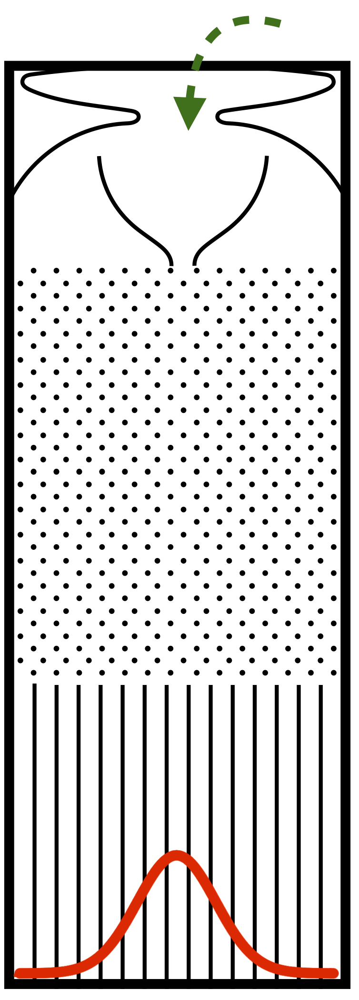
]

???
- a quincunx is an arrangement of objects which makes a patterns similar to the 5 dots on the face of a die
- Video explaining it https://www.youtube.com/watch?v=UCmPmkHqHXk&ab_channel=D%21NG 
- https://www.youtube.com/watch?v=6YDHBFVIvIs&ab_channel=IMAmaths
- https://en.wikipedia.org/wiki/Galton_board
- See online Quincunx (Galton's board) [here](https://www.mathsisfun.com/data/quincunx.html)
- 3D version printed https://www.instructables.com/3D-Printed-Galton-Board/ 

---
# Multivariate normal distribution

- There is a way to generate multiple normal distributions at once from a covariance matrix. 

```{r multivar_norm_pca, echo=-1, fig.width=5,fig.height=2}
par(mfrow = c(1,2), mar = c(4,4,0.5,0.5)); b.5 = scales::alpha("black",0.5)
set.seed(24601) # setting this so the random results will be repeatable 
library(MASS)
covmat <- matrix(c(1.0,   0.2,   0.6, # variance covariance matrix of the data 
                   0.2,   2.0,  -0.5, # Positive-definite symmetric matrix
                   0.6,  -0.5,   1.0), nrow=3) 
data <- mvrnorm(n = 300,  
                mu = c(1,-1,0), # mean of the data 
                Sigma=covmat) # generate random data that match that variance covariance matrix
plot(data[,1:2], pch = 19, col = b.5); abline(h=0,v=0,lty = 3)
plot(data[,2:3], pch = 19, col = b.5); abline(h=0,v=0,lty = 3)
```


???

---
# Multivariate normal distribution

- There is a way to generate multiple normal distributions at once from a covariance matrix. 

```{r multivar_norm_pca_plot, echo=-1, fig.width=6,fig.height=5}
# biplot(prcomp(data)) # check var(data) to verify the covmat
ggplot2::autoplot(vegan::rda(data)) + theme_classic() + 
  theme(plot.margin = unit(c(0,0.5,0,0.5), "cm"), legend.position="none")+
  geom_hline(yintercept=0, linetype="dotted",color = "grey50", size=0.5)+
  geom_vline(xintercept=0, linetype="dotted",color = "grey50", size=0.5)

```

---
# Multivariate normal distribution

- You can also generate multiple normal distributions at once **with a correlation matrix** between the variables to get the covariance matrix. 
- The diagonal are variances for each variable, the upper and lower triangles are the same and refer to the covariance *between* the variables. The `faux` package can help you simulate factorial designs and multiple normal correlated variables (see `rnorm_multi`). 

```{r multivar_norm_cov_and_correlation, echo=-1, fig.width=5,fig.height=2.5}
par(mfrow = c(1,1), mar = c(4,4,1.5,0.5)); b.5 = scales::alpha("black",0.5); xlim = c(8,14); ylim = c(7,14)
library(faux); set.seed(12345); n = 500 #number of values to generate for the variable x
traits = rnorm_multi(n = n, # ??rnorm_multi
                     mu = c(11.317531, 10.470744, 9.377967), # Mean of 3 variables
                     sd = c( 0.6247866, 0.7134755, 0.5502800), # SD of variables 
                     r = c(0.4887644, 0.4678446, 0.7056161), # correlation between variables 
                     varnames = c("Beak length", "Beak depth", "Beak width"), empirical = TRUE)
plot(traits[,1:2],col=b.5,pch=19,main="Simulated data",xlab="");title(xlab="Beak length",ylab="",line=2.2,cex.lab=1.2)
```
???
- Compare the data generated with the values set in the function
```{r}
cov(traits); cor(traits) # you can verify that these were the input in the function 
```
- Play at [Guess the correlation](http://guessthecorrelation.com)
- See this post [Obtaining covariance matrix from correlation matrix](https://stats.stackexchange.com/questions/62850/obtaining-covariance-matrix-from-correlation-matrix/407954#407954)

$\mathbf{\rho} = \mathbf{V}^{1/2}\mathbf{\Sigma}\mathbf{V}^{1/2}$

$\left(\begin{array}{ccc}\sigma_{11} & \sigma_{12} & \sigma_{13} \\ \sigma_{21} & \sigma_{22} & \sigma_{23} \\ \sigma_{31} & \sigma_{32} & \sigma_{33}\end{array}\right) = \left(\begin{array}{ccc}\sqrt{\sigma_{11}} & 0 & 0 \\ 0 & \sqrt{\sigma_{22}} & 0 \\ 0 & 0 & \sqrt{\sigma_{33}}\end{array}\right) \left(\begin{array}{ccc}\rho_{11} & \rho_{12} & \rho_{13} \\ \rho_{21} & \rho_{22} & \rho_{23} \\ \rho_{31} & \rho_{32} & \rho_{33}\end{array}\right) \left(\begin{array}{ccc}\sqrt{\sigma_{11}} & 0 & 0 \\ 0 & \sqrt{\sigma_{22}} & 0 \\ 0 & 0 & \sqrt{\sigma_{33}}\end{array}\right)$

$\left(\begin{array}{ccc}\rho_{11} & \rho_{12} & \rho_{13} \\ \rho_{21} & \rho_{22} & \rho_{23} \\ \rho_{31} & \rho_{32} & \rho_{33}\end{array}\right)=\left(\begin{array}{ccc}\sqrt{\sigma_{11}} & 0 & 0 \\ 0 & \sqrt{\sigma_{22}} & 0 \\ 0 & 0 & \sqrt{\sigma_{33}}\end{array}\right)^{-1}\left(\begin{array}{ccc}\sigma_{11} & \sigma_{12} & \sigma_{13} \\ \sigma_{21} & \sigma_{22} & \sigma_{23} \\ \sigma_{31} & \sigma_{32} & \sigma_{33}\end{array}\right)\left(\begin{array}{ccc}\sqrt{\sigma_{11}} & 0 & 0 \\ 0 & \sqrt{\sigma_{22}} & 0 \\ 0 & 0 & \sqrt{\sigma_{33}}\end{array}\right)^{-1}$

---
# Multivariate normal: PCA simulation

```{r simulation_PCA, echo=-1, fig.width=5,fig.height=2}
par(mfrow = c(1,2), mar = c(4,4,0.5,0.5))
set.seed(123) # setting this so the random results will be repeatable 
library(MASS)
# Simulating 3 traits for 4 different species 
n = 200
Amat1 = MASS::mvrnorm(n, mu = c(11.2,11.8,9.91), Sigma = diag(c(1.31,1.01,1.02))) 
Amat2 = MASS::mvrnorm(n, mu = c(7.16,8.54,6.82), Sigma = diag(c(0.445,0.546,0.350)))
Amat3 = MASS::mvrnorm(n, mu = c(15.6,14.6,13.5), Sigma = diag(c(1.43,0.885,0.990)))
Amat4 = MASS::mvrnorm(n, mu = c(8.65,14.1,8.24), Sigma = diag(c(0.535,0.844,0.426)))
Amat = rbind(Amat1,Amat2,Amat3,Amat4)
Amat.gr = cbind(Amat, gl(4,k=n,labels = c(1,2,3,4)))

# by(Amat.gr[,1:3],INDICES = Amat.gr[,4],FUN = cov) # calc. cov. mat. for all gr 

summary(m1 <- prcomp(Amat, scale= T))
```

---
# Multivariate normal: PCA simulation

```{r simulation_PCA_plot, echo=-1, fig.width=5,fig.height=2}
par(mfrow = c(1,2), mar = c(4,4,0.5,0.5))
# biplot(m1, xlabs=rep(".", nrow(Amat)), cex = 3)
plot(Amat[,1],Amat[,2], pch = 19, col = gl(4,k=n,labels = c(1,2,3,4))); abline(h=mean(Amat[,1]),v=mean(Amat[,2]),lty = 3)
plot(vegan::scores(m1), asp = 1, pch = 19, col = gl(4,k=n,labels = c(1,2,3,4))); abline(h=0,v=0,lty = 3)
# library(ggvegan)
# autoplot(vegan::rda(Amat))
```

---
# Find the parameters of a distribution 

```{r parameter_distribution}
x = rnorm(100)
# x = rt(100,1000)
library(fitdistrplus)
descdist(x, discrete = FALSE)
fit.pois <- fitdist(x, "norm")
plot(fit.pois)
```


???

#################################
---
class: inverse, center, middle
name: sim-data-models
# Simulating data for models

---
# Linear model (lm) refresher

$$Y = \beta_{0} + \beta_{1} x_{1} + \cdots + \beta_{p} x_{p} + \epsilon$$

- $Y$ is the response variable
- $\beta_0$ is the intercept
- $\beta_1$ is the coefficient of variation for the first explanatory variable ( $x_1$ )
- $\beta_p$ is the coefficient of variation for the $p^{th}$ explanatory variable for the $p^{th}$ $x_p$ explanatory variable
- $\epsilon$ is the residual of the model. Note that $\epsilon \sim N(\mu=0,sd = \sigma)$

---
# Linear model (lm) refresher

- The goal is to find the **best estimation** of the parameters ( $\beta$ s), while minimizing the residuals, and assess the goodness of fit of the model
- We use the least-squares in order to fit the line to the data.
- In order to interpret your results correctly when using a linear model, be sure you are not crossing the *LINE*: 
  * L: Linearity, —  I: Independence,  — N: normally distributed residuals, — E: Equality of variance 

.pull-left4[
```{r lm_assumtion_expected_mean, echo=FALSE, fig.width=4,fig.height=4}
par(mar=c(4,4,0.1,0.1))
set.seed(12345678)
n = 100; beta0 = 2.5; beta1 = 0.8
x.lm = rnorm(n = n, mean = 10, sd = 1)
err = rnorm(n = n, mean = 0, sd = 1)
# Linear combination 
y.lm = beta0 + beta1*x.lm + err
# Make a dataframe of the data 
df.lm = data.frame(x = x.lm, y = y.lm)
par(mar = c(4,4,.5,.5))
# Colour 
b.5 = scales::alpha("black",alpha = .5)

# PLot the data 
plot(y~x, data = df.lm, pch = 19, col = b.5, xlab = "")
title(xlab = "x", ylab="", line=2.2, cex.lab=1.2)
# Model the data 
lm.out = lm(y~x, data = df.lm)
# Add a line to the plot 
abline(lm.out)

####
slm=summary(lm.out)
# sd(slm$residuals)
yvals = seq(floor(range(df.lm$y)[1]),ceiling(range(df.lm$y)[2]),length.out = 1000)
xvals = seq(8,12, length.out = 10)
yh = dnorm(x =yvals, mean = predict(lm.out,newdata = data.frame(x = xvals)),sd = (slm$sigma))
# length(yh)
xrp = rep(xvals, length(yh)/length(xvals)) # each=length(yh)/length(xvals)
# length(xrp)
points(xrp,yvals, cex = yh/max(yh), pch = 19, col = scales::alpha("red",.5))
```
]

.pull-right4[
```{r lm_assumtion_expected_mean_interactive, echo=FALSE, fig.width=3,fig.height=3}
library(plotly)
library(dplyr)

beta <- lm.out$coefficients
fxy <- function(x,y){  beta[1] + beta[2]*x }
# fxy2 <- function(x,y){  
#   observeddata <- cbind(predict(lm.out, newdata = data.frame(x = x), se.fit = TRUE,interval = 'confidence'))
#   # observeddata[2]
#   dnorm(x =y, mean = predict(lm.out,newdata = data.frame(x = x)),sd = (observeddata[2]))
#   }
fxy2 <- function(x,y){  dnorm(x =y, mean = predict(lm.out,newdata = data.frame(x = x)),sd = (slm$sigma))}
# fxy2 <- function(x,y){  dnorm(x =y, mean = predict(lm.out,newdata = data.frame(x = x)),sd = (sqrt(deviance(lm.out)/df.residual(lm.out))))}
z <- outer(X = xvals,Y = yvals,FUN = fxy2)
z2 <- outer(X = xvals,Y = yvals,FUN = fxy)
# axx <- list(nticks = 4,range = c(-25,75))
# axy <- list(nticks = 4,range = c(-25,75))
# axz <- list(nticks = 4,range = c(0,1))
df.lm$yhat = fitted(lm.out)
# df.lm$yhat = predict(lm.out)
df.lm$z = 0
lm.model.interactive = plotly::plot_ly(x = xrp,
                                       y = yvals,
                                       z = t(z), 
                                       type = "surface",
                                       colors = terrain.colors(100),#c("darkblue", "yellow", "darkred"), 
                                       opacity = 1,
                                       showlegend = F,
                                       width = 500, height = 500) %>% 
  hide_colorbar() %>% 
  add_markers(data = df.lm, x = ~x, y = ~y, z = 0,
              mode = "markers", 
              type = "scatter3d", 
              marker = list(size = 5, color = "black"), 
              name="Points",showlegend = F) %>% 
  add_trace(data = df.lm, x = ~x, y = ~yhat, z = 0, 
            name="Linear", 
            line = list(dash="solid", color = "red", width = 10.5),
            inherit = FALSE,showlegend = F,
            mode = "lines",
            type = "scatter3d") %>% 
  layout(#title = '<b> Linear model expected values </b>',
         # margin = list(t = 80),
    autosize = F,
    margin =list(l = 0, r=0,b = 0, t = 0),
         scene = list(#xaxis=axx,yaxis=axy,
           xaxis = list(#title = 'X',
             range = c(range(xrp)), autorange = "reversed"),
           yaxis = list(#title = 'Y',
             range = range(yvals), autorange = "reversed"),
           zaxis=list(title = 'Z',nticks = 10,range = c(0,1)),
           camera = list(eye = list(x = 1.8, # 0  see https://plotly.com/python/3d-camera-controls/
                                    y = 1.8, # 0.9
                                    z = 0.5))),#2.0))),
           # camera = list(eye = list(x = 0, # 0  see https://plotly.com/python/3d-camera-controls/
           #                          y = .9, # 0.9
           #                          z = 2))),#2.0))),
         showlegend = F
         )

# lm.model.interactive
## save the output 
# htmlwidgets::saveWidget(lm.model.interactive, file = "images/lm.model.interactive.html")
# path_to_python <- "~/miniconda3/bin/python"
# suppressMessages(reticulate::use_python(path_to_python))
# suppressMessages(reticulate::import("plotly"))
# suppressMessages(reticulate::import("kaleido"))
# plotly::save_image(lm.model.interactive, file = "images/lm.model.interactive.png")
```
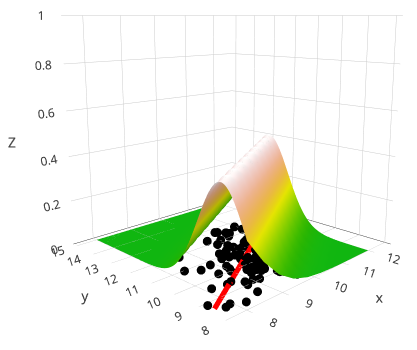

]


???
Reference for the section 
- [Linear model](https://aosmith.rbind.io/2018/01/09/simulate-simulate-part1/) and [Linear mixed model](https://aosmith.rbind.io/2018/04/23/simulate-simulate-part-2/)
- [Poisson model](https://aosmith.rbind.io/2018/07/18/simulate-poisson-edition/)
- [binomial generalized linear mixed model](https://aosmith.rbind.io/2020/08/20/simulate-binomial-glmm/)
- [Simple Linear Regression](https://sphweb.bumc.bu.edu/otlt/MPH-Modules/BS/R/R5_Correlation-Regression/R5_Correlation-Regression4.html)

---
# Linear model (lm) refresher

- You can add:
  1. the confidence limits for the expected values (confidence interval or uncertainty around the **mean predictions (y)** for a value of x given the parameters of the model; blue shaded polygon `predict(lm.out, interval = "confidence")`; at mean of x and y, the uncertainty comes only from the intercept) to the line and
  2. the 95% central quantiles of the Normal distribution (or prediction interval, grey shaded polygon for the simulated one; compared with red shading lines which is the theoretical one `predict(lm.out, interval="prediction")`)

```{r simulate.gaussian.model, echo=FALSE, fig.width=8,fig.height=4}

sim.lm = simulate(lm.out, nsim = 1e5, seed = 12) %>% data.frame
lower_ci_sim <- apply(sim.lm, 1, function(x) quantile(x, probs = 0.025) )
upper_ci_sim <- apply(sim.lm, 1, function(x) quantile(x, probs = 0.975) )
sims_summary <- data.frame(
  lower = lower_ci_sim,
  upper = upper_ci_sim
)

# Plot the data 
plot(y~x, data = df.lm, pch = 19, col = b.5)

# Add permutations
permutate.df =replicate(n = 200, # nperm 
          expr = data.frame(y = sample(df.lm$y,size = nrow(df.lm), replace = FALSE), x = df.lm$x),
          simplify = FALSE)
lm.out.perm = mapply(lm, permutate.df)
invisible(apply(lm.out.perm,2,function(x) abline(x,col = scales::alpha("orange",.5))))
lm.out.perm = mapply(lm, permutate.df)

# Add bootstrap
bootstrap.fun <- function(data) {
  tmp.sample = sample(1:nrow(data),size = c(nrow(data)-20),replace = FALSE)
  data.frame(y = data[tmp.sample,"y"], 
             x = data[tmp.sample,"x"])
}
bootstrap.df =replicate(n = 200, # nperm 
                        expr = bootstrap.fun(df.lm),
                        simplify = FALSE)

lm.out.boot = mapply(lm, bootstrap.df)
invisible(apply(lm.out.boot,2,function(x) abline(x,col = scales::alpha("red",.9))))


### Adding the REAL prediction interval 
new.x =  seq(min(df.lm$x),max(df.lm$x), length.out = 100)
p <- predict(lm.out, 
             newdata = data.frame(x = new.x), se.fit=TRUE,     
             interval="prediction")

polygon(x = c(new.x,rev(new.x)),  
        y = c(p$fit[,"lwr"], rev(p$fit[,"upr"])), col = scales::alpha("red",.5),
        density=10)


# Add a line to the plot 
df.lm$sims = sims_summary
o.sim = df.lm[order(df.lm[,1]),]
polygon(x = c(o.sim$x, rev(o.sim$x)),  
        y = c(o.sim$sims$lower,rev(o.sim$sims$upper)), col = scales::alpha("grey50",.5))


# GeneralStandardDev<-sd(lm.out$residuals)
# UpperLine<- lm.out$coefficients[1]+lm.out$coefficients[2]*df.lm$x + GeneralStandardDev
# LowerLine<- lm.out$coefficients[1]+lm.out$coefficients[2]*df.lm$x - GeneralStandardDev
# 
# lines(df.lm$x, UpperLine, col = "blue")
# lines(df.lm$x, LowerLine, col = "blue")
pred = predict(lm.out, interval = "confidence") # 95%  confidence interval
# lines(df.lm$x[order(df.lm$x)], pred[, "lwr"][order(df.lm$x)], col = "blue") 
# lines(df.lm$x[order(df.lm$x)], pred[, "upr"][order(df.lm$x)], col = "blue") 


polygon(x = c(df.lm$x[order(df.lm$x)], rev(df.lm$x[order(df.lm$x)])),  
        y = c(pred[, "lwr"][order(df.lm$x)],rev(pred[, "upr"][order(df.lm$x)])), 
        col = scales::alpha("blue",.5))
abline(lm.out)
points(df.lm$x,df.lm$y)
points(mean(df.lm$x),mean(df.lm$y), col = "red", pch = 19)
abline(v =mean(df.lm$x), h = mean(df.lm$y), lty = 3)

```

???
- Idea from https://www.barelysignificant.com/post/glm/
- The reason the blue area gets smaller in the middle is that the uncertainty we have comes from the intercept only and not the slope, as this one can pivot on the mean (with changing slope). The standard error (uncertainty of the predicted values changes as we move away from the mean) of the predicted value is smaller at the mean of x. 
- Grey: simulated 95% central quantiles of the Normal distribution (or prediction interval, grey shaded polygon for the simulated one; compared with red shading lines which is the theoretical one `predict(lm.out, interval="prediction")`)
- Blue: the confidence limits for the expected values (confidence interval or uncertainty around the **mean predictions (y)** for a value of x given the parameters of the model; blue shaded polygon `predict(lm.out, interval = "confidence")`; at mean of x and y, the uncertainty comes only from the intercept) to the line and
- Red: 200 Bootstrap leaving out 20 data points 
- Orange: Permutation of the response variable (breaking up the association between x and y)


---
# Generalized linear model (GLM) refresher

- What we've seen so far are cases in which the **response** variable was continuous and where the "error" is normally distributed.
- But there might be cases where the **response** variable is *not* continuous or has an error structure that is *not* normal. 
- Therefore, we need to look for GLMs. 

| Type | Equation |
| ---- | -------- |
| Linear | $Y = \beta_{0} + \beta_{1} x_{1}  + \epsilon$ or $\mu = \beta_{0} + \beta_{1} x_{1}$ for $Y \sim Normal(\mu, \sigma)$ |
| Poisson | $Y \sim Poisson(\mu)$ with $\text {ln} \mu=\beta_0+\beta_1x$ or $\mu=e^{\beta_0+\beta_1x}$ <br /> (no separate error term as $\lambda$ determines both the mean and variance) |
| Logistic | $Y \sim Binomial(p)$ with $\text{log} \Bigl(\frac{p}{1-p}\Bigr) = \beta_0 +\beta_1x$ or $p=\frac{e^{\beta_0+\beta_1x}}{1+e^{\beta_0+\beta_1x}}$ where $\text{log} \Bigl(\frac{p}{1-p}\Bigr)$ is the log odds or log likelihood. <br /> The Y values are determined by a Bernoulli distribution (binomial of size = 1) |

- Keep in mind that the x-values *don't need to be normally distributed*. 

???

<!-- 
In GLM, we don't model the individual Y values, but the mean
https://www.theanalysisfactor.com/generalized-linear-models-no-error-term/
In other words "there's no common error distribution independent of predictor values"
see https://stats.stackexchange.com/questions/124818/logistic-regression-error-term-and-its-distribution
-->
<!-- For poisson (there is no 'error' term like linear regression, since there is inherent variability)?? -->
<!-- logistic regression there is an error (or randomness hidden in the Bernoulli (or binomial(size =1)) with probability p)  -->
<!-- Simulate logistic regression https://stats.stackexchange.com/questions/46523/how-to-simulate-artificial-data-for-logistic-regression/46525 -->


---
# Generalized linear model (GLM) refresher

- As we have seen, the idea being linear regression is to model the expected value. We are doing the same thing for a poisson regression model. 

.pull-left[
```{r glm_assumtion_expected_mean, echo=FALSE, fig.width=8,fig.height=5}
### Linear model 
par(mfrow=c(1,2), mar=c(4,4,2,2), cex = 1.2)
set.seed(12345678)
n = 100; beta0 = 2.5; beta1 = 0.8
x.lm = rnorm(n = n, mean = 10, sd = 1)
err = rnorm(n = n, mean = 0, sd = 1)
# Linear combination 
y.lm = beta0 + beta1*x.lm + err
# Make a dataframe of the data 
df.lm = data.frame(x = x.lm, y = y.lm)
# Colour 
b.5 = scales::alpha("black",alpha = .5)

# PLot the data 
plot(y~x, data = df.lm, pch = 19, col = b.5, xlab = "", cex = 0.5, main = "Linear regression")
title(xlab = "x", ylab="", line=2.2, cex.lab=1.2)
# Model the data 
lm.out = lm(y~x, data = df.lm)
# Add a line to the plot 
abline(lm.out)
####
yvals = seq(floor(range(df.lm$y)[1]),ceiling(range(df.lm$y)[2]),length.out = 1000)
xvals = seq(8,12, length.out = 10)
slm=summary(lm.out)
yh = dnorm(x =yvals, mean = predict(lm.out,newdata = data.frame(x = xvals)),sd = (slm$sigma))
xrp = rep(xvals, length(yh)/length(xvals)) # each=length(yh)/length(xvals)
points(xrp,yvals, cex = 1.5*yh/max(yh), pch = 19, col = scales::alpha("red",.5))

#####
set.seed(42)
n = 500
x = rnorm(n = n, mean = 0, sd = 1)
# Rescale the data
xz = scale(x)
log.mu = 2 + 0.8*xz
y = rpois(n = n, lambda = exp(log.mu)) 

# Combine the data in a dataframe 
df = data.frame(y = y, x = x)

#now feed it to glm:
glm.poisson = glm( y~x, data=df, family="poisson")
plot(y~x, data = df, col = scales::alpha("black", 0.5), pch = 19, cex = 0.5, main = "Poisson regression")
newdata <- data.frame(x = seq(min(x), max(x), len = n))
newdata$y = predict(object = glm.poisson, newdata = newdata, type = "response") 
lines(x = newdata$x,
      y = newdata$y, col = "red",lwd = 2)

yvals = seq(floor(range(df$y)[1]),ceiling(range(df$y)[2]),by = 1)
xvals = seq(-3,3, length.out = 20)
tmp.pois = NULL
pred.lbda= exp(predict(glm.poisson,newdata = data.frame(x = xvals)))
for (i in 1:length(pred.lbda)) {
  yh = dpois(x =yvals, lambda = pred.lbda[i])
  tmp.pois = cbind(tmp.pois,yh)
}
xrp = xvals
for (j in 1:ncol(tmp.pois)) {
  points(rep(xrp[j],length(yvals)),yvals, cex = 1.5*tmp.pois[,j]/max(tmp.pois[,j]), pch = 19, 
         col = scales::alpha(c("red"),.5))# Change the colour depending on the even-odd index
         # col = scales::alpha(c("red", "blue")[j%%2+1],.5))# Change the colour depending on the even-odd index
}

```

]

```{r poisson_assumtion_expected_mean_interactive, echo=FALSE, fig.width=3,fig.height=3}


library(plotly)
library(dplyr)

beta <- glm.poisson$coefficients
fxy2 <- function(x,y){ dpois(x = y, lambda = exp(predict(glm.poisson, newdata = data.frame(x = xvals))))}
z <- outer(X = xvals,Y = yvals,FUN = fxy2)
df$yhat = fitted(glm.poisson)
df$z = 0
poisson_interactive = plotly::plot_ly(x = xrp,
                y = yvals,
                z = t(z), 
                type = "surface",
                colors = terrain.colors(100),#c("darkblue", "yellow", "darkred"), 
                opacity = 1,
                showlegend = F, width = 500, height = 500) %>% 
  hide_colorbar() %>% 
  add_markers(data = df, x = ~x, y = ~y, z = 0,
              mode = "markers", 
              type = "scatter3d", 
              marker = list(size = 5, color = "black"), 
              name="Points",showlegend = F) %>% 
  add_trace(x = xvals, y = exp(predict(glm.poisson,newdata = data.frame(x = xvals))), z = 0,
            name="Linear",
            line = list(dash="solid", color = "red", width = 10.5),
            inherit = FALSE,showlegend = F,
            mode = "lines",
            type = "scatter3d") %>%
  layout(#title = '<b> Linear model expected values </b>',
    autosize = F,
    margin =list(l = 0, r=0,b = 0, t = 0),
    scene = list(#xaxis=axx,yaxis=axy,
      xaxis = list(#title = 'X',
        range = c(range(xrp)), autorange = "reversed"),
      yaxis = list(#title = 'Y',
        range = range(yvals), autorange = "reversed"),
      zaxis=list(title = 'Z',nticks = 10,range = c(0,1)),
      camera = list(eye = list(x = 1.8, # 0  see https://plotly.com/python/3d-camera-controls/
                               y = 1.8, # 0.9
                               z = 0.7))),#2.0))),
    # camera = list(eye = list(x = 0, # 0  see https://plotly.com/python/3d-camera-controls/
    #                          y = .9, # 0.9
    #                          z = 2))),#2.0))),
    showlegend = F
  )
# poisson_interactive
# # save the output
# htmlwidgets::saveWidget(poisson_interactive, file = "images/poisson_interactive.html")
# path_to_python <- "~/miniconda3/bin/python"
# suppressMessages(reticulate::use_python(path_to_python))
# suppressMessages(reticulate::import("plotly"))
# suppressMessages(reticulate::import("kaleido"))
# plotly::save_image(poisson_interactive, file = "images/poisson_interactive.png")
```

.pull-right[
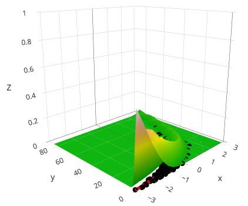
]


---
# Simulate categories (t-test, Anova)
<!-- Although this is with only 2 groups, I'm showing this as a quick example -->
.pull-left[
```{r Sim_t_test_anova}
set.seed(1234); n = 1000
y1 = rnorm(n, mean = 15, sd = 1)
y2 = rnorm(n, mean = 15.5, sd = 1)

sim.aov1 = data.frame(y = y1, gr = "A")
sim.aov2 = data.frame(y = y2, gr = "B")
df.aov = rbind(sim.aov1, sim.aov2)
df.aov$gr = factor(df.aov$gr)

# t.test(y~gr, data = df.aov) or
aov.out = aov(y~gr, data = df.aov)
#summary(aov.out)
tk.test = TukeyHSD(aov.out)
round(tk.test$gr,2)
```
]

.pull-right[
```{r Sim_t_test_anova_plot, fig.width=5,fig.height=5}
plot(y~gr, data = df.aov)
```

]

???
Assumptions? [see Wikipedia](https://en.wikipedia.org/wiki/Student%27s_t-test#Assumptions)
- Both population have equal variance (compare the variances with a F-ratio test)
- Both samples are drawn from a normal distribution 

---
# GLM: Linear model

- We start by generating a linear model with an intercept and slope for 100 points (here random uniform between 0 and 1), an the error in the measurements.

.pull-left[
```{r simulate_lm_data, echo=-1, fig.width=4,fig.height=2}
par(mar=c(4,4,0.1,0.1))
set.seed(12345678)
n = 100; beta0 = 2.5; beta1 = 0.8
x.lm = runif(n = n) # or it could be something else! rnorm(n = n, mean = 10, sd = 1)
err = rnorm(n = n, mean = 0, sd = 1)
# Linear combination 
mu = beta0 + beta1*x.lm 
y.lm = mu + err # same as y.lm = rnorm(n = n, mu, sd = 1)
# Make a dataframe of the data 
df.lm = data.frame(x = x.lm, y = y.lm)
```
]

.pull-right[
```{r simulate_lm_plot, echo=FALSE, fig.width=4,fig.height=3}
par(mar = c(4,4,.5,.5))
# Colour 
b.5 = scales::alpha("black",alpha = .5)

# PLot the data 
plot(y~x, data = df.lm, pch = 19, col = b.5)

# Model the data 
lm.out = lm(y~x, data = df.lm)
# Add a line to the plot 
abline(lm.out)
```
]

```{r simulate_lm_output}
round(coefficients(summary(lm.out)), 4)
# Adjusted R^2
summary(lm.out)$adj.r.squared
# summary(lm.out)$fstatistic
# anova(lm.out)
```

???
- Take a look at [Interpretation of R's lm() output](https://stats.stackexchange.com/questions/5135/interpretation-of-rs-lm-output) to refresh lm important numbers

---
# GLM: Linear model

- You can `simulate` the response (fitted line), from a distribution used in a fitted model. 

```{r simulate_lm_resimulate_from_model, echo=-1, fig.width=13,fig.height=3}
par(mfrow = c(1,2), mar = c(3.5,4,1,1), cex = 1.2)
sim.lm = simulate(lm.out, nsim = 2000, seed = 12) # simulate based on predicted value and sigma of model #<<
rx = range(c(rowMeans(sim.lm), fitted(lm.out)))
hist(rowMeans(sim.lm),xlim=rx,main="Hist simulation",xlab="");title(xlab="rowMeans(sim.lm)",line=2.2,cex.lab=1.2)
hist(fitted(lm.out), xlim = rx,main="Hist fitted",xlab="");title(xlab="fitted(lm.out)",line=2.2,cex.lab=1.2)
c(mean(rowMeans(sim.lm)), mean(y.lm),  mean(fitted(lm.out))) # compare
rbind(head(rowMeans(sim.lm)), head(fitted(lm.out))) # Average of all simulations (in row) gives the fitted values
```

???
- From the help, `simulate()` allows to "Simulate one or more **responses** (Y) from the distribution corresponding to a fitted model object." `stats:::simulate.lm`
- [How does the function "simulate" work, conceptually?](https://stackoverflow.com/questions/29349602/how-does-the-function-simulate-work-conceptually)

```
nsim=2
head(simulate(lm.out, nsim=nsim, seed = 1))

set.seed(1)
for(i in 1:nsim) {
  tmp <- fitted(lm.out) + rnorm(length(predict(lm.out)), 0, summary(lm.out)$sigma)
  res <- if (i==1) tmp else cbind(res, tmp)
}
head(res)
```


---
# GLM: Linear model

- Now that we have the core elements to generate a lm, we can put the simulation inside a function and vary some parameters
- If we are interested in how our confidence in the slope estimate changes based on sample size we could `replicate` the simulation a certain number of times
  * We could plot the density of the estimates that we'd get out of the simulations. 
  * Below, **slopes estimates were extracted** from each simulation with various sample sizes. 
  * As the sample size increases, our slope estimation gets closer to the "true" underlying value. 

```{r lm_simulate_slope, echo=FALSE, fig.width=12,fig.height=4}
par(mar=c(4,4,1,1), cex = 1.3)

set.seed(12345678)
lm.sim.fun <- function(n = 100, 
                       mean = 10, sd = 1, sd.err = 1,
                       beta0 = 2.5, beta1 = 0.8,
                       plot = FALSE, ret = TRUE) {
  # Generate x values 
  x.lm = rnorm(n = n, mean = mean, sd = sd)
  # Generate error for each x value 
  err = rnorm(n = n, mean = 0, sd = sd.err)
  
  # Linear combination 
  y.lm = beta0 + beta1*x.lm + err
  
  # Make a dataframe of the data 
  df.lm = data.frame(x = x.lm, y = y.lm)
  
  # Colour 
  b.5 = scales::alpha("black",alpha = .5)
  
  # Model the data 
  lm.out = lm(y~x, data = df.lm)
  # Get the summary 
  s.out = summary(lm.out)
  
  # Might want to add the plot 
  if (plot) {
    # PLot the data 
    plot(y~x, data = df.lm, pch = 19, col = b.5)
    # Add a line to the plot 
    abline(lm.out)
  } # end if plot
  
  # Return some interesting parameters for future analysis
  if (ret) {
  return(list(lm.out = s.out,
              int = s.out$coefficients["(Intercept)",1],
              slope = s.out$coefficients["x",1]))
  }
}

# Number of repetitions to replicate our simulation
nb.rep = 1000
# Make an empty data object to record what we are interested in 
df.all.sim = NULL
beta1 = 0.8
for (i in c(5,20,200)) {
  l.rp = replicate(n = nb.rep, 
                   expr = lm.sim.fun(n = i,beta1 = beta1), 
                   simplify = FALSE)
  all.int = unlist(lapply(l.rp, function(x) x$int)) # Get intercept
  all.slp = unlist(lapply(l.rp, function(x) x$slope)) # Get slope
  df.all.sim = rbind(df.all.sim,
                     data.frame(n = i, # number of replicate 
                                all.int, # all intercepts
                                all.slp)) # all slopes 
}

plot.dens <- function(density, data, subset, main) {
  plot(density,   xlim = c(-3,4), main = main, cex = 1.3)
abline(v = mean(data[data$n==subset,"all.slp"]),   lty =1)
abline(v = beta1, lty = 3)
polygon(x = c(-10, density$x[density$x>-10 & density$x < 10], 10), 
        y = c(0, density$y[density$x>=-10 & density$x <= 10], 0),
        col=scales::alpha("blue",.5))
}

par(mfrow = c(1,3), cex = 1.2)
# get the density 
dens5 = density(df.all.sim[df.all.sim$n==5,"all.slp"]  )
dens20 = density(df.all.sim[df.all.sim$n==20,"all.slp"] )
dens200 = density(df.all.sim[df.all.sim$n==200,"all.slp"])

# Plot for each parameter we are interested in 
plot.dens(density = dens5, data = df.all.sim,subset = 5, main = paste("slope =",beta1,"n = 5"))
plot.dens(density = dens20, data = df.all.sim,subset = 20, main = paste("slope =",beta1,"n = 20"))
plot.dens(density = dens200, data = df.all.sim,subset = 200, main = paste("slope =",beta1,"n = 200"))

# lm.f <- function(n,mean,sd,b0,b1, plot = FALSE) {
#   x = rnorm(n, mean = mean, sd = sd)
#   beta0 = b0; beta1 = b1
#   y = beta0 + beta1 * x + rnorm(n)
#   lm.out = lm(y~x)
#   s.lm.out = summary(lm.out)
#   if (plot) {
#     plot(x,y, pch = 19)
#     abline(lm.out)
#   }
#   return(s.lm.out)
# }
# 
# par(mfrow = c(1,3))
# for (i in c(5,20,1000)) {
#   rp.lm = replicate(n = 1000, 
#                     expr = lm.f(n = i,mean = 19, sd = 1, b0 = 1, b1 = 4, plot = FALSE)$coefficients[c("(Intercept)","x"),"Estimate"],
#                     simplify = FALSE)
#   sim.est.lm = do.call(rbind, rp.lm)
#   dens = density(sim.est.lm[,"x"])
#   plot(dens, main = paste("n=",i), xlim = c(-1,10))
#   polygon(c(-10, dens$x[dens$x>-10 & dens$x < 10], 10), 
#           c(0, dens$y[dens$x>=-10 & dens$x <= 10], 0), 
#           col=scales::alpha("blue",.5))
# }
```

???
- This is an example of how a simulation script could be replicated to get a global understanding of the change of a parameter value (slope) by changing another value (sample size)
- This is where simulations shine. They really help us understand how we can interpret some results or get a better feeling of the confidence (or uncertainty) we have from our data. Or at least, this is one use of this. 

- I'd suggest opening RStudio to show the code 

---
# GLM: Linear model

- Same simulation as before, but now we plot the adjusted $R^2$ from the linear model. 

```{r lm_simulate_r_sq, echo=FALSE, fig.width=10,fig.height=5}
par(mfrow = c(2,3),mar=c(4,4,1,1), cex = 1.1)
set.seed(2345)
nb.rep = 1000
sd.err = 2
df.all.sim = NULL
for (i in c(5,20,200)) {
  l.rp = replicate(nb.rep, lm.sim.fun(n = i,beta1 = 2,sd.err = sd.err), simplify = FALSE)
  all.adjr2 = unlist(lapply(l.rp, function(x) x$lm.out$adj.r.squared))
  all.int = unlist(lapply(l.rp, function(x) x$int))
  all.slp = unlist(lapply(l.rp, function(x) x$slope))
  df.all.sim = rbind(df.all.sim,data.frame(n = i, all.int, all.slp,all.adjr2))
}
dens5 = density(df.all.sim[df.all.sim$n==5,"all.adjr2"]  )
dens20 = density(df.all.sim[df.all.sim$n==20,"all.adjr2"] )
dens200 = density(df.all.sim[df.all.sim$n==200,"all.adjr2"])
xlim = c(-1,1.3)
plot(dens5,   xlim = xlim, main = "n = 5");   abline(v = mean(df.all.sim[df.all.sim$n==5,"all.adjr2"]),   lty =1)
polygon(c(-10, dens5$x[dens5$x>-10 & dens5$x < 10], 10), c(0, dens5$y[dens5$x>=-10 & dens5$x <= 10], 0), col=scales::alpha("blue",.5))
plot(dens20,  xlim = xlim, main = "n = 20");  abline(v = mean(df.all.sim[df.all.sim$n==20,"all.adjr2"]),  lty =1)
polygon(c(-10, dens20$x[dens20$x>-10 & dens20$x < 10], 10), c(0, dens20$y[dens20$x>=-10 & dens20$x <= 10], 0), col=scales::alpha("blue",.5))
plot(dens200, xlim = xlim, main = "n = 200"); abline(v = mean(df.all.sim[df.all.sim$n==200,"all.adjr2"]), lty =1)
polygon(c(-10, dens200$x[dens200$x>-10 & dens200$x < 10], 10), c(0, dens200$y[dens200$x>=-10 & dens200$x <= 10], 0), col=scales::alpha("blue",.5))
lm.sim.fun(n = 5,  sd.err = sd.err,plot = T, ret = F)
lm.sim.fun(n = 20, sd.err = sd.err,plot = T, ret = F)
lm.sim.fun(n = 200,sd.err = sd.err,plot = T, ret = F)

```
- You can see from the plots that the effect size, the $R^2$, varies much more when the sample size is small. As the sample size increases, the spread around the effect size diminishes. 

???
- This makes a SUPER IMPORTANT POINT. The effect size in this case is the amount of variance explained. You can see that with the exact same model that we generated, we can have pretty much any type of effect size for a small sample size. 
- But as we increase the sample size, the effect size seems to converge on a particular value. 
- (note that if the $R^2$ is negative, it could be thought as being 0.)
- This adds to the idea that larger sample sizes are important when you conduct a study. It's not just that the sample size makes the estimate better. It also plays with our CONFIDENCE in having a particular value for the effect size. 

---
# GLM: Linear model

- Simulate 2 independent variables ( $x_1$ and $x_2$ ). 

```{r lm_simulate_2x, echo=FALSE, fig.width=8,fig.height=4}
set.seed(12345678)
n = 100
x1 = rnorm(n = n, mean = 10, sd = 1)
x2 = rnorm(n = n, mean = 15, sd = 6)
# x1 = scale(x1)
# x2 = scale(x2)
beta0 = 2.5
beta1 = .8
beta2 = .5
err = rnorm(n = n, mean = 0, sd = 1)

# Linear combination 
y.lm = beta0 + beta1*x1 + beta2*x2 + err

# Make a dataframe of the data 
df.lm = data.frame(x1 = x1, x2 = x2, y = y.lm)

# Colour 
b.5 = scales::alpha("black",alpha = .5)

par(mfrow=c(1,2))
# PLot the data 
plot(y~x1, data = df.lm, pch = 19, col = b.5)

# Model the data 
lm.out = lm(y~x1+x2, data = df.lm)
# Add a line to the plot 
abline(a = coef(lm.out)["(Intercept)"]+mean(x2)*coef(lm.out)["x2"], b = coef(lm.out)["x1"])

# PLot the data 
plot(y~x2, data = df.lm, pch = 19, col = b.5)
# Add a line to the plot 
abline(a = coef(lm.out)["(Intercept)"]+mean(x1)*coef(lm.out)["x1"], b = coef(lm.out)["x2"])
# abline(lm.out)
```

```{r lm_simulate_2x_out, echo=FALSE}
cat("Coefficients table:\n"); round(coefficients(summary(lm.out)), 4)
# Adjusted R^2
cat("R Squared: "); summary(lm.out)$adj.r.squared
# summary(lm.out)$fstatistic
# anova(lm.out)
# vcov(lm.out)
```

???

```
n = 100
x1 = rnorm(n = n, mean = 10, sd = 1)
x2 = rnorm(n = n, mean = 15, sd = 6)
beta0 = 2.5
beta1 = .8
beta2 = .5
err = rnorm(n = n, mean = 0, sd = 1)
```


---
# GLM: Linear model (with categorical)

- Simulate 1 numerical variable ( $x_1$ ) separated in 2 levels (Control, Treatment). 

```{r sim_lm_cat, fig.width=5,fig.height=5}
set.seed(12345678)
n = 100; meanx = 10
x.lm = rnorm(n = n, mean = meanx, sd = 1)
cat.lm = c("Control", "Treatment")
gr = gl(n = length(cat.lm), k = n/2, labels = cat.lm) # makes factors (default)
# Make a dummy matrix
dummy.mat = matrix(data = 0,
                   nrow = n,
                   ncol = length(cat.lm))
colnames(dummy.mat) <- paste0(c(cat.lm))
dummy.mat[,1] <- 1 # Intercept
dummy.mat[,2] <- ifelse(gr=="Treatment",1,0)

beta1 = 0.8; betaControl = .2; betaTreament = .7
# Combine the data to get the linear prediction 
lin.pred.x = dummy.mat %*% c(betaControl,betaTreament) + beta1 * x.lm
y.lm = lin.pred.x + rnorm(n = n, mean = 0, sd = 1)
df.lm = data.frame(x = x.lm, y = y.lm, gr = gr)
b.5 = scales::alpha("black",alpha = .5); r.5 = scales::alpha("red",alpha = .5)
lm.out = lm(y~x+gr, data = df.lm);   lmcoef <- lm.out$coefficients
```

```{r sim_lm_cat_out, echo=FALSE, eval=TRUE, results = 'hide'}
# Think of beta1 as multiplying the mean of X by beta1 and then seeing the effect of the betaControl and betaTreament
# See this 
mean(x.lm) # Mean of the X variable 
mean(y.lm) # Mean of the Y variable 

# Theoretical
t.x = meanx * beta1
# Observed 
o.x = mean(x.lm) * lm.out$coefficients["x"]

# Theoretical
t.xc = meanx * beta1 + betaControl
# Observed 
o.xc = mean(x.lm) * lm.out$coefficients["x"] + lm.out$coefficients["(Intercept)"]

# Theoretical
t.xt = meanx * beta1 + betaControl + betaTreament
# Observed 
o.xt = mean(x.lm) * lm.out$coefficients["x"] + lm.out$coefficients["(Intercept)"] + lm.out$coefficients["grTreatment"]
mat.exp.obs = matrix(c(meanx, mean(x.lm),
                       NA,NA,
                       t.x,o.x,
                       t.xc,o.xc,
                       t.xt,o.xt,
                       beta1,lm.out$coefficients["x"],
                       betaControl, lm.out$coefficients["(Intercept)"],
                       betaTreament, lm.out$coefficients["grTreatment"]
                       ), ncol = 2, byrow = TRUE, 
                     dimnames = list(c("x","y",
                                       "m.beta1","m.beta1.bC","m.beta1.bC.bT", 
                                       "beta1","betaC","betaT"),
                                     c("Expected","Observed")))
# m.beta1 # is the global intercept
df.eo = as.data.frame(mat.exp.obs)
df.eo$Expected[which(is.na(df.eo$Expected))] <- list(unique(dummy.mat %*% c(betaControl,betaTreament) + beta1 * meanx))
df.eo$Observed[which(is.na(df.eo$Observed))] <- list(aggregate(x = df.lm[,c("y")],by = list(df.lm[,c("gr")]), mean)$x)

df.eo$Notes = c("Mean of X","Mean of each category in Y", "Global intercept (mean)","Global + control","Global + control + treatment","","","")
# Here you can see the beta1 (x), betaControl (Intercept) and betaTreament (grTreatment)
summary(lm(y~x+gr, data = df.lm))

# Get JUST the DIFFERENCE with the treatment (Intercept is the Control)
gr.means = lm(y~gr, data = df.lm) 
summary(gr.means)

# Calculate the mean of the 2 groups 
summary(lm(y~gr-1, data = df.lm) )


# Another way to calculate the mean of the 2 groups 
aggregate(x = df.lm[,c("y")],by = list(df.lm[,c("gr")]), mean)

# Compare to this (ANCOVA!)
summary(aov(y~x+gr,data = df.lm))
anova(lm.out)
```


???
- Here we generate 2 categories that we want to test an effect (e.g., a new drug), but we want to CONTROL for a particular X independent continuous variable (ANCOVA)
```{r sim_lm_cat_out_summary}
# Here you can see the beta1 (x), betaControl (Intercept) and betaTreament (grTreatment)
summary(lm(y~x+gr, data = df.lm))
# Get JUST the DIFFERENCE with the treatment (Intercept is the Control)
# gr.means = lm(y~gr, data = df.lm) 
# coefficients(gr.means)
```

- see [Simulating from regression model with categorical variable with 4 categories?](https://stats.stackexchange.com/questions/471947/simulating-from-regression-model-with-categorical-variable-with-4-categories)

---
# GLM: Linear model (with categorical)

```{r sim_lm_cat_plot, echo=-1, fig.width=8,fig.height=3.5}
par(mfrow=c(1,2), mar = c(4,4,.5,.5))
plot(y~x, data = df.lm, pch = 19, col = ifelse(gr=="Treatment",r.5,b.5))
abline(a= lmcoef["(Intercept)"], b= lmcoef["x"], col = "black") # control
abline(a= lmcoef["(Intercept)"] + lmcoef["grTreatment"], b=lmcoef["x"], col="red")
boxplot(y~gr, data = df.lm, pch = 19, col = ifelse(gr=="Treatment",r.5,b.5))
round(coefficients(summary(lm.out)), 4) # betaControl is (Intercept)
summary(lm.out)$adj.r.squared           # betaTreament is grTreatment. 
```

???

```{r show_df, echo=FALSE}
df.eo
```


---
# GLM: Linear model (interaction; discrete)

- Linear models can also take interactions in consideration. 
- $y=\beta_0+\beta_1x_1+\beta_2x_2+\beta_3x_1x_2+\epsilon$
- In this simple example $\beta_1$ and $\beta_2$ is the effect that the predictor $x_1$ and $x_2$ have, and $\beta_3$ is the effect that both $x_1$ and $x_2$ predictor have (or that the effect of one variable (e.g., $x_1$) *depends* on the value of the other (e.g., $x_2$)). 

```{r sim_lm_interaction_discrete, echo=FALSE, fig.width=8,fig.height=3}
set.seed(1)
n = 100
x.lm1 = rbinom(n = n, size = 1, prob = 0.5)
x.lm2 = rnorm(n = n, mean = 1, sd = 1) # Note that this doesn't have to be normally distributed. This could be a uniform distribution or from a binomial.

# x.lm2 = scale(x.lm2)
beta0 = 2.5
beta1 = 1.5
beta2 = 2
beta3 = -3
err.lm = rnorm(n = n, mean = 0, sd = 1)
y.lm = beta0 + beta1*x.lm1 + beta2*x.lm2 + beta3*x.lm1*x.lm2 + err.lm


df.lm = data.frame(x1 = x.lm1, x2 = x.lm2, y = y.lm)
b.5 = scales::alpha("black",alpha = .5)
par(mfrow=c(1,3))
# apply(df.lm, 2, hist)
hist(df.lm$x1)
hist(df.lm$x2)
hist(df.lm$y)

lm.out = lm(y~x1*x2, data = df.lm)
# summary(lm.out)
round(coefficients(summary(lm.out)), 4)
# Adjusted R^2
summary(lm.out)$adj.r.squared
# summary(lm.out)$fstatistic
# anova(lm.out)
# coef(lm.out)
```

???
- Note the parameters that were used to generate the model 

```
n = 100
x.lm1 = rbinom(n = n, size = 1, prob = 0.5)
x.lm2 = rnorm(n = n, mean = 0, sd = 1) 
x.lm2 = scale(x.lm2)
beta0 = 2.5
beta1 = 1.5
beta2 = 2
beta3 = -3
err.lm = rnorm(n = n, mean = 0, sd = 1)
```


---
# GLM: Linear model (interaction; discrete)

```{r lm_sim_interaction, echo=-1, fig.width=5,fig.height=5}
par(mfrow=c(1,1), mar = c(4,4,.1,.1))
plot(x = df.lm[df.lm$x1 == 0, ]$x2, y = df.lm[df.lm$x1 == 0, ]$y, # Add x1 = 0
     col = rgb(red = 0, green = 0, blue = 1, alpha = 0.25), pch = 19,
     xlab = "x2", ylab = "y", ylim = range(df.lm$y)); abline(h=0, v=0, lt =3)
abline(a = coef(lm.out)[1], b = coef(lm.out)[3], col = "blue", pch = 19, lwd =2)
points(x = df.lm[df.lm$x1 == 1, ]$x2, y = df.lm[df.lm$x1 == 1, ]$y, # Add x1 = 1
       col = rgb(red = 1, green = 0, blue = 0, alpha = 0.25), pch = 19)
abline(a = coef(lm.out)[1] + coef(lm.out)[2], 
       b = coef(lm.out)[3] + coef(lm.out)[4], col = "red", lwd = 2)
```

???
See [Tutorial 11: Interaction terms, by Johannes Karreth](http://www.jkarreth.net/files/RPOS517_Day11_Interact.html)

```
# If x1 = 1
# $\hat{y}=\beta_0+\beta_1x_1+\beta_2x_2+\beta_3x_1x_2$
# $\hat{y}=\beta_0+\beta_1 (1)+\beta_2x_2+\beta_3(1)x_2$
# $\hat{y}=(\beta_0+\beta_1)+x_2(\beta_2+\beta_3)$
```

---
# GLM: Linear model (interaction; continuous)

- Here is the simulation of a linear model with an interaction term between two continuous variables. 
- The plot is to show that the relationship between $y$ and $x_1$ is modulated by $x_2$ 
- If $\hat{y}=\beta_0+\beta_1x_1+\beta_2x_2+\beta_3x_1x_2$, but you want to show the graph for $x_1$, we can rearrange the equation to this: 
  * $\hat{y}=(\beta_0+\beta_2x_2)+(\beta_1+\beta_3x_2)x_1$
  * You can see from the equation above that in order to get an intercept and slope for $x_1$, you need to specify a $x_2$ value. Therefore, if you want to show the effect of $x_1$ on $y$ you need to set $x_2$ to a certain value. So for a *given value of* $x_2$, the intercept on the y-axis is the first term $(\beta_0+\beta_2x_2)$ while the slope of $x_1$ is $(\beta_1+\beta_3x_2)$.

```{r sim_lm_interaction, echo=FALSE, fig.width=8,fig.height=5}
library(viridis)
set.seed(1)
n = 100
# x.lm1 = rbinom(n = n, size = 1, prob = 0.5)
x.lm1 = rnorm(n = n, mean = 5, sd = 1)
x.lm2 = rnorm(n = n, mean = 2, sd = 1) # Note that this doesn't have to be normally distributed. This could be a uniform distribution or from a binomial.
# x.lm1 = scale(x.lm1)
# x.lm2 = scale(x.lm2)
beta0 = 2.5
beta1 = 1.5
beta2 = 2
beta3 = 3
err.lm = rnorm(n = n, mean = 0, sd = 1)
y.lm = beta0 + beta1*x.lm1 + beta2*x.lm2 + beta3*x.lm1*x.lm2 + err.lm

df.lm = data.frame(x1 = x.lm1, x2 = x.lm2, y = y.lm)
b.5 = scales::alpha("black",alpha = .5)
```

???
- See [Tutorial 11: Interaction terms, by Johannes Karreth](http://www.jkarreth.net/files/RPOS517_Day11_Interact.html)
- [DECOMPOSING, PROBING, AND PLOTTING INTERACTIONS IN R](https://stats.oarc.ucla.edu/r/seminars/interactions-r/)
- [HOW CAN I EXPLAIN A CONTINUOUS BY CONTINUOUS INTERACTION? | R FAQ](https://stats.oarc.ucla.edu/r/faq/how-can-i-explain-a-continuous-by-continuous-interaction/)
- [how to interpret the interaction term in lm formula in R?](https://stats.stackexchange.com/questions/56784/how-to-interpret-the-interaction-term-in-lm-formula-in-r)


---
# GLM: Linear model (interaction; continuous)

```{r, echo=-c(1:2), fig.width=8,fig.height=2,.5}
par(mfrow=c(1,3))
# apply(df.lm, 2, hist)
hist(df.lm$x1);hist(df.lm$x2);hist(df.lm$y)
lm.out = lm(y~x1*x2, data = df.lm); lmcoef = coef(lm.out)
# Make a new range of x2 values on which we will test the effect of x1 
x2r = range(x.lm2); x2.sim = seq(x2r[1], x2r[2], by = .5); x2s.lg=length(x2.sim)
# This is the effect of x1 at different values of x2 (moderates the effect of x1)
eff.x1 <- lmcoef["x1"] + lmcoef["x1:x2"] * x2.sim # gets slopes  
eff.x1.int <- lmcoef["(Intercept)"] + lmcoef["x2"] * x2.sim # gets  int.  
eff.dat <- data.frame(x2.sim, eff.x1, eff.x1.int) # Put that in dataframe 
virPal <- viridis::viridis(length(x2.sim), alpha = .8) # Get colours 
eff.dat$col <- virPal[as.numeric(cut(eff.dat$x2.sim, breaks = x2s.lg))]
df.lm$col <- virPal[as.numeric(cut(df.lm$x2, breaks = x2s.lg))]
df.lm$line <- c("black","red")[as.numeric(cut(df.lm$x2, breaks = x2s.lg)) %% 2+1]
```

???

```
# summary(lm.out)
# coef(lm.out)

# To show the plot of an interaction between 2 continuous variables, we need to use the marginal effects or the conditional effect (effect of x1 conditional on the values of x2)
# The marginal effect of x_1 is $x_1 = \beta_1+\beta_3\times x_2$
# The marginal effect of x_2 is $x_2 = \beta_2+\beta_3\times x_1$
```


---
# GLM: Linear model (interaction; continuous)

```{r lm_sim_interaction_plot_1x, echo=-c(1:3), fig.width=8,fig.height=4}
# plot(x = eff.dat$x2.sim, y = eff.dat$eff.x1, type = "l",#col =df.lm$line,
#      # xlim=range(x2.sim),
#      pch = 19, xlab = "Level of x2", ylab = "Marginal effect of x1")
par(mfrow=c(1,1), mar =c(4,4,1,1))
plot(x = df.lm$x1, y = df.lm$y, bg = df.lm$col, 
     pch = 21, xlab = "x1", ylab = "y")
apply(eff.dat, 1, function(x) abline(a = x[3], b = x[2], col = x[4], lwd  = 2))
abline(h = 0, v = 0,lty = 3)
legend("topleft", title = "x2",legend = round(eff.dat$x2.sim,1), lty = 1, lwd = 3,
       col = eff.dat$col, bg = scales::alpha("white",.5))
```

???

```{r lm_sim_interaction_out_summary}
summary(lm.out)
```


---
name: challenge6
## Challenge 6 

- You have 20 seeds from plants that are genetically similar on which you want to see the effect of a treatment, say a species of fungi added to the soil compared to a control with only the soil. 
- After a certain time, say 6 months, you want to weight the dried plant material and test if there is an effect of your treatment 
- You've read in the literature that similar experiments have had a mean weight of 5.03g (standard deviation = 0.28) for the control and 4.66g (standard deviation = 0.49) for the treatment.
- Your scale adds and error of 0.3g of standard deviation to the measurement.
- Can you tell the proportion of p-values that will be significant with these details?

???
```
See the idea from ?lm 
Annette Dobson (1990) "An Introduction to Generalized Linear Models".
Page 9: Plant Weight Data.
```


---
## Challenge 6 - Solution 

```{r challenge4.one.rep, fig.width=5,fig.height=5}
set.seed(1234)
n = 10;  sd.e = 0.3
control = rnorm(n, mean = 5.03, sd = 0.28)
treatmt = rnorm(n, mean = 4.66, sd = 0.49)
gr <- gl(n = 2, k = n, length = n*2, labels = c("ctl","trt"))
weight = c(control,treatmt) + rnorm(2*n, mean = 0, sd = sd.e)
plant.weight = data.frame(weight=weight, gr = gr)
lm.out.int <- lm(weight ~ gr, data = plant.weight)
lm.out.noi <- lm(weight ~ gr-1, data = plant.weight) # Comparing the data to 0 (int. = 0, which becomes the reference)
anova(lm.out.int) # this time, it was significant 
# summary(lm.out.noi) # Just to see the estimate (NOT THE P-VALUES)
s.lm.out = summary(lm.out.int)
# You can get the p-value with this function 
pt(q = abs(s.lm.out$coefficients["grtrt","t value"]),df = s.lm.out$df[2], lower.tail = F) *2
```

---
## Challenge 6 - Solution 

.pull-left[
```{r challenge4.diagnose1, echo=-c(1), fig.width=5,fig.height=4}
par(mfrow = c(1,1), mar = c(4, 4, .1, 0.1))
plot(weight~gr, data=plant.weight, las=1)
```
]

.pull-right[
```{r challenge4.diagnose2, echo=-c(1), fig.width=5,fig.height=5}
par(mfrow = c(2,2), oma = c(0, 0, 1.1, 0))
plot(lm.out.int, las = 1)
```
]

???


---
## Challenge 6 - Solution 

```{r challenge4.fun, fig.width=8,fig.height=5}
# Make the function for the simulation
exp.plant <- function(n = 100, # number of seeds in EACH group (2*n = total)
                      sd.e = 0.3, plot=F, ret = T) {
  control = rnorm(n, mean = 5.03, sd = 0.28)
  treatmt = rnorm(n, mean = 4.66, sd = 0.49)
  gr <- gl(n = 2, k = n, length = 2*n, labels = c("ctl","trt"))
  weight = c(control,treatmt) + rnorm(2*n, mean = 0, sd = sd.e)
  plant.weight = data.frame(weight=weight, gr = gr)
  if (plot) {
    plot(weight ~ gr, data = plant.weight, las = 1)
  }
  lm.out.int <- lm(weight ~ gr, data = plant.weight)
  s.lm.out = summary(lm.out.int)
  if (ret) {
   return(s.lm.out) 
  }
}

```

---
## Challenge 6 - Solution 

```{r challenge4.fun.plot, echo=-c(1:3), fig.width=8,fig.height=3.5}
par(mfrow = c(2,2), mar = c(4,4,.5,.5))
layout.matrix <- matrix(c(1, 1, 2, 3), nrow = 2, ncol = 2)
layout(layout.matrix, widths = c(2,2), heights = c(1,1))
set.seed(2345); nb.rep = 2000 # number of replications in the simulation 
l.rp = replicate(n = nb.rep, simplify = FALSE,
                 expr = exp.plant( n = 10)$coefficients["grtrt","t value"])
p.val.lm = pt(q = abs(unlist(l.rp)),df = s.lm.out$df[2], lower.tail = F)*2 # Get p-values 
exp.plant(n = 10, plot = T, ret = F) # plot a simulation example 
hist(unlist(l.rp), main = "t-values", probability = T, xlab ="")
lines(density(unlist(l.rp)), col="blue", lwd=2); abline(v = qt(0.025, df = s.lm.out$df[2]))
hist(p.val.lm, main = "p-values", probability = T, xlab ="", xlim = c(0,1))
lines(density(p.val.lm), col="red", lwd=2); abline(v = 0.05)
```
- The proportion of p-values that are significant is `r paste0(sum(p.val.lm<=0.05)/length(p.val.lm)*100,"%")`

???

- Note that we could have checked with the t-values instead
```{r chall.6.output}
qt(0.05, df = s.lm.out$df[2])
sum(unlist(l.rp)<qt(0.025, df = s.lm.out$df[2]))/length(unlist(l.rp))
sum(p.val.lm<=0.05)/length(p.val.lm)
```


---
# GLM: Logistic

- Recall that logistic is $Y \sim Binomial(p)$ with $\text{log} \Bigl(\frac{p}{1-p}\Bigr) = \beta_0 +\beta_1x$ or $p=\frac{e^{\beta_0+\beta_1x}}{1+e^{\beta_0+\beta_1x}}$ where $\text{log} \Bigl(\frac{p}{1-p}\Bigr)$ is the log odds or log likelihood. The Y values are determined by a Bernoulli distribution (binomial of size = 1) 
- We use maximum likelihood to fit a line to the data. It doesn't have 'residuals' and don't have an $R^2$
- Remember that in order to make the domain $]-\infty,\infty[$ for the y values (instead of $[0,1]$), we need to transform the probability to the $log(odds)$. 

???
- A Binomial regression with a logit link is a logistic regression! See [Why Is Logistic Regression the Spokesperson of Binomial Regression Models?](https://towardsdatascience.com/why-is-logistic-regression-the-spokesperson-of-binomial-regression-models-54a65a3f368e)

---
# GLM: Logistic

- This simulation concerns a continuous variable. 

<!-- Inspiration : https://stats.stackexchange.com/questions/46523/how-to-simulate-artificial-data-for-logistic-regression/46525
-->
```{r sim_logistic}
set.seed(987654)
n = 100
x1 = rnorm(n = n, mean = 6, sd = 1)
x2 = rnorm(n = n, mean = 0, sd = 1)
# Rescale the data
x1z = scale(x1)
x2z = scale(x2)
z = 0 + 2*x1z + 3*x2 # This gives the LOG odds. Recall that $p = odds/(1+odds)$
pr = 1/(1+exp(-z)) # Transform to get the LOG(odds) # inverse-logit function; 
y = rbinom(n = n, size = 1, prob = pr) # Bernoulli response variable 

# Combine the data in a dataframe 
df = data.frame(y = y, x1 = x1, x2 = x2)

# Compute the model
glm.logist = glm( y~x1+x2, data=df, family="binomial")

```

???
- Note that $1/(1+e^{-x}) == e^{x}/(1+e^{x})$ same as `pr2 = boot::inv.logit(z)`
- $pr_2 = e^z/(1+e^z)$ #  z being the log odds. 
- Using the exp (exponential), you get the odds. 
- Use the $p = odds/(1+odds)$ formula to get the probability
- Bernoulli response variable (which is a special case of the binomial with size = 1)
```{r}
# source : https://sebastiansauer.github.io/convert_logit2prob/
logit2prob <- function(logit){
  odds <- exp(logit)
  prob <- odds / (1 + odds)
  return(prob)
}
coef(glm.logist)
round(logit2prob(coef(glm.logist)),5)
```

---
# GLM: Logistic

```{r sim_logistic_glm, echo=-1, fig.width=5,fig.height=3}
par(mar = c(4,4,0.2,0.1))
plot(y~x1, data = df, col = scales::alpha("black",.5), pch = 19)
newdata <- data.frame(x1=seq(min(x1), max(x1),len=n), 
                      x2 = seq(min(x2), max(x2),len=n))
newdata$y = predict(object = glm.logist, newdata = newdata, type = "response") 
lines(x = newdata$x1, y = newdata$y, col = "red",lwd = 2)
```

- The coefficients are given in log(odds)

```{r glm_logistic_summary, echo=FALSE}
glm.sum = summary(glm.logist) # Note that the output of the GLM is in "logit"
coefficients(glm.sum)[,"Estimate"]
# glm.sum$coefficients[,1]/glm.sum$coefficients[,2] # Estimate/Std. Error = z val.
```

- The z-values are the number of `sd` the estimate is from a z-distribution. 
- For every one unit in X, the log(odds) increases by about `r round(glm.sum$coefficients[2,1])`.

???
- Note that from the summary output, is in log odds
- Wald's test, as this value is given by the ratio of the *estimate* value divided by the *standard error*

---
# GLM: Logistic

- Here is another example of the logistic regression with only 1 independent variable (z = 0 + 2*rnorm(n = 20, mean = 6, sd = 1))
- You can see that the coefficients are given in log odds. 

```{r glm_logistic_odd_prob_linear, echo=FALSE, fig.width=8,fig.height=3  }
set.seed(6)
n = 200
x1 = rnorm(n = n, mean = 6, sd = 3)
# Rescale the data
x1z = scale(x1)
beta1 = 2
z = 0 + beta1*x1z  
pr = 1/(1+exp(-z))
y = rbinom(n = n, size = 1, prob = pr) 

# Combine the data in a dataframe 
df = data.frame(y = y, x1 = x1)
model.logistic = data.frame(x1,pr,y)
model.logistic = model.logistic[order(model.logistic$x1),]

#now feed it to glm:
glm.logist = glm( y~x1, data=df, family="binomial")
glm.sum = summary(glm.logist)
# cat("Coefficients\n")
glm.sum$coefficients

par(mfrow=c(1,3))
b.5 = scales::alpha("black",.5)
plot(z~x1z, ylab = "Log Odds", main = "Theoretical logistic in log(odds)",
     pch = 19, col = b.5, xlim = c(-5,5), ylim = c(-12,11), asp = 1)
abline(a = 0,
       b = beta1, col = "red")
abline(h=0, v=0,lty = 3)

newdata <- data.frame(x1=seq(min(x1), max(x1),len=n))
newdata$y = predict(object = glm.logist, newdata = newdata, type = "response") 
# log(newdata$y/(1-newdata$y))
plot(z~x1, ylab = "Log Odds", main = "Estimated logistic in log(odds)",
     pch = 19, 
     col = scales::alpha(c("blue","red")[y+1],.3),
     # col = b.5,
     xlim = c(0,10), ylim = c(-12,11), asp = 1)
abline(h=0, v=0,lty = 3)
# newdata$y/(1-newdata$y)
points(x = newdata$x1, 
       y=log(newdata$y/(1-newdata$y)), 
       pch = 19, 
       col = scales::alpha("green",.2))
       # col = c("blue","red")[model.logistic$y+1])
abline(a = glm.sum$coefficients[1,1],
       b = glm.sum$coefficients[2,1])
points(x = 0, y=glm.sum$coefficients[1,1], pch = 19, col = "red")
text(x = 0, y=glm.sum$coefficients[1,1], labels = c("Intercept"), pos =4)

# par(mfrow = c(1,1))
plot(y~x1, data = df, main = "Estimated logistic in probability",
     ylab = "Probability of outcome",
     col = scales::alpha(c("blue","red")[y+1],.5), pch = 19)
abline(h=0.5, v=mean(x1),lty = 3)
lines(x = newdata$x1,
      y = newdata$y, col = "black",lwd = 2)

lines(x = model.logistic$x1,
      y = model.logistic$pr, col = "red",lwd = 2)

myx1 = seq(min(x1),max(x1), length.out = length(x1))
# Rescale the data
my.x1z = scale(myx1)
beta1 = 2
my.z = 0 + beta1*my.x1z
new.pr = 1/(1+exp(-my.z))

new.p = dbinom(c(1,0),size = 1,prob = new.pr)
p = dbinom(c(1,0),size = 1,prob = pr)
new.q = 1-new.p
q = 1-p
df = data.frame(y = y, x1 = x1, x1z = x1z, p, q, myx1, new.pr,pr, new.p)
# points(x = df$x1,
#        y = df$p, cex = 2*df$p, col = scales::alpha(c("green","orange"),.5), pch = 19)

my.x=seq(range(x1z)[1],range(x1z)[2], length.out = 20)

my.pr = 1/(1+exp(-(0 + beta1*my.x)))
p = dbinom(c(1,0),size = 1,prob = rep(my.pr,each =2 ))
q = 1-p
df = data.frame( p, q,my.x= rep(my.x, each =2),my.pr)
points(x = (df$my.x*attr(x1z,which = "scaled:scale"))+attr(x1z,which = "scaled:center"),
       y = df$p, cex = 1.3*exp(df$p), col = scales::alpha(c("green","orange"),.5), pch = 19)
x.vals = (my.x*attr(x1z,which = "scaled:scale"))+attr(x1z,which = "scaled:center")
abline(v = x.vals[seq(1,length(x.vals),by = 2)], lty = 3, col = "grey80")

cat("Probability at intercept is",1/(1+exp(-glm.sum$coefficients[1,1])),"\n")
cat("Probability for an increase in 1 sd of X is",1/(1+exp(-glm.sum$coefficients[2,1])))
```

???

- Logistic models are basically, 

```
x1 = rnorm(n = n, mean = 6, sd = 1)
x1z = scale(x1)
z = 0 + 2*x1z  
pr = 1/(1+exp(-z))
y = rbinom(n = n, size = 1, prob = pr) 
```

---
# GLM: Logistic (quadratic)


```{r glm_logistic_odd_prob_quad, echo=FALSE, fig.width=8,fig.height=3}
set.seed(6)
n = 150
x1 = rnorm(n = n, mean = 6, sd = 3)
# Rescale the data
x1z = scale(x1)
B0 = 1
B1 = .4
B2 = -.5
z = B0 + B1*x1z + B2*x1z^2 # This gives the LOG odds. Recall that $p = odds/(1+odds)$
pr = 1/(1+exp(-z)) # Transform to get the LOG(odds) # inverse-logit function; 
y = rbinom(n = n, size = 1, prob = pr) # Bernoulli response variable 

# Combine the data in a dataframe 
df = data.frame(y = y, x1 = x1z, x = x1)

# Compute the model
glm.logist = glm( y~x1+I(x1^2), data=df, family="binomial")

#now feed it to glm:
glm.sum = summary(glm.logist)
# cat("Coefficients\n")
glm.sum$coefficients

par(mfrow=c(1,3))
b.5 = scales::alpha("black",.5)
r.5 = scales::alpha("red",.5)
col.line = "green"
plot(z~x1z, ylab = "Log Odds", main = "Theoretical logistic in log(odds)",
     pch = 19, col = ifelse(df$y==1,b.5,r.5), xlim = c(-5,5), ylim = c(-12,11)); abline(h=0, v=0,lty = 3)
x.sq = seq(-12,12,length.out = n)
Y = B0 + B1 *x.sq + B2 *x.sq^2
lines(x.sq, Y, col = col.line)
# Add the point of inflection
# points(-B1/(2*B2),c(B0+B1*(-B1/(2*B2))+B2*(-B1/(2*B2))^2), col = "pink", cex = 3, pch = 19)
# Where the log odds =0 BUT without the B0
# points(-B1/(B2),c(B0+B1*(-B1/(B2))+B2*(-B1/(B2))^2), col = "pink", cex = 3, pch = 19)
nx = -B1/B2
B0 + B1 *nx + B2 *nx^2

plot(z~x1, ylab = "Log Odds", main = "Estimated logistic in log(odds)",
     pch = 19, col = ifelse(df$y==1,b.5,r.5), xlim = c(0,10), ylim = c(-12,11));abline(h=0, v=0,lty = 3)

glm.logist2 = glm( y~x+I(x^2), data=df, family="binomial")
glm.sum = summary(glm.logist2)
b0 = glm.sum$coefficients["(Intercept)","Estimate"]
b1 = glm.sum$coefficients["x","Estimate"]
b2 = glm.sum$coefficients["I(x^2)","Estimate"]
x.sq = seq(-2,12,length.out = n)
yhat = b0 + b1 *x.sq + b2 *x.sq^2
lines(x.sq, yhat, col = col.line)
points(x = 0, y=b0, pch = 19, col = "blue")
text(x = 0, y=b0, labels = c("Intercept"), pos =4)

plot(y~x, data = df, main = "Estimated logistic in probability",
     ylab = "Probability of outcome", xlim =range(-5,x1,20),
     col = ifelse(df$y==1,b.5,r.5), pch = 19)
abline(h=0.5, v=mean(x1),lty = 3)
newdata <- data.frame(x=seq(min(-10,x1), max(x1,20),len=n))
newdata$y = predict(object = glm.logist2, newdata = newdata, type = "response") 
lines(x = newdata$x,
      y = newdata$y, col = col.line,lwd = 2)

cat("Probability at intercept is",1/(1+exp(-glm.sum$coefficients[1,1])),"\n")

mod.test <- function(b0,b1,b2,x) {
  b0 + b1 *x + b2 *x^2  
}

# Show the points at certain x values 
points(mean(df$x)+0*sd(df$x),1-1/(1+exp(mod.test(b0,b1,b2,mean(df$x)+0*sd(df$x)))))
points(mean(df$x)+1*sd(df$x),1-1/(1+exp(mod.test(b0,b1,b2,mean(df$x)+1*sd(df$x)))))
points(mean(df$x)+2*sd(df$x),1-1/(1+exp(mod.test(b0,b1,b2,mean(df$x)+2*sd(df$x)))))
```

???

- the points on the line are at the mean, 1 x sd and 2 x sd from the mean 

```{r glm_logistic_odd_prob_quad_showval}
mean(df$x)+0*sd(df$x)
1-1/(1+exp(mod.test(b0,b1,b2,mean(df$x)+0*sd(df$x))))
mean(df$x)+1*sd(df$x)
1-1/(1+exp(mod.test(b0,b1,b2,mean(df$x)+1*sd(df$x))))
mean(df$x)+2*sd(df$x)
1-1/(1+exp(mod.test(b0,b1,b2,mean(df$x)+2*sd(df$x))))
mean(df$x)+5*sd(df$x)
1-1/(1+exp(mod.test(b0,b1,b2,mean(df$x)+5*sd(df$x))))
```


```
set.seed(6)
n = 150
x1 = rnorm(n = n, mean = 6, sd = 3)
x1z = scale(x1)
B0 = 1
B1 = .4
B2 = -.5
z = B0 + B1*x1z + B2*x1z^2 
pr = 1/(1+exp(-z)) 
y = rbinom(n = n, size = 1, prob = pr) 
df = data.frame(y = y, x1 = x1z, x = x1)
glm.logist = glm( y~x1+I(x1^2), data=df, family="binomial")
```

---
# GLM: Logistic (categories)

- We can also simulate a model with categorical variables 

```{r glm_logistic_cat_1, echo=FALSE}
set.seed(12345678)
n <- 10000
# generate categories 
categories = c("A","B", "C")

x <- sample(x = categories, 
            size = n, 
            replace = TRUE, 
            prob = rep(x = 1/length(categories), length(categories)))

# Here is another way to generate factors 
# cat.fact = gl(n = 3,k = 1,length = n,labels = categories)

# Make a dummy matrix
dummy.mat = matrix(data = 0,
                   nrow = length(x),
                   ncol = length(categories))
colnames(dummy.mat) <- paste0("x",c(categories))
dummy.mat[,1] <- 1
dummy.mat[,2] <- ifelse(x=="B",1,0)
dummy.mat[,3] <- ifelse(x=="C",1,0)

# contrasts(as.factor(x))

# Easier
library(dummies)
# dummy(x)

# Set some coefficients
beta0 <- 2
betaB <- 3.1
betaC <- -4.35
beta1 <- 2

xxx = rnorm(n = n, mean = 0, sd = 1)

# linpred <- cbind(1, dummy(x)[, -1]) %*% c(beta0, betaB, betaC) + beta1 * xxx
linpred <- 
  dummy.mat[,'xA']*beta0 + 
  dummy.mat[,"xB"] * betaB + 
  dummy.mat[,"xC"] * betaC + 
  beta1 * xxx

prob_i <- exp(linpred) / (1 + exp(linpred))
y <- rbinom(n = n, size = 1, prob = prob_i)
data <- data.frame(x=x,xxx = xxx, y=y)
mod <- glm(y ~ x+xxx, family="binomial", data=data)
# summary(mod)

#------ initialisation ------
beta0Hat <- rep(NA, 1000)
betaBHat <- rep(NA, 1000)
betaCHat <- rep(NA, 1000)
#----------------------------

#------ simulations ------
# for(i in 1:100)
# {
#  #data generation
#  x <- sample(x=c("A","B", "C"), 
#              size=n, replace=TRUE, prob=rep(1/3, 3))  #(a)
#  linpred <- cbind(1, dummy(x)[, -1]) %*% c(beta0, betaB, betaC)  #(b)
#  prob_i <- exp(linpred) / (1 + exp(linpred))  #(c)
#  y <- rbinom(n=n, size=1, prob=prob_i)  #(d)
#  data <- data.frame(x=x, y=y)
#  
#  #fit the logistic model
#  mod <- glm(y ~ x, family="binomial", data=data)
#  
#  #save the estimates
#  beta0Hat[i] <- mod$coef[1]
#  betaBHat[i] <- mod$coef[2]
#  betaCHat[i] <- mod$coef[3]
# }
# #-------------------------
# 
# #------ results ------
# round(c(beta0 = mean(beta0Hat), 
#        betaB = mean(betaBHat), 
#        betaC = mean(betaCHat)), 3)

```

```{r glm_logistic_cat_plot, echo=FALSE, fig.width=6,fig.height=4}
b0 <- mod$coef[1] # (Intercept)
xb <- mod$coef[2] # xB
xc <- mod$coef[3] # xC
XXX <- mod$coef[4] # xxx

xrange <- seq(from=min(data$xxx), to=max(data$xxx), length.out = n)

# Find the values for each category 
a_logits <- b0 + 
  XXX*xrange + 
  xb*0 + 
  xc*0 
b_logits <- b0 + 
  XXX*xrange + 
  xb*1 + 
  xc*0 
c_logits <- b0 + 
  XXX*xrange + 
  xb*0 + 
  xc*1 

# Transform
a_probs <- exp(a_logits)/(1 + exp(a_logits))
b_probs <- exp(b_logits)/(1 + exp(b_logits))
c_probs <- exp(c_logits)/(1 + exp(c_logits))

# plot 
plot(xrange, sort(a_probs), 
     ylim=c(0,1),
     type="l", lwd=3, lty=2, 
     col="gold", 
     xlab="x", ylab="P(outcome)", 
     main="Probability of outcome")


# Add the line for people who are in the b group
lines(xrange, sort(b_probs), 
      type="l", lwd=3, lty=3, 
      col="turquoise2")

# Add the line for people who are in the c group
lines(xrange, sort(c_probs), 
      type="l", lwd=3, lty=4, 
      col="orangered")
gold.5 = scales::alpha("gold", .3)
turquoise2.5 = scales::alpha("turquoise2", .3)
orangered.5 = scales::alpha("orangered", .3)
points(x = data[data$x %in% "A" & data$y %in% 1,"xxx"],data[data$x %in% "A" & data$y %in% 1,"y"], col = gold.5, pch =19, cex = .5)
points(x = data[data$x %in% "A" & data$y %in% 0,"xxx"],data[data$x %in% "A" & data$y %in% 0,"y"], col = gold.5, pch =19, cex = .5)

points(x = data[data$x %in% "B" & data$y %in% 1,"xxx"],data[data$x %in% "B" & data$y %in% 1,"y"]-.05, col = turquoise2.5, pch =19, cex = .5)
points(x = data[data$x %in% "B" & data$y %in% 0,"xxx"],data[data$x %in% "B" & data$y %in% 0,"y"]+.05, col = turquoise2.5, pch =19, cex = .5)

points(x = data[data$x %in% "C" & data$y %in% 1,"xxx"],data[data$x %in% "C" & data$y %in% 1,"y"]-.025, col = orangered.5, pch =19, cex = .5)
points(x = data[data$x %in% "C" & data$y %in% 0,"xxx"],data[data$x %in% "C" & data$y %in% 0,"y"]+.025, col = orangered.5, pch =19, cex = .5)

# add a horizontal line at p=.5
abline(h=.5, lty=2)
```

???

```
n <- 10000
categories = c("A","B", "C")
beta0 <- 2
betaB <- 3.1
betaC <- -4.35
beta1 <- 2
xxx = rnorm(n = n, mean = 0, sd = 1)
linpred <- 
  dummy.mat[,'xA']*beta0 + 
  dummy.mat[,"xB"] * betaB + 
  dummy.mat[,"xC"] * betaC + 
  beta1 * xxx
prob_i <- exp(linpred) / (1 + exp(linpred))
y <- rbinom(n = n, size = 1, prob = prob_i)
```

- See [Simulating data for logistic regression with a categorical variable](https://stats.stackexchange.com/questions/49916/simulating-data-for-logistic-regression-with-a-categorical-variable)
- See [Plotting the results of your logistic regression Part 1: Continuous by categorical interaction](https://blogs.uoregon.edu/rclub/2016/04/05/plotting-your-logistic-regression-models/)


---
# GLM: Poisson

- Recall that Poisson is $Y \sim Poisson(\mu)$ with $\text {ln} \mu=\beta_0+\beta_1x$ or $\mu=e^{\beta_0+\beta_1x}$ (no separate error term as $\lambda$ determines both the mean and variance)

```{r sim_poisson_glm}
set.seed(42)
n = 500
x = rnorm(n = n, mean = 0, sd = 1)
# Rescale the data
xz = scale(x)
log.mu = 1 + .8*xz
y = rpois(n = n, lambda = exp(log.mu)) 

# Combine the data in a dataframe 
df = data.frame(y = y, x = x)
```

---
# GLM: Poisson
```{r sim_poisson_glm_plot, echo=-1, fig.width=9,fig.height=3.5}
par(mfrow=c(1,3), mar=c(4,4,1.5,1.5), cex = 1.2)
#now feed it to glm:
glm.poisson = glm( y~x, data=df, family="poisson")
plot(y~x, data = df, col = scales::alpha("black", 0.5), pch = 19, cex = 0.5,
     main = "Poisson regression")
newdata <- data.frame(x = seq(min(x), max(x), len = n))
newdata$y = predict(object = glm.poisson, newdata = newdata, type = "response") 
lines(x = newdata$x,
      y = newdata$y, col = "red",lwd = 2)
glm.gau = glm( y~x, data=df, family="gaussian")
hist(residuals(glm.gau), main = "Residuals Gaussian")
hist(residuals(glm.poisson), main = "Residuals Poisson")
```

???
- See how the residuals when modeling the data with Gaussian vs Poisson, is normal or not... 
- 

---
# Linear mixed model (LMMs) refresher

- A simple linear model is actually the 'simplest' mixed model (although the convention is that we don't called it mixed)
- What is the random effect in a linear model? 

$$Y = \beta_{0} + \beta_{1} x_{1} + \cdots + \beta_{p} x_{p} + \epsilon$$

???
- Fixed vs Random [Fixed and random effects with Tom Reader](https://www.youtube.com/watch?v=FCcVPsq8VcA)

---
# Linear mixed model (LMMs) refresher

- A simple linear model is actually the 'simplest' mixed model (although the convention is that we don't called it mixed)
- What is the random effect in a linear model? 

$$Y = \beta_{0} + \beta_{1} x_{1} + \cdots + \beta_{p} x_{p} + \epsilon$$

- The residual of the model ( $\epsilon$ ) is actually the 'random effect' since it is drawn from a distribution which can change for each data point $\epsilon \sim N(\mu=0,sd = \sigma)$. 

---
# Linear mixed model (LMMs) refresher

- to simplify the linear model equation we are going to write it this way:
$$\mathbf{Y} = \mathbf{X}\beta + \epsilon$$
- This only means that $\mathbf{Y}$ is a vector (or matrix) made up of the linear combination of fixed effects $\mathbf{X}\beta$ and a random part $\epsilon$. 

- In this type of notation, LMMs is (random intercept):
$$\mathbf{Y} = \mathbf{X}\beta + \mathbf{Z\upsilon} + \epsilon$$

- With all the previous elements being the same but the random part which is composed of $\mathbf{Z \upsilon} + \epsilon$, for all categories $\mathbf{\upsilon}$. $\mathbf{X}$ is the *design matrix* and $\mathbf{Z}$  is the *block matrix*.
- Just keep in mind that, as before, $\epsilon \sim N(\mu=0,sd = \sigma)$ and $\mathbf{\upsilon} \sim N(\mu=0,sd = \mathbf{D})$, where $\mathbf{D}$ is a variance-covariance matrix. Also, $\mathbf{\upsilon}$ and $\epsilon$ are independent. 

<!-- 
See 
https://towardsdatascience.com/linear-mixed-model-from-scratch-f29b2e45f0a4 
https://www.bristol.ac.uk/cmm/learning/videos/random-slopes.html
-->

---
# Linear mixed model (LMMs) refresher

- This is just another way to write the model (there is a part that specify the random slopes)

$$y_{ij} = \beta_{0} + \beta_{1} x_{1ij} + \upsilon_{1j} x_{1ij} + \upsilon_{0ij} + \epsilon_{0ij}$$
- $\epsilon_{0ij} \sim N(\mu=0,sd = \sigma_{e0})$ and $\mathbf{\upsilon_{0j}} \text{ and } \mathbf{\upsilon_{1j}} \sim N(\mu=0,sd = \Omega_{\upsilon})$ and $\Omega_{\upsilon} = \left[\begin{align*} \sigma_{\upsilon0}^2 & \sigma_{\upsilon10} \\ \sigma_{\upsilon01} & \sigma_{\upsilon1}^2 \end{align*}\right]$


---
# Linear mixed model (LMMs) refresher

- Just so that everything is extra clear
$$\mathbf{Y} = \mathbf{X}\beta + \mathbf{Z \upsilon} + \epsilon$$

One implementation of that could be ( $\beta_1$ and $\beta_2$ would represent different treatments, $v_1$ and $v_2$ are different categories):

$$\left[\begin{array}{l} y_{11} \\ y_{21} \\ y_{12} \\ y_{22} \end{array} \right] = \left[ \begin{array}{ll} 1 & 0 \\ 0 & 1 \\ 1 & 0 \\ 0 & 1 \end{array}\right]\left[\begin{array}{l} \beta_{1} \\ \beta_{2} \end{array}\right]+\left[\begin{array}{ll} 1 & 0 \\ 1 & 0 \\ 0 & 1 \\ 0 & 1 \end{array}\right]\left[\begin{array}{l} v_{1} \\ v_{2} \end{array}\right]+\left[\begin{array}{l} \epsilon_{11} \\ \epsilon_{21} \\ \epsilon_{12} \\ \epsilon_{22} \end{array}\right]$$

---
# LMMs simulation

- (G)LMMs are a neat extention of the LM models that can take into account different type of response variables and variance parterns in the response data (see [QCBS workshop ](http://r.qcbs.ca/Workshops/workshop07/workshop07-en/workshop07-en.html#1) on the topic)

```{r sim_lmms, echo=FALSE, fig.width=5, fig.height=3}
library(lme4)
set.seed(16)
# Experimental design 
lakes = 6
f.sp = 3
n.id = 10 
# Setting parameters
sd = 0.3# Individual measure 
sd.lake = .05
sd.fish = .02
beta0 = 1
beta1 = 0.003
total.n = lakes*f.sp*n.id

# Getting the age status of a fish 
age = rep(c(rep("Juv",2),rep("Ado",6),rep("Adt",2)), lakes)
n.juv = length(which(age =="Juv"))
n.ado = length(which(age =="Ado"))
n.adt = length(which(age =="Adt"))
age.df = data.frame(age,length = NA)
# Generating the length of the fish depending on the age it has 
age.df[age.df$age =="Juv","length"] <- rnorm(n.juv,mean = 100,sd = 10)
age.df[age.df$age =="Ado","length"] <- rnorm(n.ado,mean = 250,sd = 50)
age.df[age.df$age =="Adt","length"] <- rnorm(n.adt,mean = 400,sd = 10)

# trophic position is the response variable 
# Fish length is the phenotype that is measured 

lake.rep = gl(n = lakes,k = f.sp*n.id,labels = paste0("L",1:lakes))
# length(lake.rep)

sp.rep = rep( x = gl(n = f.sp,k = n.id, labels = paste0("s",1:f.sp)), lakes)
# length(sp.rep)
f.id = paste0("f.",1:(lakes*f.sp*n.id)) 

# Random effects 
# Setting it up with rnorm (the correct way)
# lake.rdm.eff = rep( rnorm(lakes, 0, sd.lake), each = f.sp*n.id)

# setting it up manually to see what happens when you modify the value
my.rdm.lake = c(1,2, 1.1,0.8,1.5,1.8)
lake.rdm.eff = rep( my.rdm.lake, each = f.sp*n.id)

# Setting it up with rnorm (the correct way)
# fish.rdm.eff = rep( rnorm(f.sp, 0, sd.fish), each = n.id)
# setting it up manually to see what happens when you modify the value
my.rdm.fish = c(-0.5,.4, -0.2)
fish.rdm.eff = rep( my.rdm.fish, each = n.id)

# Individual error 
id.err = rnorm(lakes*f.sp*n.id, 0, sd)

f.dat = data.frame(lake = lake.rep,
                   lake.rdm.eff,
                   species = sp.rep,
                   lake.rdm.eff,
                   fish.rdm.eff,
                   id = f.id,
                   age.df)

f.dat$t.lvl = with(f.dat, beta0 + beta1*length +lake.rdm.eff+fish.rdm.eff+ id.err )
# > range(fish.data$Trophic_Pos)
# [1] 2.123674 4.370899

f.dat$z_lgt = scale(f.dat$length) #(f.dat$Lake - mean(f.dat$length)) /sd(f.dat$length)
f.dat$z.t.lvl = scale(f.dat$t.lvl) #(f.dat$Lake - mean(f.dat$length)) /sd(f.dat$length)

# head(f.dat)
# range(f.dat$t.lvl)

plot <- ggplot(aes(length, t.lvl), data = f.dat)
fig <- theme_bw() + 
  theme(panel.grid.minor=element_blank(), 
        panel.grid.major=element_blank(), 
        panel.background=element_blank(), 
        strip.background=element_blank(), 
        strip.text.y = element_text(),
        legend.background=element_blank(),
        legend.key=element_blank(),
        panel.border = element_rect(colour="black", fill = NA))

plot + geom_point(aes(col = species), size = 1) + 
  labs(x = "Length (mm)", y = "Trophic Position", 
       title = "All Data") + 
  fig

# Full model with varying intercepts and slopes only varying by species
M8 <- lmer(z.t.lvl ~ z_lgt + (1 + z_lgt | species) + (1 | lake),
           data = f.dat, REML = FALSE)

Lake.coef              <- coef(M8)$lake
colnames(Lake.coef)    <- c("Intercept", "Slope")
Species.coef           <- coef(M8)$species
colnames(Species.coef) <- c("Intercept", "Slope")
```

.pull-left[
```{r sim_lmms_lines_species, echo=FALSE, fig.width=4, fig.height=3}
plot <- ggplot(aes(z_lgt, z.t.lvl), data = f.dat)
Plot_BySpecies <- plot +
  geom_point(aes(colour = species), size = 1) +
  xlab("Length (mm)") + ylab("Trophic position") +
  labs(title = "By species") + fig
# Add regression lines for each species
Plot_BySpecies +
  geom_abline(intercept = Species.coef[1,1],
              slope     = Species.coef[1,2], col = "coral2") +
  geom_abline(intercept = Species.coef[2,1],
              slope     = Species.coef[2,2], col = "green4") +
  geom_abline(intercept = Species.coef[3,1],
              slope     = Species.coef[3,2], col = "blue1")

```
]

.pull-right[
```{r sim_lmms_lines_lakes, echo=FALSE, fig.width=4, fig.height=3}
Plot_ByLake <- plot +
  geom_point(aes(colour = lake), size = 1) +
  xlab("Length (mm)") + ylab("Trophic Position") +
  labs(title = "By Lake") + fig
# Add in regression lines with the intercepts specific to each lake
Plot_ByLake +
  geom_abline(intercept = Lake.coef[1,1],
              slope     = Lake.coef[1,2], col = "coral2") +
  geom_abline(intercept = Lake.coef[2,1],
              slope     = Lake.coef[2,2], col = "khaki4") +
  geom_abline(intercept = Lake.coef[3,1],
              slope     = Lake.coef[3,2], col = "green4") +
  geom_abline(intercept = Lake.coef[4,1],
              slope     = Lake.coef[4,2], col = "darkgoldenrod") +
  geom_abline(intercept = Lake.coef[5,1],
              slope     = Lake.coef[5,2], col = "royalblue1") +
  geom_abline(intercept = Lake.coef[6,1],
              slope     = Lake.coef[6,2], col = "magenta3")
```
]


---
# LMMs simulation

- For the previous simulation, here is how the data was generated 

.pull-left[
```{r sim_lmms_data_gen}
set.seed(16)
# Experimental design 
lakes = 6
f.sp = 3
n.id = 10 

# Setting parameters
sd = 0.3# Individual measure 
sd.lake = .05
sd.fish = .02
beta0 = 1
beta1 = 0.003
total.n = lakes*f.sp*n.id

# Getting the age status of a fish 
age = rep(c(rep("Juv",2),rep("Ado",6),rep("Adt",2)), lakes)
n.juv = length(which(age =="Juv"))
n.ado = length(which(age =="Ado"))
n.adt = length(which(age =="Adt"))
age.df = data.frame(age,length = NA)
```
]

.pull-right[
```{r sim_lmms_data_gen_randm}
# Generating the length of the fish depending on the age it has 
age.df[age.df$age =="Juv","length"] <- rnorm(n.juv,mean = 100,sd = 10)
age.df[age.df$age =="Ado","length"] <- rnorm(n.ado,mean = 250,sd = 50)
age.df[age.df$age =="Adt","length"] <- rnorm(n.adt,mean = 400,sd = 10)

# trophic position is the response variable 
# Fish length is the phenotype that is measured 

lake.rep = gl(n = lakes,k = f.sp*n.id,labels = paste0("L",1:lakes))
# length(lake.rep)

sp.rep = rep( x = gl(n = f.sp,k = n.id, labels = paste0("s",1:f.sp)), lakes)
# length(sp.rep)
f.id = paste0("f.",1:(lakes*f.sp*n.id)) 

# Random effects 
# Setting it up with rnorm (the correct way)
# lake.rdm.eff = rep( rnorm(lakes, 0, sd.lake), each = f.sp*n.id)

# setting it up manually to see what happens when you modify the value
my.rdm.lake = c(1,2, 1.1,0.8,1.5,1.8)
lake.rdm.eff = rep( my.rdm.lake, each = f.sp*n.id)

# Setting it up with rnorm (the correct way)
# fish.rdm.eff = rep( rnorm(f.sp, 0, sd.fish), each = n.id)
# setting it up manually to see what happens when you modify the value
my.rdm.fish = c(-0.5,.4, -0.2)
fish.rdm.eff = rep( my.rdm.fish, each = n.id)

# Individual error 
id.err = rnorm(lakes*f.sp*n.id, 0, sd)

f.dat = data.frame(lake = lake.rep,
                   lake.rdm.eff,
                   species = sp.rep,
                   lake.rdm.eff,
                   fish.rdm.eff,
                   id = f.id,
                   age.df)

f.dat$t.lvl = with(f.dat, beta0 + beta1*length +lake.rdm.eff+fish.rdm.eff+ id.err )

f.dat$z_lgt = scale(f.dat$length) #(f.dat$Lake - mean(f.dat$length)) /sd(f.dat$length)
f.dat$z.t.lvl = scale(f.dat$t.lvl) #(f.dat$Lake - mean(f.dat$length)) /sd(f.dat$length)
```
]


---
# LMMs simulation

```{r sim_lmms_data_gen_indv.err}
# Individual error 
id.err = rnorm(lakes*f.sp*n.id, 0, sd)

f.dat = data.frame(lake = lake.rep,
                   lake.rdm.eff,
                   species = sp.rep,
                   lake.rdm.eff,
                   fish.rdm.eff,
                   id = f.id,
                   age.df)

f.dat$t.lvl = with(f.dat, beta0 + beta1*length +lake.rdm.eff+fish.rdm.eff+ id.err )

f.dat$z_lgt = scale(f.dat$length) #(f.dat$Lake - mean(f.dat$length)) /sd(f.dat$length)
f.dat$z.t.lvl = scale(f.dat$t.lvl) #(f.dat$Lake - mean(f.dat$length)) /sd(f.dat$length)
```

---
# LMMs simulation

- This simulation is from [Simulate! Simulate! - Part 2: A linear mixed model](https://aosmith.rbind.io/2018/04/23/simulate-simulate-part-2/)
```{r lmm_sim.blog1, fig.width=8, fig.height=3}
set.seed(16)
nstand = 5
nplot = 4
mu = 10
sds = 2
sd = 1
stand = rep(LETTERS[1:nstand], each = nplot) 
plot = letters[1:(nstand*nplot)] 
standeff = rnorm(nstand, 0, sds) 
standeff = rep(standeff, each = nplot) 
ploteff = rnorm(nstand*nplot, 0, sd) 
dat = data.frame(stand, standeff, plot, ploteff) 
dat$resp = with(dat, mu + standeff + ploteff ) 
```

---
# LMMs simulation

- This simulation is from [Simulate! Simulate! - Part 2: A linear mixed model](https://aosmith.rbind.io/2018/04/23/simulate-simulate-part-2/)

```{r lmm_sim.blog2, fig.width=8, fig.height=3}
library(lme4,warn.conflicts = FALSE)
fit1 = lmer(resp ~ 1 + (1|stand), data = dat)
fit1
twolevel_fun = function(nstand = 5, nplot = 4, mu = 10, sigma_s = 2, sigma = 1) {
     standeff = rep( rnorm(nstand, 0, sigma_s), each = nplot)
     stand = rep(LETTERS[1:nstand], each = nplot)
     ploteff = rnorm(nstand*nplot, 0, sigma)
     resp = mu + standeff + ploteff
     dat = data.frame(stand, resp)
     lmer(resp ~ 1 + (1|stand), data = dat)
}
set.seed(16)
twolevel_fun()
sims = replicate(100, twolevel_fun(), simplify = FALSE )
sims[[100]]
library(broom.mixed)
tidy(fit1)
tidy(fit1, effects = "fixed")
tidy(fit1, effects = "ran_pars", scales = "vcov")
library(purrr) # v. 0.3.4
suppressPackageStartupMessages( library(dplyr) ) # v. 1.0.7
library(ggplot2) # v. 3.3.5
stand_sims = c(5, 20, 100) %>%
     set_names() %>%
     map(~replicate(100, twolevel_fun(nstand = .x) ) )
stand_vars = stand_sims %>%
     modify_depth(2, ~tidy(.x, effects = "ran_pars", scales = "vcov") ) %>%
     map_dfr(bind_rows, .id = "stand_num") %>%
     filter(group == "stand")
head(stand_vars)
```

---
# LMMs simulation

- This simulation is from [Simulate! Simulate! - Part 2: A linear mixed model](https://aosmith.rbind.io/2018/04/23/simulate-simulate-part-2/)

```{r lmm_sim.blog3, fig.width=8, fig.height=3}
ggplot(stand_vars, aes(x = estimate) ) +
     geom_density(fill = "blue", alpha = .25) +
     facet_wrap(~stand_num) +
     geom_vline(xintercept = 4)
stand_vars = mutate(stand_vars, stand_num = forcats::fct_inorder(stand_num) )
add_prefix = function(string) {
     paste("Number stands:", string, sep = " ")
}
groupmed = stand_vars %>%
     group_by(stand_num) %>%
     summarise(mvar = median(estimate) )
ggplot(stand_vars, aes(x = estimate) ) + 
     geom_density(fill = "blue", alpha = .25) +
     facet_wrap(~stand_num, labeller = as_labeller(add_prefix) ) +
     geom_vline(aes(xintercept = 4, linetype = "True variance"), size = .5 ) +
     geom_vline(data = groupmed, aes(xintercept = mvar, linetype = "Median variance"),
                size = .5) +
     theme_bw(base_size = 14) +
     scale_linetype_manual(name = "", values = c(2, 1) ) +
     theme(legend.position = "bottom",
           legend.key.width = unit(.1, "cm") ) +
     labs(x = "Estimated Variance", y = NULL)
stand_vars %>%
     group_by(stand_num) %>%
     summarise_at("estimate", 
                  list(min = min, mean = mean, med = median, max = max) )
stand_vars %>%
     group_by(stand_num) %>%
     summarise(mean(estimate < 4) )
```

---
# LMMs simulation

For now, please see [this link: Chapter 4 Simulating Mixed Effects by Lisa DeBruine](https://debruine.github.io/tutorials/sim-lmer.html). 

```{r lmmmmmmmmms, fig.width=8, fig.height=3}
library(lmerTest, warn.conflicts = F)
n = 20; sd.n = 2
# Generate dataframe 
x = 1:n
values = rnorm(n = n,mean = 0,sd = sd.n)
gr = rep(c("short","tall"), each = n/2)
sim.df = data.frame(x,values,gr)

plot(density(sim.df[sim.df$gr%in%"short","values"]), col = "black", ylim = c(0,1), main = "Density")
lines(density(sim.df[sim.df$gr%in%"tall","values"]), col = "red")
legend("toprigh",legend = c("Short","Tall"),col = c("black","red"), lty = 1)
```

---
# Time series simulation

- In *The R book* (Crawley 2013) chapter 28 is about simulation models in R. It offers an introduction to temporal and spatial dynamics. 
- We suggest that for the moment, you consult the [Time Series Analysis CRAN Task View](https://cran.r-project.org/web/views/TimeSeries.html) which contains packages that can simualte time series for you to analyze. 
- You can also see [this guide to better understand Time series](https://www.analyticsvidhya.com/blog/2015/12/complete-tutorial-time-series-modeling/)
- There is a neat tutorial by [Daniel Pinedo called Time series analysis in R](https://rpubs.com/odenipinedo/time-series-analysis-in-R)

```{r help_arima, echo=FALSE, fig.width=8,fig.height=4}
??arima.sim
```

```{r chaos_fun, echo=FALSE, fig.width=8,fig.height=4}
chaos.fun <- function(lambda, n, initial, plot=TRUE, x.out = 20) {
  x <- numeric(n)
  x[1] <- initial
  for (t in 2 : n) x[t] <- lambda * x[t-1] * (1 - x[t-1])
  if(plot){ plot(1:n,x,type="l",ylim=c(0,1),ylab="population",
                 xlab="time",main=paste("lambda =", lambda))}
  tail(x,x.out)
}
```

```{r plot_chaos, echo=FALSE, fig.width=8,fig.height=4}
par(mfrow=c(1,2))
chaout = chaos.fun(3.3,40,.6) # chaos.fun(4,40,.6)

plot(c(2,4),c(0,1),type="n",xlab="lambda",ylab="population")
for(lam in seq(2,4,0.001)){
  points(rep(lam,20), sapply(lam, FUN = function(x) {
    chaos.fun(lambda = x, n = 400, initial = .6, plot = FALSE)}),
    pch=16,cex=0.25,col=scales::alpha("blue", alpha = .5))
}

```

???
- Crawley, M.J., 2013. The R book 2nd ed., United Kingdom: John Wiley & Sons, Ltd.

---
# Random walk

```{r plot_random_walk, fig.width=4,fig.height=4}
plot(0:100,0:100,type="n",xlab="",ylab="", main = "Random walk", asp = 1)
x <- y <- 50
points(50,50,pch=16,col="red",cex=1.5)
set.seed(1)
for (i in 1:1000) {
  xi <- sample(c(1,0,-1),1);   yi <- sample(c(1,0,-1),1) 
  lines(c(x,x+xi),c(y,y+yi),col=scales::alpha("blue", alpha = .7)) 
  x <- x+xi;   y <- y+yi
  if (x>100 | x<0 | y>100 | y<0) break }
points(x,y,pch=16,col="green",cex=1.5)
```


---
# Spatial simulation

- The examples here were taken from [this post on Stack Overflow](https://stackoverflow.com/questions/68761166/create-random-points-inside-a-shape-in-r)
- See also the help for `st_sample()`. In the *Examples* section, there are some neat simulations of points in polygons. 

```{r rdm_points_in_polygon_code, eval=FALSE, fig.width=8, fig.height=3}
library(sf); library(ggplot2)
polygon = list(matrix(c(2, 2, 3, 3, 2.5, 4, 
                        3, 4, 2.5, 5, 1, 4, 
                        0, 5, 1, 3, 2, 2), ncol=2, byrow=T)) 
polygon = sf::st_polygon(polygon) # Create an sf polygon
points = sf::st_sample(polygon, size=50) # Sample 50 rdm pts in the polygon
# Plot using the ggplot geom_sf function.
pol.sf = ggplot() + geom_sf(aes(), data=polygon) + 
  geom_sf(aes(), col = alpha("black",.4), data=points) + theme_classic()
```

```{r rdm_points_in_polygon, echo=FALSE, fig.width=8, fig.height=3}
library(sf); library(ggplot2)
polygon = list(matrix(c(2, 2, 3, 3, 2.5, 4, 
                        3, 4, 2.5, 5, 1, 4, 
                        0, 5, 1, 3, 2, 2), 
                      ncol=2, byrow=T)) 
polygon = sf::st_polygon(polygon) # Create an sf polygon
points = sf::st_sample(polygon, size = 50) # Sample 50 rdm pts in the polygon
# Plot using the ggplot geom_sf function.
pol.sf = ggplot() + geom_sf(aes(), data=polygon) + 
  geom_sf(aes(), col = alpha("black",.4), data=points) + theme_classic()

pol.sf + 
  theme(axis.text = element_text(colour = "black",size = 14),
    axis.text.x = element_text(colour = "black", size = 14),
    axis.text.y = element_text(colour = "black", size = 14),
    axis.line = element_line(size = 1.2,linetype = "solid"), 
    axis.ticks = element_line(colour = "black", size = 1.2), 
    panel.grid.major = element_line(colour = "gray98", linetype = "dashed"))
```


---
# Spatial simulation

- [QGIS](https://qgis.org/en/site/) was used to draw the Jardin Botanique de Montréal. Buildings were added to remove them from the Jardin Botanique polygon. 
- Here, 5 random points were generated and added to the polygon

```{r spatial_read, echo=FALSE}
library(sf, warn.conflicts = FALSE)
library(mapview, warn.conflicts = FALSE)

# Read the park layer
bot.gardp = st_read("data/GIS/Park_mtl.gpkg",layer = "Park_mtl", quiet = TRUE)
# Read the building layer
bot.gardb = st_read("data/GIS/Park_mtl.gpkg",layer = "buildings_mtl", quiet = TRUE)
# Show the layers 
# mapView(bot.gardb, col.regions = c("red")) + 
#   mapView(bot.gardp, col.regions = c("green"))

# Remove the buildings so that we can only have the 'green park' if we want to sample in the park 
only.park = st_difference(bot.gardp, st_union(bot.gardb))

# Get a specific point where we want to sample and get points around it  
selected.point = st_point(c(-73.566190,45.560516)) # Get point in CRS EPSG:4326
selected.point.no.tree = st_point(c(-73.56407,45.56502)) # Get point in CRS EPSG:4326
selected.point = st_sfc(selected.point) %>% st_set_crs(4326)
selected.point.no.tree = st_sfc(selected.point.no.tree) %>% st_set_crs(4326)

# Transform all the data to be in "NAD83 / MTM zone 8" or EPSG:32188
selected.point = st_transform(x = selected.point, crs = 32188)
selected.point.no.tree = st_transform(x = selected.point.no.tree, crs = 32188)
only.park = st_transform(x = only.park, crs = 32188)

```

.pull-left[
```{r rdm_pts_in_polygon, echo=TRUE}
# Get random points
set.seed(456)
rdm.n = 5
rdm.pt = st_sample(x = only.park, 
                   size = rdm.n)
map.rdm = mapView(only.park, 
        col.regions = c("green")) +
  mapView(rdm.pt)  # Random points
# map.rdm

## save the output 
# mapshot(map.rdm,file = "images/map_rdm.png", 
        # url = "images/map_rdm.html")
```
]

.pull-right[
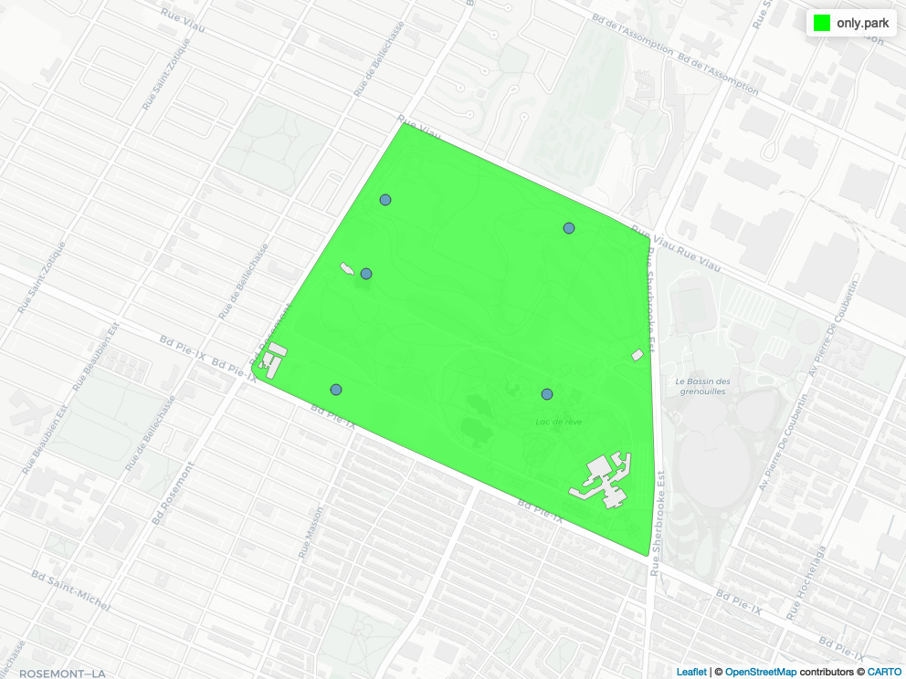
]

---
# Spatial simulation

- 2 points were added to that polygon with known location. 
- But we'd like to add random points in the 100m buffer around these points 

.pull-left[
```{r spatial_add_buffer}
# Add a buffer around the point we want to look at 
n = 10*2
min.buff = units::set_units(x = 0, value = "m")
max.buff = units::set_units(x = 100, value = "m")
buffer = st_buffer(x = c(selected.point,
                         selected.point.no.tree), 
                   dist = units::set_units(x = 100, 
                                           value = "m"))
```
]

```{r rdm_pts_in_polygon_buffer, echo=FALSE}

map.unif = mapView(only.park, 
        col.regions = c("green"))+
  mapView(c(selected.point,selected.point.no.tree), # Get the poitn that was added to be looked at 
          col.regions = c("red")) +
  mapView(buffer, col.regions = c("red"))#; map.unif

## save html to png
# mapshot(map.unif,file = "images/map_unif.png", url = "images/map_unif.html")
```
.pull-right[

]


---
# Spatial simulation

- 5 random points were generated and added to the polygon
- 2 points were added to that polygon with known location.
- 10 Uniformly distributed points in each of the 100m buffer 

.pull-left[
```{r}
set.seed(6543)
n = 10*2
min.buff = units::set_units(x = 0, value = "m")
max.buff = units::set_units(x = 100, value = "m")

# Get random distance 
# rdm.disttmp = rexp(n = n, rate = 1)*20
rdm.disttmp = runif(n = n, min = 0, max = max.buff)
# get random angle
rdm.angtmp = runif(n = n, min=0, max = 360)

# Conversion between Radians and Degrees
rad = rdm.angtmp * pi/180
rdm.ppt_x = rdm.disttmp*cos(rad) + c(st_coordinates(selected.point)[1], st_coordinates(selected.point.no.tree)[1])
rdm.ppt_y = rdm.disttmp*sin(rad) + c(st_coordinates(selected.point)[2], st_coordinates(selected.point.no.tree)[2])
rmd.ptdf = data.frame(rdm.ppt_x,
                      rdm.ppt_y, length(rdm.ppt_x))

rmd.ptdf.sf = sf::st_as_sf(rmd.ptdf, coords = c("rdm.ppt_x","rdm.ppt_y"), crs = 32188)#4326)
```

]

```{r rdm_pts_in_polygon_buffer_uniform, echo=FALSE}
set.seed(456)
map.unif.rdm = mapView(only.park, col.regions = c("green"))+
  mapView(st_sample(only.park,5)) + 
  mapView(c(selected.point,selected.point.no.tree),col.regions = c("red")) + 
  mapView(buffer, col.regions = c("red")) + 
  mapview(rmd.ptdf.sf,col.regions = c("pink"))#; map.unif.rdm

## save html to png
# mapshot(map.unif.rdm,file = "images/map_unif_rdm.png", url = "images/map_unif_rdm.html")
```
.pull-right[
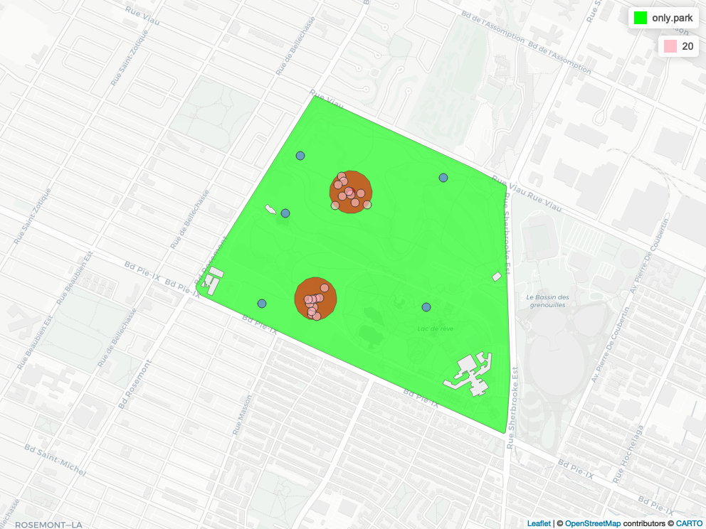
]

---
# Spatial simulation

- What if we want to add a grid to the polygon?
- This is one way of doing it: 

.pull-left[
```{r rdm_pts_in_polygon_grid, echo=TRUE}
set.seed(456)
# Add random points that are occupying the space of the polygon (grid )
rdm.pt = st_sample(x = only.park,
                   size = 100,
                   type ="hexagonal")
map.grid = mapView(only.park, 
                   col.regions = c("green")) + 
  mapView(rdm.pt)#; map.grid
## save html to png
# mapshot(map.grid,file = "images/map_grid.png", url = "images/map_grid.html")
```
]

.pull-right[
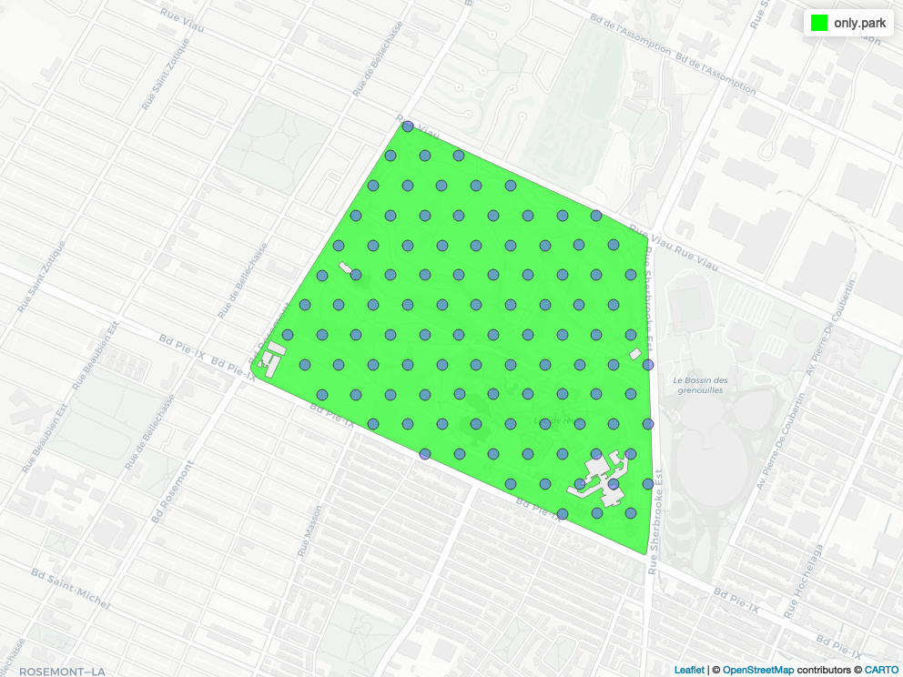
]


???

#################################
---
class: inverse, center, middle
name: simulating-power
# Simulating data for power analysis

???
Now that we have a better understanding of distributions and how to play with them, we are going to look into the subject of power analysis.
- Bolker, B. M. 2015. Ecological Models and Data in R. (see chapter 5, p. 209)
- [Power Analysis by Data Simulation in R - Part I](https://julianquandt.com/post/power-analysis-by-data-simulation-in-r-part-i/)
- [Power Analysis by Data Simulation in R - Part II](https://julianquandt.com/post/power-analysis-by-data-simulation-in-r-part-ii/)
- [Power Analysis by Data Simulation in R - Part III](https://julianquandt.com/post/power-analysis-by-data-simulation-in-r-part-iii/)
- [Power Analysis by Data Simulation in R - Part IV](https://julianquandt.com/post/power-analysis-by-data-simulation-in-r-part-iv/)
- [Power Analysis in R with GLMMs: Introduction](https://www.youtube.com/watch?v=nh6zh9sN3As&ab_channel=DaCCoTABiostatsCore)
- [Power Analysis, Clearly Explained!!!](https://www.youtube.com/watch?v=VX_M3tIyiYk&ab_channel=StatQuestwithJoshStarmer)
- [Power Analysis in R: Introduction](https://www.youtube.com/watch?v=wYZ6oD_cgMg&ab_channel=DaCCoTABiostatsCore)
- [DACCOTA Statistical Resources](https://med.und.edu/daccota/berdc-resources.html)

---
# Power analysis

Resources: 

- [Power Analysis by Data Simulation in R - Part I](https://julianquandt.com/post/power-analysis-by-data-simulation-in-r-part-i/)
- [Power Analysis by Data Simulation in R - Part II](https://julianquandt.com/post/power-analysis-by-data-simulation-in-r-part-ii/)
- [Power Analysis by Data Simulation in R - Part III](https://julianquandt.com/post/power-analysis-by-data-simulation-in-r-part-iii/)
- [Power Analysis by Data Simulation in R - Part IV](https://julianquandt.com/post/power-analysis-by-data-simulation-in-r-part-iv/)

???
- "If a certain effect of interest exists (e.g. a difference between two groups) power is the chance that we actually find the effect in a given study." See [from Julian Quandt; Power Analysis by Data Simulation in R - Part I](https://julianquandt.com/post/power-analysis-by-data-simulation-in-r-part-i/)
- [Simulating Power with the paramtest Package](https://cran.r-project.org/web/packages/paramtest/vignettes/Simulating-Power.html)
- [Simulation for Power Analysis](https://nickch-k.github.io/EconometricsSlides/Week_08/Power_Simulations.html)
- [Script: Power Analysis Simulations in R](https://egap.org/resource/script-power-analysis-simulations-in-r/)
- [Using R for Simulation (pdf)](http://www.columbia.edu/~cjd11/charles_dimaggio/DIRE/resources/R/power.pdf)

---
# Power analysis

- Power ( $1-\beta$ ) is the chance (probability) that we *actually find the effect* in a given study. 
- So "power" is actually a probability that can change depending on multiple factors 
  1. sample size, 
  2. type I error (or significance $\alpha$ level, usually "0.05"), and 
  3. the effect size or the magnitude of the alternative hypothesis

| Null hypothesis is... | TRUE | FALSE |
| --------------------- | ---- | ----- |
| Rejected     |  Type I error (FP) $\alpha$                         |    Correct decision (true positive, TP) $1-\beta$   |
| Not rejected |  Correct decision (true negative, TN) $1-\alpha$   |   Type II error (FN) $\beta$                         |


```{r normal_statistics_areas_power_analysis_mean, echo=FALSE, fig.width=10,fig.height=4}
dir.create("images/power.gif")
png(filename = "images/power.gif/power.to.the.people%03d.png", width = 8,height = 5,units = "in",res = 300)
par(mfrow=c(1,1), mar = c(3,4,2,1), cex = 1.1)
for (i in seq(1,5,length.out = 10)) {
  hypothesis.testing(mean.pop = i,sd = 5, n = 10, range.y = c(0,.5), 
                     poptext = expression("H"[0]*" True"),
                     title = "Changing the effect size",
                     samptext.pos = c(i-.99,.31),
                     pos.arrow.samp = c(i,i,.29,.25),
                     poptext.pos = c(-4.5,.22),
                     samptext = paste("Sample \npop. mean=",round(i,1),sep=""))
}
garbage = dev.off()
# This is the SAME code, but naming the png differently so that it can be processed in a different way later! 
png(filename = "images/power.gif/p2tp%03d.png", width = 8,height = 5,units = "in",res = 300)
par(mfrow=c(1,1), mar = c(3,4,2,1), cex = 1.1)
for (i in seq(1,5,length.out = 10)) {
  hypothesis.testing(mean.pop = i,sd = 5, n = 10, range.y = c(0,.5), 
                     poptext = expression("H"[0]*" True"),
                     title = "Changing the effect size",
                     samptext.pos = c(i-.99,.31),
                     pos.arrow.samp = c(i,i,.29,.25),
                     poptext.pos = c(-4.5,.22),
                     samptext = paste("Sample \npop. mean=",round(i,1),sep=""))
}
garbage = dev.off()
# Requires imagemagick
# https://imagemagick.org/index.php
system("/opt/homebrew/Cellar/imagemagick/7.1.0-33/bin/convert -delay 70 images/power.gif/power.to.the.people*.png images/power.gif/power.to.the.people.gif")
```

<!--  -->


```{r normal_statistics_areas_power_analysis_n, echo=FALSE, fig.width=10,fig.height=4}
png(filename = "images/power.gif/power.to.the.number%03d.png", width = 8,height = 5,units = "in",res = 300)
par(mfrow=c(1,1), mar = c(3,4,2,1), cex = 1.1)
for (i in seq(10,1000,length.out = 10)) {
hypothesis.testing(mean.pop = 2,sd = 5, n = i, range.y = c(0,2.5), 
                   poptext = expression("H"[0]*" True"),
                   title = "Changing the sample size",
                     samptext.pos = c(2.8,.31),
                     pos.arrow.samp = c(2.9,2.5,.30,.25),
                     pos.arrow.pop = c(-1.5,-1.25,.40,.29),
                     poptext.pos = c(-2,.5),
                     samptext = paste("Sample \npop. n=",round(i,1),sep=""))

}
garbage = dev.off()
# Requires imagemagick
# https://imagemagick.org/index.php
system("/opt/homebrew/Cellar/imagemagick/7.1.0-33/bin/convert -delay 70 images/power.gif/power.to.the.number*.png images/power.gif/power.to.the.number.gif")
```

<!-- 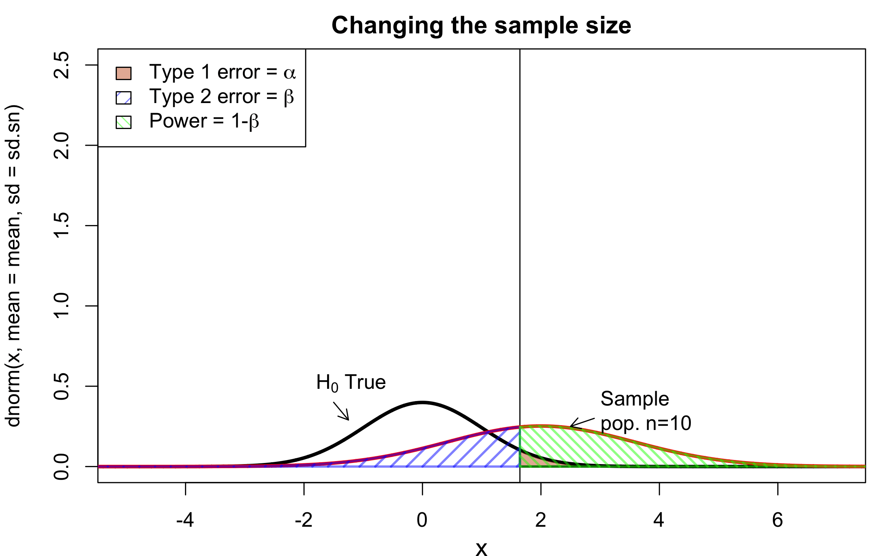 -->
```{r normal_statistics_areas_power_analysis_alpha, echo=FALSE, fig.width=10,fig.height=4}
png(filename = "images/power.gif/power.to.the.alpha%03d.png", width = 8,height = 5,units = "in",res = 300)
par(mfrow=c(1,1), mar = c(3,4,2,1), cex = 1.1)
sequ.p = seq(0.025,.99,length.out = 10)
xp = qnorm(sequ.p,0,1, lower.tail = FALSE)
xprob = pnorm(q = xp,0,1, lower.tail = FALSE)
w = 1
for (i in sequ.p) {
  hypothesis.testing(mean.pop = 2,sd = 5, n = 10, range.y = c(0,.5), prob = i,
                     poptext = expression("H"[0]*" True"),
                     title = "Changing the alpha level",
                     samptext.pos = c(2-.99,.31),
                     pos.arrow.samp = c(2,2,.29,.25),
                     poptext.pos = c(-4,.22),legend = "topright",
                     samptext = "Sample pop.")
  text(xp[w], y = .48, labels = paste("q=",round(xp[w],2),sep = ""), srt = 90, pos = 2)
  text(xp[w]+.50, y = .50, labels = paste("p=",round(xprob[w],3),sep=""), srt = 90,pos = 2)
  w = w + 1
}
garbage = dev.off()
# Requires imagemagick
# https://imagemagick.org/index.php
system("/opt/homebrew/Cellar/imagemagick/7.1.0-33/bin/convert -delay 70 images/power.gif/power.to.the.alpha*.png images/power.gif/power.to.the.alpha.gif")
```

<!-- 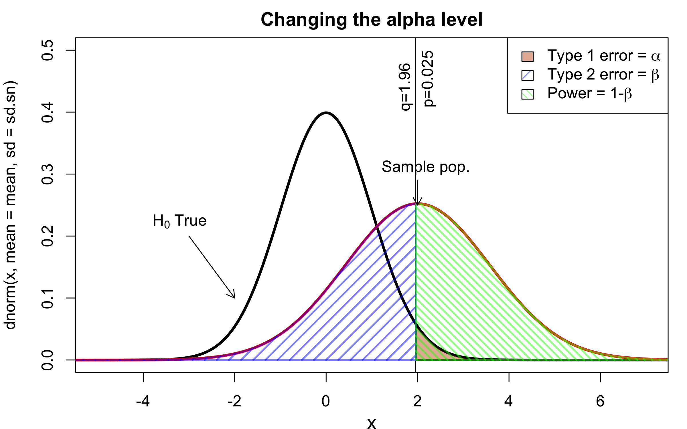 -->

```{r combine_gifs, echo=FALSE}
# Requires imagemagick
# https://imagemagick.org/index.php
# all p2tp*.png will be MODIFIED
system("for f in images/power.gif/p2tp*.png; do /opt/homebrew/Cellar/imagemagick/7.1.0-33/bin/convert $f ${f/images\\/power.gif\\/p2tp/images\\/power.gif\\/power.to.the.number} +append $f; done")

system("for f in images/power.gif/p2tp*.png; do /opt/homebrew/Cellar/imagemagick/7.1.0-33/bin/convert $f ${f/images\\/power.gif\\/p2tp/images\\/power.gif\\/power.to.the.alpha} +append $f; done")

system("/opt/homebrew/Cellar/imagemagick/7.1.0-33/bin/convert -delay 70 images/power.gif/p2tp*.png images/power.gif/power.to.the.all.gif")
```

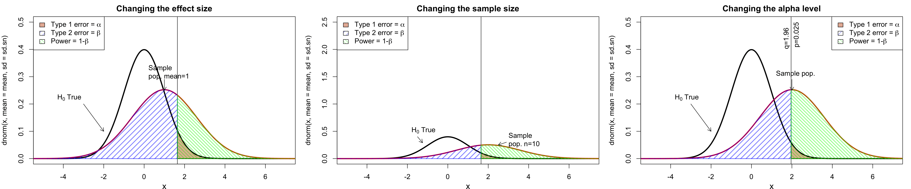

???
- POWER: "The **probability** that a fixed level $\alpha$ significance test will reject $H_0$ when a particular alternative value of the parameter is true is called the **POWER** of the test to detect that alternative."
- The "power of a significance test measures its ability to detect an alternative hypothesis."
- Source: Moore, D. S., and G. P. McCabe. 2006. Introduction to the practice of statistics. Fifth edition. W.H. Freeman and Company, New York.
- Power is the probability that we will correctly reject the null hypothesis. see [Statistical Power, Clearly Explained!!!](https://www.youtube.com/watch?v=Rsc5znwR5FA&ab_channel=StatQuestwithJoshStarmer)
- See also [Type I and II errors](https://www.scribbr.com/statistics/type-i-and-type-ii-errors/)
- Here the mean is changing but not the standard deviation (both will deterine the overlap between the 2 distributions: one way to take BOTH measures at the same time, is to calculate an effect size "d", or Cohen's d). This will give you an understanding of the overlap! 
- NOTE: the image in the middle choses the effect of increasing sample size on our CONFIDENCE WE HAVE IN GETTING THE POPULATION MEAN, or SE. 

---
# Power analysis

- Cohen's d for equal group sizes is $\text{Cohen's d} = \frac{M_1-M_2}{\text{pooled sd}}$ and $\text{pooled sd} = \sqrt{\frac{sd_1^2+sd_2^2}{2}}$ or $\text{Cohen's d} = \frac{M_1-M_2}{\sqrt{\frac{sd_1^2+sd_2^2}{2}}}$
- Cohen's d for unequal group sizes is $\text{pooled sd} = \sqrt{\frac{(n_1-1)sd_1^2+(n_2-1)sd_2^2}{n_1+n_2-2}}$

```{r cod.fun, echo=FALSE}
cohend <- function(gr1, gr2) {
  abs((mean(gr1)-mean(gr2))/(sqrt((sd(gr1)^2+sd(gr2)^2)/2)))
}
```

```{r echo=FALSE}
set.seed(12345)
n=1000
sd = 2
mean1= 1
mean2= 2
mean3= 5
cod.id= cohend(rnorm(n),rnorm(n))
cod.11= cohend(rnorm(n, mean = mean1, sd = 1),rnorm(n))
cod.21= cohend(rnorm(n, mean = mean2, sd = 1),rnorm(n))
cod.51= cohend(rnorm(n, mean = mean3, sd = 1),rnorm(n))
cod.12= cohend(rnorm(n, mean = mean1, sd = sd),rnorm(n))
cod.22= cohend(rnorm(n, mean = mean2, sd = sd),rnorm(n))
cod.52= cohend(rnorm(n, mean = mean3, sd = sd),rnorm(n))
cod.df = data.frame(cod.id, cod.11,cod.21,cod.51,cod.12,cod.22,cod.52)
round(cod.df,2)
```

```{r leonard_cohens_D, echo=FALSE, fig.width=10,fig.height=6}
par(mfrow = c(2,3))
hypothesis.testing(mean.pop = mean1,sd = 1, range.y = c(0,2.5), 
                   poptext = expression("H"[0]*" True"),
                   title = "Changing the sample size",
                   samptext.pos = c(2.8,.31),
                   pos.arrow.samp = c(2.9,2.5,.30,.25),
                   pos.arrow.pop = c(-1.5,-1.25,.40,.29),
                   poptext.pos = c(-2,.5),
                   samptext = paste("Sample \npop. n=",round(i,1),sep=""))

hypothesis.testing(mean.pop = mean2,sd = 1, range.y = c(0,2.5), 
                   poptext = expression("H"[0]*" True"),
                   title = "Changing the sample size",
                   samptext.pos = c(2.8,.31),
                   pos.arrow.samp = c(2.9,2.5,.30,.25),
                   pos.arrow.pop = c(-1.5,-1.25,.40,.29),
                   poptext.pos = c(-2,.5),
                   samptext = paste("Sample \npop. n=",round(i,1),sep=""))

hypothesis.testing(mean.pop = mean3,sd = 1, range.y = c(0,2.5), 
                   poptext = expression("H"[0]*" True"),
                   title = "Changing the sample size",
                   samptext.pos = c(2.8,.31),
                   pos.arrow.samp = c(2.9,2.5,.30,.25),
                   pos.arrow.pop = c(-1.5,-1.25,.40,.29),
                   poptext.pos = c(-2,.5),
                   samptext = paste("Sample \npop. n=",round(i,1),sep=""))

hypothesis.testing(mean.pop = mean1,sd = sd, range.y = c(0,2.5), 
                   poptext = expression("H"[0]*" True"),
                   title = "Changing the sample size",
                   samptext.pos = c(2.8,.31),
                   pos.arrow.samp = c(2.9,2.5,.30,.25),
                   pos.arrow.pop = c(-1.5,-1.25,.40,.29),
                   poptext.pos = c(-2,.5),
                   samptext = paste("Sample \npop. n=",round(i,1),sep=""))

hypothesis.testing(mean.pop = mean2,sd = sd, range.y = c(0,2.5), 
                   poptext = expression("H"[0]*" True"),
                   title = "Changing the sample size",
                   samptext.pos = c(2.8,.31),
                   pos.arrow.samp = c(2.9,2.5,.30,.25),
                   pos.arrow.pop = c(-1.5,-1.25,.40,.29),
                   poptext.pos = c(-2,.5),
                   samptext = paste("Sample \npop. n=",round(i,1),sep=""))

hypothesis.testing(mean.pop = mean3,sd = sd, range.y = c(0,2.5), 
                   poptext = expression("H"[0]*" True"),
                   title = "Changing the sample size",
                   samptext.pos = c(2.8,.31),
                   pos.arrow.samp = c(2.9,2.5,.30,.25),
                   pos.arrow.pop = c(-1.5,-1.25,.40,.29),
                   poptext.pos = c(-2,.5),
                   samptext = paste("Sample \npop. n=",round(i,1),sep=""))
```

???
- think of Cohen's d as the **number of standard deviations between the 2 groups**. So a value of 1, indicates that the means of the 2 groups differ by 1 SD. 
- range of values to get a better intuition of Cohen's D
- [0-0.1[ none or very small
- [0.1-0.5[ small (e.g., difference in height between 15 and 16 years old girls)
- [0.5-0.8[ medium (e.g., difference in height between 14 and 18 years old girls)
- [0.8-1.3[ large (e.g., difference in height between 13 and 18 years old girls)
- [1.3-2.0[ very large

---
# Power analysis


- Simulating a t-test

```{r t.test.sim, echo=FALSE, eval=FALSE}
set.seed(1)
n = 30
gr1 = rnorm(n = n, mean = 1, sd = 2)
gr2 = rnorm(n = n, mean = 0, sd = 2)
t.test(gr1, gr2, paired = FALSE, var.equal = TRUE, conf.level = 0.90)
```

```{r t.test.sim.pval}
sim.ci.t <- function(n = 30) {
  gr1 = rnorm(n = n, mean = 0, sd = 2)
  gr2 = rnorm(n = n, mean = 1, sd = 2)
  ttr = t.test(gr1, gr2, paired = FALSE, var.equal = TRUE, conf.level = 0.95)
  return(ttr$p.value)
}
set.seed(1)
get.p.vals = replicate(n = 1000, expr = sim.ci.t(), simplify = T)
alpha.level = 0.05
mean(get.p.vals<alpha.level) # this is the power, proportion of p-values that we are smaller than the alpha level
# table(get.p.vals<alpha.level)
# prop.table(table(get.p.vals<alpha.level))
# You can see that mean(get.p.vals<alpha.level) is much lower than the 95% power desired... 
```

---
# Power analysis


```{r simulatepval.cod, echo=FALSE, fig.width=10,fig.height=4}
set.seed(1)
sim.ci.t <- function(n = 30, mean1 = 0, mean2 = 1, sd1 = 2, sd2 =2) {
  gr1 = rnorm(n = n, mean = mean1, sd = sd1)
  gr2 = rnorm(n = n, mean = mean2, sd = sd2)
  ttr = t.test(gr1, gr2, paired = FALSE, var.equal = TRUE, conf.level = 0.95)
  cohend.val = cohend(gr1,gr2)
  return(list(pval = ttr$p.value, cd = cohend.val))
}

# Set up the while loop 
n_sims <- 1000 # nb simulations 
power_at_n <- c(0) 
cod = c(0)
i = 2;n = n.first <- 5
by.step = 5
while(power_at_n[i-1] < .95){
    get.p.c = replicate(n_sims,sim.ci.t(n = n, mean1 = 0, mean2 = 2), simplify = T)
    power_at_n = append(power_at_n,mean(unlist(get.p.c[1,])<alpha.level))
    cod = append(cod,mean(unlist(get.p.c[2,])))
    i = i+1
    n = n+by.step
}
power_at_n = power_at_n[-1] # Remove initiation values
cod = cod[-1] # Remove initiation values
n.last = n 

x = seq(n.first,c(n.last-1), by = by.step) # Get the sequence from start sample size to finish sample size

par(mfrow = c(1,2)) # plot! 
plot(x, power_at_n, 
     xlab = "Number of participants per group", ylab = "Power", 
     ylim = c(0,1), axes = TRUE, type = "l")
points(x, power_at_n, pch = 19, col = scales::alpha("black", .8))

abline(h = .95, col = "red")
abline(v = x[which(power_at_n>.95)], col = "red")

plot(x, cod, 
     xlab = "Number of participants per group", ylab = "Cohen's D", 
     axes = TRUE, type = "l")
points(x, cod, pch = 19, col = scales::alpha("black", .8))
abline(h = .5, col = "red")


```


---
# Power analysis (proportions)

- The [vignette](https://cran.r-project.org/web/packages/pwr/vignettes/pwr-vignette.html) for the `pwr` package explains how to perform power analysis. 
- We think we have a coin, which has a 75% chance of landing on 'heads':

```{r pwr_test}
p1 = .75 # Proportion to test 
p2 = .50 # proportion of the null hypothesis 
alpha = 0.05 # Type 1 error 
pwr = 0.80 # power or 1-beta = power. Beta is the type II error 
coin.p.power = power.prop.test(p1 = p1, p2 = p2, sig.level = alpha, power = pwr)
n = ceiling(coin.p.power$n) # get the sample size from the power analysis
coin.pip = rbinom(n, size = 1, prob = p1) # Generate coin tosses 
p.table = table(coin.pip)[c(2,1)] # Get the number of 1 and 0s  
(ptest = prop.test(p.table, alternative = "greater")) # Do the test 
```


???
- Power analysis are useful to get a sense of the
  * sample size required to run an analysis
  * know the power 
  * get the effect size
  * or the significance level
- What we can do is prepare the power analysis to what we want to test, then generate data the we could use to see how this would modify the result of our test. 
- In this first example, we are looking at a proportion power test.

```
# coin.pip = rbinom(1,size = n,prob = p1) # similar to above 
# prop.test(x = coin.pip, n = n,alternative = "greater")
```

- For the moment, please refer to [this link](https://www.r-bloggers.com/2020/05/power-analysis-by-data-simulation-in-r-part-ii/).

---
# Power analysis (proportions)

- from the output we got (previous slide), we can plot the chi-square distribution with the df and see where our statistics ends in the graph. We can see that the p-value must be pretty small. 

```{r show_the_pwr, echo=-1, fig.width=7,fig.height=4}
par(mar=c(4,4,0.1,0.1))
curve(dchisq(x, df = ptest$parameter), 
      xlim = c(0, ceiling(max(ptest$statistic))))
abline(v = ptest$statistic, lty = 3)
```
--

- The p-value is `r format(signif(ptest$p.value, 3),scientific = FALSE)`.

---
# Power analysis (linear model)

.pull-left[
```{r get_eff_size, fig.width=7,fig.height=4}
library(pwr)
r2 = seq(0,0.9,by =.1)
f2 <- function(r2) {r2/(1-r2)}
```
]

.pull-right[
```{r get_eff_size_plot, echo=-1, fig.width=7,fig.height=4}
par(mar=c(4,4,0.1,0.1))
plot(f2(r2)~r2)
curve(expr = (x/(1-x)),add = T)
```
]

```{r get_eff_size_n, fig.width=7,fig.height=4}
nb.coef.in.model = 2
pwr.lm = pwr.f2.test(u = nb.coef.in.model, f2 = f2(.3), sig.level = 0.001, power = 0.8)

# sample size (n = v + u + 1)
n = ceiling(pwr.lm$v + nb.coef.in.model + 1)
n
```


???
- based on the number of coefficients you have in a model, and the effect size you think you're going to have (perhaps based on the literature), you can find the number of samples you'd require in ordre to get find a statistical difference at the level that interests you. 
- Refer to the [vignette](https://cran.r-project.org/web/packages/pwr/vignettes/pwr-vignette.html) for the `pwr` package
- See also the package `pwr2ppl`

---
# Power analysis (GLMM)

- The `simr` package uses simulations to perform power analysis for Generalised Linear Mixed Models (GLMMs) with the `lme4` packge

???

- See [Power Analysis in R with GLMMs: Introduction](https://www.youtube.com/watch?v=nh6zh9sN3As&ab_channel=DaCCoTABiostatsCore)
- In case you are wondering what are S4 classes, see [The S4 object system](http://adv-r.had.co.nz/S4.html)


#################################
---
class: inverse, center, middle
name: advanced-simulations
# Advanced simulations


---
# Advanced simulations

- Now that we have the building blocks to make simulations, we are going to add another layer:
- We want to simulate a process and then see how our simulation responds to a fluctuation in a parameter
- For this, we need a certain workflow that resembles this: 
1. create a blank vector in which a value of interest will be stored in 
2. Within a loop or many `for(){}` loops, we are going to simulate data, get a desired result and store the result for future analysis 
3. Summarize our findings (in a plot, with calculations, etc.) 

.alert[ATTENTION]. This is an iterative process. Usually, we make small increments writing up the code and then put it all together in a cohesive function that will make exactly what we are looking for. 


---
# Advanced simulations
.tiny-code[
```{r simulate_sampling_function}
# Defining the population 
n = 600 # Number of elements to be generated 
set.seed(13) # Set RNG 
x = rnorm(n) # Generate numbers from normal distribution 
reedddd = scales::alpha("blue",.4) # Make colour transparent 

# Definte the function 
sample.mean.pop.est <- function(x,n, sample.size, ylim = NULL) {
  # x: is the actual values of the trait measured 
  # n: size of the population (number of individuals or items)
  # sample.size: how big is the sample size from which the MEAN will be calculated from 
  # ylim: add a maximum if needed 
  # histogram of the population 
  
  # Just get the stats from the histogram 
  pop.hist = hist(x, plot = F) # Make base histogram 
  
  # Make empty vector
  tmp.v = c(NA) 
  
  # For loop to calculate the mean based on a sample from the population 
  for (i in 1:n) {
    tmp = sample(x = x, size = sample.size, replace = FALSE)
    # Record that information (mean of the sample)
    tmp.v[i] = mean(tmp)
  } # End i
  
  # Sample histogram 
  sample.hist = hist(tmp.v, plot = F)
  # Population histogram 
  hist(x, ylim = range(c(0,c(sample.hist$counts, pop.hist$counts), ylim)), 
       main = paste("Sample n =", sample.size))
  # Add the sample estimate 
  sample.hist = hist(tmp.v, col = reedddd, add=T)
} # End sample.mean.pop.est
```
]

---
# Advanced simulations

```{r simulate_sampling_plots}
par(mfrow=c(2,2), lwd = .3)
sample.mean.pop.est(x = x, n = n, sample.size = 1, ylim = 300)
sample.mean.pop.est(x = x, n = n, sample.size = 10, ylim = 300)
sample.mean.pop.est(x = x, n = n, sample.size = 50, ylim = 300)
sample.mean.pop.est(x = x, n = n, sample.size = 500, ylim = 300)
```

---
# Advanced simulations (natural selection)

- The sentence "METHINKS IT IS LIKE A WEASEL" is from Shakespeare's *Hamlet*
- Richard Dawkins, in his 1986 book *The Blind Watchmaker*, used it to simulate natural selection on random genetic mutation. 

```{r Dawkins_natural_Selection_example, echo=FALSE}
set.seed(12345, kind="Mersenne-Twister")

## Easier if the string is a character vector
target <- unlist(strsplit("METHINKS IT IS LIKE A WEASEL", ""))
# target <- unlist(strsplit("MORE GIDDY IN MY DESIRES THAN A MONKEY", ""))
# http://shakespeare.mit.edu/hamlet/full.html 

charset <- c(LETTERS, " ")
rdm <- sample(charset, length(target), replace=TRUE)
parent <- sample(charset, length(target), replace=TRUE)

mutaterate <- 0.01

## Number of offspring in each generation
C <- 100

## Hamming distance between strings normalized by string length is used
## as the fitness function.
fitness <- function(parent, target) {
  sum(parent == target) / length(target)
}

mutate <- function(parent, rate, charset) {
  p <- runif(length(parent))
  nMutants <- sum(p < rate)
  if (nMutants) {
    parent[ p < rate ] <- sample(charset, nMutants, replace=TRUE)
  }
  parent
}

evolve <- function(parent, mutate, fitness, C, mutaterate, charset) {
  children <- replicate(C, mutate(parent, mutaterate, charset),
                        simplify=FALSE)
  children <- c(list(parent), children)
  children[[which.max(sapply(children, fitness, target=target))]]
}

.printGen <- function(parent, target, gen) {
  cat(format(i, width=3),
      formatC(fitness(parent, target), digits=2, format="f"),
      paste(parent, collapse=""), "\n")
}

i <- 0
.printGen(parent, target, i)
while ( ! all(parent == target)) {
  i <- i + 1
  parent <- evolve(parent, mutate, fitness, C, mutaterate, charset)
  
  if (i %% 20 == 0) {
    .printGen(parent, target, i)
  }
}
.printGen(parent, target, i)
```

- After the same number of generations, but if a monkey would randomly be typing on a keyboard! 
```{r Dawkin_print, echo=FALSE}
.printGen(rdm, target, i)
```

- Source: [Evolutionary algorithm from Rosettacode.org](https://rosettacode.org/wiki/Evolutionary_algorithm).

???

- The full tradgedy's name is *The Tragedy of Hamlet, Prince of Denmark*
- Get more information here https://en.wikipedia.org/wiki/Weasel_program 


---
name: challenge7
## Challenge 7 

- Simulate data to show how natural selection works! 

---
## Challenge 7 - Solution 

- There are multiple solutions :) 

???

#################################
---
class: inverse, center, middle
name: misc
# Miscellaneous

---
# Some R packages to perform simulations 

- `simecol` ([simulation of ecological systems](http://simecol.r-forge.r-project.org)), 
- `cds` with function `simpca` to simulate PCA.
- `mobsim` measurement of biodiversity across space (archived)
- `rspecies` with function `rspecies` (archived)

<!-- - `HMSC` with function `communitySimul` -->


???
```
library(cds)
simpca(nr.indv = rep(200, 5), m = 10, q = 7, R = rcormat(m = 10),
       err.coeff = 0.1, alphamat = rbind(c(0.5, 2, 4), c(10, 2, 10), c(1, 2, 1),
                                         c(4, 2, 0.5), c(0.1, 2, 0.1))[1:length(rep(200, 5)), ], randomize = FALSE)
```


---
name: references
# References Books

.pull-left[
- Aho. 2013. Foundational & applied statistics for biologists using R.
- Banks. 1998. Handbook of simulation.
- Bloomfield. 2009a. Using R for computer simulation & data analysis in biochemistry, molecular biology, & biophysics
- —. 2009b. Computer simulation & data analysis in molecular biology & biophysics: an introduction using R. 
- Bolker. 2015. Ecological models & data in R. 
- Crawley. 2013. The R book. 2ed. (Chap. 7)
- Dobrow. 2013. Probability: With applications & R. 
]

.pull-right[
- Jones, Maillardet, & Robinson. 2014. Intro. to scientific programming & simulation using R. 2ed.
- Morgan. 1984. Elements of simulation.
- Otto & Day. 2007. A Biologist's Guide to Mathematical Modeling in Ecology & Evolution.
- Ross. 2021. An introduction to probability & simulation.
- Seefeld & Linder. 2007. Statistics using R with biological examples.
- Soetaert, Cash, & Mazzia. 2012. Solving Diff. Eq. in R.
- Templ. 2016. Simulation for data science with R. 
- Whitlock & Schluter. 2020. The analysis of biological data. 3ed.
]
<!-- 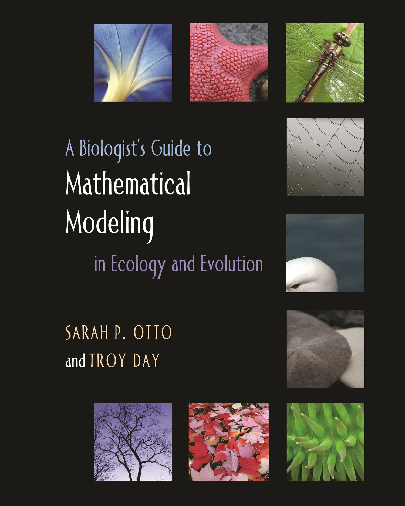 -->


---
# References links

.pull-left[
- [Simulate Linear model](https://aosmith.rbind.io/2018/01/09/simulate-simulate-part1/), [Simulate Linear mixed model](https://aosmith.rbind.io/2018/04/23/simulate-simulate-part-2/), [Simulate Poisson model](https://aosmith.rbind.io/2018/07/18/simulate-poisson-edition/), [Simulate binomial generalized linear mixed model](https://aosmith.rbind.io/2020/08/20/simulate-binomial-glmm/), and [Getting started simulating data in R: some helpful functions and how to use them](https://aosmith.rbind.io/2018/08/29/getting-started-simulating-data/) by Ariel Muldoon
- [Statistical Simulation in R with Code — Part I](https://towardsdatascience.com/statistical-simulation-in-r-part-1-d9cb4dc393c9)
- [Power Analysis by Data Simulation in R – Part II](https://www.r-bloggers.com/2020/05/power-analysis-by-data-simulation-in-r-part-ii/)
- [bios221; Lab 3: Simulations in R](https://web.stanford.edu/class/bios221/labs/simulation/Lab_3_simulation.html)
- [R Programming for Data Science; See 20 Simulation](https://bookdown.org/rdpeng/rprogdatascience/simulation.html)
- [Simulation in R (YouTube)](https://www.youtube.com/watch?v=tvv4IA8PEzw)
- [An Introduction to Probability and Simulation by Kevin Ross](https://bookdown.org/kevin_davisross/probsim-book/)
]

.pull-right[
- [Introduction to Simulations in R](http://www.columbia.edu/~cjd11/charles_dimaggio/DIRE/resources/R/simRreg.pdf)
- [Crump Lab; Chap. 5 Simulating and Analyzing Data in R](https://www.crumplab.com/programmingforpsych/simulating-and-analyzing-data-in-r.html)
- [Intro to R Lecture Notes; Chap. 13 Simulations](https://users.phhp.ufl.edu/rlp176/Courses/PHC6089/R_notes/simulations.html)
- [Simulation Cheat Sheet, by Nick Huntington-Klein](https://nickch-k.github.io/introcausality/Cheat%20Sheets/Simulation_Cheat_Sheet.pdf)
- [Simulating mixed effets; Chap. 4](https://debruine.github.io/tutorials/sim-lmer.html)
- [Cours 'Econ 224'; Lab #9 Logistic Regression Part I](https://ditraglia.com/econ224/lab09.pdf)
- [ECON 41 Labs; useful ressources about distributions](https://bookdown.org/gabriel_butler/ECON41Labs/)
- [Binomial regression in R](https://kkorthauer.org/fungeno2019/methylation/vignettes/1-binomial-regression.html#4_pitfalls_of_glm)
- [Simple Data Simulations in R, of course](https://it.unt.edu/simple-data-simulations)
- [Probability Cheat sheet](https://static1.squarespace.com/static/54bf3241e4b0f0d81bf7ff36/t/55e9494fe4b011aed10e48e5/1441352015658/probability_cheatsheet.pdf)
]

---
name: acknowledgements
# Acknowledgements

Thanks to all the people that contributed to this presentation. All of the inspiration for this workshop is referenced in the markdown or linked in the notes. 

In particular, thank to the Barrett lab graduate students (McGill) for their valuable insights and support, Winer Daniel Reyes Corral (McGill), Pierre-Olivier Montiglio (UQAM), etc. 

Thank you for your participation and helping me improve the workshop.

---
class: inverse, center, bottom

# Thank you for attending this workshop!


